
## ThinkPad

T480 User Guide

## n

Note: Before using this information and the product it supports, ensure that you read and understand the following:

• Safety and Warranty Guide

• Setup Guide

“Important safety information” on page v

Lenovo® makes constant improvement on the documentation of your computer, including this User Guide. To get all the latest documents, go to:

https://support.lenovo.com

LIMITED AND RESTRICTED RIGHTS NOTICE: If data or software is delivered pursuant to a General Services Administration “GSA” contract, use, reproduction, or disclosure is subject to restrictions set forth in Contract No. GS-35F-05925.

## Contents

Important safety information . v   
Read this first. v   
Important information about using your computer . . v   
Conditions that require immediate action . . vii   
Service and upgrades viii   
Power adapters . . ix   
Extension cords and related devices. . ix   
Plugs and outlets . x   
Power supply statement . x   
External devices . xi   
General battery notice . xi   
Notice for removable rechargeable battery . xi   
Notice for built-in rechargeable battery. . xii   
Notice for non-rechargeable coin-cell battery . xii   
Heat and product ventilation . xiii   
Electrical current safety information xiv   
Liquid crystal display (LCD) notice xiv   
Using headphones or earphones . xv   
Choking hazard notice . xv   
Plastic bag notice . . xv   
Glass parts notice . . xv   
Chapter 1. Product overview 1   
Computer controls, connectors, and indicators 1   
Front view . . 1   
Left-side view . 3   
Right-side view 4   
Bottom view 6   
Status indicators 7   
Important product information . 9   
Machine type and model information. . 9   
FCC ID and IC Certification number 10   
Labels for the Windows operating systems 11   
Computer features. 12   
Computer specifications 13   
Operating environment . 13   
Lenovo programs 14   
Accessing Lenovo programs . 14   
An introduction to Lenovo programs . 14   
Chapter 2. Using your computer 17   
Registering your computer 17   
Frequently asked questions 17   
Using the multi-touch screen 18   
Using the special keys . 20   
Using the ThinkPad pointing device . 22   
ThinkPad pointing device overview 22   
Using the TrackPoint pointing device. 23   
Using the trackpad. 24   
Using the trackpad touch gestures 25   
Customizing the ThinkPad pointing device 25   
Replacing the cap on the pointing stick . 26   
Power management . 26   
Using the ac power adapter 26   
Using the battery 27   
Managing the battery power 28   
Power-saving modes . 28   
Cabled Ethernet connections 29   
Wireless connections 29   
Using the wireless-LAN connection 29   
Using the wireless-WAN connection . 30   
Using the Bluetooth connection. 30   
Using the NFC devices . 31   
Using the Airplane mode 32   
Using audio features . 32   
Using the cameras. 33   
Using a media card or a smart card 34   
Using an external display . 36   
Traveling with your computer 37   
Chapter 3. Enhancing your   
computer . . 39   
Finding ThinkPad options . 39   
ThinkPad Basic Docking Station, ThinkPad Pro   
Docking Station, and ThinkPad Ultra Docking   
Station 39   
Locating controls, connectors, and   
indicators 39   
Attaching your computer to a docking   
station 41   
Detaching your computer from a docking   
station 43   
Guidelines on connecting multiple external   
displays . . 44   
Chapter 4. Accessibility, ergonomic,   
and maintenance information 47   
Accessibility information 47   
Ergonomic information . 49   
Cleaning and maintenance 50   
Chapter 5. Security 53   
Using passwords . 53   
Passwords introduction . 53   
Setting, changing, or removing a password . . 54   
Hard disk security . 55   
Setting the security chip 55   
Using the fingerprint reader 56   
Deleting data from your storage drive 58   
Using firewalls 58   
Protecting data against viruses . 59   
Chapter 6. Advanced   
configuration. 61   
Installing the Windows 10 operating system . 61   
Installing device drivers . 62   
Using the ThinkPad Setup program 63   
Configuring ThinkPad Setup . 63   
Changing the startup sequence . 63   
Updating the UEFI BIOS. 64   
BIOS menu. 64   
Using system management 76   
Chapter 7. Troubleshooting   
computer problems . 79   
General tips for preventing problems 79   
Diagnosing problems 79   
Troubleshooting 80   
Computer stops responding 80   
Spills on the keyboard 80   
Error messages 81   
Beep errors. 82   
Memory module problems . 84   
Ethernet problems . 84   
Wireless-LAN problem 85   
Wireless-WAN problem . 85   
Bluetooth problem . 85   
ThinkPad pointing device problems 86   
Keyboard problems 86   
Computer screen problems 87   
External monitor problems . 89   
Audio problems . 90   
Fingerprint reader problems 91   
Battery problems 91   
ac power adapter problem. 92   
Power problems . . 92   
Power button problem 93   
Boot problems 93   
Sleep and hibernation problems 93   
Hard disk drive problems 94   
Solid-state drive problem 94   
Software problem 94   
USB problem . 95   
Docking station problem 95   
Chapter 8. Recovery information . . . 97   
Resetting your computer 97   
Using advanced startup options 97   
Recovering your operating system if Windows 10   
fails to start . . 97   
Creating and using a recovery USB drive . 98   
Chapter 9. Replacing devices . 99   
Customer Replaceable Units. 99   
Static electricity prevention . 100   
Disabling the built-in battery . 100   
Replacing the removable battery 100   
Replacing the nano-SIM card 102   
Replacing the base cover assembly . 103   
Replacing a memory module. 106   
Replacing the internal storage drive . 108   
Replacing a wireless-WAN card 116   
Replacing the keyboard. 117   
Replacing the coin-cell battery . 121   
Chapter 10. Getting support. . 125   
Before you contact Lenovo 125   
Getting help and service 125   
Lenovo Support Web site 126   
Calling Lenovo 126   
Purchasing additional services . 127   
Appendix A. Supplemental   
information about the Ubuntu operating   
system . . . . . 129   
Appendix B. Regulatory   
information . . . . 131   
Certification-related information 131   
Wireless-related information . 131   
Wireless interoperability . 131   
Usage environment and your health 131   
Locating the UltraConnect wireless   
antennas. 132   
Wireless-radio compliance information . 132   
Locating wireless regulatory notices 132   
TCO certification 133   
Export classification notice 133   
Electronic emission notices 133   
Federal Communications Commission   
Declaration of Conformity . . 133   
Industry Canada Class B emission   
compliance statement . 134   
European Union conformity 134   
German Class B compliance statement. . 134   
Japan VCCI Class B compliance   
statement . 135   
Japan compliance statement for products   
which connect to the power mains with rated   
current less than or equal to 20 A per   
phase . . . . 135   
Japan notice for ac power cord . . . . . . . 135   
Lenovo product service information for   
Taiwan . . . . . . . . . . 135   
Eurasian compliance mark . . . 135   
Brazil audio notice . . . 135   
Appendix C. WEEE and recycling   
statements of countries and   
regions . . . . . . . . . . . 137   
General recycling information . 137   
Important WEEE information . . . 137   
Japan recycling statements . . . . . . 138   
Recycling information for Brazil. . . . . 139   
Battery recycling information for the European   
Union . . . 139   
Battery recycling information for Taiwan . . . . . 140   
Battery recycling information for the United States   
and Canada . . 140   
Recycling information for China . 140   
Appendix D. Restriction of   
Hazardous Substances (RoHS) Directive   
of countries and regions . . . . . . . . 141   
Appendix E. ENERGY STAR model   
information . . . . . . . 145   
Appendix F. Notices . . . . . . . . . . 147   
Appendix G. Trademarks . . . . . . . 149

## Important safety information

Note: Read the important safety information first.

## Read this first

This information can help you safely use your notebook computer. Follow and retain all information included with your computer. The information in this document does not alter the terms of your purchase agreement or the Lenovo Limited Warranty. For more information, see "Warranty Information" in the Safety and Warranty Guide that comes with your computer.

Customer safety is important. Our products are developed to be safe and effective. However, personal computers are electronic devices. Power adapters and other features can create potential safety risks that can result in physical injury or property damage, especially if misused. To reduce these risks, follow the instructions included with your product, observe all warnings on the product and in the operating instructions, and review the information included in this document carefully. By carefully following the information contained in this document and provided with your product, you can help protect yourself from hazards and create a safer computer work environment.

Note: This information includes references to power adapters and batteries. In addition to notebook computers, some products (such as speakers and monitors) ship with external power adapters. If you have such a product, this information applies to your product. In addition, computer products contain a coin-sized internal battery that provides power to the system clock even when the computer is unplugged, so the battery safety information applies to all computer products.

## Important information about using your computer

Ensure that you follow the important tips given here to get the most use and enjoyment out of your computer.   
Failure to do so might lead to discomfort or injury, or cause the computer to fail.

## Protect yourself from the heat that your computer generates.

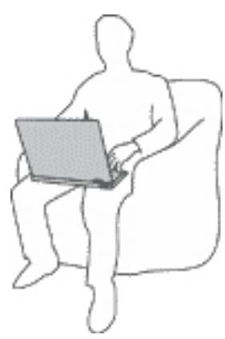

> **AI Description:**
> **Source:** `assets/_page_6_Figure_0.jpg`
> 
> **Generated:** 2026-06-01 23:33:22
> 
> ---
> 
> The image is a simple line drawing of a person sitting on a chair with a laptop on their lap. The person is depicted in a side profile, facing to the left. The laptop is open and placed on the person's lap, with their hands resting on the keyboard. The chair is a simple, rounded design. There are no additional labels, text, or annotations present in the image.

When your computer is turned on or the battery is charging, the base, the palm rest, and some other parts may become hot. The temperature they reach depends on the amount of system activity and the level of charge in the battery.

Extended contact with your body, even through clothing, could cause discomfort or even a skin burn.

• Avoid keeping your hands, your lap, or any other part of your body in contact with a hot section of the computer for any extended time.

• Periodically take hands from using the keyboard by lifting your hands from the palm rest.

## Protect yourself from the heat generated by the ac power adapter.

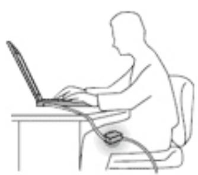

> **AI Description:**
> **Source:** `assets/_page_7_Figure_0.jpg`
> 
> **Generated:** 2026-06-01 23:35:34
> 
> ---
> 
> The image is a simple line drawing depicting a person sitting at a desk, using a laptop computer. The person is seated in a chair with their legs crossed, and the desk is positioned in front of them. The drawing is minimalistic and does not contain any text or additional annotations. The focus is on the posture and activity of the person, which could be interpreted as a representation of someone working or studying at a computer.

When the ac power adapter is connected to an electrical outlet and your computer, it generates heat.

Extended contact with your body, even through clothing, may cause a skin burn.

• Do not place the ac power adapter in contact with any part of your body while it is in use.

• Never use it to warm your body.

## Prevent your computer from getting wet.

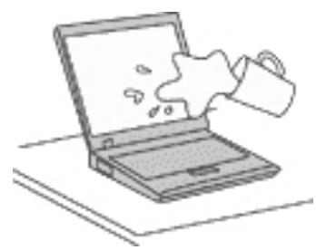

> **AI Description:**
> **Source:** `assets/_page_7_Figure_1.jpg`
> 
> **Generated:** 2026-06-01 23:34:53
> 
> ---
> 
> The image is a diagram showing a laptop with a cup of liquid spilled on it. The liquid appears to be spilling onto the keyboard and screen, indicating a potential malfunction or damage to the laptop. The image is a simple illustration and does not contain any text or additional annotations.

To avoid spills and the danger of electrical shock, keep liquids away from your computer.

## Protect the cables from being damaged.

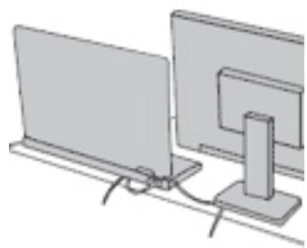

> **AI Description:**
> **Source:** `assets/_page_7_Figure_2.jpg`
> 
> **Generated:** 2026-06-01 23:33:41
> 
> ---
> 
> The image contains a technical illustration of a computer setup. It shows two monitors, one of which is connected to the other via a cable, likely representing a display extension or mirrored display configuration. The illustration is simple and does not include any text or additional annotations. The focus is on the hardware setup, specifically the connection between the two monitors.

Applying strong force to cables may damage or break them.

Route communication lines, or the cables of an ac power adapter, a mouse, a keyboard, a printer, or any other electronic device, so that they cannot be walked on, tripped over, pinched by your computer or other objects, or in any way subject to treatment that could interfere with the operation of your computer.

## Protect your computer and data when moving it.

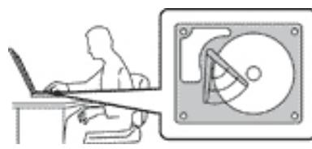

> **AI Description:**
> **Source:** `assets/_page_7_Figure_3.jpg`
> 
> **Generated:** 2026-06-01 23:34:15
> 
> ---
> 
> The image contains a diagram of a person sitting at a desk using a laptop. To the right of the person, there is a representation of a hard drive with a disc inside it. The diagram appears to be illustrating a connection or relationship between the person using the laptop and the hard drive, possibly symbolizing data transfer or storage.

Before moving a computer equipped with a hard disk drive, do one of the following:

• Turn it off.

• Put it in sleep mode.

• Put it in hibernation mode.

This helps to prevent damage to the computer, and possible loss of data.

## Handle your computer gently.

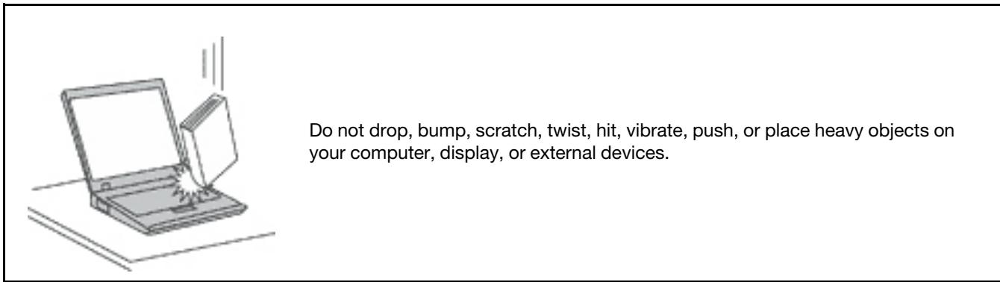

> **AI Description:**
> **Source:** `assets/_page_8_Figure_0.jpg`
> 
> **Generated:** 2026-06-01 23:42:07
> 
> ---
> 
> The image contains a simple line drawing of a laptop being dropped onto a surface. The laptop is depicted in a tilted position, with a small explosion or impact effect near the bottom, suggesting damage. The accompanying text provides instructions on how to handle electronic devices, emphasizing the importance of avoiding actions such as dropping, bumping, scratching, twisting, hitting, vibrating, pushing, or placing heavy objects on the computer, display, or external devices. The image serves as a visual aid to reinforce the safety message in the text.

## Carry your computer carefully.

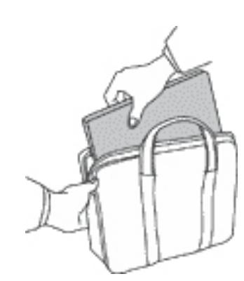

> **AI Description:**
> **Source:** `assets/_page_8_Figure_1.jpg`
> 
> **Generated:** 2026-06-01 23:42:13
> 
> ---
> 
> The image is a simple line drawing depicting a person's hands placing a folder into a bag. The drawing is minimalistic, with no additional labels or text annotations. The focus is on the action of storing a document, which could be interpreted as a metaphor for organizing or preparing for a meeting or event.

• Use a quality carrying case that provides adequate cushioning and protection.

• Do not pack your computer in a tightly packed suitcase or bag.

• Before putting your computer in a carrying case, make sure that it is off, in sleep mode, or in hibernation mode. Do not put a computer in a carrying case while it is turned on.

## Conditions that require immediate action

Products can become damaged due to misuse or neglect. Some product damage is serious enough that the product should not be used again until it has been inspected and, if necessary, repaired by an authorized servicer.

As with any electronic device, pay close attention to the product when it is turned on. On very rare occasions, you might notice an odor or see a puff of smoke or sparks vent from your product. Or you might hear sounds like popping, cracking or hissing. These conditions might merely mean that an internal electronic component has failed in a safe and controlled manner. Or, they might indicate a potential safety issue. However, do not take risks or attempt to diagnose the situation yourself. Contact the Customer Support Center for further guidance. For a list of Service and Support phone numbers, see the following Web site:

## https://pcsupport.lenovo.com/supportphonelist

Frequently inspect your computer and its components for damage or wear or signs of danger. If you have any question about the condition of a component, do not use the product. Contact the Customer Support Center or the product manufacturer for instructions on how to inspect the product and have it repaired, if necessary.

In the unlikely event that you notice any of the following conditions, or if you have any safety concerns with your product, stop using the product and unplug it from the power source and telecommunication lines until you can speak to the Customer Support Center for further guidance.

• Plugs, power adapters, extension cords, surge protectors, or power supplies that are cracked, broken, or damaged.

• Signs of overheating, smoke, sparks, or fire.

• Damage to a battery (such as cracks, dents, or creases), discharge from a battery, or a buildup of foreign substances on the battery.

• A cracking, hissing or popping sound, or strong odor that comes from the product.

• Signs that liquid has been spilled or an object has fallen onto the computer product or the power adapter.

• The computer product or power adapter has been exposed to water.

• The product has been dropped or damaged in any way.

• The product does not operate normally when you follow the operating instructions.

Note: If you notice these conditions with a product (such as an extension cord) that is not manufactured for or by Lenovo, stop using that product until you can contact the product manufacturer for further instructions, or until you get a suitable replacement.

## Service and upgrades

Do not attempt to service a product yourself unless instructed to do so by the Customer Support Center or your documentation. Only use a Service Provider who is approved to repair your particular product.

Note: Some computer parts can be upgraded or replaced by the customer. Upgrades typically are referred to as options. Replacement parts approved for customer installation are referred to as Customer Replaceable Units, or CRUs. Lenovo provides documentation with instructions when it is appropriate for customers to install options or replace CRUs. You must closely follow all instructions when installing or replacing parts. Before you remove the covers from a product equipped with a power adapter, always make sure that the power is turned off and that the product is unplugged from any power source. If you have any questions or concerns, contact the Customer Support Center.

Although there are no moving parts in your computer after the power adapter has been disconnected, the following warnings are required for your safety.

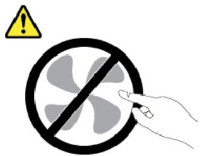

> **AI Description:**
> **Source:** `assets/_page_9_Figure_0.jpg`
> 
> **Generated:** 2026-06-01 23:40:12
> 
> ---
> 
> The image contains a warning symbol and a circular icon with a crossed-out fan symbol. The warning symbol is a yellow triangle with an exclamation mark, indicating a caution or danger. The circular icon, which is crossed out, features a stylized fan with blades. The crossed-out symbol suggests that the fan should not be touched or used. The image is a visual representation of a warning against interacting with a fan.

CAUTION:

Hazardous moving parts. Keep fingers and other body parts away.

CAUTION:

> **AI Description:**
> **Source:** `assets/_page_9_Figure_1.jpg`
> 
> **Generated:** 2026-06-01 23:39:55
> 
> ---
> 
> The image contains two warning symbols. The first symbol is a yellow triangle with an exclamation mark inside, indicating a general warning or caution. The second symbol is a yellow triangle with a steam symbol inside, indicating a hot surface or steam hazard. These symbols are commonly used in safety signage to alert individuals to potential dangers or hazards.

Before you open the computer cover, turn off the computer and wait several minutes until the computer is cool.

## Power adapters

## DANGER

Use only the power adapters supplied by the product manufacturer.

Never wrap a power adapter cable around a power adapter or other object. Doing so can stress the cord in ways that can cause the power adapter cable to fray, crack, or crimp. This can present a safety hazard.

Always route the power adapter cable so that they will not be walked on, tripped over, or pinched by objects.

Protect power adapters from liquids. For instance, do not leave your power adapter near sinks, tubs, toilets, or on floors that are cleaned with liquid cleansers. Liquids can cause a short circuit, particularly if the power adapter has been stressed by misuse. Liquids also can cause gradual corrosion of the connector terminals on a power adapter, which can eventually result in overheating.

Ensure that all power adapter connectors are securely and completely plugged into receptacles.

Do not use any power adapter that shows corrosion at the ac input pins or shows signs of overheating (such as deformed plastic) at the ac input pins or anywhere on the power adapter.

To prevent possible overheating, do not cover the power adapter with clothing or other objects when the power adapter is plugged into an electrical outlet.

## Extension cords and related devices

Ensure that extension cords, surge protectors, uninterruptible power supplies, and power strips that you use are rated to handle the electrical requirements of the product. Never overload these devices. If power strips are used, the load should not exceed the power strip input rating. Consult an electrician for more information if you have questions about power loads, power requirements, and input ratings.

## Plugs and outlets

If a receptacle (power outlet) that you intend to use with your computer equipment appears to be damaged or corroded, do not use the outlet until it is replaced by a qualified electrician.

Do not bend or modify the plug. If the plug is damaged, contact the manufacturer to obtain a replacement.

Do not share an electrical outlet with other home or commercial appliances that draw large amounts of electricity; otherwise, unstable voltage might damage your computer, data, or attached devices.

Some products are equipped with a three-pronged plug. This plug fits only into a grounded electrical outlet. This is a safety feature. Do not defeat this safety feature by trying to insert it into a non-grounded outlet. If you cannot insert the plug into the outlet, contact an electrician for an approved outlet adapter or to replace the outlet with one that enables this safety feature. Never overload an electrical outlet. The overall system load should not exceed 80 percent of the branch circuit rating. Consult an electrician for more information if you have questions about power loads and branch circuit ratings.

Be sure that the power outlet you are using is properly wired, easily accessible, and located close to the equipment. Do not fully extend power adapter cable in a way that will stress the cords.

Be sure that the power outlet provides the correct voltage and current for the product you are installing.

Carefully connect and disconnect the equipment from the electrical outlet.

## Power supply statement

## DANGER

Never remove the cover on a power supply or any part that has the following label attached.

> **AI Description:**
> **Source:** `assets/_page_11_Figure_1.jpg`
> 
> **Generated:** 2026-06-01 23:44:06
> 
> ---
> 
> The image contains two distinct symbols on a yellow background. The first symbol is a circle with a diagonal line through a hammer, indicating prohibition or restriction on using tools or equipment. The second symbol is a triangle with a lightning bolt inside, warning of electrical hazards. These symbols are commonly used in safety instructions to alert individuals to potential dangers or to follow specific safety protocols.

Hazardous voltage, current, and energy levels are present inside any component that has this label attached. There are no serviceable parts inside these components. If you suspect a problem with one of these parts, contact a service technician.

## External devices

CAUTION:

Do not connect or disconnect any external device cables other than Universal Serial Bus (USB) and 1394 cables while the computer power is on; otherwise, you might damage your computer. To avoid possible damage to attached devices, wait at least five seconds after the computer is shut down to disconnect external devices.

## General battery notice

> **AI Description:**
> **Source:** `assets/_page_12_Figure_0.jpg`
> 
> **Generated:** 2026-06-01 23:32:56
> 
> ---
> 
> The image contains a warning symbol and the word "DANGER" in bold, capitalized letters. The warning symbol is a yellow triangle with an exclamation mark inside it, commonly used to indicate a high level of risk or danger. The text "DANGER" is in black, emphasizing the severity of the warning. This image is a standard safety warning graphic, likely used to alert viewers to potential hazards or risks.

Batteries supplied by Lenovo for use with your product have been tested for compatibility and should only be replaced with approved parts. A battery other than the one specified by Lenovo, or a disassembled or modified battery is not covered by the warranty.

Battery abuse or mishandling can cause overheat, liquid leakage, or an explosion. To avoid possible injury, do the following:

• Do not open, dissemble, or service any battery.

• Do not crush or puncture the battery.

• Do not short-circuit the battery, or expose it to water or other liquids.

• Keep the battery away from children.

• Keep the battery away from fire.

Stop using the battery if it is damaged, or if you notice any discharge or the buildup of foreign materials on the battery leads.

Store the rechargeable batteries or products containing the rechargeable batteries at room temperature, charged to approximately 30 to 50% of capacity. We recommend that the batteries be charged about once per year to prevent overdischarge.

Do not put the battery in trash that is disposed of in landfills. When disposing of the battery, comply with local ordinances or regulations.

## Notice for removable rechargeable battery

## DANGER

Only recharge the battery strictly according to instructions included in the product documentation.

If the battery is incorrectly replaced, there is danger of an explosion. The battery contains a small amount of harmful substances.

## Notice for built-in rechargeable battery

## DANGER

Do not attempt to remove or replace the built-in rechargeable battery. Replacement of the battery must be done by a Lenovo-authorized repair facility or technician.

Only recharge the battery strictly according to instructions included in the product documentation.

The Lenovo-authorized repair facilities or technicians recycle Lenovo batteries according to local laws and regulations.

## Notice for non-rechargeable coin-cell battery

> **AI Description:**
> **Source:** `assets/_page_13_Figure_0.jpg`
> 
> **Generated:** 2026-06-01 23:34:19
> 
> ---
> 
> The image contains a warning symbol with an exclamation mark inside a triangle, followed by the word "DANGER" in bold, black capital letters. The visual element is a standard warning sign, commonly used to indicate potential hazards or risks. The text is clear and serves as a cautionary message.

If the coin-cell battery is incorrectly replaced, there is danger of an explosion. The battery contains a small amount of harmful substance.

Do not heat to more than 100°C (212°F).

The following statement applies to users in the state of California, U.S.A.

California Perchlorate Information:

Products containing manganese dioxide lithium coin-cell batteries may contain perchlorate.

Perchlorate Material - special handling may apply, See https://www.dtsc.ca.gov/hazardouswaste/ perchlorate/

## Heat and product ventilation

## DANGER

Computers, ac power adapters, and many accessories can generate heat when turned on and when batteries are charging. Notebook computers can generate a significant amount of heat due to their compact size. Always follow these basic precautions:

• When your computer is turned on or the battery is charging, the base, the palm rest, and some other parts may become hot. Avoid keeping your hands, your lap, or any other part of your body in contact with a hot section of the computer for any extended length of time. When you use the keyboard, avoid keeping your palms on the palm rest for a prolonged period of time. Your computer generates some heat during normal operation. The amount of heat depends on the amount of system activity and the battery charge level. Extended contact with your body, even through clothing, could cause discomfort or even a skin burn. Periodically take breaks from using the keyboard by lifting your hands from the palm rest; and be careful not to use the keyboard for any extended length of time.

• Do not operate your computer or charge the battery near flammable materials or in explosive environments.

• Ventilation slots, fans and/or heat sinks are provided with the product for safety, comfort, and reliable operation. These features might inadvertently become blocked by placing the product on a bed, sofa, carpet, or other flexible surface. Never block, cover, or disable these features.

• When the ac power adapter is connected to an electrical outlet and your computer, it generates heat. Do not place the adapter in contact with any part of your body while using it. Never use the ac power adapter to warm your body. Extended contact with your body, even through clothing, may cause a skin burn.

For your safety, always follow these basic precautions with your computer:

• Keep the cover closed whenever the computer is plugged in.

• Regularly inspect the outside of the computer for dust accumulation.

• Remove dust from vents and any perforations in the bezel. More frequent cleanings might be required for computers in dusty or high-traffic areas.

• Do not restrict or block any ventilation openings.

• Do not operate your computer inside furniture, as this might increase the risk of overheating.

• Airflow temperatures into the computer should not exceed 35°C (95°F).

## Electrical current safety information

## DANGER

Electric current from power, telephone, and communication cables is hazardous.

To avoid a shock hazard:

• Do not use your computer during a lightning storm.

• Do not connect or disconnect any cables or perform installation, maintenance, or reconfiguration of this product during an electrical storm.

• Connect power adapter to a properly wired and grounded electrical outlet.

• Connect to properly wired outlets any equipment that will be attached to this product.

• Whenever possible, use one hand only to connect or disconnect signal cables.

• Never turn on any equipment when there is evidence of fire, water, or structural damage.

• Disconnect the power adapter and all the cables before you open the device covers, unless instructed otherwise in the installation and configuration procedures.

• Do not use your computer until all internal parts enclosures are fastened into place. Never use the computer when internal parts and circuits are exposed.

> **AI Description:**
> **Source:** `assets/_page_15_Figure_0.jpg`
> 
> **Generated:** 2026-06-01 23:32:42
> 
> ---
> 
> The image contains a warning symbol with a yellow triangle and an exclamation mark inside it, followed by the word "DANGER" in bold, black letters. The visual element is a standard safety warning symbol, commonly used to indicate a hazardous situation that requires caution. The text reinforces the warning by explicitly stating "DANGER," emphasizing the potential risk.

Connect and disconnect cables as described in the following procedures when installing, moving, or opening covers on this product or attached devices.

## To connect:

1. Turn everything OFF.

## To disconnect:

2. First, attach all cables to devices.

1. Turn everything OFF.

3. Attach signal cables to connectors.

2. First, remove power adapter from outlets.

3. Remove signal cables from connectors.

4. Attach power adapter to outlets.

4. Remove all cables from devices.

5. Turn devices ON.

The power adapter must be disconnected from the wall outlet or receptacle before installing all other electrical cables connected to the computer.

The power adapter may be reconnected to the wall outlet or receptacle only after all other electrical cables have been connected to the computer.

## Liquid crystal display (LCD) notice

## CAUTION:

The liquid crystal display (LCD) is made of glass, and rough handling or dropping the computer can cause the LCD to break. If the LCD breaks and the internal fluid gets into your eyes or on your hands, immediately wash the affected areas with water for at least 15 minutes; if any symptoms are present after washing, get medical care.

Note: For products with mercury-containing fluorescent lamps (for example, non-LED), the fluorescent lamp in the liquid crystal display (LCD) contains mercury; dispose of according to local, state, or federal laws.

## Using headphones or earphones

## CAUTION:

Excessive sound pressure from earphones and headphones can cause hearing loss. Adjustment of the equalizer to maximum increases the earphone and headphone output voltage and the sound pressure level. Therefore, to protect your hearing, adjust the equalizer to an appropriate level.

Excessive use of headphones or earphones for a long period of time at high volume can be dangerous if the output of the headphone or earphone connectors do not comply with specifications of EN 50332-2. The headphone output connector of your computer complies with EN 50332-2 Sub clause 7. This specification limits the computer’s maximum wide band true RMS output voltage to 150 mV. To help protect against hearing loss, ensure that the headphones or earphones you use also comply with EN 50332-2 (Clause 7 limits) for a wide band characteristic voltage of 75 mV. Using headphones that do not comply with EN 50332- 2 can be dangerous due to excessive sound pressure levels.

If your Lenovo computer came with headphones or earphones in the package, as a set, the combination of the headphones or earphones and the computer already complies with the specifications of EN 50332-1. If different headphones or earphones are used, ensure that they comply with EN 50332-1 (Clause 6.5 Limitation Values). Using headphones that do not comply with EN 50332-1 can be dangerous due to excessive sound pressure levels.

## Choking hazard notice

CHOKING HAZARD – Product contains small parts.

Keep away from children under three years.

## Plastic bag notice

## DANGER

Plastic bags can be dangerous. Keep plastic bags away from babies and children to avoid danger of suffocation.

## Glass parts notice

## CAUTION:

Some parts of your product may be made of glass. This glass could break if the product is dropped on a hard surface or receives a substantial impact. If glass breaks, do not touch or attempt to remove it. Stop using your product until the glass is replaced by trained service personnel.

## Chapter 1. Product overview

This chapter provides basic information to help you get familiar with your computer.

## Computer controls, connectors, and indicators

This section introduces hardware features of the computer.

## Front view

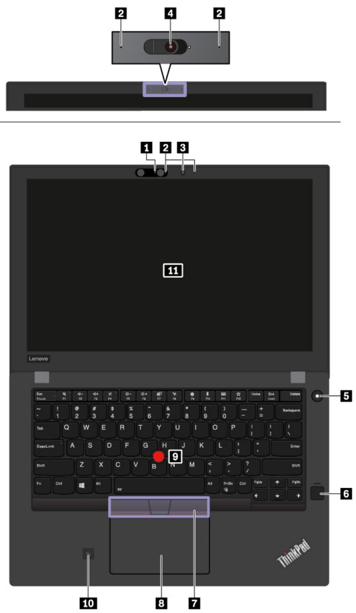

> **AI Description:**
> **Source:** `assets/_page_18_Figure_0.jpg`
> 
> **Generated:** 2026-06-01 23:39:19
> 
> ---
> 
> The image is a technical illustration of a Lenovo ThinkPad laptop, showing various components and their locations. It includes a top view of the laptop's webcam area, a front view of the laptop, and a close-up of the keyboard area. The image is annotated with numbers (1 through 11) to indicate different parts of the laptop, such as the webcam, touchpad, keyboard, and other buttons. The diagram is designed to help users identify and locate specific components on the laptop.

Note: \* Available on some models.

## 1 Infrared camera

The infrared camera provides a personal and secure way for you to sign in to your computer with face authentication. After setting the infrared camera for face authentication, you can unlock your computer by scanning your face instead of using a password. For more information, see “Using the cameras” on page 33.

Note: The infrared camera is supported only on the Windows 10 operating system.

## 2 Microphones

The microphones capture sound and voice when used with a program capable of handling audio.

## 3 Conventional camera

The camera enables you to take pictures or hold a video conference. For more information, see “Using the cameras” on page 33.

## 4 Conventional camera with Think Shutter

The camera enables you to take pictures or hold a video conference. You can use the Think Shutter to cover (slide to the right) or unveil (slide to the left) the camera lens.

## 5 Power button

Press the power button to turn on the computer or put the computer into sleep mode.

To turn off the computer, open the Start menu, click Power, and then click Shut down.

If your computer is unresponsive, you can turn off the computer by pressing and holding the power button for four or more seconds. If the computer cannot be turned off, see “Computer stops responding” on page 80 for more information.

You also can define what the power button does. For example, by pressing the power button, you can turn off the computer or put the computer into sleep or hibernation mode. To change what the power button does, do the following:

1. Go to Control Panel, and then change the view of Control Panel from Category to Large icons or Small icons.

2. Click Power Options ➙ Choose what the power buttons do.

3. Follow the instructions on the screen.

## 6 Fingerprint reader

Fingerprint authentication provides simple and secure user access by associating your fingerprint with a password. For more information, see “Using the fingerprint reader” on page 56.

Your computer is equipped with the Lenovo-unique ThinkPad® pointing device. For more information, see “ThinkPad pointing device overview” on page 22.

## 10 NFC mark

Near field communication (NFC) is a high-frequency and short-range wireless communication technology. By using NFC, you can establish the radio communications between your computer and another NFC-enabled device over a few centimeters or inches. For more information, see “Using the NFC devices” on page 31.

## 11 Screen (multi-touch screen on some models)

The multi-touch screen enables you to use your computer with simple touch gestures. For more information, see “Using the multi-touch screen” on page 18.

## Left-side view

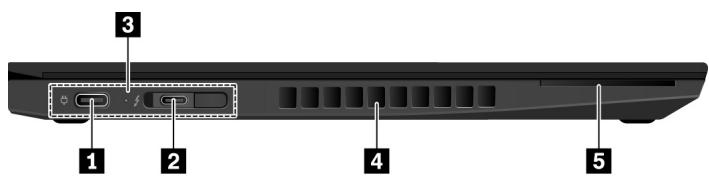

> **AI Description:**
> **Source:** `assets/_page_20_Figure_0.jpg`
> 
> **Generated:** 2026-06-01 23:45:10
> 
> ---
> 
> The image is a technical illustration of a laptop's side panel, showing various ports and features. It includes a diagram with numbered labels pointing to different components:
> 
> 1. A USB port
> 2. A charging port
> 3. A power button
> 4. A vent for cooling
> 5. A speaker or microphone port
> 
> The image is designed to help users identify and locate specific ports and features on a laptop's side panel.

Note: \* Available on some models.

## 1 USB-C™ connector

The USB-C connector / power connector on your computer supports both the USB Type-C™ standard. With an appropriate USB-C cable connected, you can use the connector to transfer data, charge your device, or connect your computer to external displays.

The USB-C connector also works as the power connector. Use the shipped USB-C power adapter and power cord to connect the computer to ac power through the USB-C connector.

Lenovo provides various USB-C accessories to help you expand your computer functionality. For more   
information, go to:   
https://www.lenovo.com/essentials

Note: When the battery power is below 10%, the USB-C accessories connected to the USB-C connector might not work correctly.

## 2 USB-C connector (Thunderbolt™ 3 compatible)

The USB-C connector on your computer supports both the USB Type-C standard and the Thunderbolt 3 technology. With an appropriate USB-C cable connected, you can use the connector to transfer data, charge your device, or connect your computer to external displays.

The USB-C connector also works as the power connector. Use the shipped USB-C power adapter and power cord to connect the computer to ac power through the USB-C connector.

Lenovo provides various USB-C accessories to help you expand your computer functionality. For more   
information, go to:   
https://www.lenovo.com/essentials

Note: When the battery power is below 10%, the USB-C accessories connected to the USB-C connector might not work correctly.

## 3 Docking-station connector

Connect your computer to a supported docking station to extend the computer capabilities. For more information, see “Attaching your computer to a docking station” on page 41.

## 4 Fan louvers

The fan louvers and internal fan enable air to circulate in the computer to ensure proper cooling, especially the cooling of the microprocessor.

Note: To ensure proper airflow, do not place any obstacles in front of the fan louvers.

## 5 Smart-card slot

Use smart cards for authentication, data storage, and application processing. Within large organizations, you might also use smart cards for strong security authentication of single sign-on (SSO). For more information, see “Using a media card or a smart card” on page 34.

## Right-side view

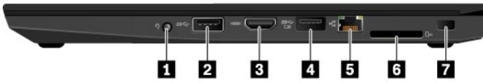

> **AI Description:**
> **Source:** `assets/_page_21_Figure_0.jpg`
> 
> **Generated:** 2026-06-01 23:47:35
> 
> ---
> 
> The image is a diagram of a laptop's bottom panel, showcasing various ports and connectors. It includes labels numbered 1 through 7, pointing to different ports and features. The labels are as follows: 1 is a power input, 2 is a USB port, 3 is an HDMI port, 4 is a Gigabit Ethernet port, 5 is a network port, 6 is a microphone input, and 7 is a headphone output. The diagram is likely used for identifying and locating these ports on a laptop for connectivity and functionality purposes.

## 1 Audio connector

Connect headphones or a headset with a 3.5-mm (0.14-inch), 4-pole plug to the audio connector to listen to the sound from the computer.

If you are using a headset with a function switch, do not press this switch while using the headset. If you press the switch, the headset microphone is disabled, and the integrated microphones on the computer is enabled instead.

Note: The audio connector does not support a conventional microphone. For more information, see “Using audio features” on page 32.

## 2 USB 3.1 connector Gen1

Connect USB-compatible devices, such as a USB keyboard, USB mouse, USB storage device, or USB printer.

Attention: When you attach a USB cable to this connector, ensure that the USB mark is facing upward.   
Otherwise the connector might get damaged.

## 3 HDMI connector

The High-Definition Multimedia Interface (HDMI) connector is a digital audio and video interface. It enables you to connect your computer to a compatible digital audio device or video monitor, such as a high-definition television (HDTV).

## 4 Always on USB 3.1 connector Gen 1

By default, the Always On USB 3.0 connector enables you to charge the USB-compatible devices in the following situations:

• When your computer is on or in sleep mode

• When your computer is off or in hibernation mode, but connected to ac power

To charge these devices when the computer is off or in hibernation mode, and the computer is not connected to ac power, start the Lenovo Vantage program, click Hardware Settings ➙ Power. Locate the Always On USB section and follow the instructions on the screen to make your preferred setting.

## 5 Ethernet connector

Connect the computer to a local area network (LAN). The Ethernet connector has two network status indicators. When the green indicator is on, the computer is connected to a LAN. When the yellow indicator blinks, data is being transmitted.

## DANGER

To avoid the risk of electrical shock, do not connect the telephone cable to the Ethernet connector.   
You can only connect an Ethernet cable to this connector.

Note: If the computer is connected to a docking station, use the Ethernet connector on the docking station instead of the one on the computer.

## 6 Media-card slot

Insert a flash media card into the media-card slot for data access or storage. For more information, see “Using a media card or a smart card” on page 34.

## 7 Security-lock slot

Lock your computer to a desk, table, or other fixtures through a security cable lock that fits this security-lock slot to protect your computer from theft,.

Note: You are responsible for evaluating, selecting, and implementing the locking device and security feature. Lenovo makes no comments, judgments, or warranties about the function, quality, or performance of the locking device and security feature.

## Bottom view

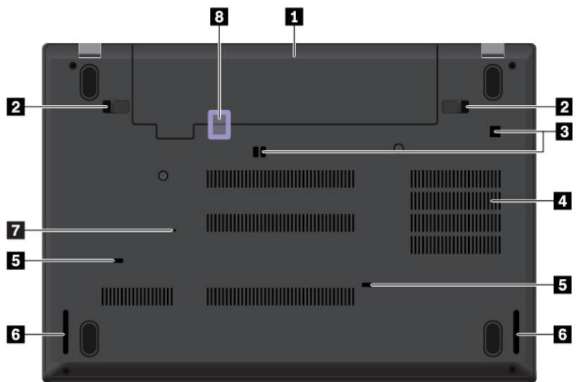

> **AI Description:**
> **Source:** `assets/_page_23_Figure_0.jpg`
> 
> **Generated:** 2026-06-01 23:33:37
> 
> ---
> 
> The image is a technical illustration of a laptop's underside, showcasing various components and ports. It includes labels numbered from 1 to 8, pointing to different parts of the laptop's underside. The labels indicate features such as the power button, audio jacks, USB ports, and cooling vents. The illustration is designed to help users identify and locate specific components for maintenance or troubleshooting purposes.

Note: \* Available on some models.

## 1 Removable battery

You can use the computer with battery power whenever ac power is unavailable.

## 2 Latches

Use the latches to lock or unlock the removable battery.

## 3 Docking-station hook holes

Use the docking-station hook holes to secure a supported docking station.

## 4 Fan louvers

The fan louvers and internal fan enable air to circulate in the computer to ensure proper cooling, especially the cooling of the microprocessor.

Note: To ensure proper airflow, do not place any obstacles under the fan louvers.

## 5 Keyboard drainage holes

If you accidentally spill water or drink over the keyboard, the keyboard drainage holes can help drain out liquid from your computer.

## 6 Speakers

Your computer is equipped with a pair of stereo speakers.

## 7 Emergency-reset hole

If the computer stops responding and you cannot turn it off by pressing the power button, remove the ac power adapter. Then, insert a straightened paper clip into the emergency-reset hole to reset the computer.

## 8 Nano-SIM card slot

The nano-SIM-card slot is in the battery compartment. If the computer supports the wireless wide area network (WWAN), a nano Subscriber Identification Module (SIM) card might be required to establish connections. For information about replacing or installing the nano-SIM card, see “Replacing the nano-SIM card” on page 102.

## Status indicators

This topic provides information about locating and identifying the various status indicators on your computer.

Note: Depending on the model, your computer might look different from the following illustrations.

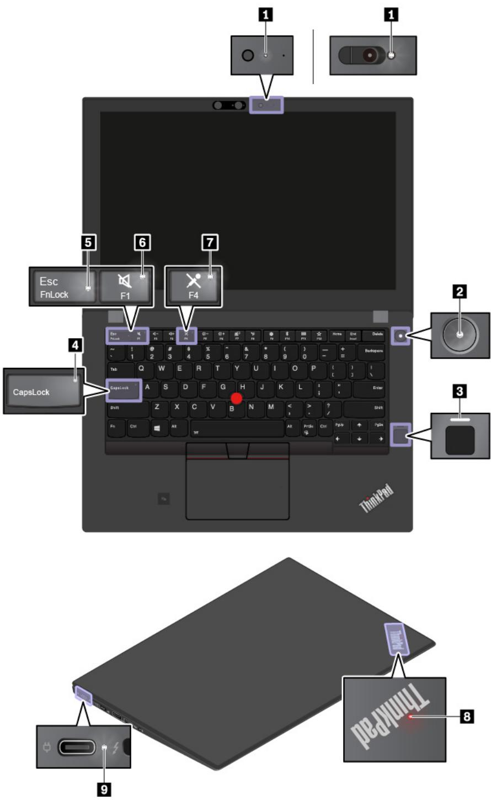

> **AI Description:**
> **Source:** `assets/_page_25_Figure_0.jpg`
> 
> **Generated:** 2026-06-01 23:35:29
> 
> ---
> 
> The image is a detailed technical illustration of a ThinkPad laptop, highlighting various components and their locations. It includes a top view of the laptop with labels pointing to the power button, camera, and other features. The keyboard area is also labeled, showing the Caps Lock key, function keys (F1, F4), and other keys. The bottom view of the laptop shows the ThinkPad logo, a USB port, and a charging port. The image is designed to provide a visual guide for identifying and locating different parts of the laptop.

## 1 Camera status indicator

When this indicator is on, the camera is in use.

## 2 8 System status indicators

The indicator in the ThinkPad logo on the computer lid and the indicator in the power button show the system status of your computer.

• Blinks for three times: The computer is initially connected to power.

• On: The computer is on (in normal mode).

• Off: The computer is off or in hibernation mode.

• Blinks quickly: The computer is entering sleep or hibernation mode.

• Blinks slowly: The computer is in sleep mode.

## 3 Fingerprint reader indicator

This indicator shows the status of fingerprint reader. For more information, see “Using the fingerprint reader” on page 56.

## 4 Caps Lock indicator

When this indicator is on, you can type uppercase letters by directly pressing the letter keys.

## 5 Fn Lock indicator

This indicator shows the status of Fn Lock function. For more information, see “Using the special keys” on page 20.

## 6 Speaker-mute indicator

When this indicator is on, the speakers are muted.

## 7 Microphone-mute indicator

When this indicator is on, the microphones are muted.

## 9 ac power status indicator

This indicator shows the ac power and charging status of the computer.

• White: connected to ac power (battery power 90%–100%)

• Amber: connected to ac power (battery power 0%–90%)

• Off: not connected to ac power

## Important product information

This section provides information to help you locate the following:

• Machine type and model information

• FCC ID and IC Certification information

• Windows operating systems information

## Machine type and model information

When you contact Lenovo for help, the machine type and model information helps the technicians to identify your computer and provide faster service.

The following illustration shows where to find the machine type and model information of your computer.

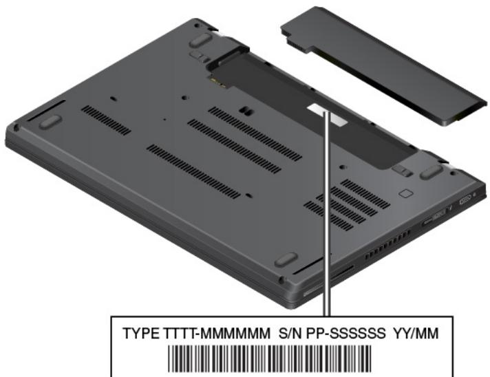

> **AI Description:**
> **Source:** `assets/_page_27_Figure_0.jpg`
> 
> **Generated:** 2026-06-01 23:44:59
> 
> ---
> 
> The image contains a technical illustration of a laptop's bottom panel, showing the underside of a device with various ports and cooling vents. The image also includes a barcode and a label with the text "TYPE TTTT-MMNNNN S/N PP-SSSSSS YY/MM," which appears to be a model and serial number identification. The illustration is likely used for repair or identification purposes.

## FCC ID and IC Certification number

The FCC and IC Certification information is identified by a label on the computer as shown in the following illustration.

Note: Depending on the model, your computer might look different from the following illustration.

Contains FCC ID:XXX-XXXXXXXX IC:XXXXX-XXXXXXX label P/N:SL10LXXXX

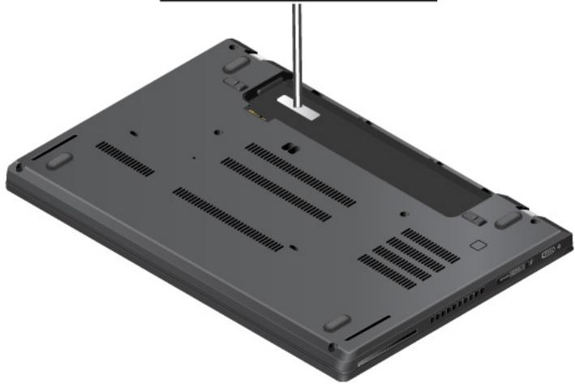

> **AI Description:**
> **Source:** `assets/_page_27_Figure_1.jpg`
> 
> **Generated:** 2026-06-01 23:45:50
> 
> ---
> 
> The image is a technical illustration of the underside of a laptop, showing various components and features. It includes a vented area for cooling, a USB port, and other ports and buttons. The image is likely used for educational or instructional purposes, such as explaining how to connect peripherals or access the laptop's ports.

The content of this label differs depending on the wireless modules that come with your computer:

• For a preinstalled wireless module, this label identifies the actual FCC ID and IC certification number for the wireless module installed by Lenovo.

Note: Do not remove or replace a preinstalled wireless module by yourself. For replacement, you must contact Lenovo service first. Lenovo is not responsible for any damage caused by unauthorized replacement.

• For a user-installable wireless WAN module, this label directs you to consult this user guide for the actual FCC ID and IC certification number.

The FCC ID and IC Certification number label is affixed to the wireless WAN module 1 (available on some models) installed in the computer.

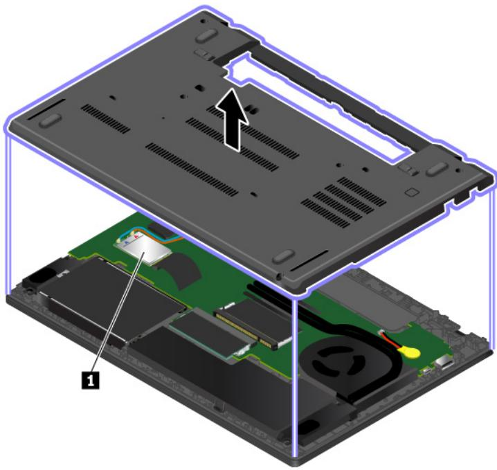

> **AI Description:**
> **Source:** `assets/_page_28_Figure_0.jpg`
> 
> **Generated:** 2026-06-01 23:36:25
> 
> ---
> 
> The image is a technical illustration of a computer's internal components. It shows a top-down view of a laptop's internal structure, highlighting the placement of a memory module (RAM) within the laptop's chassis. The image includes a label "1" pointing to the RAM module, indicating its location. The illustration is designed to guide users on how to access and replace the RAM. The image also includes a large arrow pointing upwards, likely indicating the direction in which the RAM should be inserted or removed. The illustration is detailed, showing various components such as the motherboard, cooling system, and other internal parts of the laptop.

Note: For the user-installable wireless module, ensure that you use only Lenovo-authorized wireless module for the computer. Otherwise, an error message will be displayed and the computer will beep when you turn on the computer.

## Labels for the Windows operating systems

Windows® 10 Genuine Microsoft® label: Your computer might have a Genuine Microsoft label affixed to its cover depending on the following factors:

• Your geographic location

• Date when your computer was manufactured

• Version of Windows 10 that is preinstalled

Go to https://www.microsoft.com/en-us/howtotell/Hardware.aspx for illustrations of the various types of Genuine Microsoft labels.

• In the People’s Republic of China, the Genuine Microsoft label is required on all computer models preinstalled with any version of Windows 10.

• In other countries and regions, the Genuine Microsoft label is required only on computer models licensed for Windows 10 Pro.

The absence of a Genuine Microsoft label does not indicate that the preinstalled Windows version is not genuine. For details on how to tell whether your preinstalled Windows product is genuine, refer to the information provided by Microsoft at:

https://www.microsoft.com/en-us/howtotell/default.aspx

There are no external, visual indicators of the Product ID or Windows version for which the computer is licensed. Instead, the Product ID is recorded in the computer firmware. Whenever a Windows 10 product is installed, the installation program checks the computer firmware for a valid, matching Product ID to complete the activation.

In some cases, an earlier Windows version might be preinstalled under the terms of the Windows 10 Pro license downgrade rights.

## Computer features

The computer features introduced in this topic cover various models. Some computer features might be available only on specific models.

## Microprocessor

To view the microprocessor information of your computer, right-click the Start button and then click System.

## Memory

Double data rate 4 (DDR4) small outline dual in-line memory module (SODIMM)

## Storage device

• 2.5-inch form factor, 7-mm (0.28-inch) height hard disk drive \*

• 2.5-inch form factor, 7-mm (0.28-inch) height Serial Advanced Technology Attachment (SATA) solid-state drive \*

• M.2 solid-state drive \*

## Display

• Brightness control

• Color display with In-Plane Switching (IPS) or Twisted Nematic (TN) technology

• Display size: 355.6 mm (14 inches)

• Display resolution: 1366 x 768 pixels, 1920 x 1080 pixels, or 2560 x 1440 pixels

• Multi-touch technology \*

## Keyboard

• Six-row keyboard (backlight function available on some models)

• Function keys

• ThinkPad pointing device

## Connectors and slots

• Audio connector

• Ethernet connector

• HDMI connector

• Media-card slot

• Two USB-C connectors (one Thunderbolt 3 compatible)

• Two USB 3.1 connectors Gen 1 (including one Always On USB connector)

• Smart-card slot \*

• Nano-SIM-card slot (inside the battery compartment) \*

## Security features

• Security-lock slot

• Security chip

• Face authentication (available on models with the infrared camera)

• Fingerprint reader \*

• Trusted Platform Module (TPM) \*

• Conventional camera with Think Shutter \*

## Wireless features

• Bluetooth

• Wireless LAN

• Global Positioning System (GPS) \*

• NFC \*

• Wireless WAN \*

## Others

• Microphones

• Conventional camera \*

Note: \* Available on some models.

## Computer specifications

## Size

• Width: 336.6 mm (13.25 inches)

• Depth: 232.5 mm (9.15 inches)

• Thickness: 19.95 mm (0.79 inches)

Maximum heat output (depending on the model)

• 45 W (154 Btu/hr)

• 65 W (222 Btu/hr)

Power source (ac power adapter)

• Sine-wave input at 50 Hz to 60 Hz

• Input rating of the ac power adapter: 100 V to 240 V ac, 50 Hz to 60 Hz

## Operating environment

Maximum altitude (without pressurization)

• 3048 m (10 000 ft)

## Temperature

• At altitudes up to 2438 m (8000 ft)

– Operating: 5°C to 35°C (41°F to 95°F)

– Storage: 5°C to 43°C (41°F to 109°F)

• At altitudes above 2438 m (8000 ft)

– Maximum temperature when operating under the unpressurized condition: 31.3°C (88°F)

Note: When you charge the battery, its temperature must be at least 10°C (50°F).

## Relative humidity

• Operating: 8% to 95% at wet-bulb temperature ${ } ^ { 2 3 ^ { \circ } \mathrm { C } }$ (73°F)

• Storage: 5% to 95% at wet-bulb temperature $\scriptstyle 2 7 ^ { \circ } \complement$ (81°F)

If possible, place your computer in a well-ventilated and dry area without direct exposure to sunshine.

## Attention:

• Keep electrical appliances such as electric fans, radio, air conditioners, and microwave ovens away from the computer. The strong magnetic fields generated by these appliances can damage the monitor and data on the internal storage drive.

• Do not place any beverages on top of or beside the computer or other attached devices. If liquid is spilled on or in the computer or an attached device, a short circuit or other damage might occur.

• Do not eat or smoke over your keyboard. Particles that fall into your keyboard can cause damage.

## Lenovo programs

Your computer comes with Lenovo programs to help you work easily and securely.

## Accessing Lenovo programs

To access Lenovo programs on your computer, do the following:

1. Open the Start menu and locate a program by the program name.

2. If you do not find the program in the program list, search for the program in the search box.

## An introduction to Lenovo programs

This topic provides a brief introduction to Lenovo programs. Depending on your computer model, some of the programs might not be available.

The available programs are subject to change without notice. To learn more about the programs and other computing solutions offered by Lenovo, go to:

https://support.lenovo.com

## Chapter 2. Using your computer

This chapter provides information to help you use the various features provided by your computer.

## Registering your computer

When you register your computer, information is entered into a database, which enables Lenovo to contact you if there is a recall or other severe problem. In addition, some locations offer extended privileges and services to registered users.

When you register your computer with Lenovo, you also will receive the following benefits:

• Quicker service when you call Lenovo for help

• Automatic notification of free software and special promotional offers

To register your computer with Lenovo, go to https://support.lenovo.com/productregistration and follow the instructions on the screen.

## Frequently asked questions

This topic provides a few tips to help you optimize the use of your ThinkPad notebook computers.

## Can I get my user guide in another language?

To download the user guide in another language, go to https://support.lenovo.com. Then follow the instructions on the screen.

## How do I get help about the Windows operating system?

The Windows help information system provides you with detailed information about using the Windows operating system so that you can get the most of your computer. To access the Windows help information system, click the Start button to open the Start menu, and then click Get Help. Additionally, you can use the Cortana® personal assistant to search for help, apps, files, settings, and so on.

## How do I access Control Panel?

Click the Start button to open the Start menu, and then click Windows System ➙ Control Panel.

## How to turn off my computer?

Open the Start menu, click Power, and then click Shut down.

## How to partition my storage drive?

To partition the storage drive of your computer in the Windows operating system, refer to https:// support.lenovo.com/solutions/ht503851.

## How do I use battery power more effectively when I am on the go?

• To conserve power, or to suspend operation without exiting programs or saving files, see “Power-saving modes” on page 28.

• To achieve the best balance between performance and power saving, create and apply an appropriate power plan. See “Managing the battery power” on page 28.

• If your computer will be turned off for an extended period of time, you can prevent battery power from draining by removing the battery.

How do I securely dispose of data stored on the internal storage drive?

• Study Chapter 5 “Security” on page 53 to find out how you can protect your computer from theft and unauthorized use.

• Before you dispose of the data on the internal storage drive, ensure that you read “Deleting data from your storage drive” on page 58.

## How do I attach an external display?

• Refer to “Using an external display” on page 36.

• With the Extend desktop function, you can display output on both the computer display and an external display.

How do I attach or replace a device?

Refer to the appropriate topic in Chapter 9 “Replacing devices” on page 99.

I have been using the computer for some time already, and is getting slower. What should I do?

• Follow the “General tips for preventing problems” on page 79.

• Diagnose problems yourself by using the preinstalled diagnostic software. See “Diagnosing problems” on page 79.

• Check for recovery solutions in Chapter 8 “Recovery information” on page 97.

Print the following topics and keep them with your computer in case you are unable to access this electronic user guide when necessary.

“Installing the Windows 10 operating system” on page 61

• “Computer stops responding” on page 80

• “Power problems” on page 92

## Using the multi-touch screen

This topic provides instructions on how to use the multi-touch screen that is available on some models.

## Notes:

• Your computer screen might look different from the following illustrations.

• Depending on the program you use, some gestures might not be available.

The following table introduces some frequently used gestures.

## Tips on using the multi-touch screen

• The multi-touch screen is a glass panel covered with a plastic film. Do not apply pressure or place any metallic object on the screen, which might damage the touch panel or cause it to malfunction.

• Do not use fingernails, gloved fingers, or inanimate objects for input on the screen.

• Regularly calibrate the accuracy of the finger input to avoid a discrepancy.

## Tips on cleaning the multi-touch screen

• Turn off the computer before cleaning the multi-touch screen.

• Use a dry, soft, and lint-free cloth or a piece of absorbent cotton to remove fingerprints or dust from the multi-touch screen. Do not apply solvents to the cloth.

• Gently wipe the screen using a top-down motion. Do not apply any pressure on the screen.

## Using the special keys

Your computer has several special keys to help you work more easily and effectively.

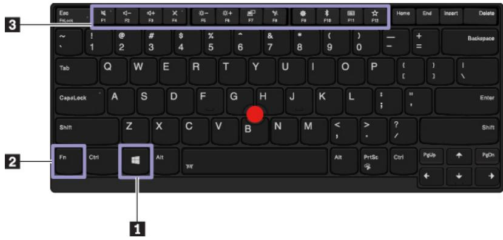

> **AI Description:**
> **Source:** `assets/_page_37_Figure_0.jpg`
> 
> **Generated:** 2026-06-01 23:35:51
> 
> ---
> 
> The image is a diagram of a computer keyboard, highlighting specific keys and key combinations. It includes labels for the "Fn" key, the "Ctrl" key, the "Alt" key, and the "Windows" key. The diagram also points to the "Caps Lock" key and the "Backspace" key, indicating their locations on the keyboard. The image is designed to help users locate these keys and understand their functions.

## 1 Windows logo key

Press the Windows logo key to open the Start menu. For information about using the Windows logo key with other keys, see the help information system of the Windows operating system.

## 2 3 Fn key and function keys

You can configure the Fn key and function keys in the Keyboard Properties window by doing the following:

1. Go to Control Panel, and then change the view of Control Panel from Category to Large icons or Small icons.

2. Click Lenovo - Keyboard Manager and the Keyboard Manager window is displayed.

3. Select the options of your preference.

FnLock Switch the key function between the standard F1–F12 function and the special function printed as an icon on each key. When the Fn Lock indicator is off, you can use the default function. You can change the default function in the Keyboard Properties window.

Mute or unmute the speakers. When the speakers are muted, the indicator on the key is on.   
If you mute the sound and turn off your computer, the sound will remain muted when you turn on your   
computer. To turn on the sound, press or F3

F2 Decrease the speaker volume.

F3 Increase the speaker volume.

Mute or unmute the microphones. When the microphones are muted, the indicator on the key is on.

Darken the computer display.

Brighten the computer display.

吧 F7 Manage external displays.

F8 Enable or disable the built-in wireless features.

Open the Settings window.

F8 Enable or disable the built-in Bluetooth features.

Open a keyboard setting page.

Invoke the function defined by yourself. If no function is defined, press this key to open the Cortana personal assistant. To define or change the function, do the following:

1. Open the Start menu and click the Lenovo Vantage program.

2. Click Hardware Settings and then click Input.

3. Locate the Keyboard: User-defined Key section and follow the instructions on the screen to complete the setting.

On the Input page, you can also define different functions for the key combinations with F12, such as Shift +F12, Alt+F12, or Ctrl+F12.

## Key combinations

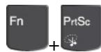

> **AI Description:**
> **Source:** `assets/_page_38_Figure_0.jpg`
> 
> **Generated:** 2026-06-01 23:41:42
> 
> ---
> 
> The image contains a keyboard shortcut icon. It shows the "Fn" key and the "PrtSc" key, with a plus sign between them, indicating that these two keys should be pressed together. This is a common keyboard shortcut for taking a screenshot on many computers.

Open the Snipping Tool program.

• Fn+B: The Break key

• Fn+K: The ScrLK or Scroll Lock key

• Fn+P: The Pause key

• Fn+S: The SysRq key

• Fn+Left Arrow key: The Home key

• Fn+Right Arrow key: The End key

• Fn+4: Put the computer into sleep mode. To wake up the computer, press the Fn key or the power button.

• Fn+Spacebar: If your computer supports keyboard backlight, press Fn+Spacebar to switch between the different keyboard backlight status.

## Using the ThinkPad pointing device

This section provides information about using the ThinkPad pointing device.

## ThinkPad pointing device overview

The ThinkPad pointing device enables you to perform all the functions of a traditional mouse, such as pointing, clicking, and scrolling. With the ThinkPad pointing device, you also can perform various touch gestures, such as rotating and zooming in or out.

The ThinkPad pointing device consists of the following devices:

1 TrackPoint pointing device

## 2 Trackpad

Note: Depending on the model, your TrackPoint pointing device and the trackpad might look different from the illustration in this topic.

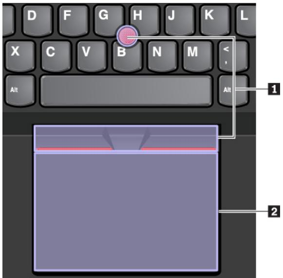

> **AI Description:**
> **Source:** `assets/_page_39_Figure_0.jpg`
> 
> **Generated:** 2026-06-01 23:40:07
> 
> ---
> 
> The image contains a diagram of a computer keyboard with a focus on the "B" key and the "Alt" key. The diagram highlights the "B" key with a circular highlight, indicating its position on the keyboard. Below the keyboard, there is a rectangular shape with a red line across the top, labeled as "2," which may represent a cursor or a pointer. The diagram is likely used to illustrate a specific function or action related to the "B" key and the "Alt" key, possibly in a software or hardware context.

By default, both the TrackPoint pointing device and the trackpad are active with the touch gestures enabled. To change the settings, see “Customizing the ThinkPad pointing device” on page 25.

## Using the TrackPoint pointing device

The TrackPoint pointing device enables you to perform all the functions of a traditional mouse, such as pointing, clicking, and scrolling.

The TrackPoint pointing device consists of the following components:

1 Pointing stick

2 Left-click button (primary-click button)

3 Right-click button (secondary-click button)

4 Scroll bar

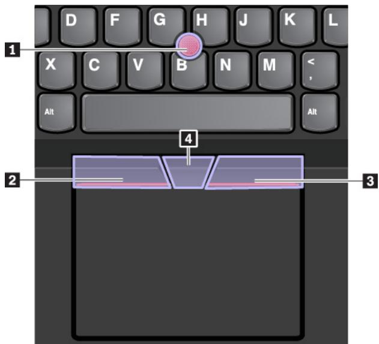

> **AI Description:**
> **Source:** `assets/_page_40_Figure_0.jpg`
> 
> **Generated:** 2026-06-01 23:32:51
> 
> ---
> 
> The image is a diagram of a keyboard layout, highlighting specific keys and areas. It includes labels for the following elements: 
> 1. A circular highlight on the 'B' key.
> 2. A highlighted area on the left side of the keyboard.
> 3. A highlighted area on the right side of the keyboard.
> 4. A highlighted area in the center of the keyboard. The diagram is likely used to demonstrate a specific feature or function related to these highlighted areas on the keyboard.

To use the TrackPoint pointing device, see the following instructions:

Note: Place your hands in the typing position and use your index finger or middle finger to apply pressure to the pointing-stick nonslip cap. Use either thumb to press the left-click button or right-click button.

## • Point

Use the pointing stick 1 to move the pointer on the screen. To use the pointing stick, apply pressure to the pointing-stick nonslip cap in any direction parallel to the keyboard. The pointer moves accordingly but the pointing stick itself does not move. The speed at which the pointer moves depends on the amount of pressure you apply to the pointing stick.

## • Left-click

Press the left-click button 2 to select or open an item.

## • Right-click

Press the right-click button 3 to display a shortcut menu.

## • Scroll

Press and hold the dotted scroll bar 4 while applying pressure to the pointing stick in the vertical or horizontal direction. Then you can scroll through the document, Web site, or apps.

## Using the trackpad

The entire trackpad surface is sensitive to finger touch and movement. You can use the trackpad to perform all the pointing, clicking, and scrolling functions of a traditional mouse.

The trackpad can be divided into two zones:

1 Left-click zone (primary-click zone)

2 Right-click zone (secondary-click zone)

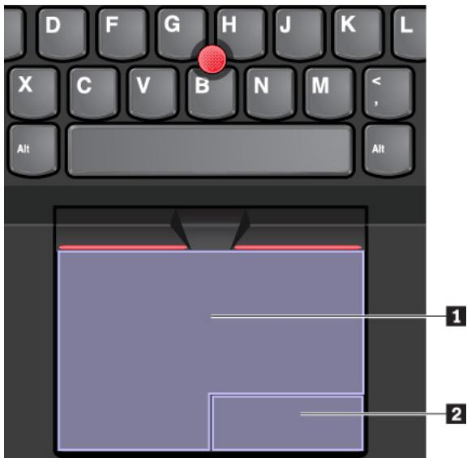

> **AI Description:**
> **Source:** `assets/_page_41_Figure_0.jpg`
> 
> **Generated:** 2026-06-01 23:34:29
> 
> ---
> 
> The image contains a diagram of a keyboard with a focus on the spacebar area. The diagram includes a highlighted spacebar with two labeled sections: 1 and 2. Section 1 appears to be the main part of the spacebar, while section 2 is a smaller, separate area at the bottom of the spacebar. The diagram is likely used to illustrate a feature or function related to the spacebar, possibly for a keyboard layout or a specific keyboard model. The red dot on the keyboard indicates the location of the spacebar within the overall keyboard layout.

To use the trackpad, see the following instructions:

## • Point

Slide one finger across the surface of the trackpad to move the pointer accordingly.

## • Left-click

Press the left-click zone 1 to select or open an item.

You also can tap anywhere on the surface of the trackpad with one finger to perform the left-click action.

## • Right-click

Press the right-click zone 2 to display a shortcut menu.

You also can tap anywhere on the surface of the trackpad with two fingers to perform the right-click action.

## • Scroll

Put two fingers on the trackpad and move them in the vertical or horizontal direction. This action enables you to scroll through the document, Web site, or apps. Ensure that you position your two fingers slightly apart from each other.

With the trackpad, you also can perform a variety of touch gestures. For information about using the touch gestures, see “Using the trackpad touch gestures” on page 25.

If the trackpad surface is stained with oil, turn off the computer first. Then gently wipe the trackpad surface with a soft and lint-free cloth moistened with lukewarm water or computer cleaner.

## Using the trackpad touch gestures

The entire trackpad surface is sensitive to finger touch and movement. You can use the trackpad to perform the same point and click actions as you would use a traditional mouse. You also can use the trackpad to perform various touch gestures.

The following section introduces some frequently used touch gestures such as tapping, dragging, and scrolling. For more gestures, see the help information system of the ThinkPad pointing device.

## Notes:

• When using two or more fingers, ensure that you position your fingers slightly apart.

• Some gestures are not available if the last action was done from the TrackPoint pointing device.

• Some gestures are only available when you are using certain apps.

• Depending on the model, the trackpad on your computer might look different from the illustrations in this topic.

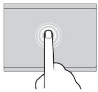

> **AI Description:**
> **Source:** `assets/_page_42_Figure_0.jpg`
> 
> **Generated:** 2026-06-01 23:45:55
> 
> ---
> 
> The image is a simple technical illustration. It depicts a finger interacting with a touch screen, likely representing a touch gesture or touchpad functionality. The finger is positioned as if pressing or swiping on the screen, with a circular icon indicating the area of interaction. This type of image is commonly used in user interface design or instructional materials to demonstrate touch-based interactions on electronic devices.

## Tap

Tap anywhere on the trackpad with one finger to select or open an item.

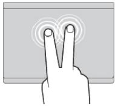

> **AI Description:**
> **Source:** `assets/_page_42_Figure_1.jpg`
> 
> **Generated:** 2026-06-01 23:46:45
> 
> ---
> 
> The image is a diagram illustrating a hand gesture. It shows a hand with the thumb and index finger extended, forming a "V" shape. The fingers are positioned over a surface that resembles a touchscreen or a tablet, suggesting a gesture interaction with the device. The image is likely used to demonstrate a specific touch gesture or input method for a user interface.

## Two-finger tap

Tap anywhere on the trackpad with two fingers to display a shortcut menu.

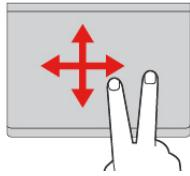

> **AI Description:**
> **Source:** `assets/_page_42_Figure_2.jpg`
> 
> **Generated:** 2026-06-01 23:48:17
> 
> ---
> 
> The image contains a diagram illustrating a finger gesture on a touchscreen interface. The diagram shows two fingers pointing towards a virtual button or icon on the screen, with red arrows indicating the direction of movement. The arrows are pointing in four directions: up, down, left, and right, suggesting that the gesture is used to navigate or interact with the screen in those directions.

## Two-finger scroll

Put two fingers on the trackpad and move them in the vertical or horizontal direction. This action enables you to scroll through the document, Web site, or apps.

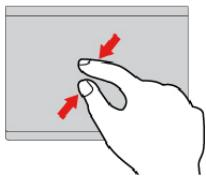

> **AI Description:**
> **Source:** `assets/_page_42_Figure_3.jpg`
> 
> **Generated:** 2026-06-01 23:46:56
> 
> ---
> 
> The image contains a simple diagram of a hand interacting with a touch screen or similar interface. The hand is shown with a finger pressing down on the screen, and there are red arrows pointing towards the finger, indicating the direction of the touch. The diagram is likely used to illustrate a gesture or interaction method for a user interface, possibly for a tutorial or instructional guide.

## Two-finger zoom out

Put two fingers on the trackpad and move them closer together to zoom out.

## Two-finger zoom in

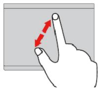

> **AI Description:**
> **Source:** `assets/_page_42_Figure_4.jpg`
> 
> **Generated:** 2026-06-01 23:45:41
> 
> ---
> 
> The image contains a diagram of a hand performing a gesture. The diagram shows a hand with the thumb and index finger extended, and a red arrow pointing from the tip of the thumb towards the index finger, indicating a specific motion or interaction. The background is a simple gray rectangle, and the hand is outlined in black.

Put two fingers on the trackpad and move them farther apart to zoom in.

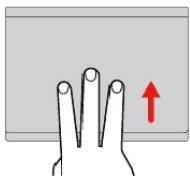

> **AI Description:**
> **Source:** `assets/_page_42_Figure_5.jpg`
> 
> **Generated:** 2026-06-01 23:45:04
> 
> ---
> 
> The image is a simple diagram showing a hand interacting with a touchpad. The hand is positioned with fingers extended, and a red arrow points upwards, indicating a gesture or action to be performed on the touchpad. The diagram is likely instructional, demonstrating how to use a touchpad, possibly for a computer or tablet.

## Swipe three fingers up

Put three fingers on the trackpad and move them up to open the task view to see all your open windows.

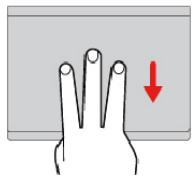

> **AI Description:**
> **Source:** `assets/_page_42_Figure_6.jpg`
> 
> **Generated:** 2026-06-01 23:43:42
> 
> ---
> 
> The image contains a diagram illustrating a hand interacting with a touchpad or similar device. The hand is positioned with the fingers extended, and a red arrow points downward, indicating a downward swipe or tap action on the touchpad. The diagram is simple and likely serves as an instructional or illustrative guide for using a touchpad.

## Swipe three fingers down

Put three fingers on the trackpad and move them down to show the desktop.

## Customizing the ThinkPad pointing device

You can customize the ThinkPad pointing device so you can use it more comfortably and efficiently. For example, you can choose to enable the TrackPoint pointing device, the trackpad, or both. You also can disable or enable the touch gestures.

To customize the ThinkPad pointing device, do the following:

1. Go to Control Panel.

2. View Control Panel by Large icons or Small icons. Click Mouse. The Mouse Properties window is displayed.

3. In the Mouse Properties window, follow the instructions on the screen to complete the customization.

## Replacing the cap on the pointing stick

The cap 1 on the end of the pointing stick is removable. After you use the cap for a period of time, you might consider replacing the cap with a new one.

## Notes:

• Ensure that you use a cap with grooves a as shown in the following illustration.

• Depending on the model, your keyboard might look different from the illustration in this topic.

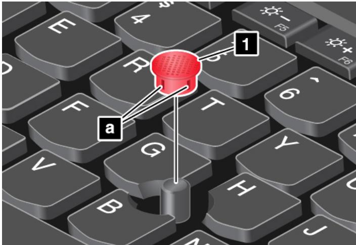

> **AI Description:**
> **Source:** `assets/_page_43_Figure_0.jpg`
> 
> **Generated:** 2026-06-01 23:44:38
> 
> ---
> 
> The image is a close-up of a computer keyboard, focusing on the spacebar area. It highlights a red button labeled "1" and a smaller button labeled "a". The red button appears to be a special function key, possibly for a specific keyboard feature or software function. The smaller button labeled "a" is likely a dedicated key for a specific application or setting. The image is a technical illustration, likely used for instructional or troubleshooting purposes.

## Power management

This section provides information about how to use ac power and battery power to achieve the best balance between performance and power management.

## Using the ac power adapter

The power to run your computer can come either from the battery or from ac power. While you use ac power, the battery charges automatically.

Your computer comes with a USB-C type ac power adapter and a power cord.

• ac power adapter: Converts ac power for notebook computer use.

• Power cord: Connects the ac outlet and the ac power adapter.

## Connecting the ac power adapter

To connect the computer to ac power, ensure that you follow the steps in order:

Attention: Using an improper power cord might severely damage your computer.

1. Connect the power cord to the ac power adapter.

2. Connect the ac power adapter to one of the USB-C connectors of the computer.

3. Connect the power cord to an electrical outlet.

## Tips on using the ac power adapter

• When the ac power adapter is not in use, disconnect it from the electrical outlet.

• Do not bind the power cord tightly around the ac power adapter transformer pack when it is connected to the transformer.

## Using the battery

When you use your computer away from electrical outlets, you depend on battery power to keep your computer running. Different computer components consume power at different rates. The more you use the power-intensive components, the faster you consume battery power.

Spend more time unplugged with ThinkPad batteries. Mobility has revolutionized business by enabling you to take your work wherever you go. With ThinkPad batteries, you are able to work longer without being tied to an electrical outlet.

## Checking the battery status

Move your pointer to the battery-status icon in the Windows notification area to check the battery status. The battery-status icon displays the percentage of battery power remaining and how long you can use your computer before you must charge the battery.

The rate at which you use battery power determines how long you can use the battery of your computer between charges. Because every computer user has individual habits and needs, it is difficult to predict how long a battery charge lasts. There are two main factors:

• How much energy is stored in the battery when you begin to work

• The way you use your computer, for example:

– How often you access the storage drive

– How bright you make the computer display

– How often you use the wireless feature

## Charging the battery

When you find that the remaining battery power is low, charge your battery or replace the battery with a charged battery.

If an ac outlet is convenient, connect the computer to ac power. The battery is fully charged in about four to eight hours. The actual charging time depends on the battery size, the physical environment, and whether you are using the computer. You can check the battery charging status at any time through the batterystatus icon in the Windows notification area.

Note: To maximize the life of the battery, the computer does not start recharging the battery if the remaining power is greater than 95%.

## When to charge the battery

• Battery charging is affected by its temperature. The recommended temperature range for charging the battery is between 10°C (50°F) and 35°C (95°F).

Notes: To check the battery temperature, do the following:

1. Open the Lenovo Vantage.

2. Click Hardware Settings ➙ Power.

3. Locate the Power Status section and then click Show Details to view the battery temperature.

• Charge the battery in any of the following conditions:

– A new battery is installed.

– The percentage of power remaining is low.

– The battery has not been used for a long time.

## Maximizing the battery life

To maximize the life of the battery, do the following:

• Use the battery until the charge is depleted.

• Recharge the battery completely before using it. You can see whether the battery is fully charged from the battery-status icon in the Windows notification area.

• Always use power management features such as power-saving modes.

## Managing the battery power

To achieve the best balance between performance and power saving, adjust your power plan settings. To adjust power plan settings, do the following:

1. Go to Control Panel, and then change the view of Control Panel from Category to Large icons or Small icons.

2. Click Power Options.

3. Follow the instructions on the screen.

For more information, see the Windows help information system.

## Power-saving modes

There are several modes that you can use at any time to conserve power. This section introduces each mode and gives tips on the effective use of battery power.

## • Sleep mode

In sleep mode, your work is saved to memory, and then the storage drive and the computer display are turned off. When your computer wakes up, your work is restored within seconds.

To put your computer to sleep mode, open the Start menu, click Power, and then click Sleep.

## • Hibernation mode

By using this mode, you can turn off your computer completely without saving files or exiting any programs that are running. When the computer enters hibernation mode, all open programs, folders, and files are saved to the storage drive, and then the computer turns off.

To put the computer to hibernation mode, define what the power button does first, and then press the power button to put the computer to hibernation mode.

If you put your computer to hibernation mode with the wake-up function disabled, the computer does not consume any power. The wake-up function is disabled by default. If you put your computer to hibernation mode with the wake-up function enabled, the computer consumes a small amount of power.

To enable the wake-up function, do the following:

1. Open Control Panel, view Control Panel by Category, and then click System and Security.

2. Click Administrative Tools.

3. Double-click Task Scheduler. If you are prompted for an administrator password or confirmation, type the password or provide confirmation.

4. From the left pane, select the task folder for which you want to enable the wake-up function. The scheduled tasks are displayed.

5. Click a scheduled task, and then click the Conditions tab.

6. Under Power, select Wake the computer to run this task.

## • Wireless off

When you are not using the wireless features, such as Bluetooth or wireless LAN, turn them off to help conserve power.

## Cabled Ethernet connections

With an Ethernet cable, you can connect your computer to a local network through the Ethernet connector on your computer.

The Ethernet connector has two network status indicators. When the green indicator is on, the computer is connected to a LAN. When the yellow indicator blinks, data is being transmitted.

Note: If the computer is connected to a supported docking station or a supported dock, use the Ethernet connector on the docking station or the dock instead of the one on the computer.

## DANGER

Your computer has an Ethernet connector. To avoid the risk of electrical shock, do not connect the telephone cable to the Ethernet connector.

## Wireless connections

Wireless connection is the transfer of data without the use of cables but by means of radio waves only.

## Using the wireless-LAN connection

A wireless local area network (LAN) covers a relatively small geographic area, such as an office building or a house. Devices based on the 802.11 standards can connect to this type of network.

Your computer comes with a built-in wireless network card to help you establish wireless connections and monitor the connection status.

To establish a wireless-LAN connection, do the following:

1. Turn on the wireless feature, press

2. Click the wireless-network-connection-status icon in the Windows notification area. A list of available wireless networks is displayed.

3. Double-click a network to connect to it. Provide required information if needed.

The computer automatically connects to an available and remembered wireless network when the location changes. If the available wireless network is secured, provide the password as required. For more information, see the Windows help information system.

## Tips on using the wireless-LAN feature

To achieve the best connection, use the following guidelines:

• Place your computer so that there are as few obstacles as possible between the wireless-LAN access point and the computer.

• Open your computer cover to an angle of slightly more than 90 degrees.

## Checking the wireless-LAN connection status

You can check the wireless-LAN connection status through the wireless-network-connection-status icon in the Windows notification area. The more bars encompassed, the better the signal is.

## Using the wireless-WAN connection

Wireless wide area network (WAN), which uses cellular networks for data transmission, enables you to establish wireless connections over remote public or private networks. These connections can be maintained over a large geographical area by use of multiple antenna sites or satellite systems maintained by wireless service providers.

Some ThinkPad notebook computers come with a wireless-WAN card installed, which provides some wireless-WAN technologies, such as HSPA, 3G, 4G, or LTE. By using the wireless-WAN card, you can establish wireless-WAN connections.

Note: The wireless-WAN service is provided by authorized service providers in some countries or regions.

## Tips for using the wireless-WAN feature

To achieve the best connection, use the following guidelines:

• Keep your computer away from your body.

• Place your computer on a flat surface and open your computer display to an angle of slightly more than 90 degrees.

• Place your computer away from concrete or brick walls that might dampen cellular signals.

• Best reception is available near windows and other locations where cellular phone reception is the strongest.

## Checking the wireless-WAN connection status

You can check the wireless-WAN connection status through the wireless-network-connection-status icon in the Windows notification area. The more bars encompassed, the better the signal is.

## Using the Bluetooth connection

Bluetooth can connect devices that are within a short distance from one another. Bluetooth is commonly used in the following scenarios:

• Connecting peripheral devices to a computer

• Transferring data between hand-held devices and a personal computer

• Remotely controlling and communicating with devices such as mobile phones

Depending on the model, your computer might support the Bluetooth feature. To transfer data through the Bluetooth feature, do the following:

Note: It is not recommended to use the wireless feature (the 802.11 standards) of your computer simultaneously with a Bluetooth option. The data transmission speed can be delayed and the performance of the wireless feature can be degraded.

1. Do one of the following:

• Press the Bluetooth-control key F10 and turn on the Bluetooth feature.

• Open the Start menu, and then click Settings ➙ Devices ➙ Bluetooth & other devices. Turn on the Bluetooth switch to enable the Bluetooth feature.

2. Right-click the data that you want to send.

3. Select Send to ➙ Bluetooth device.

4. Select a Bluetooth device, and then follow the instructions on the screen.

For more information, see the Windows help information system and the help information system of the Bluetooth device.

## Using the NFC devices

If your computer supports the NFC feature, you will see an NFC mark or label around the trackpad area.

NFC is a high-frequency and short-range wireless communication technology. By using NFC, you can establish the radio communications between your computer and another NFC-enabled device over a few centimeters or inches.

This section provides instructions on how to pair your computer with an NFC device. For more information about data transfer, see the documentation of the NFC device.

## Attention:

• Before handling the NFC card, touch a metal table or a grounded metal object. Otherwise the card might get damaged by the static electricity from your body.

• During the data transfer, do not put your computer or NFC-enabled smartphone to sleep mode; otherwise, your data might get damaged.

## Enabling the NFC feature

By default, the NFC feature is enabled. If the NFC feature of your computer is disabled, do the following to enable the NFC feature:

1. Open the Start menu and then click Settings ➙ Network & Internet ➙ Airplane mode.

2. Turn off the Airplane mode.

3. Turn on the NFC function.

## Pairing your computer with an NFC card

Before you start, ensure that the card is in NFC Data Exchange Format (NDEF), otherwise the card cannot be detected. Then do the following:

1. Position the card closely above the NFC label as shown. Align the shorter edge of the card with the horizontal extension line for the center of the NFC label.

2. Slowly move the card a distance within 0.5 cm (0.20 inches) to the direction of the computer display. Then hold the card for seconds until you are prompted that the card has been successfully detected.

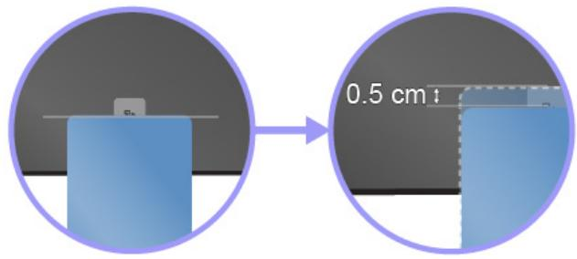

> **AI Description:**
> **Source:** `assets/_page_48_Figure_0.jpg`
> 
> **Generated:** 2026-06-01 23:41:06
> 
> ---
> 
> The image contains a diagram with two circular sections. The left circle shows a simplified representation of a device with a blue rectangular component underneath it. The right circle zooms in on the blue component, indicating a measurement of 0.5 cm with a dashed line marking the boundary of the component. The diagram appears to be illustrating the size of a specific part or feature within a device.

## Pairing your computer with an NFC-enabled smartphone

Before you start, ensure that the smartphone screen is facing upward. Then do the following:

1. Position the smartphone closely above the NFC label as shown. Align the shorter edge of the smartphone with the horizontal extension line for the center of the NFC label.

2. Slowly move the smartphone a distance within 5 cm (1.97 inches) to the direction of the computer display. Then hold the smartphone for seconds until you are prompted that the smartphone has been successfully detected.

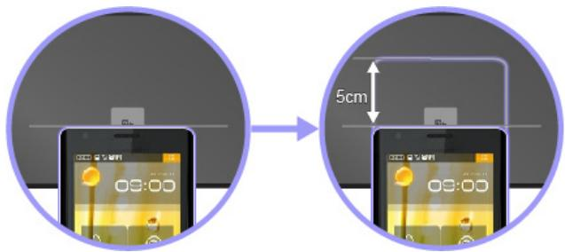

> **AI Description:**
> **Source:** `assets/_page_49_Figure_0.jpg`
> 
> **Generated:** 2026-06-01 23:42:32
> 
> ---
> 
> The image is a diagram showing a smartphone placed on a surface with a 5cm gap between the phone and the edge of the surface. The diagram includes a close-up view of the phone's screen displaying the time "09:00". The diagram is likely used to illustrate a specific measurement or setup related to the phone's placement or usage.

## Using the Airplane mode

If the Airplane mode is enabled, all wireless features are disabled.

To enable or disable the Airplane mode, do the following:

1. Open the Start menu.

2. Click Settings ➙ Network & Internet ➙ Airplane mode.

3. Slide the control for Airplane mode to turn it on or off.

## Using audio features

Your computer is equipped with the following items:

• Audio connector, 3.5 mm (0.14 inches) in diameter

• Microphones

• Speakers

Your computer also has an audio chip that enables you to enjoy various multimedia audio features, such as the following:

• Compliant with High Definition Audio

• Playback of MIDI and MP3 files

• Recording and playback of PCM and WAV files

• Recording from various sound sources, such as a headset attached

The following list provides information about supported functions of the audio devices attached to the connectors on your computer or the docking station.

• Headset with a 3.5-mm (0.14-inch), 4-pole plug: Headphone and microphone functions

• Conventional headphone: Headphone function

Note: The conventional microphone is not supported.

## Using the smart audio feature

The smart audio feature is supported on some computer models. To help protect against hearing loss, the feature limits the computer’s maximum wide band true RMS output voltage to 130 mV when a headset or headphone is connected.

To change the setting, do the following:

1. Go to Control Panel and view by Large icons.

2. Click SmartAudio. In the window displayed, click the Disable Headphone Limiter icon. Then follow the on-screen instructions.

## Using the cameras

Depending on models, your computer might be equipped with a conventional camera with Think Shutter or an infrared camera.

## Using the conventional camera with Think Shutter

To use the conventional camera to take pictures and record videos, slide the Think Shutter to the left to unveil the camera lens first. Then open the Start menu and click Camera from the program list. If you use other programs that provide features such as photographing, video capturing, and video conferencing, the camera starts automatically when you enable the camera-required feature. When the camera starts, the camera status indicator nearby turns white, indicating that the camera is in use. If your want to cover the camera lens, slide the Think Shutter to the right.

If you want to configure the camera settings, open the Start menu and then click Lenovo Vantage ➙ Hardware Settings ➙ Audio/Visual. Locate the Camera section and then follow the instructions on the screen to configure the camera settings

## Using the infrared camera

The infrared camera provides a personal and secure way for you to sign in to your computer with face authentication. After setting the infrared camera for face authentication, you can unlock your computer by scanning your face instead of using a password.

The infrared camera has the following components:

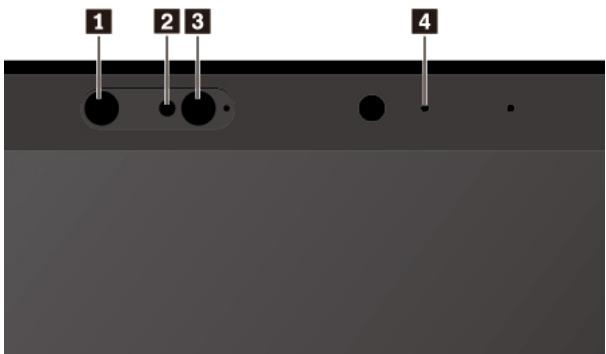

> **AI Description:**
> **Source:** `assets/_page_50_Figure_0.jpg`
> 
> **Generated:** 2026-06-01 23:46:32
> 
> ---
> 
> The image is a technical illustration showing a top-down view of a device's edge with four labeled points. The points are numbered 1 through 4 and appear to represent different components or features of the device. The labels are placed above the corresponding points, indicating their respective positions. The illustration is likely used for instructional or technical purposes, possibly to highlight specific parts of the device for assembly or maintenance.

1 3 Infrared light-emitting diode (LED)

The infrared LED emits infrared light. Normally the infrared light is invisible to the naked eye.

2 Infrared camera lens

The infrared camera lens is used for creating the facial image of a user.

## 4 Camera indicator

When the camera indicator is on, the infrared camera is in the recognition mode.

To set the infrared camera for face authentication, do the following:

1. Open the Start menu and click Settings ➙ Accounts ➙ Sign-in options.

2. Scroll down to the Password section and click Add to create a password.

3. Follow the instructions on the screen to create a Personal Identification Number (PIN).

4. Locate the Windows Hello section and click Set up under Face Recognition. Then click Get Started.

5. Enter the PIN you have set earlier. The camera preview starts.

6. Follow the instructions on the screen to complete the setup.

7. Click Improve Recognition to improve the image so that Windows Hello can recognize you in different light conditions or when your appearance changes.

To use the infrared camera to unlock your computer, do the following:

1. On the Windows lock screen, select the smiling face icon from the sign-in options.

2. Follow the instructions on the screen and ensure that you are centered and looking directly at the camera. When the program recognizes your face, it automatically unlocks the screen and signs you in to the Windows operating system.

## Using a media card or a smart card

Your computer has a media-card slot. Depending on the model, your computer might also have a smart-card slot.

## Supported media card types

The media-card reader on your computer only supports the following media cards:

Note: Your computer does not support the content protection for recordable media (CPRM) feature for the SD card.

• MultiMediaCard (MMC)

• Secure Digital (SD) card

• Secure Digital eXtended-Capacity (SDXC) card

• Secure Digital High-Capacity (SDHC) card

## Supported smart card type

You can use smart cards for authentication, data storage, and application processing. Within large organizations, you might also use smart cards for strong security authentication of single sign-on (SSO). The smart-card reader on your computer only supports the smart card of the following specifications:

> **AI Description:**
> **Source:** `assets/_page_51_Figure_0.jpg`
> 
> **Generated:** 2026-06-01 23:43:38
> 
> ---
> 
> The image shows a simple graphic of a credit card with a blue background and a yellow chip at the bottom right corner. The card appears to be a standard design for a debit or credit card, with no additional text or numerical information visible. The image is minimalistic and does not contain any charts, graphs, or other visual elements beyond the basic representation of a card.

• Length: 85.60 mm (3.37 inches)

• Width: 53.98 mm (2.13 inches)

• Thickness: 0.76 mm (0.03 inches)

Attention: Smart cards with slits are not supported. Do not insert such a smart card into the smart-card reader of your computer. Otherwise the reader might get damaged.

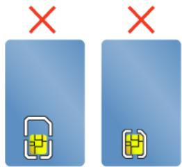

> **AI Description:**
> **Source:** `assets/_page_52_Figure_0.jpg`
> 
> **Generated:** 2026-06-01 23:33:01
> 
> ---
> 
> The image contains a simple diagram with two blue rectangles representing SIM cards. Each SIM card has a yellow icon at the bottom right corner, which appears to be a representation of a SIM card. Above each SIM card, there is a red "X" symbol, indicating that these SIM cards are not usable or are marked as incorrect. The image uses a clear visual distinction to convey the status of the SIM cards.

## Installing a media card or a smart card

Attention: Before you start installing a card, touch a metal table or a grounded metal object. This action reduces any static electricity from your body. Static electricity could damage the card.

To install the card, do the following:

1. Locate the appropriate type of slot for your card. See “Computer controls, connectors, and indicators” on page 1.

2. Ensure that the card is correctly oriented:

• For the media card: The metal contacts are facing down and pointing toward the card slot.

• For the smart card: The metal contacts are facing upward and pointing toward the card slot.

3. Press the card firmly into the card slot.

If the plug-and-play feature is not enabled for the installed media card or smart card, do the following to enable the feature:

1. Go to Control Panel.

2. View Control Panel by Category. Click Hardware and Sound.

3. Click Device Manager. If you are prompted for an administrator password or confirmation, type the password or provide confirmation.

4. From the Action menu, select Add legacy hardware. The Add Hardware Wizard starts.

5. Follow the instructions on the screen.

## Removing a media card or a smart card

## Attention:

• Before removing a card, stop the card first. Otherwise, data on the card might get corrupted or lost.

• When transferring data to or from a media card or a smart card, do not put your computer to sleep or hibernation mode before the data transfer is completed; otherwise, your data might get damaged.

• Do not remove a card when the computer is in sleep mode or hibernation mode. Otherwise, the system might not respond when you try to resume operation.

To remove a card, do the following:

1. Click the triangular icon in the Windows notification area to show hidden icons. Then, right-click the Safely Remove Hardware and Eject Media icon.

2. Select the corresponding item to eject the card from the Windows operating system.

3. Press the card to eject it from your computer.

4. Remove the card and store it safely for future use.

Note: If you do not remove the card from your computer after you eject the card from the Windows operating system, the card can no longer be accessed. To access the card, you must remove it first, and then insert it again.

## Using an external display

This section provides instructions on how to connect an external display, choose display modes, and change display settings.

You can use an external display such as a projector or a monitor to give presentations or to expand your workspace.

Your computer supports the following video resolution, if the external display also supports that resolution.

• Up to 4096 x 2304 pixels / 60 Hz, with an external display connected to the USB-C or USB-C (Thunderbolt 3 compatible) connector

• Up to 4096 x 2160 pixels / 30 Hz with an external display connected to the HDMI connector

For more information about the external display, see the manuals that come with it.

## Connecting an external display

You can use either a wired display or a wireless display. The wired display can be connected to a video connector such as the HDMI connector and the USB-C connector by a cable. The external display connected to the USB-C connector and the external display connected to the HDMI connector cannot be used simultaneously. The wireless display can be added through the Miracast® function.

## • Connecting a wired display

Note: When you connect an external monitor, a video interface cable with a ferrite core is required.

1. Connect the external display to an appropriate video connector on your computer, such as the HDMI connector or the USB-C connector.

2. Connect the external display to an electrical outlet.

3. Turn on the external display.

If your computer cannot detect the external display, right-click on the desktop, and then click Screen resolution/Display settings ➙ Detect.

Do not connect external displays to the USB-C connector 1 and the HDMI connector 2 at the same time. Otherwise, only the external display connected to the USB-C connector 1 will work by default. To change the priority between the USB-C connector and the HDMI connector, start the ThinkPad Setup program. See “” on page , and then configure Shared Display Priority in “” on page .

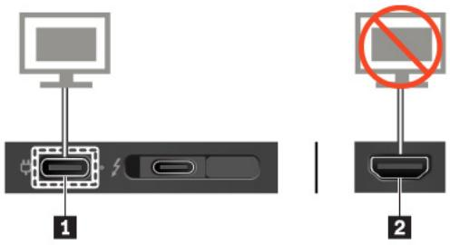

> **AI Description:**
> **Source:** `assets/_page_53_Figure_0.jpg`
> 
> **Generated:** 2026-06-01 23:33:59
> 
> ---
> 
> The image is a technical illustration showing two scenarios involving a device with a display port and a USB-C port. On the left side, labeled as "1," the display port is connected to a monitor, indicating that the device is currently connected to a display. On the right side, labeled as "2," the display port is not connected to a monitor, as indicated by the red circle with a diagonal line through it, suggesting that the display is disconnected. The USB-C port is shown on both sides, but its connection status is not depicted.

## • Connecting a wireless display

Note: To use a wireless display, ensure that both your computer and the external display support the Miracast feature.

Do one of the following:

– Open the Start menu, and then click Settings ➙ Devices ➙ Connected devices ➙ Add a device.

– Click the action center icon in the Windows notification area. Click Connect. Select the wireless display and follow the instructions on the screen.

For more information, see the Windows help information system.

## Choosing a display mode

You can display your desktop and apps on the computer display, the external display, or both. To choose how to display the video output, press the display-mode switching key and then select a display mode you prefer.

There are four display modes:

• PC screen only: Displays the video output only on your computer screen.

Note: Depending on the situation, you might see Disconnect, PC screen only, Computer only or Disconnect projector.

• Duplicate: Displays the same video output on both your computer screen and an external display.

• Extend: Extends the video output from your computer display to an external display. You can drag and move items between the two displays.

• Second screen only: Shows the video output only on an external display.

Note: Depending on the situation, you might see Projector only or Second screen only.

If you show programs using DirectDraw or Direct3D® in full-screen mode, only the main display shows the video output.

## Changing display settings

You can change the settings for both the computer display and the external display. For example, you can define which one is the main display and which one is the secondary display. You also can change the resolution and orientation.

To change display settings, do the following:

1. Right-click on the desktop and select Display settings (Windows 10).

2. Select the display that you want to configure.

3. Change display settings as you want.

Note: If you set a higher resolution for the computer display than the external display, only part of the screen can be shown on the external display.

## Traveling with your computer

This topic provides information to help you work with your computer when you are traveling.

Use the following travel tips to travel more confidently and efficiently with your computer.

• When your computer goes through the x-ray machines at airport security stations, it is important to keep your eyes on the computer at all times to prevent theft.

• Consider bringing an electrical adapter for use on an airplane or automobile.

• If you carry an ac power adapter, detach the ac cord from it to avoid damaging the cord.

## Travel tips on airplanes

If you carry your computer onto an airplane, observe the following tips:

• Be careful about the seat in front of you on airplanes. Angle your computer display so that it does not get caught when the person in front of you leans back.

• When taking off, remember to turn off your computer or put it to hibernation mode.

• If you intend to use your computer or wireless services (such as Internet and Bluetooth), check with the airline for restrictions and availability of services before boarding the airplane. If there are restrictions on the use of computers with wireless features on the airplane, you must abide by those restrictions.

The Airplane mode is supported on the Windows 10 operating system. In the Airplane mode, all wireless features are disabled.

To enable the Airplane mode, do the following:

1. Open the Start menu, and then click Settings ➙ Network & Internet ➙ Airplane mode.

2. Slide the Airplane mode control to turn it on.

## Travel accessories

If you are traveling to another country or region, you might want to consider an appropriate ac power adapter for the country or region to which you are traveling.

To purchase travel accessories, go to:

https://www.lenovo.com/accessories

## Chapter 3. Enhancing your computer

This chapter provides instructions on how to use hardware devices to expand your computer capabilities.

## Finding ThinkPad options

If you want to expand the capabilities of your computer, Lenovo has a number of hardware accessories and upgrades to meet your needs. Options include memory modules, storage devices, network cards, port replicators or docking stations, batteries, power adapters, keyboards, mice, and more.

To shop at Lenovo, go to:

https://www.lenovo.com/accessories

## ThinkPad Basic Docking Station, ThinkPad Pro Docking Station, and ThinkPad Ultra Docking Station

This section introduces how to use the ThinkPad Basic Docking Station, ThinkPad Pro Docking Station, and ThinkPad Ultra Docking Station.

## Locating controls, connectors, and indicators

This section introduces the locations of controls, connectors, and indicators on the docking stations.

Note: When your computer is attached to the docking station, always use the Ethernet connector and the external display connectors on the docking station. Do not use the ones on the computer.

## Front view

Note: The following illustration is based on ThinkPad Basic Docking Station. The ThinkPad Pro Docking Station and ThinkPad Ultra Docking Station might look slightly different.

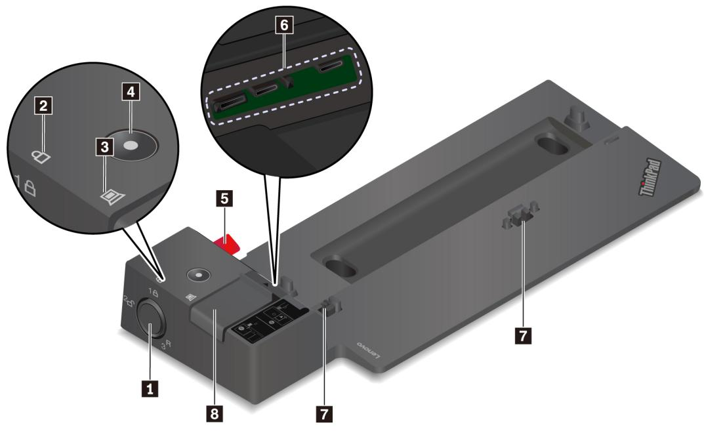

> **AI Description:**
> **Source:** `assets/_page_56_Figure_0.jpg`
> 
> **Generated:** 2026-06-01 23:44:01
> 
> ---
> 
> The image is a technical illustration of a ThinkPad device, likely a dock or adapter, with various components labeled for identification. It includes a close-up view of the back panel with labeled ports (6) and a circular diagram (2) showing the layout of the front panel with numbered labels (1-4). The illustration is designed to help users identify and understand the different parts of the device, such as the power button (3), volume controls (1), and other connectivity options. The image is detailed and serves as a guide for users to locate specific features on the device.

1 System lock: Use the system lock in the following ways:

• When the system lock is in the locked position $^ { 1 } \mathsf { A } ,$ the latch is locked, and you cannot attach or detach your computer.

• When the system lock is in the unlocked position $^ 2 \mathsf { e }$ , the latch is unlocked, and you can attach or detach your computer.

$$
3 ^ { \mathsf { R } } .
$$

• When the system lock is in the unlocked position , you can remove the system lock from the systemlock slot.

Note: The ThinkPad Basic Docking Station does not ship with a system lock installed. You can contact Lenovo sales to purchase a system lock with the option part number 4XE0Q56388.

2 Key lock indicator: This indicator turns on when the system lock key is in the locked position.

3 Docking status indicator: This indicator turns on when your computer is successfully connected to the docking station.

4 Power button: Press the power button to turn on or turn off the computer attached to the docking station.

5 Guide post: Use the guide post to help you position your computer properly when you attach the computer to the docking station.

6 Docking-station connector: Connect the computer to the docking station.

7 Hooks: Hold and secure the computer to the docking station.

8 Latch: Slide the latch to attach or detach the computer.

## Rear view

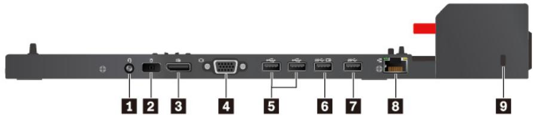

> **AI Description:**
> **Source:** `assets/_page_57_Figure_0.jpg`
> 
> **Generated:** 2026-06-01 23:46:24
> 
> ---
> 
> The image is a technical diagram of a device's rear panel, showcasing various ports and connectors. The diagram includes numbered labels from 1 to 9, corresponding to different ports and features. Key features include:
> 
> 1. A power input port (1).
> 2. A 3.5mm audio jack (2).
> 3. A USB port (3).
> 4. A VGA port (4).
> 5. Two USB 3.0 ports (5 and 6).
> 6. Two USB 2.0 ports (7 and 8).
> 7. An Ethernet port (8).
> 8. A red switch or indicator (9).
> 
> The diagram is designed to help users identify and understand the functions of each port on the device's rear panel.

Figure 1. ThinkPad Basic Docking Station
Figure 2. ThinkPad Pro Docking Station
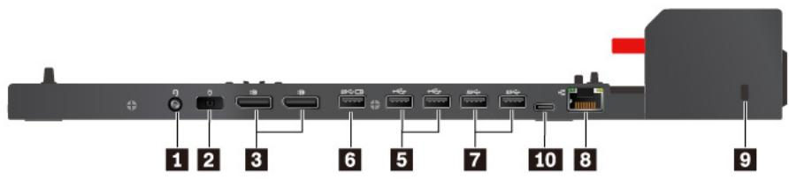

> **AI Description:**
> **Source:** `assets/_page_57_Figure_1.jpg`
> 
> **Generated:** 2026-06-01 23:46:14
> 
> ---
> 
> The image is a technical illustration of a device's rear panel, showing various ports and connectors. It includes labels numbered from 1 to 10, pointing to different ports and features. The ports include USB, HDMI, Ethernet, and other connectivity options. The illustration is designed to help users identify and connect various devices to the back of the device.

Figure 3. ThinkPad Ultra Docking Station
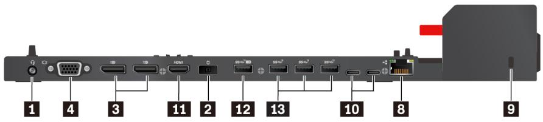

> **AI Description:**
> **Source:** `assets/_page_57_Figure_2.jpg`
> 
> **Generated:** 2026-06-01 23:47:18
> 
> ---
> 
> The image is a technical diagram illustrating various ports and connectors on a device, likely a computer or server. It includes labels numbered from 1 to 13, corresponding to different ports and connectors. The ports are identified as follows: 1 is a power input, 4 is a VGA port, 3 is a USB port, 11 is an HDMI port, 12 is a USB 3.0 port, 13 is a USB 3.0 port, 10 is a USB 3.0 port, 8 is an Ethernet port, and 9 is a power switch. The diagram is designed to help users identify and locate specific ports for connecting various devices.

1 Audio connector: Connect headphones or a headset with a 3.5-mm (0.14-inch), 4-pole plug.

2 ac power connector: Connect the ac power adapter.

3 DisplayPort® connector: Connect a high-performance monitor, a direct-drive monitor, or other devices that use a DisplayPort connector.

4 VGA connector: Connect the computer to a VGA-compatible video device, such as a VGA monitor.

5 USB 2.0 connector, 7 USB 3.1 connector Gen 1: Connect USB-compatible devices, such as a USB keyboard, a USB mouse, a USB storage device, or a USB printer.

6 Always On USB 3.1 connector Gen 1, 12 Always on USB 3.1 connector Gen 2: Connect USBcompatible devices and charge some mobile digital devices and smartphones when your computer is in sleep or hibernation mode.

8 Ethernet connector: Connect the docking station to an Ethernet LAN.

9 Security-lock slot: Lock your docking station to a desk, table, or other non-permanent fixture to protect your docking station from theft. Use a security cable lock that fits this security-lock slot.

10 USB-C connector: Use the connector to transfer data or charge your device with an appropriate USB-C cable connected.

11 HDMI connector: Connect a compatible digital audio device or video monitor, such as a DVD player or an HDTV.

13 USB 3.1 connector Gen 2: With greater data transfer rate, the USB 3.1 connector Gen 2 is used to connect USB-compatible devices, such as a USB keyboard, a USB mouse, a USB storage device, or a USB printer.

## Attaching your computer to a docking station

## Notes:

• The ThinkPad Basic Docking Station does not ship with a system lock installed. If you do not purchase and install a system lock, skip step 4 and step 7 in the following instruction to attach your computer to the ThinkPad Basic Docking Station.

• If you attach the computer to the docking station, but do not connect the docking station to ac power, your computer consumes battery power.

To attach your computer to a docking station, do the following:

1. Connect the docking station to ac power.

2. Disconnect the cables and devices from the left side of the computer.

3. Remove the connector cap as shown.

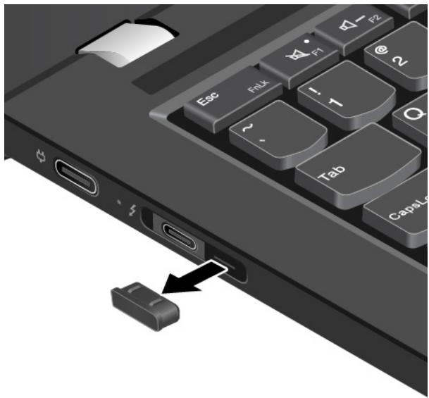

> **AI Description:**
> **Source:** `assets/_page_59_Figure_0.jpg`
> 
> **Generated:** 2026-06-01 23:37:39
> 
> ---
> 
> The image is a technical illustration showing a close-up view of a laptop's side panel. It highlights a USB-C port and a USB-A port, with a small USB-C adapter placed below the USB-C port. The image includes keyboard keys such as "Esc," "Fn," "Tab," and "Caps Lock," indicating the port's location relative to the keyboard. The illustration is likely used for instructional purposes, such as explaining how to connect a USB-C device to a laptop.

4. Ensure that you turn the system lock key to the unlocked position $( ^ { 2 } \sqcup )$

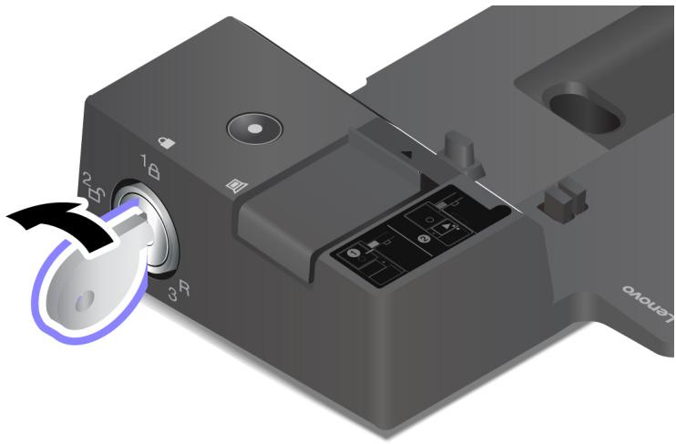

> **AI Description:**
> **Source:** `assets/_page_59_Figure_1.jpg`
> 
> **Generated:** 2026-06-01 23:36:54
> 
> ---
> 
> The image is a technical illustration of a device, likely a part of a computer or electronic equipment. It shows a close-up view of a switch or dial with numbered positions (1, 2, 3, 4) and symbols indicating different functions or settings. The switch is being rotated to a specific position, highlighted with a purple circle and arrow, suggesting a step in a process or a change in configuration. The device appears to be a Lenovo product, as indicated by the text on the side.

5. Align the top-left corner of the computer with the guide post of the docking station. Attach your computer to the docking station as shown 1 until you hear a click. Slide the latch in the direction as shown 2 .

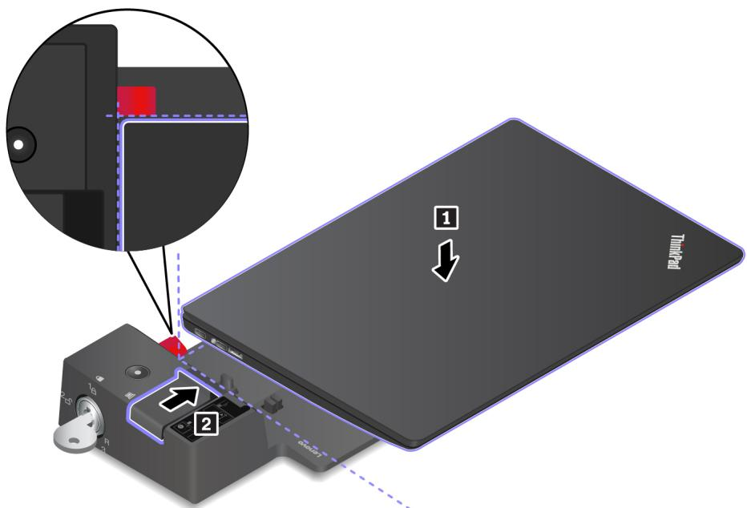

> **AI Description:**
> **Source:** `assets/_page_60_Figure_0.jpg`
> 
> **Generated:** 2026-06-01 23:45:37
> 
> ---
> 
> The image is a technical illustration showing the connection of a ThinkPad device to an external device. It includes a close-up view of a connector (labeled as "1") and a keyhole slot (labeled as "2"). The illustration demonstrates the proper alignment and insertion of the connector into the slot, emphasizing the importance of correct positioning to ensure a secure connection. The diagram is designed to guide users on how to attach the ThinkPad to an external device, likely for data transfer or expansion purposes.

6. Check the docking status indicator. The docking status indicator turns on when the computer is successfully docked.

Note: If the indicator is off, your computer is not attached to the docking station successfully. To solve the problem, detach and reattach the computer.

7. Turn the system lock key to the locked position ( ).

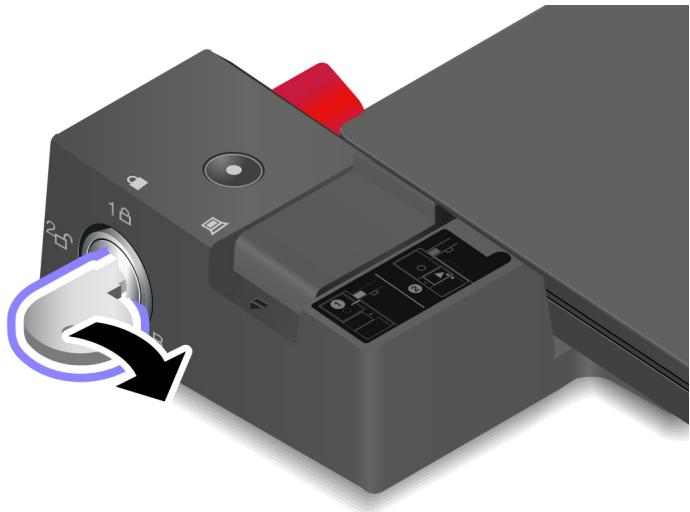

> **AI Description:**
> **Source:** `assets/_page_60_Figure_1.jpg`
> 
> **Generated:** 2026-06-01 23:45:21
> 
> ---
> 
> The image is a technical illustration showing a close-up view of a device, likely a laptop or a similar electronic device. It features a circular lock mechanism with a key inserted into it, indicating a security feature. The key is being turned, suggesting the process of locking or unlocking the device. The image includes symbols and labels that likely correspond to different functions or settings of the device, but the text is not legible in the image. The focus is on the action of the key being turned, which is highlighted with a blue and black arrow to draw attention to the process.

Attention: When the computer is attached to a docking station, do not pick up the assembly by taking hold of the computer only. Always hold the whole assembly. Otherwise the docking station might drop down.

## Detaching your computer from a docking station

To detach your computer from a docking station, do the following:

Note: The ThinkPad Basic Docking Station does not ship with a system lock installed. If you do not purchase and install a system lock, skip step 1 in the following instruction to detach your computer from the ThinkPad Basic Docking Station.

1. Turn the system lock key to the unlocked position $( ^ { 2 } \sqcup )$

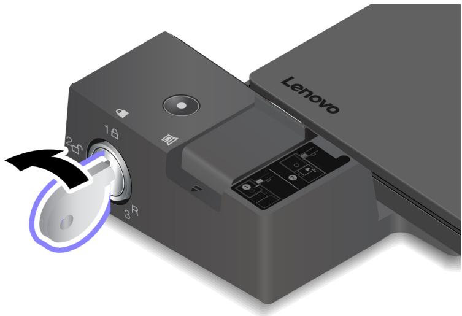

> **AI Description:**
> **Source:** `assets/_page_61_Figure_0.jpg`
> 
> **Generated:** 2026-06-01 23:47:08
> 
> ---
> 
> The image is a technical illustration showing a close-up view of a Lenovo device, likely a docking station or external power adapter. It features a circular dial with numbers and symbols indicating different settings or modes. The dial is highlighted with a purple circle and arrow, suggesting a step-by-step guide or instructional function. The Lenovo logo is visible on the top right corner of the device, and there are various symbols and labels on the device's surface, including a lock symbol and a power icon, indicating security and power management features. The image is designed to provide visual instructions or information about the device's functionality.

2. Slide the latch in the direction as shown 1 to release the computer, and then grasp both sides of the computer to remove it 2 .

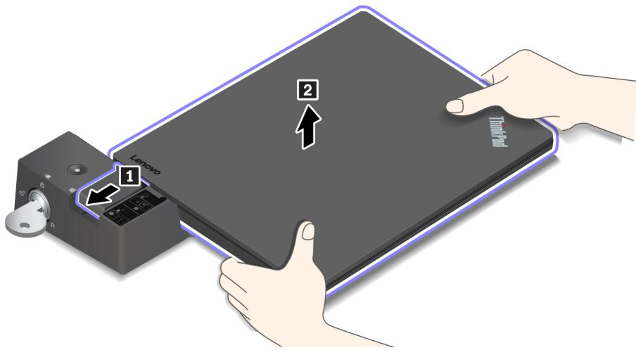

> **AI Description:**
> **Source:** `assets/_page_61_Figure_1.jpg`
> 
> **Generated:** 2026-06-01 23:48:05
> 
> ---
> 
> The image is a technical illustration showing the process of inserting a Lenovo ThinkPad into a docking station. The illustration includes two numbered steps: 1) inserting the ThinkPad into the docking station, and 2) lifting the ThinkPad to secure it in place. The docking station is labeled with the Lenovo logo and has a keyhole slot, suggesting it can be locked. The ThinkPad is shown in a top-down view with a hand positioning it for insertion.

Guidelines on connecting multiple external displays

You can connect multiple external displays to a supported ThinkPad docking station. To ensure that the multiple displays work correctly, observe the following guidelines and connect the external displays to the appropriate connectors.

## ThinkPad Basic Docking Station

Up to two external displays connected to the DisplayPort and the VGA connectors can work at the same time.

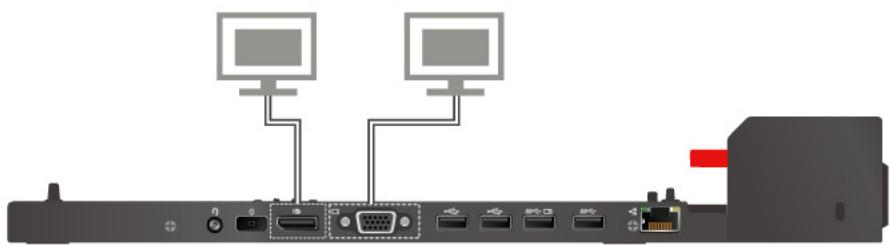

> **AI Description:**
> **Source:** `assets/_page_62_Figure_0.jpg`
> 
> **Generated:** 2026-06-01 23:35:42
> 
> ---
> 
> The image is a technical illustration showing the back panel of a device, likely a computer or server, with various ports and connections. It includes two monitors connected via cables to the device, with one monitor connected to a USB port and the other to a VGA port. The device has multiple other ports, including USB, Ethernet, and possibly audio or power connections, as indicated by the icons. The image is designed to demonstrate how the device is connected to external monitors and other peripherals.

## ThinkPad Pro Docking Station

Up to two external displays connected to the two DisplayPort connectors can work at the same time.

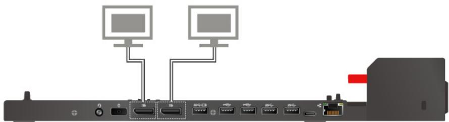

> **AI Description:**
> **Source:** `assets/_page_62_Figure_1.jpg`
> 
> **Generated:** 2026-06-01 23:34:37
> 
> ---
> 
> The image is a technical illustration of a device with multiple ports and connections. It shows a device with various ports, including USB, audio, and network ports, with two monitors connected to it via cables. The image highlights the connectivity options available on the device, emphasizing its capability to support multiple displays. The visual elements include the device's ports, the monitors, and the cables connecting them, providing a clear depiction of how the device can be used to connect and display content on multiple screens.

## ThinkPad Ultra Docking Station

Up to three external displays connected to the docking station can work at the same time.

# Chapter 4. Accessibility, ergonomic, and maintenance information

This chapter provides information about accessibility, ergonomic, and cleaning and maintenance.

## Accessibility information

Lenovo is committed to providing users who have hearing, vision, and mobility limitations with greater access to information and technology. This section provides information about the ways these users can get the most out of their computer experience. You also can get the most up-to-date accessibility information from the following Web site:

https://www.lenovo.com/accessibility

## Keyboard shortcuts

The following list contains keyboard shortcuts that can help make your computer easier to use.

Note: Depending on your keyboard, some of the following keyboard shortcuts might not be available.

• Windows logo key + U: Open Ease of Access Center

• Right Shift for eight seconds: Turn on or turn off Filter Keys

• Shift five times: Turn on or turn off Sticky Keys

• Num Lock for five seconds: Turn on or turn off Toggle Keys

• Left Alt+Left Shift+Num Lock: Turn on or turn off Mouse Keys

• Left Alt+Left Shift+PrtScn (or PrtSc): Turn on or turn off High Contrast

For more information, go to https://windows.microsoft.com/, and then search using any of the following keywords: keyboard shortcuts, key combinations, shortcut keys.

## Ease of Access Center

Ease of Access Center on the Windows operating system enables you to configure your computers to suit their physical and cognitive needs.

To access Ease of Access Center, do the following:

1. Go to Control Panel, and ensure that you view Control Panel using Category.

2. Click Ease of Access ➙ Ease of Access Center.

3. Choose the appropriate tool by following the instructions on the screen.

Ease of Access Center mainly includes the following tools:

## • Magnifier

Magnifier is a useful utility that enlarges the entire screen or part of the screen so that you can see the items better.

## • Narrator

Narrator is a screen reader that reads what is displayed on the screen aloud and describes events such as error messages.

• On-Screen Keyboard

If you prefer to type or enter data into your computer using a mouse, joystick, or other pointing device instead of a physical keyboard, you can use On-Screen Keyboard. On-Screen Keyboard displays a visual keyboard with all the standard keys. You can select keys using the mouse or another pointing device, or you can tap to select the keys if your computer supports multi-touch screen.

## • High Contrast

High Contrast is a feature that heightens the color contrast of some text and images on your screen. As a result, those items are more distinct and easier to identify.

## • Personalized keyboard

Adjust keyboard settings to make your keyboard easier to use. For example, you can use your keyboard to control the pointer and make the keyboard easier to type certain key combinations.

## • Personalized mouse

Adjust mouse settings to make your mouse easier to use. For example, you can change the pointer appearance and make your mouse easier to manage windows.

## Speech Recognition

Speech Recognition enables you to control your computer by voice.

Using only your voice, you can start programs, open menus, click objects on the screen, dictate text into documents, and write and send e-mails. Everything you do with the keyboard and mouse can be done with only your voice.

To use Speech Recognition, do the following:

1. Go to Control Panel, and ensure that you view Control Panel by Category.

2. Click Ease of Access ➙ Speech Recognition.

3. Follow the instructions on the screen.

## Screen-reader technologies

Screen-reader technologies are primarily focused on software program interfaces, help systems, and various online documents. For additional information about screen readers, see the following:

• Using PDFs with screen readers:

https://www.adobe.com/accessibility.html?promoid=DJGVE

• Using the JAWS screen reader:

https://www.freedomscientific.com/Products/Blindness/JAWS

• Using the NVDA screen reader:

https://www.nvaccess.org/

## Screen resolution

You can make the text and images on your screen easier to read by adjusting the screen resolution of your computer.

To adjust the screen resolution, do the following:

1. Right-click an empty area of the desktop and then click Display settings ➙ Display.

2. Follow the instructions on the screen.

Note: Setting a resolution too low might prevent some items from fitting on the screen.

## Customizable item size

You can make the items on your screen easier to read by changing the item size.

• To change the item size temporarily, use the Magnifier tool in Ease of Access Center.

• To change the item size permanently, do the following:

– Change the size of all the items on your screen.

1. Right-click an empty area of the desktop and then click Display settings ➙ Display.

2. Change the item size by following the instructions on the screen. For some applications, your configuration might not take effect until you sign out and then sign in again.

– Change the size of the items on a Web page.

Press and hold Ctrl, and then press the plus-sign key (+) to enlarge or the minus-sign key (–) to reduce the text size.

– Change the size of the items on the desktop or a window.

Note: This function might not work on some windows.

If your mouse has a wheel, press and hold Ctrl, and then scroll the wheel to change the item size.

## Industry-standard connectors

Your computer provides industry-standard connectors that enable you to connect assistive devices.

## Documentation in accessible formats

Lenovo provides electronic documentation in accessible formats, such as properly tagged PDF files or HyperText Markup Language (HTML) files. Lenovo electronic documentation is developed to ensure that visually impaired users can read the documentation through a screen reader. Each image in the documentation also includes adequate alternative text so that visually impaired users can understand the image when they use a screen reader.

## Ergonomic information

Good ergonomic practice is important to get the most from your personal computer and to avoid discomfort. Arrange your workplace and the equipment you use to suit your individual needs and the kind of work that you perform. In addition, use healthy work habits to maximize your performance and comfort when using your computer.

Working in the virtual office might mean adapting to frequent changes in your environment. Adapting to the surrounding light sources, active seating, and the placement of your computer hardware, can help you improve your performance and achieve greater comfort.

This example shows someone in a conventional setting. Even when not in such a setting, you can follow many of these tips. Develop good habits, and they will serve you well.

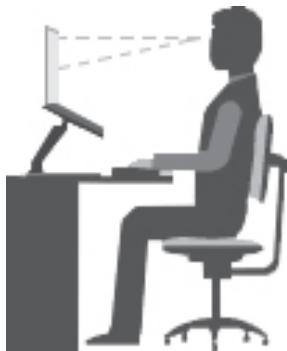

> **AI Description:**
> **Source:** `assets/_page_66_Figure_0.jpg`
> 
> **Generated:** 2026-06-01 23:46:51
> 
> ---
> 
> The image is a simple line drawing of a person sitting at a desk, working on a computer. The person is depicted in a side profile, facing the computer screen. The desk has a monitor, a keyboard, and a mouse on it. The person is seated on a chair with a backrest. The image appears to be a generic representation of someone working at a computer, possibly for use in educational or instructional materials.

General posture: Make minor modifications in your working posture to deter the onset of discomfort caused by long periods of working in the same position. Frequent short breaks from your work also help to prevent minor discomfort associated with your working posture.

Display: Position the display to maintain a comfortable viewing distance of 510 mm to 760 mm (20 inches to 30 inches). Avoid glare or reflections on the display from overhead lighting or outside sources of light. Keep the display screen clean and set the brightness to levels that enable you to see the screen clearly. Press the brightness control keys to adjust display brightness.

Head position: Keep your head and neck in a comfortable and neutral (vertical, or upright) position.

Chair: Use a chair that gives you good back support and seat height adjustment. Use chair adjustments to best suit your comfort posture.

Arm and hand position: If available, use chair arm rests or an area on your working surface to provide weight support for your arms. Keep your forearms, wrists, and hands in a relaxed and neutral (horizontal) position. Type with a soft touch without pounding the keys.

Leg position: Keep your thighs parallel to the floor and your feet flat on the floor or on a footrest.

## What if you are traveling?

It might not be possible to observe the best ergonomic practices when you are using your computer while on the move or in a casual setting. Regardless of the setting, try to observe as many of the tips as possible. Sitting properly and using adequate lighting, for example, helps you maintain desirable levels of comfort and performance. If your work area is not in an office setting, ensure to take special note of employing active sitting and taking work breaks. Many ThinkPad product solutions are available to help you modify and expand your computer to best suit your needs. You can find some of these options at https:// www.lenovo.com/accessories. Explore your options for docking solutions and external products that provide the adjustability and features that you want.

## Questions about vision?

The visual display screens of ThinkPad notebook computers are designed to meet the highest standards. These visual display screens provide you with clear, crisp images and large, bright displays that are easy to see, yet easy on the eyes. Any concentrated and sustained visual activity can be tiring. If you have questions on eye fatigue or visual discomfort, consult a vision-care specialist for advice.

## Cleaning and maintenance

With appropriate care and maintenance your computer will serve you reliably. The following topics offer information to help you keep your computer in top working order.

## Basic maintenance tips

Here are some basic points about keeping your computer functioning properly:

• Store packing materials safely out of the reach of children to prevent the risk of suffocation from plastic bags.

• Keep your computer away from magnets, activated cellular phones, electrical appliances, or speakers (more than 13 cm or 5 inches).

• Avoid subjecting your computer to extreme temperatures (below 5°C/41°F or above 35°C/95°F).

• Avoid placing any objects (including paper) between the display and the keyboard or the palm rest.

• Your computer display is designed to be opened and used at an angle slightly greater than 90 degrees. Do not open the display beyond 180 degrees. Otherwise, the computer hinge might get damaged.

• Do not turn your computer over when the ac power adapter is plugged in, otherwise, it could break the adapter plug.

• Before moving your computer, be sure to remove any media, turn off attached devices, and disconnect cords and cables.

• When picking up your open computer, hold it by the bottom. Do not pick up or hold your computer by the display.

• Only an authorized ThinkPad repair technician should disassemble and repair your computer.

• Do not modify or tape the latches to keep the display open or closed.

• Avoid directly exposing your computer and peripherals to the air from an appliance that can produce negative ions. Wherever possible, ground your computer to facilitate safe electrostatic discharge.

## Cleaning your computer

It is a good practice to clean your computer periodically to protect the surfaces and ensure trouble-free operation.

Cleaning the computer cover: Wipe it with a lint-free cloth dampened in mild soap and water. Avoid applying liquids directly to the cover.

Cleaning the keyboard: Wipe the keys one by one with a lint-free cloth dampened in mild soap and water. If you wipe several keys at a time, the cloth might hook onto an adjacent key and possibly damage it. Avoid spraying cleaner directly onto the keyboard. To remove any crumbs or dust from beneath the keys, you can use a camera blower with a brush or use cool air from a hair dryer.

Cleaning the computer screen: Scratches, oil, dust, chemicals, and ultraviolet light can affect the performance of your computer screen. Use a dry, soft lint-free cloth to wipe the screen gently. If you see a scratchlike mark on your screen, it might be a stain. Wipe or dust the stain gently with a soft, dry cloth. If the stain remains, moisten a soft, lint-free cloth with water or eyeglass cleaner, but do not apply liquids directly to your computer screen. Ensure that the computer screen is dry before closing it.

## Chapter 5. Security

This chapter provides information about how to protect your computer from unauthorized use.

## Using passwords

This topic provides information about how to use the power-on password, supervisor password, and hard disk password.

## Passwords introduction

You can help prevent your computer from unauthorized use by using passwords. After you set a password, a prompt is displayed on the screen each time you turn on the computer. Enter your password at the prompt. You cannot use the computer unless you type the correct password.

If you have set a power-on password, a supervisor password, or a hard disk password, it unlocks automatically when the computer resumes from sleep mode.

Note: If a Windows password has been set, you are prompted to enter it when the computer resumes from sleep mode.

## Power-on password

You can set a power-on password to help protect your computer against unauthorized access.

If you set a power-on password, the password prompt is displayed on the screen whenever you turn on the computer. You must enter the correct password to start using the computer.

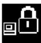

> **AI Description:**
> **Source:** `assets/_page_70_Figure_0.jpg`
> 
> **Generated:** 2026-06-01 23:34:56
> 
> ---
> 
> The image contains a simple icon consisting of a lock symbol with a keyhole on the left side. The lock is black, and the keyhole is white. This icon typically represents security, privacy, or protection, often used in digital contexts to indicate secure access or data protection.

When this icon is displayed, type a power-on password or a supervisor password.

## Supervisor password

The supervisor password protects the system information stored in the ThinkPad Setup program. It provides the following security features:

• If only a supervisor password is set, a password prompt is displayed when you try to start the ThinkPad Setup program. Unauthorized users cannot change most of the system configuration options in the ThinkPad Setup program without the password.

• The system administrator can use the supervisor password to access a computer even if the user of that computer has set a power-on password. The supervisor password overrides the power-on password.

• The system administrator can set the same supervisor password on many ThinkPad notebook computers to make administration easier.

## Hard disk passwords

Setting a hard disk password prevents unauthorized access to the data on the hard disk drive. When a hard disk password is set, you are prompted to type a valid password each time you try to access the hard disk drive.

The following two types of hard disk passwords can help protect the information stored on the storage drive:

• User hard disk password

If a user hard disk password has been set, but no master hard disk password has been, the user must enter the user hard disk password to access files and applications on the storage drive.

## • Master hard disk password

The master hard disk password also requires a user hard disk password. The master hard disk password is set and used by a system administrator. It enables the administrator to access any storage drive in a system like a master key. The administrator sets the master password; then assign a user password for each computer in the network. The user can then change the user password as desired, but the administrator still can get access by using the master password.

When a master hard disk password is set, only the administrator can remove the user hard disk password.

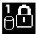

> **AI Description:**
> **Source:** `assets/_page_71_Figure_0.jpg`
> 
> **Generated:** 2026-06-01 23:33:26
> 
> ---
> 
> The image contains a simple icon with two elements: a lock symbol and a number "1". The lock symbol is typically associated with security or privacy, while the number "1" could represent a count or a status indicator. The combination of these elements suggests a security-related context, possibly indicating a single instance of a secure element or a status of being locked.

When this icon is displayed, type a user hard disk password. To type a master hard disk password,

> **AI Description:**
> **Source:** `assets/_page_71_Figure_1.jpg`
> 
> **Generated:** 2026-06-01 23:33:16
> 
> ---
> 
> The image contains a simple diagram with three distinct elements: a cylinder, a lock, and a person. The cylinder is on the left, the lock is in the middle, and the person is on the right. The lock is positioned between the cylinder and the person, suggesting a relationship or interaction between these three elements. The image appears to be a conceptual or symbolic representation rather than a detailed chart or photograph.

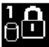

> **AI Description:**
> **Source:** `assets/_page_71_Figure_2.jpg`
> 
> **Generated:** 2026-06-01 23:32:38
> 
> ---
> 
> The image contains a simple icon with two elements: a lock and a number "1". The lock is closed, indicating security or protection, while the number "1" likely represents a count or a single instance of something secured. There are no charts, graphs, or other visual elements beyond these two icons.

press F1. When the icon changes to , type the master hard disk password. To return to the icon , press F1 again.

## Tips on using the hard disk passwords:

• You can set the minimum length of a hard disk password.

• If you set a hard disk password of over seven characters, the storage drive can be used only with a computer that can recognize a hard disk password of over seven characters. If you then install the storage drive in a computer that cannot recognize a hard disk password that contains more than seven characters, you cannot access the drive.

• Record your password and store it in a safe place. If you forget the user hard disk password, or both user and master hard disk passwords, Lenovo cannot reset your passwords or recover data from the storage drive. You must take your computer to a Lenovo reseller or a marketing representative to have the storage drive replaced. Proof of purchase is required, and a fee will be charged for parts and service.

Notes: The eDrive storage drives or Trusted Computing Group (TCG) Opal-compliant storage drives provide self-encryption capabilities to secure your data.

• If a TCG Opal-compliant storage drive and a TCG Opal management software program are installed, and the TCG Opal management software program is activated, the hard disk password is not available.

• If an eDrive storage drive is installed in your computer, and your computer is preinstalled with the Windows 10 operating system, the hard disk password is not available.

## Setting, changing, or removing a password

Before you start, print these instructions.

To set, change, or remove a password, do the following:

1. Restart the computer. When the logo screen is displayed, press F1 to start the ThinkPad Setup program.

2. Select Security ➙ Password by using the directional keys.

3. Depending on the password type, select Power-on Password, Supervisor Password, or Hard disk x Password.

4. Follow the instructions on the screen to set, change, or remove a password.

You might want to record your password and store it in a safe place. Otherwise, if you forget the password, you have to take your computer to a Lenovo reseller or a marketing representative to have the password canceled.

## Hard disk security

To protect the computer from unauthorized security attacks, refer to the following tips to enhance security:

• Set a power-on password as well as a hard disk password. For security, a longer password is recommended.

• The hard disk drive built into your computer can be protected by UEFI BIOS. To provide reliable security, use the security chip and a security program with the Trusted Platform Module (TPM) management feature. See “Setting the security chip” on page 55.

• If a Disk Encryption storage drive is installed in your computer, ensure to protect the contents of your computer from unauthorized access by use of drive encryption software, such as Microsoft Windows BitLocker® Drive Encryption.

• Before you dispose of, sell, or hand over your computer, delete the data stored on it. For more information, see “Deleting data from your storage drive” on page 58.

## Using Windows BitLocker Drive Encryption

To help protect your computer against unauthorized access, use the drive encryption software, such as Windows BitLocker Drive Encryption.

Windows BitLocker Drive Encryption (referred to as BitLocker) is an integral security feature of some editions of the Windows operating system. It can help you protect the operating system and data stored on your computer, even if your computer is lost or stolen. BitLocker can encrypt all user and system files, including the swap and hibernation files.

BitLocker uses the TPM to provide enhanced protection for your data and to ensure early boot component integrity. A compatible TPM is defined as a V2.0 TPM.

To check the BitLocker status, go to Control Panel, view Control Panel by Category, and click System and Security ➙ BitLocker Drive Encryption.

For more information, see the help system of the Windows operating system, or search for “Microsoft Windows BitLocker Drive Encryption Step-by-Step Guide” on the Microsoft Web site.

## Disk Encryption hard disk drive and Encryption solid-state drive

Some models contain the Disk Encryption hard disk drive, Encryption solid-state drive, or Encryption hybrid drive. This encryption technology helps to protect your computer against security attacks on media, NAND flash, or device controllers by use of a hardware encryption chip. For the efficient use of the encryption feature, set a hard disk password for the internal storage drive.

## Setting the security chip

Strict security requirements are imposed on network client computers that transfer confidential information electronically. Depending on the options you ordered, your computer might have an embedded security chip (a cryptographic microprocessor). With the security chip, you can do the following:

• Protect your data and system

• Strengthen access controls

• Secure communications

Before you start, print these instructions.

To set an item on the Security Chip submenu, do the following:

1. Restart the computer. When the logo screen is displayed, press F1 to start the ThinkPad Setup program.

2. Select Security ➙ Security Chip by using the directional keys.

3. Press Enter. The Security Chip submenu opens.

4. Move to an item you want to set by using the directional keys. When the item is highlighted, press Enter.

5. Set other items that you want to set.

6. Press F10. A Setup Confirmation window is displayed. Select Yes to save the configuration changes and exit.

## Notes:

• Ensure that the supervisor password has been set in ThinkPad Setup. Otherwise anyone can change the settings for the security chip.

• When you clear the security chip, turn off your computer and then turn it on again after you set the security chip to Active. Otherwise, the Clear Security Chip option is not displayed.

## Using the fingerprint reader

Depending on the model, your computer might have a fingerprint reader. Fingerprint authentication can replace your passwords, such as the Windows password, power-on password, and hard disk password. In this way, you can log in to your computer simply and securely.

## Enrolling your fingerprints

To enable fingerprint authentication, enroll your fingerprints first. During the enrollment, the fingerprints are associated with the Windows password automatically. It is recommended that you enroll more than one fingerprint in case of any injuries to your fingers.

To enroll your fingerprints, do the following:

1. Open the Start menu and then click Settings ➙ Accounts ➙ Sign-in options.

2. Follow the instructions on the screen to finish the enrollment.

## Scanning your finger

To scan your finger, tap the fingerprint reader with the top joint of your finger and hold your finger there for one or two seconds with a little pressure. Then lift the finger to complete one scan.

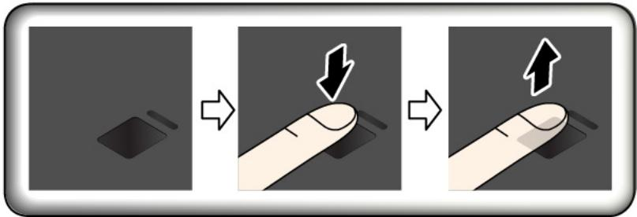

> **AI Description:**
> **Source:** `assets/_page_73_Figure_0.jpg`
> 
> **Generated:** 2026-06-01 23:47:42
> 
> ---
> 
> The image is a diagram illustrating a two-step process involving a finger interacting with a surface. The first step shows a finger pressing down on a surface, indicated by a downward arrow. The second step shows the finger lifting up from the surface, indicated by an upward arrow. The diagram is likely used to demonstrate a tactile or pressure-sensitive interaction, such as a touchpad or touch screen operation.

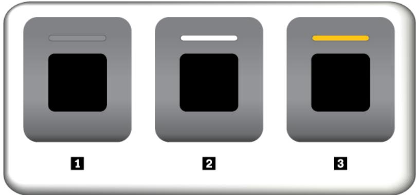

> **AI Description:**
> **Source:** `assets/_page_74_Figure_0.jpg`
> 
> **Generated:** 2026-06-01 23:47:27
> 
> ---
> 
> The image contains a diagram with three numbered squares labeled 1, 2, and 3. Each square has a black square in the center, and the top of each square has a horizontal line. Square 1 has a gray line, square 2 has a white line, and square 3 has a yellow line. The diagram appears to be a simple representation of three different states or conditions, possibly indicating a sequence or progression.

1 Off: The fingerprint reader is not ready for tapping.

2 White: The fingerprint reader is ready for tapping.

3 Amber, blinking: The fingerprint cannot be authenticated.

Associating your fingerprints with your power-on password and hard disk password

To associate your fingerprints with your power-on password and hard disk password, manually create a connection by doing the following:

1. Turn off and then turn on the computer.

2. When prompted, scan your finger on the fingerprint reader.

3. Enter your power-on password, hard disk password, or both as required. The connection is created.

When you start the computer again, you can use your fingerprints to log in to the computer with no need to enter your Windows password, power-on password, and hard disk password.

Attention: If you always use your fingerprint to log in to the computer, you might forget your passwords. Write down your passwords, and keep them in a safe place. If you forget your power-on password, you must take your computer to a Lenovo-authorized servicer or a marketing representative to have the password canceled. If you forget your hard disk password, Lenovo cannot reset your password or recover data from the storage drive. You must take your computer to a Lenovo-authorized servicer or a marketing representative to have the storage drive replaced. Proof of purchase is required, and a fee will be charged for parts and service.

## Maintaining the fingerprint reader

The following actions could damage the fingerprint reader or cause it not to work properly:

• Scratching the surface of the reader with a hard, pointed object

• Scraping the surface of the reader with your fingernail or anything hard

• Using or touching the reader with a dirty finger

If you notice any of the following conditions, gently clean the surface of the reader with a dry, soft, lint-free cloth:

• The surface of the reader is dirty or stained.

• The surface of the reader is wet.

• The reader often fails to enroll or authenticate your fingerprint.

If your finger has any of the following conditions, you might not be able to register or authenticate it:

• Your finger is wrinkled.

• Your finger is rough, dry, or injured.

• Your finger is stained with dirt, mud, or oil.

• The surface of your finger is different from the one when you enrolled your fingerprint.

• Your finger is wet.

• Your finger that you are currently using has not been enrolled before.

To improve the situation, try the following:

• Clean or wipe your hands to remove any excess dirt or moisture from the fingers.

• Enroll and use a different finger for authentication.

## Deleting data from your storage drive

Some of the data stored on the storage drive might be sensitive. Handing your computer over to someone else without deleting the installed software, such as operating systems and programs, might even violate the license agreements. Be sure to delete data stored on the storage drive before you dispose of, sell, or hand over your computer.

You can use the following methods to delete data from the storage drive:

• Move the data to the Recycle Bin, and then empty the Recycle Bin.

• Format your storage drive, using the software to initialize it.

• Use the recovery program provided by Lenovo to bring the storage drive back to the factory default settings.

These operations, however, only change the file location of the data; they do not delete the data itself. The data is still there, even though it seems to be lost. Thus, it is sometimes possible to read the data by use of special software for data recovery. There is a risk that people of bad faith might read and misuse the critical data on storage drives for unexpected purposes.

To prevent leakage of data, it is important that you delete all the data from the hard disk drive when you dispose of, sell, or hand over your computer. You can destroy the data physically by smashing the hard disk drive with a hammer, or magnetically by means of strong magnetic power, thus making the data unreadable. But it is recommended that you use the software (payware) or service (pay service) developed for that purpose. The process might take several hours.

For disposing of data on the solid-state drive, Lenovo provides the Drive Erase Utility for Resetting the Cryptographic Key and Erasing the Solid State Drive tool.

Some computers might support a Disk Encryption hard disk drive or Encryption solid-state drive and have such a drive installed. You can logically dispose of all the data on the drive in a short time by erasing the cryptographic key. The data encrypted with the old key is not physically erased but remains on the drive; however, it cannot be decrypted without the old key. This feature is also available with the Drive Erase Utility for Resetting the Cryptographic Key and Erasing the Solid State Drive tool.

## Using firewalls

If your system is preinstalled with a firewall program, it protects against computer Internet security threats, unauthorized access, intrusions, and Internet attacks. It also protects your privacy.

For more information about how to use the firewall program, see the help system that comes with the program.

## Protecting data against viruses

Lenovo provides a full version of antivirus software on your computer with a free 30-day subscription. After 30 days, you must renew the license to continue receiving the antivirus software updates.

For more information about your antivirus software, see the help system of your antivirus software.

## Chapter 6. Advanced configuration

This chapter provides information to help you further configure the computer:

## Installing the Windows 10 operating system

In some situations, you might need to install a new operating system. This topic provides instructions on how to install a Windows 10 operating system.

Before you start, print these instructions.

## Attention:

• It is recommended that you update your operating system through official channels. Any unofficial update might cause security risks.

• The process of installing a new operating system deletes all the data on your internal storage drive, including the data that were stored in a hidden folder.

To install the Windows 10 operating system, do the following:

1. Ensure that you set the security chip to TPM 2.0. For more information, see “Setting the security chip” on page 55.

2. For computer models that support the Intel Optane™ technology, start the ThinkPad Setup program and select Config ➙ Storage ➙ Controller Mode. Ensure that RST mode is selected.

3. Connect the drive that contains the operating system installation program to the computer.

4. Start the ThinkPad Setup program. See “Using the ThinkPad Setup program” on page 63.

5. Select Startup ➙ Boot to display the Boot Priority Order submenu.

6. Select the drive that contains the operating system installation program, for example, USB HDD. Then press Esc.

7. Select Restart and ensure that OS Optimized Defaults is enabled. Then press F10 to save the settings and exit the ThinkPad Setup program.

8. Follow the on-screen instructions to install the device drivers and necessary programs. See “Installing device drivers” on page 62.

9. After installing the device drivers, apply Windows Update to get the latest modules, for example the security patches.

10. Depending on your preference, install Lenovo programs. For information about Lenovo programs, see “Lenovo programs” on page 14.

Note: After installing the operating system, do not change the initial UEFI/Legacy Boot setting in the ThinkPad Setup program. Otherwise, the operating system will not start correctly.

For computer models that support the Intel Optane technology, continue to enable the Intel Optane memory by doing the following:

1. Go to https://support.lenovo.com. Download and install the Intel Rapid Storage Technology (iRST) Console with Device Driver on your computer.

2. Run the iRST Console with Device Driver.

3. Click Intel® Optane™ Memory and then follow the instructions on the screen to enable it.

When you install the Windows 10 operating system, you might need one of the following country or region codes:

## Installing device drivers

Device drivers are programs that contain instructions for the operating system about how to operate or “drive” a certain piece of hardware. Each hardware component on your computer has its own specific driver. If you add a component, the operating system must be instructed on how to operate that piece of hardware. After you install the driver, the operating system can recognize the hardware component and understand how to use it.

Note: Because drivers are programs, like any other file on your computer, they are susceptible to corruption and might not perform properly if corruption occurs.

It is not always necessary to download the latest drivers. However, you should download the latest driver for a component when you notice poor performance from that component or when you added a component. This action might eliminate the driver as the potential cause of a problem.

## Getting the latest drivers from the Web site

You can download and install updated device drivers from the Lenovo Support Web site by doing the following:

1. Go to https://support.lenovo.com.

2. Select the entry for your computer and then follow the instructions on the screen to download and install necessary software.

## Getting the latest drivers using Lenovo Vantage

The system update function of Lenovo Vantage helps you keep the software on your computer up-to-date. Update packages are stored on Lenovo servers and can be downloaded from the Lenovo Support Web site. Update packages can contain applications, device drivers, UEFI BIOS flashes, or software updates. When Lenovo Vantage connects to the Lenovo Support Web site, the program automatically recognizes the following information and determines what updates are available for your computer:

• Machine type and model of your computer

• Installed operating system

• Language of the operating system

Lenovo Vantage then displays a list of update packages and categorizes each update as critical, recommended, or optional to help you understand the importance. You have complete control of which updates to download and install. After you select the update packages you want, Lenovo Vantage automatically downloads and installs the updates.

Lenovo Vantage is preinstalled on your computer and is ready to run. The only prerequisite is an active Internet connection. You can start the program manually, or you can use the schedule feature to enable the program to search for updates automatically at specified intervals. You also can predefine scheduled updates to search by the critical severity level so the list you choose from contains only those update types that you need.

For more information about how to use Lenovo Vantage, see the help system of the program.

## Using the ThinkPad Setup program

The ThinkPad Setup program enables you to select the preferred settings for your computer through configuring the BIOS.

## Configuring ThinkPad Setup

The ThinkPad Setup program menu lists various items about system configuration.

Attention: The default configurations are already optimized for you. Improper change of the configurations might cause unexpected results.

To configure ThinkPad Setup, do the following:

1. Restart the computer. When the logo screen is displayed, press F1. The ThinkPad Setup program starts.

Note: If you are required to enter the supervisor password, enter the correct password. You also can press Enter to skip the password prompt and start the ThinkPad Setup program. If you do not enter the password, you cannot change the configurations that are protected by the supervisor password.

2. Use the arrow keys to select a tab; or use the arrow keys to locate an item and press Enter to select it. Then the supported submenu is displayed.

3. Default values are in boldface. Set the value of an item by doing one of the following:

• Press F6 to change to a higher value.

• Press F5 to change to a lower value.

4. Press the Esc key to exit the submenu and return to the parent menu. Then use the same method mentioned above to change other configurations.

5. When you complete the configuration, press F10 to save and exit. You also can select the Restart tab in the ThinkPad Setup menu, and restart your computer with one of the provided options.

You can press F9 to restore to the default settings.

## Changing the startup sequence

In some cases, you might have to change the startup sequence so that the computer starts from a desired device when powered on. Read this topic to learn how to change the computer startup sequence.

## Attention:

• After you change the startup sequence, ensure that you select the correct device during a copy, a save, or a format operation. If you select the wrong device, the data on that device might be erased or overwritten.

• If you are using the Windows BitLocker Drive Encryption feature and your computer has a Trusted Platform Module, do not change the startup sequence. BitLocker Drive Encryption locks the computer when it detects the change of startup sequence.

To change the startup sequence, do the following:

1. Access the ThinkPad Setup program and select Startup ➙ Boot. Then press Enter. The default device order list is displayed.

2. Set the startup sequence as you desired.

3. Press F10 to save the changes and restart the system.

You also can change the startup sequence temporarily by doing the following:

1. Turn off the computer.

2. Turn on the computer. When the logo screen is displayed, press the F12 key.

3. Select the device that you want the computer to start from. Then press Enter.

Note: The Boot menu will be displayed if the computer cannot start from any devices or the operating system cannot be found.

## Updating the UEFI BIOS

The UEFI BIOS is the first program that the computer runs when the computer is turned on. The UEFI BIOS initializes the hardware components, and loads the operating system and other programs.

When you install a new program, device driver, or hardware component, you might be informed to update the UEFI BIOS. You can update the UEFI BIOS by starting your computer from a flash update disc or a flash update program running in the Windows environment.

The requirements for flash update are as follows:

• The computer must be started over LAN.

• The computer must be engaged in the Preboot eXecution Environment (PXE).

• A network-management program must be installed on the computer of the network administrator.

For instructions on how to update the UEFI BIOS, go to https://support.lenovo.com.

## BIOS menu

This topic introduces the following BIOS menus of your computer:

• Main menu

• Config menu

• Date/Time menu

• Security menu

• Startup menu

• Restart menu

Note: Depending on the model and operating system, the menu items and the default value might change without notice.

## Main menu

When you enter the ThinkPad Setup program, you first see the Main menu as follows:

Note: The BIOS menu items might change without notice. Depending on the model, the default value might vary.

• UEFI BIOS Version

• UEFI BIOS Date

• Embedded Controller Version

• ME Firmware Version

• Machine Type Model

• System-unit serial number

• System board serial number

• Asset Tag

• CPU Type

• CPU Speed

• Installed Memory

• UUID

• MAC Address (Internal LAN)

• Preinstalled operating system license

• UEFI Secure Boot

• OA3 ID

• OA2

## Config menu

Note: The BIOS menu items might change without notice. Depending on the model, the default value might vary.

## Network

## • Wake On LAN

Values: Disabled, AC only, AC and Battery

Description: The network administrator can turn on a computer from a management console by using the Wake on LAN feature. If you select AC Only, the Wake on LAN feature is enabled only when the ac power adapter is attached. If you select AC and Battery, the Wake on LAN feature is enabled with any power sources.

## Notes:

– The magic packet type Wake on LAN requires that the ac power is attached.

– The Wake on LAN feature does not work when the hard disk password is set.

## • Wake On LAN from Dock

Values: Disabled, Enabled

Description: Enable or disable the Wake On LAN from Dock feature when the ThinkPad USB-C Dock or ThinkPad Thunderbolt 3 Dock is attached.

Note: The Wake on LAN from Dock feature does not work when the hard disk password is set.

## • Ethernet LAN Option ROM

Values: Disabled, Enabled

Description: The Ethernet LAN Option ROM enables the startup from an integrated network device. This menu is displayed only in Legacy Only boot mode or Both boot mode with Legacy first.

## • UEFI IPv4 Network Stack

Values: Disabled, Enabled

Description: Enable or disable Internet Protocol Version 4 (IPv4) network stack for UEFI environment. This menu is displayed only in UEFI Only boot mode or Both boot mode with UEFI first.

## • UEFI IPv6 Network Stack

## Values: Disabled, Enabled

Description: Enable or disable Internet Protocol Version 6 (IPv6) network stack for UEFI environment. This menu is displayed only in UEFI Only boot mode or Both boot mode with UEFI first.

## • UEFI PXE Boot Priority

## Values: IPv6 First, IPv4 First

Description: Select network stack priority for UEFI PXE boot. This menu is displayed only in UEFI Only boot mode or Both boot mode with UEFI first, when IPv6 and IPv4 stacks are both enabled.

## • Wireless Auto Disconnection

## Values: Disabled, Enabled

Description: Enable or disable the Wireless Auto Disconnection feature when the Ethernet cable is connected to the Ethernet LAN on system. If it is enabled, Wireless LAN signals are automatically turned off whenever Ethernet cable is connected.

Note: Ethernet attached by USB is not supported by this feature.

## • MAC address Pass Through

## Values: Disabled, Enabled

Description: Enable or disable the MAC address Pass Through function when a dock is attached. If you select Enabled, the MAC address for the dock will be changed to the Internal MAC address. If you select Disabled, the dock Ethernet uses its own MAC address.

## USB

## • USB UEFI BIOS Support

## Values: Disabled, Enabled

Description: Enable or disable the boot support for USB storage devices.

## • Always On USB

## Values: Disabled, Enabled

Description: Select Enabled to charge devices through the Always On USB connectors even when the computer is turned off, in sleep mode, or in hibernation mode.

## • Charge in Battery Mode

## Values: Disabled, Enabled

Description: It is supported only when Always On USB is Enabled. Select Enabled to charge devices through the Always On USB connectors even when the system is in hibernation mode, or is power-off and in battery operation.

## Keyboard/Mouse

## • TrackPoint

Values: Disabled, Enabled

Description: Enable or disable the built-in TrackPoint pointing device.

## • Trackpad

Values: Disabled, Enabled

Description: Enable or disable the built-in trackpad.

Note: If you want to use an external mouse, select Disabled.

## • Fn and Ctrl Key swap

## Values: Disabled, Enabled

Description: If you select Enabled, the Fn key works as the Ctrl key and the Ctrl key works as the Fn key.

Note: Only the Fn key can wake up the system from sleep mode.

## • Fn Sticky key

## Values: Disabled, Enabled

Description: If you select Enabled, you can press the Fn key (instead of press and hold) to keep it in a pressed condition. Then press the function key you want. The action is equivalent to pressing the function key simultaneously with the Fn key. When you press the Fn key twice, the Fn key will be locked in the press-and-hold mode until you press the Fn key again.

## • F1–F12 as Primary Function

## Values: Disabled, Enabled

Description: If you select Enabled, pressing the function keys directly inputs F1–F12. If you select Disabled, pressing the function keys directly initiates the special function printed as an icon on each key. To temporarily switch the above two functions, press Fn+Esc. The FnLock indicator is on when FnLock is enabled.

## Display

## • Boot Display Device

## Values: ThinkPad LCD, External Display

Description: Select the display device that you want to activate at boot time. This selection is effective for boot time, password prompt, and ThinkPad Setup. You can attach an external display to the USB-C connector or HDMI connector on your computer. If multiple displays are attached, the first recognized one will be activated at boot time.

## • Shared Display Priority

## Values: HDMI, USB Type-C

Description: Select the priority between shared display outputs. The HDMI connector and the rear USB Type-C connector share a single display output and the two connectors cannot be used simultaneously for the external display. This option chooses which connector is prioritized for the external display.

## • Total Graphics Memory

## Values: 256 MB, 512 MB

Description: Allocate the total memory which Intel internal graphics shares.

Note: If you select 512 MB, the maximum usable memory might be reduced on the 32-bit operating system.

## • Boot Time Extension

## Values: Disabled, 1 second, 2 seconds, 3 seconds, 5 seconds, 10 seconds

Description: This option defines the amount of time to extend the boot process, in seconds. The system cannot detect some external monitors during boot because they need a few seconds to be ready. Try this option if the monitor being used does not display the boot screen.

## Power

## • Intel SpeedStep® technology

## Values: Disabled, Enabled

Description: Select the mode of Intel SpeedStep technology at runtime. If you select Disabled, the highest speed, and runtime is not supported.

## – Mode for AC

Values: Maximum Performance, Battery Optimized

Description: Maximum Performance: Always highest speed

## – Mode for Battery

Values: Maximum Performance, Battery Optimized

Description: Battery Optimized: Always lowest speed

## • Adaptive Thermal Management

Description: Select a thermal management scheme to use. The scheme affects fan sound, temperature, and performance.

## – Scheme for AC

## Values: Maximum Performance, Balanced

## – Scheme for Battery

Values: Maximum Performance, Balanced

Description: Balanced: Balanced sound, temperature and performance. Maximum Performance: Reduce CPU throttling.

## • CPU Power Management

## Values: Disabled, Enabled

Description: Enable or disable the power-saving feature that stops the microprocessor clock automatically when there are no system activities. Normally, it is not necessary to change the setting.

## • Power On with AC Attach

## Values: Disabled, Enabled

Description: Enable or disable a feature that turns on the computer when the ac power adapter is attached. If you select Enabled, the system is powered on when the ac power adapter is attached. If the system is in hibernate state, the system resumes normal operation. If you select Disabled, the system is not powered on nor resumed when the ac power adapter is attached.

## • 8254 Timer Clock Gating

## Values: Auto, Disabled

Description: Select 8254 Timer Clock Gating setting. If you select Auto, 8254 Timer clock stops only when the startup setting is set as UEFI Only and CSM Support is set as No. If you select Disabled, 8254 Timer clock is running always.

## • Disable Built-in Battery

## Values: Yes, No

Description: Temporary disable battery for servicing the system. After selecting this item, the system will be automatically powered off, then ready to be serviced. Note: the battery will be automatically enabled when the AC adapter is reconnected.

## Beep and Alarm

## • Password Beep

Values: Disabled, Enabled

Description: Enable or disable a beep when the computer is waiting for a power-on, hard disk, or supervisor password. Different beeps remind you that the password you entered is right or wrong.

## • Keyboard Beep

Values: Enabled, Disabled

Description: Enable or disable a beep when unmanageable key combinations are pressed.

## Storage

Note: This menu is displayed when Intel Optane memory is installed.

## • Controller Mode

Values: AHCI mode, RST mode

Description: If your computer has an Intel Optane memory installed, select RST mode so that you can enable the Intel Optane memory in the Windows operating system.

Note: If a hard disk password has been set, you cannot change this setting until you delete the hard disk password.

## • Intel (R) Rapid Storage Technology

Description: Enter Intel (R) Rapid Storage Technology Configuration Utility to manage volumes on Intel (R) RAID Controller.

## Thunderbolt(TM) 3

## • Thunderbolt BIOS Assist Mode

## Values: Enabled, Disabled

Description: Enable or disable Thunderbolt BIOS Assist mode. If you select Enabled, Thunderbolt ports are controlled by BIOS instead of operating system, power consumption is increased, and wake from Modern Standby mode is disabled. You can only set to Enabled on the Linux and the Windows 10 (earlier than version 1709) operating systems.

## • Wake by Thunderbolt(TM) 3

Values: Disabled, Enabled

Description: Enable or disable Wake Feature with Thunderbolt(TM) 3 Port. If you select Enabled, the battery life during low power state may become shorter.

## • Security level

Values: No Security, User Authorization, Secure Connect, Display Port and USB

Description: Select the security level:

– No Security: Allow Thunderbolt devices to be connected automatically.

– User Authorization: Allow Thunderbolt devices to be connected after user authorization.

– Secure Connect: Allow Thunderbolt devices to be connected with a saved key that has been approved by the user.

– Display Port and USB: Allow only Display outputs and USB devices to be connected. Thunderbolt devices are not allowed to be connected.

## • Support in Pre Boot Environment:

Enable or disable the pre-OS support for devices connected to the Thunderbolt 3 port.

## – Thunderbolt(TM) device

## Values: Disabled, Enabled

Description: Enable or disable pre-OS support for Thunderbolt(TM) devices attached to Thunderbolt (TM) 3 port. To use a device in pre-boot environment, authorize it in the OS or set security level to No Security. To boot from a device, configure it in the Startup ➙ Boot menu.

## – USB device

Values: Disabled, Enabled

Description: Enable or disable pre-OS support for USB devices attached to Thunderbolt (TM) 3 port. To use a device in pre-boot environment, authorize it in the OS or set security level to No Security. To boot from a device, configure it in the Startup ➙ Boot menu.

## Intel AMT

## • Intel (R) AMT Control

Values: Disabled, Enabled, Permanently Disabled

Description: This option enables or disables Intel (R) Active Management Technology (AMT) function. If you select Permanently Disabled, you can never enable it again. Be cautious when you make the selection.

## • USB Key Provisioning

Values: Disabled, Enabled, Permanently Disabled

Description: This option enables or disables USB key provisioning.

## • CIRA Timeout

Values: 0–255

Description: Set the timeout option for the CIRA connection to be established. Selectable values are from 0 to 255. If you select 0, use 60 seconds as the default timeout value. If you select 255, the waiting time for establishing a connection is unlimited.

Note: The default value is 60 seconds.

## • Console Type

Values: PC-ANSI, VT100, VT100+, VT-UTF8

Description: Select the console type for AMT. This console type must match the Intel AMT remote console.

## Date/Time menu

Note: The BIOS menu items might change without notice. Depending on the model, the default value might vary.

## • System Date

Description: Set or change the date of the system.

## • System Time

Description: Set or change the time of the system.

## Security menu

Note: The BIOS menu items might change without notice. Depending on the model, the default value might vary.

## Password

## • Supervisor Password

Values: Disabled, Enabled

Descriptions: Set a supervisor password to prevent unauthorized users from changing the startup sequence, network related settings, and system date and time. For more information, see “Passwords introduction” on page 53.

## • Lock UEFI BIOS Settings

Values: Disabled, Enabled

Descriptions: Enable this option to prevent unauthorized users from changing any settings in ThinkPad Setup. To use this function, a supervisor password is required.

## • Password at Unattended Boot

## Values: Disabled, Enabled

Descriptions: When this option is enabled, a password prompt is displayed when the computer is turned on or resumed from hibernation mode by an unattended event such as a Wake on LAN attempt. To prevent unauthorized access, set the user authentication on the operating system.

## • Password at Restart

## Values: Disabled, Enabled

Descriptions: When this option is enabled, a password prompt is displayed when you restart the computer. To prevent unauthorized access, set the user authentication on the operating system.

## • Password at Boot Device List

## Values: Disabled, Enabled

Descriptions: If you enable this option, the supervisor password is required when you try to enter the Boot menu by repeatedly pressing F12. To use this function, a supervisor password must be set.

## • Password Count Exceeded Error

## Values: Disabled, Enabled

Descriptions: Enable this option to display the POST 0199 error message and prompt for the Security password.

## • Set Minimum Length

## Values: Disabled, x characters (4 ≤ x ≤ 12)

Descriptions: Specify a minimum length for power-on passwords and hard disk passwords. If a supervisor password is set, you cannot change the minimum length until you log in as a supervisor.

## • Power-On Password

## Values: Disabled, Enabled

Descriptions: Set a power-on password to protect the computer from unauthorized access. For more information, see “Passwords introduction” on page 53.

## • Hard Disk x Password

## Values: Disabled, Enabled

Descriptions: Set a hard disk password to prevent unauthorized users from accessing data on the internal storage drive. For more information, see “Passwords introduction” on page 53.

## Fingerprint

## • Predesktop Authentication

## Values: Disabled, Enabled

Descriptions: Enable or disable fingerprint authentication before the operating system is loaded.

## • Reader Priority

## Values: External ➙ Internal, Internal Only

Descriptions: If your computer has an internal fingerprint reader and an attached external fingerprint reader, use this option to specify the fingerprint reader priority.

## • Security Mode

## Values: Normal, High

Descriptions: If the fingerprint is not authenticated, you can enter a password instead. If you have selected Normal, enter either the power-on password or the supervisor password; if you have selected High, supervisor password must be entered.

## • Password Authentication

## Values: Disabled, Enabled

Descriptions: Enable this option to use password authentication when fingerprints are not available. This item is displayed if Security Mode is set to High.

## • Reset Fingerprint Data

Value: Enter

Descriptions: Use this option to erase all fingerprint data stored in the fingerprint reader and reset the settings to the factory default state. As a result, any power-on security features previously enabled will not work until they are re-enabled in the fingerprint software.

## Security Chip

## • Security Chip Type

Values: TPM 2.0

Descriptions: You can use a discrete TPM chip with TPM 2.0 mode.

## • Security Chip

Values: Enabled, Disabled

Descriptions: Enable or disable the security chip.

## • Security Reporting Options

## – SMBIOS Reporting

Values: Enabled, Disabled

Descriptions: When enabled, changes to corresponding UEFI BIOS data are logged in a location, (PCR1, defined in the TCG standards), which other authorized programs can monitor, read and analyze.

## • Clear Security Chip

Descriptions: Use this option to clear the encryption key. It will not be possible to access alreadyencrypted data after these keys are cleared.

## • Intel (R) TXT Feature

Values: Disabled, Enabled

Descriptions: Enable or disable the Intel Trusted Execution Technology.

## • Physical Presence for Clear

Values: Disabled, Enabled

Descriptions: If this option is enabled, a confirmation message is displayed when you clear the security chip.

## UEFI BIOS Update Option

## • Flash BIOS Updating by End-Users

## Values: Disabled, Enabled

Descriptions: When this option is enabled, all users can update the UEFI BIOS. If you disable this option, the supervisor password will be required to update the UEFI BIOS.

## • Secure RollBack Prevention

Values: Disabled, Enabled

Descriptions: When this option is disabled, you can flash the UEFI BIOS to earlier version.

## • Windows UEFI Firmware Update

## Values: Disabled, Enabled

Descriptions: This option enables or disables Windows UEFI Firmware Update feature. When this option is enabled, Windows UEFI firmware update is allowed.

## Memory Protection

## • Execution Prevention

## Values: Disabled, Enabled

Descriptions: Some computer viruses and worms cause memory buffers to overflow. By enabling this option, you can protect your computer against attacks from such viruses and worms. If the option is enabled but you find that a program does not run properly, disable this option first and then reset the settings.

## Virtualization

## • Intel Virtualization Technology

## Values: Disabled, Enabled

Descriptions: If this option is enabled, a Virtual Machine Monitor (VMM) can utilize the additional hardware capabilities provided by Intel Virtualization Technology. This setting should be set to Disabled to prevent security risks if operating system does not support a VMM.

Note: This item is set as Disabled by default when the OS Optimized Defaults on the Restart menu is set as Disabled. This item is set as Enabled by default when the OS Optimized Defaults is set as Enabled.

## • Intel VT-d Feature

Values: Disabled, Enabled

Descriptions: Intel VT-d stands for Intel Virtualization Technology for Directed I/O. When enabled, a VMM can utilize the platform infrastructure for I/O virtualization. This setting should be set to Disabled to prevent security risks if operating system does not support a VMM.

Note: This item is set as Disabled by default when the OS Optimized Defaults on the Restart menu is set as Disabled. This item is set as Enabled by default when the OS Optimized Defaults is set as Enabled.

## I/O Port Access

Descriptions: Use this submenu to enable or disable the following hardware features:

• Ethernet LAN

• Wireless LAN

• Wireless WAN

• Bluetooth

• USB port

• Memory card slot

• Smart card slot

• Integrated camera

• Microphone

• Fingerprint reader

• Thunderbolt(TM) 3

• NFC device

## Internal Device Access

## • Bottom Cover Tamper Detection

Values: Disabled, Enabled

Descriptions: When this option is enabled, supervisor password is required when a bottom cover tamper is detected. This option is not functional until a supervisor password is set.

## • Internal Storage Tamper Detection

Values: Disabled, Enabled

Descriptions: When this option is enabled, removing any internal storage device when your computer is in sleep mode will be detected. If you remove the internal storage device while the computer is in sleep mode, the computer will shut down when you wake it up, and any unsaved data will be lost.

## Anti-Theft

## • Computrace Module Activation

Values: Disabled, Enabled, Permanently Disabled

Descriptions: Enable the UEFI BIOS interface to activate the computrace module. Computrace is an optional monitoring service from Absolute Software. If you select Permanently Disabled, you cannot enable this setting again.

## Secure Boot

## • Secure Boot

Values: Disabled, Enabled

Descriptions: Enable this option to prevent unauthorized operating systems from loading when you turn on the computer.

Note: Enabling Secure Boot requires to set the startup setting to UEFI Only and CSM Support to No.

## • Platform Mode

Values: Setup Mode, User Mode

Descriptions: Specify the system operating mode.

## • Secure Boot Mode

Values: Standard Mode, Custom Mode

Descriptions: Specify the Secure Boot mode.

## • Reset to Setup Mode

Descriptions: Use this option to clear the current platform key and reset Platform Mode to Setup Mode.

## • Restore Factory Keys

Descriptions: Use this option to restore all keys and certificates in Secure Boot databases to the factory defaults.

## • Clear All Secure Boot Keys

Descriptions: Use this option to clear all keys and certificates in Secure Boot databases and install your own keys and certificates.

## Intel (R) SGX

## • Intel (R) SGX Control

Values: Disabled, Enabled, Software Controlled

Descriptions: Enable or disable the Intel Software Guard Extensions (SGX) function. If you select Software Controlled, SGX will be controlled by the SGX application for UEFI boot OS.

## • Change Owner EPOCH

Value: Enter

Descriptions: Change Owner EPOCH to a random value. Use this option to clear SGX user data.

## Device Guard

## • Device Guard

## Values: Disabled, Enabled

Descriptions: This option is used to support Microsoft Device Guard.

When this option is enabled, Intel Virtualization Technology, Intel VT-d Feature, Secure Boot, and OS Optimized Defaults are automatically enabled. Boot order is restricted to customer image only. To complete the configuration of Device Guard, you have to set a supervisor password.

When this option is disabled, the setup options are configurable and you can choose any boot options to start the computer.

## Startup menu

Note: The BIOS menu items might change without notice. Depending on the model, the default value might vary.

## • Boot

Descriptions: Define the startup sequence.

## • Network Boot

Descriptions: Select the boot device when the system wakes from LAN. If Wake On LAN is enabled, the network administrator can turn on all of the computers in a LAN remotely through network management software.

## • UEFI/Legacy Boot

Values: Both, UEFI Only, Legacy Only

Descriptions: Define the system boot capability.

## – UEFI/Legacy Boot Priority

Values: Legacy First, UEFI First

Description: Select the boot priority between UEFI and Legacy.

## – CSM Support (for UEFI only)

Values: Yes, No

Description: Compatibility Support Module (CSM) is required for starting the legacy operating system. If you select UEFI only, CSM Support is selectable. For Both or Legacy Only mode, CSM Support is not selectable.

## • Boot Mode

## Values: Quick, Diagnostics

Descriptions: Define which screen is displayed during the POST, the logo screen or the text message screen.

## • Option Key Display

## Values: Disabled, Enabled

Descriptions: If you disable this option, the “To interrupt normal startup, press Enter.” message will not be displayed during the POST.

## • Boot Device List F12 Option

## Values: Disabled, Enabled

Descriptions: If you enable this option, you can open the Boot Menu window by continuously pressing F12 when the computer is powered on.

## • Boot Order Lock

Values: Disabled, Enabled

Descriptions: Enable this option to lock the boot device priority order.

## Restart menu

Note: The BIOS menu items might change without notice. Depending on the model, the default value might vary.

## • Exit Saving Changes

Descriptions: Save the changes and restart the computer.

## • Exit Discarding Changes

Descriptions: Discard the changes and restart the computer.

## • Load Setup Defaults

Descriptions: Restore to the factory default settings.

Note: Enable OS Optimized Defaults to meet the Windows 10 certification requirements. When you change this setting, some other settings are changed automatically, such as CSM Support, UEFI/Legacy Boot, Secure Boot, and Secure RollBack Prevention, Intel Virtualization Technology, and Intel VT-d Feature.

## • Discard Changes

Descriptions: Discard the changes.

## • Save Changes

Descriptions: Save the changes.

## Using system management

This topic is primarily intended for the network administrators.

Your computer is designed for manageability, so that you can redirect more resources to better meet your business objectives.

This manageability, known as total cost of ownership (TCO), enables you to remotely operate client computers in the same way as you operate your own computer, such as turning on a client computer, formatting a storage drive, and installing a program.

Once the computer is configured and operational, you can manage it by using the software and the manageability features that are already integrated into the client computer and the network.

## Desktop Management Interface

The UEFI BIOS of your computer supports an interface called System Management BIOS (SMBIOS) Reference Specification, version 2.8 or later. SMBIOS provides information about the hardware components of your computer. It is the responsibility of the UEFI BIOS to provide information about itself and the devices on the system board. This specification documents the standards for getting access to this BIOS information.

## Preboot eXecution Environment

The Preboot eXecution Environment (PXE) technology makes the computer more manageable by enabling the computer to start from a server. Your computer supports the personal computer functions that PXE requires. For example, with the appropriate LAN card, your computer can be started from the PXE server.

Note: The Remote Initial Program Load (RIPL or RPL) function cannot be used with your computer.

## Wake on LAN

The network administrator can turn on a computer from a management console by using the Wake on LAN feature.

When the Wake on LAN feature is enabled, many operations, such as data transfer, software updates, and flash updates of the UEFI BIOS, can be done remotely without remote attendance. The updating process can perform after normal working hours and on weekends, so that the users are not interrupted during work, and the LAN traffic is kept to a minimum. It saves time and increases productivity.

If the computer is turned on through Wake on LAN, the computer starts follow the Network Boot sequence.

## Asset ID EEPROM

The Asset ID EEPROM contains information about the computer configuration and the serial numbers of the key components. It also includes a number of blank fields where you can record information about the end users in your network.

To enable a network administrator to remotely control your computer, set the following system-management features in the ThinkPad Setup program:

• Wake on LAN

• Network Boot sequence

Note: If a supervisor password has been set, you are required to enter the supervisor password when you start the ThinkPad Setup program.

## Enabling or disabling the Wake on LAN feature

When the Wake on LAN feature is enabled and the computer is connected to a LAN, the network administrator can start the computer remotely from a management console, using a remote networkmanagement program.

To enable or disable the Wake on LAN feature, do the following:

1. Restart the computer. When the logo screen is displayed, press F1 to start the ThinkPad Setup program.

2. Select Config ➙ Network. The Network submenu is displayed.

3. Select a corresponding option for the Wake on LAN feature.

4. Press F10 to save the settings and exit.

## Defining a Network Boot sequence

When the computer wakes on LAN, the computer boots from the device as specified on the Network Boot menu, and then follow the boot order list on the Boot menu.

To define a Network Boot sequence, do the following:

1. Restart the computer. When the logo screen is displayed, press F1 to start the ThinkPad Setup program.

2. Select Startup ➙ Network Boot. The boot device list is displayed.

3. Select a boot device to make it as the top boot priority.

4. Press F10 to save the settings and exit.

You can press F9 to restore to the factory default settings.

## Chapter 7. Troubleshooting computer problems

This chapter provides information about what to do if you experience a problem with your computer.

## General tips for preventing problems

This topic provides the following tips to help you prevent computing problems:

• Empty your recycle bin on a regular basis.

• Use a disk defragment tool regularly on your storage drive to improve data seek and read times.

• To free up disk space, uninstall unused programs. You also might want to look for program duplication or overlapping versions.

• Clean out your Inbox, Sent, and Trash folders from your e-mail client program.

• Back up your data at least once a week. If critical data is present, it is a good idea to back up the data daily. Lenovo has many backup options available for your computer.

• Schedule system restore operations to take a system snapshot periodically. For information about system restore, see Chapter 8 “Recovery information” on page 97.

• Go to https://support.lenovo.com to download and install updates for the device drivers and UEFI BIOS when needed.

• Keep up to date for device drivers on other non-Lenovo hardware. Before updating device drivers, read the device driver information release notes for compatibility or known issues.

• Keep a log book. Entries might include major hardware or software changes, driver updates, minor issues you have experienced, and how you resolved the minor issues.

• If you ever need to run a recovery on your computer to return the preinstalled contents onto the machine, the following tips might help along the way:

1. Remove all external devices such as the printer and keyboard.

2. Ensure that your battery is charged and your computer has the ac power connected.

3. Access ThinkPad Setup and load the default settings.

4. Restart the computer and start the recovery operation.

5. If your computer uses discs as the recovery media, do not remove the disc from the drive until prompted to do so.

## Diagnosing problems

Many computer problems can be solved without outside assistance. If you experience a problem with your computer, the first place to start is the troubleshooting information in your computer documentation. If you suspect a software problem, see the documentation, including readme files and help information systems, that come with the operating system or program. ThinkPad notebook computers come with a set of diagnostic programs that you can use to help you identify hardware problems.

Note: If you are unable to isolate and repair the problem yourself after running Lenovo Vantage, save and print the log files created by the program. You need the log files when you speak to a Lenovo technical support representative.

Lenovo Vantage supports the hardware scan function. It combines diagnostic tests, system information collection, security status, and support information, along with hints and tips for optimal system performance. To run Lenovo Vantage, see “Accessing Lenovo programs” on page 14.

The troubleshooting information or the diagnostic programs might tell you that you need additional or updated device drivers or other software. You can get the latest technical information and download device drivers and updates from the Lenovo Support Web site at:

https://support.lenovo.com

For additional information, see the help system of the program.

## Troubleshooting

If your computer has an error, it typically displays a message or an error code, or makes a beep when you turn it on. When you experience a problem, see the corresponding symptom and solution in this topic to try to solve the problem by yourself.

## Computer stops responding

Print these instructions now and keep them with your computer for reference later.

Problem: My computer is unresponsive (I cannot use the ThinkPad pointing device or the keyboard).

Solution: Do the following:

1. Press and hold the power button until the computer turns off. If you cannot turn off the computer by pressing the power button, remove the ac power adapter and the removable battery. After the computer is turned off, reconnect the ac power adapter and reinstall the removable battery, and then restart the computer by pressing the power button. If the computer does not turn on, continue with step 2.

2. While the computer is turned off, remove all power sources from the computer (removable battery and the ac power adapter). Plug in the ac power adapter while keeping the removable battery out of the computer. If the computer does not turn back on, continue with step 3.

Note: When the computer starts up and enters the Windows environment, use the proper shutdown procedure to turn off the computer. When the computer is off, reattach the removable battery and restart the computer. If the computer does not start with the removable battery reattached, remove the removable battery and again start with step 2. If the computer starts with ac power but does not start when the removable battery is attached, call the Customer Support Center for support.

3. While the computer is off, remove all sources of power (removable battery and the ac power adapter). Remove all external devices that are attached to your computer (keyboard, mouse, printer, scanner, and so on). Repeat step 2. If step 2 is unsuccessful, continue with step 4.

Note: The following steps involve removing static sensitive components from your computer. Make sure that you are properly grounded and remove all sources of power attached to the computer. If you are uncomfortable or unsure about removing components, call the Customer Support Center for assistance.

4. While the computer is off, remove all sources of power and external hardware. Remove any non-original memory module added to your computer. After removing the extra memory module and reinstalling the original memory module, repeat step 2. If the computer still does not turn on, consult the user manual for other customer-replaceable components that are attached to your computer.

If the computer still does not start up, call the Customer Support Center and a Customer Support Specialist will assist you.

## Spills on the keyboard

Problem: I spill something on the computer.

Solution: Because most liquids conduct electricity, liquid spilled on the keyboard could create numerous short circuits and damage your computer. To solve the problem, do the following:

1. Ensure that no liquid creates a short circuit between you and the ac power adapter (if in use).

2. Carefully unplug the ac power adapter immediately.

3. Turn off the computer immediately. If the computer does not turn off, remove the removable battery. The more quickly you stop the current from passing through the computer the more likely you will reduce damage from short circuits.

Attention: Although you might lose some data or work by turning off the computer immediately, leaving the computer on might make your computer unusable.

4. Wait until you are certain that all the liquid is drained out from the keyboard drainage holes before turning on your computer.

## Error messages

• Message: 0177: Bad SVP data, stop POST task.

Solution: Checksum of the supervisor password in the EEPROM is not correct. The system board should be replaced. Have the computer serviced.

• Message: 0183: Bad CRC of Security Settings in EFI Variable. Enter ThinkPad Setup.

Solution: Checksum of the Security settings in the EFI Variable is not correct. Enter ThinkPad Setup to check security settings, press F10, and then press Enter to restart the system. If you still have a problem, have the computer serviced.

• Message: 0187: EAIA data access error

Solution: The access to EEPROM is failed. Have the computer serviced.

• Message: 0188: Invalid RFID Serialization Information Area

Solution: The EEPROM checksum is not correct (block # 0 and 1). The system board should be replaced, and the box serial number must be reinstalled. Have the computer serviced.

• Message: 0189: Invalid RFID configuration information area

Solution: The EEPROM checksum is not correct (block # 4 and 5). The system board should be replaced, and the universally unique identifier (UUID) must be reinstalled. Have the computer serviced.

• Message: 0190: Critical low-battery error

Solution: The computer turned off because the battery power is low. Connect the ac power adapter to the computer and charge the batteries.

• Message: 0191: System Security - Invalid remote change requested

Solution: The system configuration change has failed. Confirm the operation and try again. To clear the error, enter ThinkPad Setup.

• Message: 0199: System Security - Security password retry count exceeded.

Solution: This message is displayed if you enter a wrong supervisor password more than three times.   
Confirm the supervisor password and try again. To clear the error, enter ThinkPad Setup.

• Message: 0270: Real Time Clock Error.

Solution: System Real Time Clock is not functional. Have the computer serviced.

• Message: 0271: Check Date and Time settings.

Solution: The date or the time is not set in the computer. Enter ThinkPad Setup and set the date and time.

• Message: 1802: Unauthorized network card is plugged in - Power off and remove the network card. Solution: The wireless network card is not supported on this computer. Remove it.

• Message: 1820: More than one external fingerprint readers are attached.

Solution: Turn off and remove all but the reader that you set up within your main operating system.

• Message: 2100: Detection error on HDD0 (Main HDD)

Solution: The hard disk drive is not working. Have the hard disk drive serviced.

• Message: 2101: Detection error on SSD1 (M.2)

Solution: The M.2 solid-state drive is not working. Have the M.2 solid-state drive serviced.

• Message: 2102: Detection error on SSD2 (M.2)

Solution: The M.2 solid-state drive is not working. Have the M.2 solid-state drive serviced.

• Message: 2110: Read error on HDD0 (Main HDD)

Solution: The hard disk drive is not working. Have the hard disk drive serviced.

• Message: 2111: Read error on SSD1 (M.2)

Solution: The M.2 solid-state drive is not working. Have the M.2 solid-state drive serviced.

• Message: 2112: Read error on SSD2 (M.2)

Solution: The M.2 solid-state drive is not working. Have the M.2 solid-state drive serviced.

• Message: 2200: Machine Type and Serial Number are invalid.

Solution: Machine Type and Serial Number are invalid. Have the computer serviced.

• Message: 2201: Machine UUID is invalid.

Solution: Machine UUID is invalid. Have the computer serviced.

• Message: Fan error

Solution: Cooling fan has failed. Shut down the computer immediately and have the computer serviced.

• Message: Thermal sensing error

Solution: The thermal sensor has a problem. Shut down the computer immediately and have the computer serviced.

• Message: Bottom cover tamper detection error

Solution: The bottom cover tamper switch is not working. Have the computer serviced.

• Message: Error: The non-volatile system UEFI variable storage is nearly full.

Note: This error indicates that the operating system or programs cannot create, modify, or delete data in the non-volatile system UEFI variable storage due to insufficient storage space after POST.

The non-volatile system UEFI variable storage is used by the UEFI BIOS and by the operating system or programs. This error occurs when the operating system or programs store large amounts of data in the variable storage. All data needed for POST, such as BIOS setup settings, chipset, or platform configuration data, are stored in a separate UEFI variable storage.

Solution: Press F1 after the error message is displayed to enter ThinkPad Setup. A dialog asks the user for confirmation to clean up the storage. If the user selects “Yes”, all data that were created by the operating system or programs will be deleted except global variables defined by the Unified Extensible Firmware Interface Specification. If the user selects “No”, all data will be kept, but the operating system or programs will not be able to create, modify, or delete data in the storage.

If this error happens at a service center, Lenovo authorized service personnel will clean up the non-volatile system UEFI variable storage using the preceding solution.

## Beep errors

Lenovo SmartBeep technology enables you to decode beep errors with your smartphone when a black screen occurs with beeps from your computer. To decode the beep error with Lenovo SmartBeep technology, do the following:

1. Go to https://support.lenovo.com/smartbeep or scan the following QR Code.

2. Download the proper diagnostic app and install it on your smartphone.

3. Run the diagnostic app and place the smartphone near the computer.

4. Press the Fn key on your computer to emit the beep again. The diagnostic app decodes the beep error and shows possible solutions on the smartphone.

The following section describes some beep errors and the corresponding solutions.

Note: Do not attempt to service a product yourself unless instructed to do so by the Customer Support Center or product documentation. Only use a Lenovo-authorized service provider to repair your product.

## Memory module problems

Print these instructions now and keep them with your computer for reference later.

Problem: My memory module is not operating properly.

Solution: Check the following items:

1. Verify that the memory module is installed and seated correctly in your computer.

Remove all added memory modules to test the computer with only the factory-installed memory modules, and then reinstall the memory module one at a time to ensure a proper connection.

2. Check for error messages during startup.

Follow the appropriate corrective actions for power-on self-test (POST) error messages.

3. Verify that the latest UEFI BIOS for your model has been installed.

4. Verify the proper memory configuration and compatibility including the maximum memory size and the memory speed.

5. Run diagnostic programs. See “Diagnosing problems” on page 79.

## Ethernet problems

• Problem: My computer cannot connect to the network.

## Solution:

Ensure that:

– The cable is installed correctly.

The network cable must be securely connected both to the Ethernet connector of your computer and to the RJ45 connector of the hub. The maximum allowable distance from the computer to hub is 100 m (328 ft). If the cable is connected and the distance is within the acceptable limits but the problem persists, try a different cable.

– You are using the correct device driver. To install the correct driver, do the following:

1. Go to Control Panel, and ensure that you view Control Panel by Category.

2. Click Hardware and Sound ➙ Device Manager. If you are prompted for an administrator password or confirmation, type the password or provide confirmation.

3. Double-click Network adapters to view all network adapters. If an exclamation mark ! is displayed next to the adapter name, you might not be using the correct driver or the driver might have been disabled.

4. Right-click the highlighted adapter, click Update driver, and then follow the instructions on the screen to update the driver.

– The switch port and the adapter have the same duplex setting.

If you configured the adapter for full duplex, ensure that the switch port also is configured for full duplex. Setting a wrong duplex mode can degrade performance, cause data loss, or result in lost connections.

– You have installed all networking software that is necessary for your network environment.

Check with your LAN administrator for the necessary networking software.

• Problem: The adapter stops working for no apparent reason.

Solution: The network driver files might be corrupt or missing.

• Problem: My computer is a Gigabit Ethernet model and I use a speed of 1000 Mbps, the connection fails or errors occur.

## Solution:

– Use Category 5 wiring and ensure that the network cable is securely connected.

– Connect to a 1000 BASE-T hub/switch (not 1000 BASE-X).

• Problem: The Wake on LAN feature is not working.

Solution: Ensure that Wake on LAN is enabled in ThinkPad Setup. If it is, check with your LAN administrator for the necessary settings.

• Problem: My computer is a Gigabit Ethernet model, but it cannot connect to the network at 1000 Mbps. Instead, it connects at 100 Mbps.

## Solution:

– Try another Ethernet cable.

– Ensure that the link partner is set to auto-negotiate.

– Ensure that the switch is 802.3ab-compliant (gigabit over copper).

## Wireless-LAN problem

Problem: I cannot connect to the network using the built-in wireless network card.

Solution: Ensure that:

• The Airplane mode is off.

• Your wireless-LAN driver is the latest version.

• Your computer is within the range of a wireless access point.

• The wireless radio is enabled.

## Wireless-WAN problem

Problem: A message is displayed indicating that an unauthorized WAN card is installed.

Solution: The WAN card is not supported on this computer. Remove the WAN card. For more information, see “Replacing a wireless-WAN card” on page 116.

Note: Some models do not have a wireless-WAN card.

## Bluetooth problem

Note: Check your connection anytime and ensure that no other Bluetooth-enabled device is searching for the device to which you want to connect. Simultaneous searching is not allowed in the Bluetooth connection.

Problem: Sound does not come from the Bluetooth headset/headphones but comes from the local speaker even though the Bluetooth headset/headphones is connected using a Headset profile or AV profile.

Solution: Do the following:

1. Exit the program that uses the sound device (for example, Windows Media Player).

2. Go to Control Panel, and ensure that you view Control Panel by Category.

3. Click Hardware and Sound ➙ Sound ➙ Playback.

4. If you are using a Headset profile, select Bluetooth Hands-free Audio and click Set Default. If you are using an AV profile, select Stereo Audio and click Set Default.

5. Click OK to close the Sound window.

## ThinkPad pointing device problems

• Problem: The pointer drifts when the computer is turned on or after it resumes normal operation.

Solution: The pointer might drift when you are not using the TrackPoint pointing device during normal operation. This is a normal characteristic of the TrackPoint pointing device and is not a defect. Pointer drifting might occur for several seconds under the following conditions:

– When the computer is turned on

– When the computer resumes normal operation

– When the TrackPoint pointing device is kept pressed for a long time

– When the temperature changes

• Problem: The TrackPoint pointing device or trackpad does not work.

Solution: Ensure that the TrackPoint pointing device or trackpad is enabled in the Mouse Properties window. For more information, see “Customizing the ThinkPad pointing device” on page 25.

## Keyboard problems

• Problem: All or some keys on the keyboard do not work.

Solution: If an external numeric keypad is connected:

1. Turn off the computer.

2. Remove the external numeric keypad.

3. Turn on the computer and try using the keyboard again.

If the keyboard problem is resolved, carefully reconnect the external numeric keypad.

If the problem persists, ensure that the correct device driver is installed by doing the following:

1. Go to Control Panel, and then change the view of Control Panel from Category to Large icons or Small icons.

2. Click Keyboard.

3. Click the Hardware tab. In the Device Properties section, ensure that you see this message: Device status: This device is working properly.

If keys on the keyboard still do not work, have the computer serviced.

• Problem: All or some keys on the external numeric keypad do not work.

Solution: Ensure that the external numeric keypad is correctly connected to the computer.

• Problem: The keys on the top row of the numeric keypad might not function the same as the icon printed on each key.

Solution: Do the following:

1. Go to Control Panel, and then change the view of Control Panel from Category to Large icons or Small icons.

2. Click Keyboard. In the Keyboard Properties window, click the Fn and function keys tab.

Note: If the Fn and function keys tab is not displayed, connect your computer to the Internet. Then download and install the ThinkPad Hotkey Features program from the Lenovo Support Web site. For more information, see “Installing device drivers” on page 62.

3. In the How to use Fn key combinations section, select your preferred option.

4. If you select Fn sticky method, press Fn to reset the Fn sticky status.

5. Try to press keys on the top row of the numeric keypad again to check if the problem is resolved.

## Computer screen problems

• Problem: My screen keeps blanking when I do not want it to.

Solution: Do the following:

1. Go to Control Panel, and ensure that you view Control Panel by Category.

2. Click Hardware and Sound ➙ Power Options.

3. Show the additional plans, and then select High performance.

• Problem: When I turn on the computer, nothing is displayed on the screen and the computer does not beep while starting up.

Note: If you are not sure whether you heard any beeps, turn off the computer by pressing and holding the power button for four seconds or more. Then turn on the computer and listen again.

Solution: Ensure that:

– The battery is installed correctly.

– The ac power adapter is connected to the computer and the power cord is plugged into a working electrical outlet.

– The computer is turned on. (Press the power button again for confirmation.)

– The brightness level of the screen is appropriately set.

If a power-on password is set, press any key to display the prompt for the power-on password and then type the correct password and press Enter.

If these items are correctly set, and the screen remains blank, have the computer serviced.

• Problem: When I turn on the computer, only a white cursor is displayed on a blank screen.

Solution: If you have modified a partition on your hard disk drive by using partition software, information about that partition, or the master boot record might have been destroyed.

Do the following to try to solve the problem:

1. Turn off the computer, and then turn it on again.

2. If you still see only the cursor on the screen, do the following:

– If you have used partition software, examine the partition on the hard disk drive by using the software, and recover the partition if required.

– Use the recovery solutions to restore the system to the factory default state. For more information, see Chapter 8 “Recovery information” on page 97.

If the problem persists, have the computer serviced.

• Problem: The screen goes blank while the computer is on.

Solution: Your screen saver or power management might have been enabled. Do one of the following:

– Touch the TrackPoint pointing device or the trackpad, or press a key to exit the screen saver.

– Press the power button to resume the computer from sleep or hibernation mode.

• Problem: The screen is blank.

Solution: Do the following:

1. Press the display-mode switching key F7 to bring up the image.

2. If you are using the ac power adapter, or using the battery and the battery gauge shows that the + battery is not depleted, press the brightness-up key F6 to make the screen brighter.

3. If your computer is in sleep mode, press Fn to resume the computer from sleep mode.

4. If the problem persists, follow the solution for the following problem.

• Problem: The screen is unreadable or distorted.

Solution: Ensure that:

– The display device driver is installed correctly.

– The screen resolution and color quality are correctly set.

– The monitor type is correct.

To check these settings, do the following:

1. Right-click on the desktop, and then click Display settings ➙ Display.

Note: If your computer cannot detect the external monitor, click Detect in the Display window.

2. Select the external monitor and set Resolution.

3. Click Display adapter properties.

4. Click the Monitor tab. Check the monitor information to make sure that the monitor type is correct. If it is, click OK to close the window; otherwise proceed with the following steps.

5. If more than two monitor types are displayed, select Generic PnP Monitor or Generic Non-PnP Monitor.

6. Click Properties. If you are prompted for an administrator password or confirmation, type the password or provide confirmation.

7. Click the Driver tab.

8. Click Update Driver.

9. Click Browse my computer for driver software, and then click Let me pick from a list of available drivers on my computer.

10. Clear the Show compatible hardware check box.

11. Select the correct manufacturer and model for the external monitor. If you cannot find your monitor on the list, stop the installation of this driver and use the driver shipped with your monitor.

12. After updating the driver, click Close.

• Problem: Incorrect characters are displayed on the screen.

Solution: Ensure that you install the operating system and program correctly. If the problem persists, have the computer serviced.

• Problem: I try to turn off my computer but the screen stays on and I cannot completely turn off my computer.

Solution: Press and hold the power button for four seconds or more to turn off the computer.

• Problem: Missing, discolored, or bright dots appear on the screen every time I turn on my computer.

Solution: This is an intrinsic characteristic of the TFT technology. Your computer display contains multiple thin-film transistors (TFTs). Only a very small number of missing, discolored, or bright dots on the screen might exist all the time.

## External monitor problems

• Problem: The external monitor is blank.

Solution: To bring up the image, press the display-mode switching key and select the monitor you want. If the problem persists, do the following:

1. Connect the external monitor to another computer to ensure that it works.

2. Reconnect the external monitor to your computer.

3. See the manual shipped with the external monitor to check the resolutions and refresh rates that are supported.

– If the external monitor supports the same resolution as the computer display or a higher resolution, view output on the external monitor or on both the external monitor and the computer display.

– If the external monitor supports a lower resolution than the computer display, view output on the external monitor only. (If you view output on both the computer display and the external monitor, the external monitor screen will be blank or distorted.)

• Problem: I cannot set a higher resolution than the present one on my external monitor.

Solution: Ensure that the monitor information is correct. If necessary, update the monitor driver.

• Problem: The screen is unreadable or distorted.

Solution: Ensure that:

– The monitor information is correct and the appropriate monitor type is selected. If necessary, update the monitor driver.

– Ensure that an appropriate refresh rate is selected by doing the following:

1. Connect the external monitor to the monitor connector, and then connect the monitor to an electrical outlet.

2. Turn on the external monitor and the computer.

3. Right-click on the desktop, and then click Display settings ➙ Advanced display settings.

Note: If your computer cannot detect the external monitor, click Detect in the Display window.

4. Click the icon for the appropriate monitor (Monitor-2 icon is for the external monitor).

5. Click Display adapter properties.

6. Click the Monitor tab.

7. Select the correct screen refresh rate.

• Problem: Wrong characters are displayed on the screen.

Solution: Ensure that you follow the correct procedure when installing the operating system and program. If they are installed and configured correctly, but the problem still persists, have the external monitor serviced.

• Problem: The Extend desktop function does not work.

Solution: Enable the Extend desktop function. See “Using an external display” on page 36.

• Problem: I am using the Extend desktop function, but I cannot set a higher resolution or higher refresh rate on the secondary display.

Solution: Change the resolution and the color depth to lower settings for the primary display. See “Using an external display” on page 36.

• Problem: Display switching does not work.

Solution: If you use the Extend desktop function, disable it, and change the display output location. If a DVD movie or a video clip is playing, stop the playback, close the program, and then change the display output location.

• Problem: The screen position on the external monitor is incorrect when that monitor is set for a high resolution.

Solution: Sometimes, when you use a high resolution pixels, the image is shifted to the left or right on the screen. To correct this, first ensure that your external monitor supports the display mode (the resolution and the refresh rate) that you have set. If it does not, set a display mode that the monitor supports. If it does support the display mode you have set, go to the setup menu for the monitor itself and adjust the settings there. Usually the external monitor has buttons for access to the setup menu. For more information, see the documentation that comes with the monitor.

## Audio problems

• Problem: Wave or MIDI sound does not play properly.

Solution: Ensure that the built-in audio device is configured correctly.

1. Go to Control Panel, and ensure that you view Control Panel by Category.

2. Click Hardware and Sound.

3. Click Device Manager. If you are prompted for an administrator password or confirmation, type the password or provide confirmation.

4. Double-click Sound, video and game controllers.

5. Ensure that the device following Sound, video and game controllers is enabled and configured correctly.

• Problem: Recordings made by using the microphone input are not loud enough.

Solution: Ensure that the Microphone Boost function is turned on and set by doing the following:

1. Go to Control Panel, and ensure that you view Control Panel by Category.

2. Click Hardware and Sound.

3. Click Sound.

4. Click the Recording tab in the Sound window.

5. Select Microphone Array, and click Properties.

6. Click the Levels tab, and adjust the Microphone Boost slider as you need.

7. Click OK.

Note: For more information about controlling volume, see your Windows online help.

• Problem: I cannot move the volume slider or balance slider.

Solution: The slider might be grayed out. This means that its position is fixed by the hardware and cannot be changed.

• Problem: The volume sliders do not stay in place when some audio programs are used.

Solution: It is normal for the sliders to change position when certain sound programs are used. The programs are aware of the settings in the Volume Mixer window and are enabled to change the settings themselves. An example is the Windows Media Player program. Usually the program has sliders available to control the sound from within the program.

• Problem: The balance slider cannot completely mute one channel.

Solution: The control is designed to compensate for minor differences in balance and does not completely mute either channel.

• Problem: There is no volume control for MIDI sound in the Volume Mixer window.

Solution: Use the hardware volume control. This is because the built-in synthesizer software does not support the control.

• Problem: The sound cannot be turned off even if I set the Master volume control at minimum.

Solution: You still can hear some sound even though you have set the Master volume control at minimum.   
To turn off the sound completely, go to the Master volume control and select Mute Speaker/HP.

• Problem: When I connect headphones to my computer while playing sound, a speaker does not produce sound.

Solution: When the headphones are attached, the streaming is automatically redirected to it. If you want to listen to sound from the speakers again, ensure that you set those speakers as the default device. For more information, see the help information system for Realtek HD Audio Manager.

• Problem: Sound does not come from a headphone or a speaker, or the computer cannot record sounds. Solution: To switch from one device to another (for example, from a speaker to a headphone, or from an external microphone to a built-in microphone), do the following:

1. Go to Control Panel, and ensure that you view Control Panel by Category.

2. Click Hardware and Sound.

3. Click the Sound icon. The Sound window is displayed.

4. Click the Playback tab. Select the desired device (for example, speakers) and then click Set Default. The speakers are set to the default device with a check mark displayed beside the speaker icon.

5. Play any sound through a music program (for example, Windows Media Player). Ensure that sound comes from the speakers now.

6. Then, if you would like to switch to a headset, close the music program.

7. Click the Playback tab. Select Headset Earphone and then click Set Default. The headset is set to the default device with a check mark displayed beside the headset icon.

8. Play any sound through a music program. Ensure that sound comes from the headset attached directly to the computer.

## Fingerprint reader problems

• Problem: The surface of the reader is dirty, stained, or wet.

Solution: Gently clean the surface of the reader with a dry, soft, lint-free cloth.

• Problem: The reader often fails to enroll or authenticate your fingerprint.

Solution: If the surface of the reader is dirty, stained, or wet, gently clean the surface of the reader with a dry, soft, lint-free cloth.

For tips on how to maintain the fingerprint reader, see “Using the fingerprint reader” on page 56.

## Battery problems

• Problem: The battery cannot be fully charged in the standard charge time when the computer is powered off.

Solution: The battery might be over-discharged. Do the following:

1. Turn off the computer.

2. Ensure that the over-discharged battery is in the computer.

3. Connect the ac power adapter to the computer and let it charge.

If a quick charger is available, use it to charge the over-discharged battery.

If the battery cannot be fully charged in 24 hours, use a new battery.

• Problem: The computer shuts down before the battery status icon shows that the battery is empty. Solution: Discharge and recharge the battery.

• Problem: The computer operates after the battery status icon shows that the battery is empty.

Solution: Discharge and recharge the battery.

• Problem: The operating time for a fully charged battery is short.

Solution: Discharge and recharge the battery. If your battery operating time is still short, use a new battery.

• Problem: The computer does not operate with a fully charged battery.

Solution: The surge protector in the battery might be active. Turn off the computer for one minute to reset the protector; then turn on the computer again.

• Problem: The battery cannot get charged.

Solution: You cannot charge the battery when it is too hot. If the battery feels hot, remove it from the computer and wait for a while to let it cool to room temperature. After it cools, reinstall it and recharge the battery. If it still cannot be charged, have it serviced.

## ac power adapter problem

Problem: The ac power adapter is connected to the computer and the working electrical outlet, but the power adapter (power plug) icon is not displayed in the Windows notification area. The ac power indicator also does not light up.

## Solution: Do the following:

1. Ensure that the connection of the ac power adapter is correct. For instructions on how to connect the ac power adapter, see Using the ac power adapter.

2. If the connection of the ac power adapter is correct, turn off the computer, and then disconnect the ac power adapter and remove the removable battery.

3. Reinstall the battery and reconnect the ac power adapter, and then turn on the computer.

4. If the power adapter icon still is not displayed in the Windows notification area, have the ac power adapter and your computer serviced.

## Power problems

Print these instructions now and keep them with your computer for reference later.

• Problem: My computer is getting no power at all.

Solution: Check the following items:

1. Verify the power button. The power button is illuminated whenever the computer is on.

2. Check all power connections. Remove any power strips and surge protectors to connect the ac power adapter directly to the ac power outlet.

3. Inspect the ac power adapter. Check for any physical damage, and ensure that the power cable is firmly attached to the adapter brick and the computer.

4. Verify that the ac power source is working by attaching another device to the outlet.

• Problem: My computer does not run on battery power.

Solution: Check the following items:

1. Remove and reinstall the removable battery to ensure that it is properly connected.

2. If the battery runs out of power, attach the ac power adapter to recharge the battery.

3. If the battery is charged but the computer does not run, replace the battery with a new one.

• Problem: The system does not respond, and I cannot turn off the computer.

Solution: Turn off the computer by pressing and holding the power button for four seconds or more. If the computer still does not respond, remove the ac power adapter and the battery.

## Power button problem

Problem: The system does not respond, and I cannot turn off the computer.

Solution: Turn off the computer by pressing and holding the power button for four seconds or more. If the system still does not respond, remove the ac power adapter and reset the system by inserting one end of a needle or a straightened paper clip into the emergency-reset hole. To locate the emergency-reset hole, see “Bottom view” on page 6.

## Boot problems

Print these instructions now and keep them with your computer for reference later.

• Problem: I receive an error message before the operating system loads.

Solution: Follow the appropriate corrective actions for power-on self-test (POST) error messages.

• Problem: I receive an error message while the operating system is loading the desktop configuration after the POST is completed.

Solution: Find solutions by searching for the error message at the following Web sites:

https://support.lenovo.com

https://support.microsoft.com/

## Sleep and hibernation problems

• Problem: The computer enters sleep mode unexpectedly.

Solution: If the microprocessor overheats, the computer automatically enters sleep mode to allow the computer to cool and to protect the microprocessor and other internal components. Check the settings for sleep mode.

• Problem: The computer enters sleep mode immediately after the power-on self-test.

Solution: Ensure that:

– The battery is charged.

– The operating temperature is within the acceptable range. See “Operating environment” on page 13.

If the problem persists, have the computer serviced.

• Problem: A critical low-battery error occurs, and the computer immediately turns off.

Solution: The battery power is getting low. Plug the ac power adapter into an electrical outlet and then into the computer. Alternatively, replace the battery with a charged one.

• Problem: The computer display remains blank after you press Fn to resume from sleep mode.

Solution: Check whether an external monitor was disconnected or turned off while the computer was in sleep mode. If you disconnected or turned off the external monitor, connect it or turn it on before resuming the computer from sleep mode. When resuming the computer from sleep mode without attaching the external monitor or turning it on, and the computer display remains blank, press the display-mode

switching key F7 to bring up the computer display.

• Problem: The computer does not resume from sleep mode, or the system status indicator blinks slowly and the computer does not work.

Solution: If the system does not resume from sleep mode, it might have entered sleep or hibernation mode automatically because the battery is depleted. Check the system status indicator.

– If the system status indicator blinks slowly, your computer is in sleep mode. Connect the ac power adapter to the computer; then press Fn.

– If the system status indicator is off, your computer has no power or is in hibernation mode. Connect the ac power adapter to the computer; then press the power button to resume operation.

If the system still does not resume from sleep mode, your system might stop responding and you might not be able to turn off the computer. In this case, you must reset the computer. If you have not saved your data, it might be lost. To reset the computer, press and hold the power button for four seconds or more. If the system still does not respond, remove the ac power adapter and the battery.

• Problem: Your computer does not enter sleep or hibernation mode.

Solution: Check whether any option has been selected to disable your computer from entering sleep or hibernation mode.

If your computer tries to enter sleep mode but the request is rejected, the device attached to the USB connector might have been disabled. If this occurs, do a hot-unplug-and-plug operation for the USB device.

• Problem: The battery discharges slightly while the computer is in hibernation mode.

Solution: If the wakeup function is enabled, the computer consumes a small amount of power. This is not a defect. For more information, see “Power-saving modes” on page 28.

## Hard disk drive problems

• Problem: The hard disk drive makes a rattling noise intermittently.

Solution: The rattling noise might be heard:

– When the hard disk drive begins or finishes getting access to data

– When you carry the hard disk drive

– When you carry your computer

This is a normal characteristic of a hard disk drive and is not a defect.

• Problem: The hard disk drive does not work.

Solution: On the Startup menu of ThinkPad Setup, ensure that the hard disk drive is on the Boot priority order list. If it is on the Excluded from boot order list, it is disabled. Select the entry for it on the list and press Shift+1 to move it back to the Boot priority order list.

• Problem: After I have set a hard disk password, I move the hard disk drive to another computer but cannot unlock the hard disk password on the new computer.

Solution: Your computer supports an enhanced password algorithm. Computers older than yours might not support such a security function.

## Solid-state drive problem

Problem: When you compress files or folders by use of the data compression function in the Windows operating system, and then decompress them, the process of writing to or reading from the files or folders is slow.

Solution: Apply the disk defragmentation tool in the Windows operating system for faster access to the data.

## Software problem

Problem: A program does not run properly.

Solution: Ensure that the problem is not being caused by the program.

Check that your computer has the minimum required memory to run the program. See the manuals supplied with the program.

Check the following:

• The program is designed to operate with your operating system.

• Other programs run properly on your computer.

• The necessary device drivers are installed.

• The program works when it is run on some other computer.

If an error message is displayed while you are using the program, see the manuals or help system supplied with the program.

If the program still does not run properly, contact your place of purchase or a service representative for help.

## USB problem

Problem: A device connected to the USB connector does not work.

Solution: Ensure that the USB port is enabled in the ThinkPad Setup. Open the Device Manager window. Ensure that the USB device setup is correct, and that the assignment of computer resource and the installation of the device driver are correct. To open the Device Manager window, go to Control Panel and ensure that you view Control Panel by Category, and click Hardware and Sound ➙ Device Manager. If you are prompted for an administrator password or confirmation, type the password or provide confirmation.

Refer to “Diagnosing problems” on page 79 and run a diagnostic test of the USB connector.

## Docking station problem

Problem: The computer does not start when you try to turn it on, and does not respond when you try to resume operation.

Solution: Ensure that:

• The ac power adapter is connected to the docking station.

• The computer is securely attached to the docking station.

## Chapter 8. Recovery information

This chapter provides information about the Windows recovery solutions on the Windows 10 operating system.

## Resetting your computer

If your computer does not perform well, you might consider resetting your computer. In the resetting process, you can choose to keep your files or remove them, and then reinstall the Windows operating system.

To reset your computer, do the following:

Note: The items in the graphical user interface (GUI) might change without notice.

1. Open the Start menu, and then click Settings ➙ Update & Security ➙ Recovery.

2. In the Reset this PC section, click Get started.

3. Follow the instructions on the screen to reset your computer.

## Using advanced startup options

The advanced startup options enable you to do the following:

• Change the firmware settings of the computer

• Change the startup settings of the Windows operating system

• Start the computer from an external device

• Restore the Windows operating system from a system image

To use advanced startup options, do the following:

Note: The items in the graphical user interface (GUI) might change without notice.

1. Open the Start menu, and then click Settings ➙ Update & security ➙ Recovery.

2. In the Advanced startup section, click Restart now ➙ Troubleshoot ➙ Advanced options.

3. Select a startup option you want, and then follow the instructions on the screen.

## Recovering your operating system if Windows 10 fails to start

The Windows recovery environment on your computer operates independently from the Windows 10 operating system. It enables you to recover or repair the operating system even if the Windows 10 operating system fails to start.

After two consecutive failed boot attempts, the Windows recovery environment starts automatically. Then you can choose repair and recovery options by following the on-screen instructions.

Note: Ensure that your computer is connected to ac power during the recovery process.

## Creating and using a recovery USB drive

You can create a recovery USB drive as a backup for the Windows recovery programs. With the recovery USB drive, you can troubleshoot and fix the problems even if the preinstalled Windows recovery programs are damaged.

It is recommended that you create a recovery USB drive as early as possible. If you did not create a recovery USB drive as a precautionary measure, you can contact Lenovo Customer Support Center and purchase one from Lenovo. For a list of the Lenovo Support phone numbers for your country or region, go to:

https://pcsupport.lenovo.com/supportphonelist

## Creating a recovery USB drive

To create a recovery USB drive, you need a USB drive with at least 16 GB of storage capacity. The actual USB capacity that is required depends on the size of the recovery image.

Attention: The creation process will delete anything stored on the USB drive. To avoid data loss, make a backup copy of all the data that you want to keep.

To create a recovery USB drive, do the following:

Note: Ensure that your computer is connected to ac power during the following process.

1. Connect a proper USB drive (at least 16 GB of storage) to the computer.

2. Type recovery in the search box on the taskbar. Then click Create a recovery drive.

3. Click Yes in the User Account Control window to allow the Recovery Media Creator program to start.

4. In the Recovery Drive window, follow the instructions on the screen to create a recovery USB drive.

## Using the recovery USB drive

If you cannot start your computer, refer to the corresponding information in the topic “Troubleshooting” on page 80 to try to solve the problem by yourself. If you still cannot start your computer, use the recovery USB drive to recover your computer.

To use a recovery USB drive, do the following:

Note: Ensure that your computer is connected to ac power during the following process.

1. Connect the recovery USB drive to the computer.

2. Turn on or restart the computer. Before the Windows operating system starts, repeatedly press F12. The Boot Menu window opens.

3. Select the recovery USB drive as the boot device.

4. Select a preferred keyboard layout.

5. Click Troubleshoot to display optional recovery solutions.

6. Select a corresponding recovery solution according to your situation. Then follow the instructions on the screen to complete the process.

## Chapter 9. Replacing devices

This chapter provides instructions on how to install or replace hardware for your computer.

## Customer Replaceable Units

Customer Replaceable Units (CRUs) are parts that can be upgraded or replaced by the customer. ThinkPad computers contain the following types of CRUs:

• Self-service CRUs: Refer to parts that can be installed or replaced easily by customer themselves or by trained service technicians at an additional cost.

• Optional-service CRUs: Refer to parts that can be installed or replaced by customers with a greater skill level. Trained service technicians can also provide service to install or replace the parts under the type of warranty designated for the customer’s machine.

If you intend on installing the CRU, Lenovo will ship the CRU to you. CRU information and replacement instructions are shipped with your product and are available from Lenovo at any time upon request. You might be required to return the defective part that is replaced by the CRU. When return is required: (1) return instructions, a prepaid shipping label, and a container will be included with the replacement CRU; and (2) you might be charged for the replacement CRU if Lenovo does not receive the defective CRU within thirty (30) days of your receipt of the replacement CRU. See your Lenovo Limited Warranty documentation at https:// www.lenovo.com/warranty/llw\_02 for full details.

For the CRU information of your computer, refer to the following list.

## Note: \* Available on some models

## Self-service CRUs

• ac power adapter and power cord

• TrackPoint cap

• Removable battery

• Base cover assembly

• Hard disk drive or SATA solid-state drive \*

• Hard disk drive cable or SATA solid-state drive cable \*

• M.2 solid-state drive \*

• M.2 solid-state drive adapter \*

• M.2 solid-state drive cable \*

• Coin-cell battery

## Optional-service CRUs

• Keyboard

• Memory module

• Wireless LAN card

• Wireless WAN card \*

## Static electricity prevention

Static electricity, although harmless to you, can seriously damage computer components and options. Improper handling of static-sensitive parts can cause damage to the part. When you unpack an option or a Customer Replaceable Unit (CRU), do not open the static-protective package until the instructions direct you to install the part.

When you handle options or CRUs, or perform any work inside the computer, take the following precautions to avoid static-electricity damage:

• Limit your movement. Movement can cause static electricity to build up around you.

• Always handle components carefully. Handle adapters, memory modules, and other circuit boards by the edges. Never touch exposed circuitry.

• Prevent others from touching the components.

• Before you install a static-sensitive option or CRU, do either of the following to reduce static electricity in the package and your body:

– Touch the static-protective package that contains the part to a metal expansion-slot cover for at least two seconds.

– Touch the static-protective package that contains the part to other unpainted metal surface on the computer for at least two seconds.

• When possible, remove the static-sensitive part from the static-protective package and install the part without setting it down. When this is not possible, place the static-protective package on a smooth, level surface and place the part on the package.

• Do not place the part on the computer cover or other metal surface.

## Disabling the built-in battery

Before replacing any CRU, ensure that you disable Fast Startup first and then disable the built-in battery.

To disable Fast Startup, do the following:

1. Go to Control Panel, and then change the view of Control Panel from Category to Large icons or Small icons.

2. Click Power Options, and then click Choose what the power buttons do on the left pane.

3. Click Change settings that are currently unavailable at the top.

4. If prompted by User Account Control (UAC), click Yes.

5. Clear the Turn on fast startup check box, and then click Save changes.

To disable the built-in battery, do the following:

1. Restart your computer. When the logo screen is displayed, immediately press F1 to enter ThinkPad Setup.

2. Select Config ➙ Power. The Power submenu is displayed.

3. Select Disable built-in battery and press Enter.

4. Select Yes in the Setup Confirmation window. The built-in battery is disabled and the computer turns off automatically. Wait three to five minutes to let the computer cool.

## Replacing the removable battery

Before you start, read “Important safety information” on page v and print the following instructions.

This system supports only batteries specially designed for this specific system and manufactured by Lenovo or an authorized builder. The system does not support unauthorized batteries or batteries designed for other systems. If an unauthorized battery or a battery designed for another system is installed, the system does not charge and the following message is displayed:

"The battery installed is not supported by this system and will not charge. Replace the battery with the correct Lenovo battery for this system."

Attention: Lenovo has no responsibility for the performance or safety of unauthorized batteries, and provides no warranties for failures or damage arising out of their use.

## DANGER

If the rechargeable battery is incorrectly replaced, there is danger of an explosion. The battery contains a small amount of harmful substances. To avoid possible injury:

• Replace only with a battery of the type recommended by Lenovo.

• Keep the battery away from fire.

• Do not expose it to excessive heat.

• Do not expose it to water or rain.

• Do not short-circuit it.

• Do not drop, crush, puncture, or subject to strong forces. Battery abuse or mishandling can cause the battery to overheat, which can cause gasses or flame to "vent" from the battery.

To replace the removable battery, do the following:

Note: Depending on the model, your computer might look slightly different from the illustrations in this topic.

1. Disable the built-in battery. See Disabling the built-in battery.

2. Ensure that the computer is turned off and disconnected from ac power and all cables.

3. Close the computer display and turn the computer over.

4. Slide the latches 1 to the unlocked position. Then slide and hold the latch 2 . Remove the battery 3 .

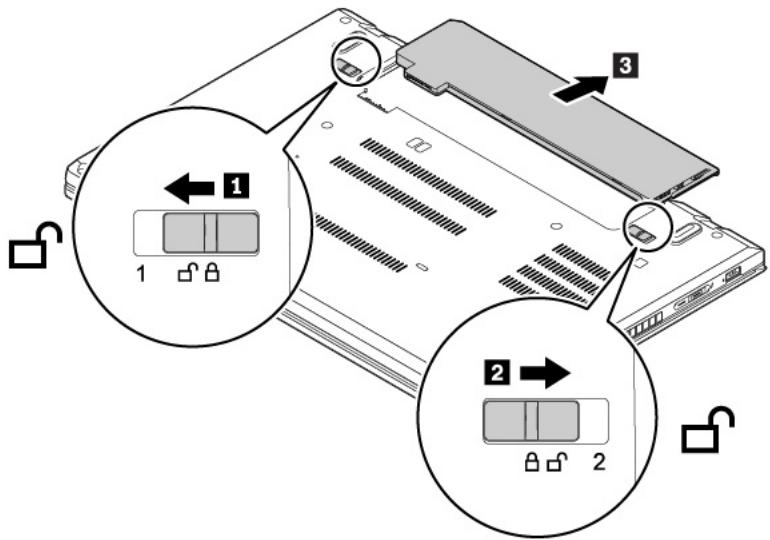

> **AI Description:**
> **Source:** `assets/_page_118_Figure_0.jpg`
> 
> **Generated:** 2026-06-01 23:47:53
> 
> ---
> 
> The image is a technical illustration, likely from a user manual or instructional guide. It shows a close-up view of a device, possibly a laptop or a similar electronic device, with various components labeled and annotated. The diagram includes numbered steps and arrows indicating the process of removing or accessing a component, such as a hard drive or similar internal part. The labels and arrows are designed to guide the user through a specific procedure, with clear visual cues to show the direction and sequence of actions.

5. Insert a new battery until it clicks into place. Ensure that the latches are in the locked positions.

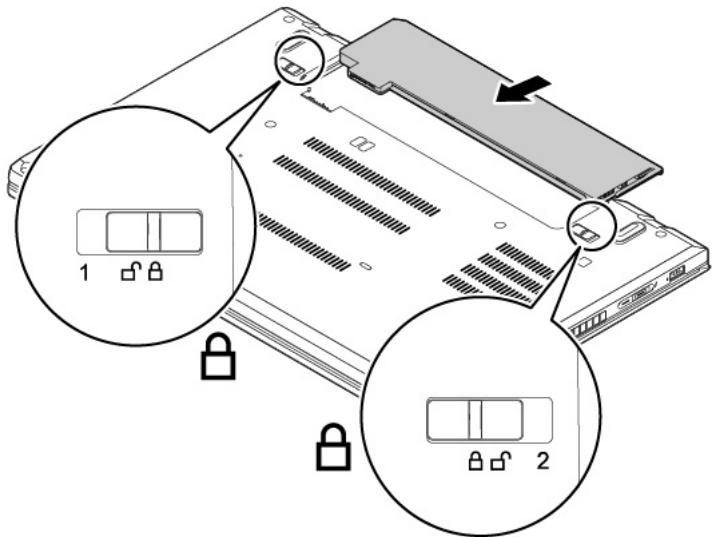

> **AI Description:**
> **Source:** `assets/_page_119_Figure_0.jpg`
> 
> **Generated:** 2026-06-01 23:44:49
> 
> ---
> 
> The image is a technical illustration showing the installation of a component, likely a hard drive, into a computer case. It includes two labeled sections (1 and 2) highlighting the orientation and placement of the component. The illustration is accompanied by symbols indicating the correct orientation and alignment for installation. The image is designed to guide the user through the process of inserting the component into the correct slot within the computer case.

6. Turn the computer over. Connect the ac power adapter and all cables to the computer.

## Replacing the nano-SIM card

Before you start, read “Important safety information” on page v and print the following instructions.

Nano-SIM card is a small plastic card with an Integrated Circuit (IC) chip mounted on one side of the card.

If your computer supports wireless WAN, your computer might require a nano-SIM card to establish wireless WAN connections. Depending on the model, you might need to purchase a nano-SIM card or a nano-SIM card might already be installed in your computer. In some countries or regions, a nano-SIM card is part of the shipping contents that come with your computer.

Attention: When installing or removing the nano-SIM card, do not touch the nano-SIM card metal connectors.

To replace the nano-SIM card, do the following:

1. Disable the built-in battery. See Disabling the built-in battery.

2. Ensure that the computer is turned off and disconnected from ac power and all cables.

3. Close the computer display and turn the computer over.

4. Remove the removable battery. See “Replacing the removable battery” on page 100.

5. Gently push the nano-SIM card to eject it 1 , and then slide it out of the slot 2 .

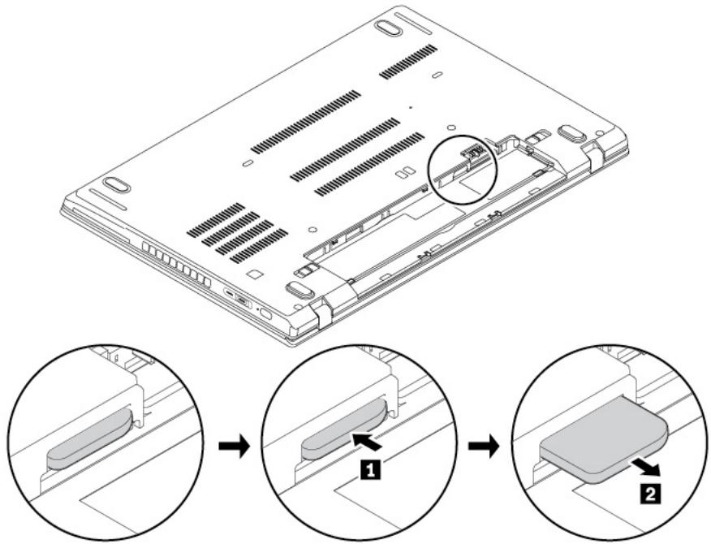

> **AI Description:**
> **Source:** `assets/_page_120_Figure_0.jpg`
> 
> **Generated:** 2026-06-01 23:37:08
> 
> ---
> 
> The image contains a technical illustration of a laptop's bottom panel, focusing on a specific component. It includes three detailed close-up views showing the removal of a component, likely a hard drive or similar slot. The first view shows the component in place, the second shows it partially removed, and the third shows it fully removed. The image is accompanied by numbered arrows indicating the steps for removal. The illustration is likely part of a manual or guide for assembling or disassembling a laptop.

6. Note the orientation of the new nano-SIM card and then insert it into the slot completely until it clicks into position.

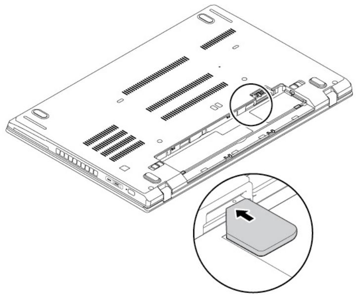

> **AI Description:**
> **Source:** `assets/_page_120_Figure_1.jpg`
> 
> **Generated:** 2026-06-01 23:37:30
> 
> ---
> 
> The image is a technical illustration showing the underside of a laptop, likely for maintenance or repair purposes. It highlights a specific area with a detailed inset, indicating a component that can be accessed or removed. The inset shows a part that appears to be a slot or connector, possibly for a memory module or similar component. The illustration is designed to guide the user in identifying and accessing this particular part of the laptop.

7. Reinstall the removable battery.

8. Turn the computer over. Connect the ac power adapter and all cables to the computer.

## Replacing the base cover assembly

Before you start, read “Important safety information” on page v and print the following instructions.

## Notes:

• Depending on the model, your computer might look slightly different from the illustrations in this topic.

• There might be a risk of short circuits if you remove the base cover assembly in the following situations:

– When your computer has the removable battery installed

– When your computer is connected to ac power

Besides, the computer will not start after you reinstall the base cover assembly. To start the computer, disconnect the ac power adapter and then reconnect it to the computer.

To replace the base cover assembly, do the following:

1. Disable the built-in battery. See Disabling the built-in battery.

2. Ensure that the computer is turned off and disconnected from ac power and all cables.

3. Remove the connector cover from the computer as shown.

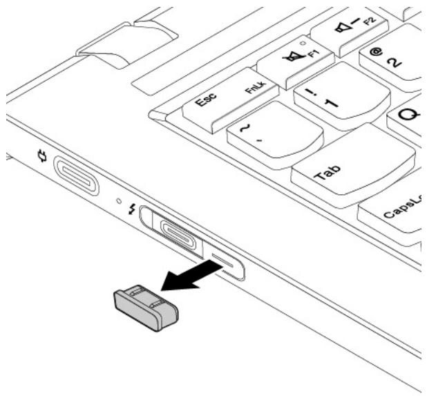

> **AI Description:**
> **Source:** `assets/_page_121_Figure_0.jpg`
> 
> **Generated:** 2026-06-01 23:39:39
> 
> ---
> 
> The image is a technical illustration showing a close-up view of a laptop's keyboard and a USB-C port. It includes a USB-C connector with a black arrow pointing towards the port, indicating the direction for inserting the connector. The keyboard keys visible include "Esc," "Fn," "1," and "Tab," with the "Caps Lock" key partially visible on the right. The illustration is likely used for instructional purposes, such as demonstrating how to connect a USB-C device to a laptop.

4. Close the computer display and turn the computer over.

5. Remove the removable battery. See “Replacing the removable battery” on page 100.

6. Loosen the screws that secure the base cover assembly as shown.

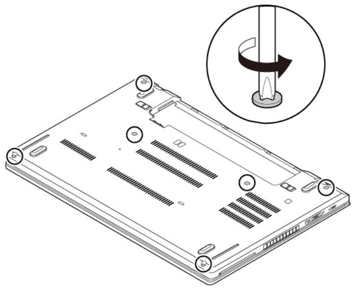

> **AI Description:**
> **Source:** `assets/_page_121_Figure_1.jpg`
> 
> **Generated:** 2026-06-01 23:38:16
> 
> ---
> 
> The image is a technical illustration showing the underside of a laptop with four screws highlighted. It includes a close-up inset of a screw being removed with a tool, indicating the process of disassembling the laptop. The illustration is likely used for repair or maintenance instructions.

7. Press the locations a on the base cover assembly with your thumbs and pivot the hooks b upward at the same time to disengage the hooks from the chassis.

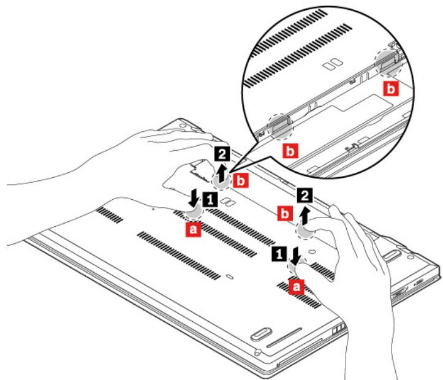

> **AI Description:**
> **Source:** `assets/_page_122_Figure_0.jpg`
> 
> **Generated:** 2026-06-01 23:42:43
> 
> ---
> 
> The image is a technical illustration showing the process of removing a component from a laptop. It includes a close-up view of the laptop's underside with labeled parts (a and b) and numbered steps (1 and 2) indicating the sequence of actions. The diagram highlights the area where the component is located and the direction in which it should be lifted to remove it. The illustration is designed to guide the user through the disassembly process.

8. Press the location c with your thumb and insert your fingers into the holes d to pivot this area of the base cover assembly upward as shown. This area of the base cover assembly will be disengaged from the chassis.

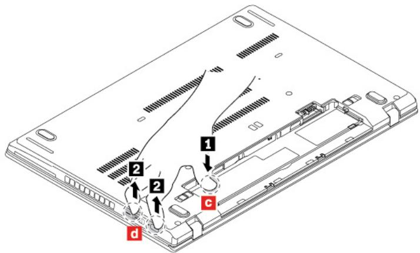

> **AI Description:**
> **Source:** `assets/_page_122_Figure_1.jpg`
> 
> **Generated:** 2026-06-01 23:43:33
> 
> ---
> 
> The image is a technical illustration of a laptop's underside, showing the process of removing a component. It includes numbered steps (1, 2, and 2) indicating the sequence of actions, with arrows pointing to specific areas on the laptop's base. The illustration highlights the location of screws and other components, with labels (C and d) pointing to particular parts. The image is designed to guide users through a disassembly process, focusing on the removal of a specific part of the laptop.

9. Remove the base cover assembly in the numeric order as shown.

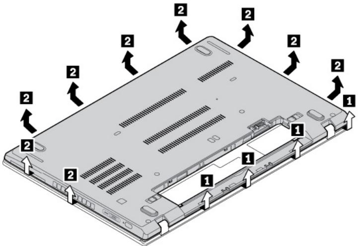

> **AI Description:**
> **Source:** `assets/_page_123_Figure_0.jpg`
> 
> **Generated:** 2026-06-01 23:40:59
> 
> ---
> 
> The image is a technical illustration of a laptop's underside, showing the process of removing the bottom cover. It includes numbered arrows indicating the sequence of steps: first, lifting the cover from the bottom left corner (1), then lifting it upwards along the sides (2). The illustration is designed to guide users through the disassembly process of a laptop, highlighting the areas where the cover is secured.

10. Install the new base cover assembly in place 1 . Ensure that the latches of the base cover assembly are secured under the base cover assembly. Then tighten the screws to secure the base cover assembly 2 .

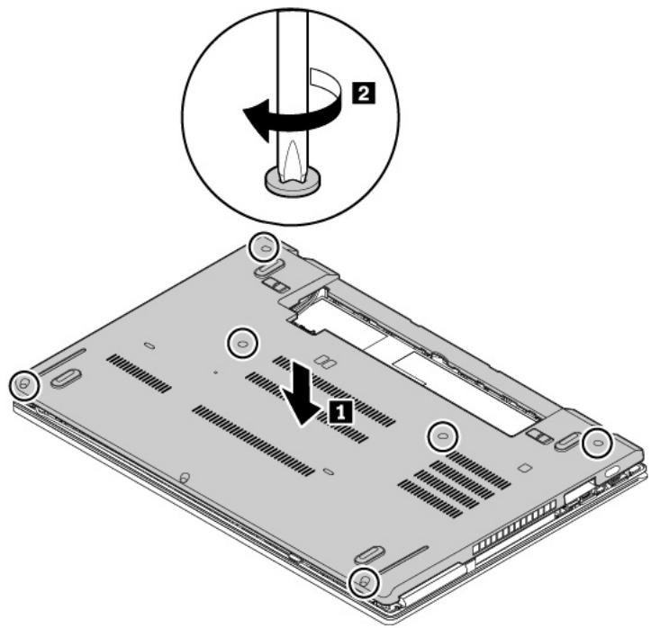

> **AI Description:**
> **Source:** `assets/_page_123_Figure_1.jpg`
> 
> **Generated:** 2026-06-01 23:40:50
> 
> ---
> 
> The image is a technical illustration showing the process of removing a component from a laptop. It includes a close-up of a tool (likely a screwdriver) being used to remove a screw (step 2), and a larger diagram of the underside of a laptop (step 1). The diagram highlights the area where the screw is located and the direction of the tool's movement. The image is designed to guide the user through the process of disassembly, focusing on the removal of a specific part.

11. Reinstall the base cover assembly and the removable battery.

12. Turn the computer over. Connect the ac power adapter and all cables to the computer.

## Replacing a memory module

Before you start, read “Important safety information” on page v and print the following instructions.

Increasing memory capacity is an effective way to make programs run faster. You can increase memory capacity by replacing or adding a memory module.

## Attention:

• Before you start the replacement, touch a grounded metal object. This action reduces any static electricity from your body. Static electricity might damage the memory module.

• Do not touch the contact edge of the memory module. Otherwise the memory module might get damaged.

To replace a memory module, do the following:

1. Disable the built-in battery. See Disabling the built-in battery.

2. Ensure that the computer is turned off and disconnected from ac power and all cables.

3. Close the computer display and turn the computer over.

4. Remove the removable battery. See “Replacing the removable battery” on page 100.

5. Remove the base cover assembly. See “Replacing the base cover assembly” on page 103.

6. To remove the memory module, do the following:

a. Open the film to access the memory module 1 .

b. Open the latches on both sides of the memory slot at the same time 2 .

c. Remove the memory module 3 .

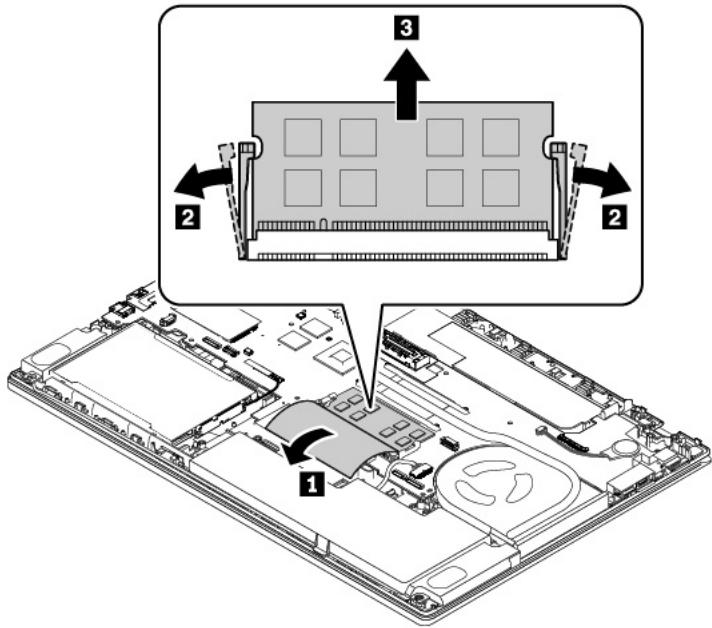

> **AI Description:**
> **Source:** `assets/_page_124_Figure_0.jpg`
> 
> **Generated:** 2026-06-01 23:41:18
> 
> ---
> 
> The image is a technical illustration showing the process of removing a component from a laptop's internal structure. It includes a detailed diagram of the laptop's internal components, specifically highlighting the area where a component is to be removed. The diagram is annotated with numbers (1, 2, 3) indicating the steps to be followed. Step 1 involves lifting a component, Step 2 involves releasing latches, and Step 3 involves pulling out the component. The illustration is designed to guide the user through the process of safely removing a specific part, likely a memory module or similar component, from the laptop.

7. To install a new memory module, do the following:

a. Place the notched end of the new memory module toward the contact edge side of the memory slot. Then insert the memory module into the slot at an angle of about 20 degrees 1 .

b. Pivot the memory module downward until it snaps into place 2 . Ensure that the memory module is firmly installed in the slot and cannot be moved easily.

c. Close the film to protect the new memory module 3 .

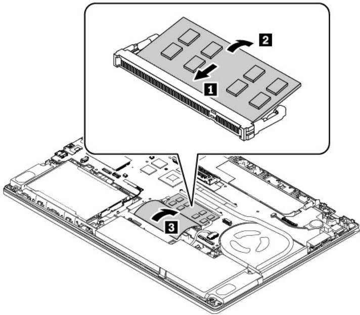

> **AI Description:**
> **Source:** `assets/_page_125_Figure_0.jpg`
> 
> **Generated:** 2026-06-01 23:42:25
> 
> ---
> 
> The image contains a technical illustration of a computer component, likely a graphics card or similar hardware, being installed or removed from a laptop. The diagram includes numbered steps (1, 2, and 3) indicating the process of inserting or removing the component. Step 1 shows the component being aligned with the slot, step 2 depicts the insertion or removal action, and step 3 shows the component fully inserted or removed. The illustration is detailed, showing the orientation and alignment of the component within the laptop's internal space.

8. Reinstall the base cover assembly and the removable battery.

9. Turn the computer over. Connect the ac power adapter and all cables to the computer.

## Replacing the internal storage drive

Before you start, read “Important safety information” on page v and print the following instructions.

Attention: The internal storage drive (such as hard disk drive, solid-state drive, or hybrid drive) is sensitive.   
Inappropriate handling might cause damage and permanent loss of data.

When handling the internal storage drive, observe the following guidelines:

• Replace the internal storage drive only for upgrade or repair. The internal storage drive is not designed for frequent changes or replacement.

• Before replacing the internal storage drive, make a backup copy of all the data that you want to keep.

• Do not touch the contact edge of the internal storage drive. Otherwise the internal storage drive might get damaged.

• Do not apply pressure to the internal storage drive.

• Do not make the internal storage drive subject to physical shocks or vibration. Put the internal storage drive on a soft material, such as cloth, to absorb physical shocks.

Note: Depending on your computer model, a 2.5-inch hard disk drive, a 2.5-inch solid-state drive, or an M.2 solid-state drive might come with your computer.

## 2.5-inch storage drive

To remove the 2.5-inch storage drive, do the following:

1. Disable the built-in battery. See Disabling the built-in battery.

2. Ensure that the computer is turned off and disconnected from ac power and all cables.

3. Close the computer display and turn the computer over.

4. Remove the removable battery. See “Replacing the removable battery” on page 100.

5. Remove the base cover assembly. See “Replacing the base cover assembly” on page 103.

6. Disconnect the cable from the system board 1 2 and pull out the tape 3 .

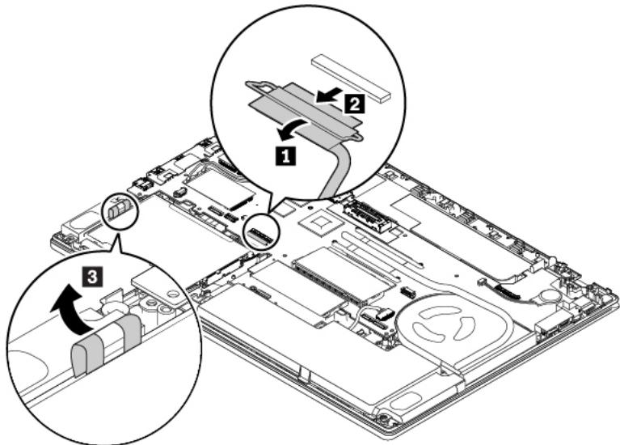

> **AI Description:**
> **Source:** `assets/_page_126_Figure_0.jpg`
> 
> **Generated:** 2026-06-01 23:39:30
> 
> ---
> 
> The image is a technical illustration showing the internal components of a laptop, specifically highlighting the process of removing or installing a component. It includes numbered steps (1, 2, and 3) indicating the sequence of actions. Step 1 shows a cable being disconnected, Step 2 shows a component being lifted or removed, and Step 3 shows a latch or connector being released. The illustration is detailed, showing various internal parts such as the motherboard, cooling system, and other hardware components.

7. Remove the 2.5-inch storage drive by pulling the tape.

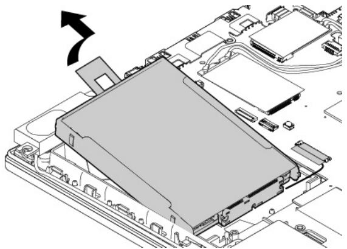

> **AI Description:**
> **Source:** `assets/_page_126_Figure_1.jpg`
> 
> **Generated:** 2026-06-01 23:38:25
> 
> ---
> 
> The image is a technical illustration showing a close-up view of a computer's internal components, specifically focusing on a hard drive or SSD. The illustration includes a large gray component, which appears to be a hard drive or SSD, with a black arrow pointing upwards, indicating the direction of removal or installation. The surrounding area includes various other components such as circuit boards and connectors, suggesting this is part of a computer's internal hardware. The illustration is likely used for instructional purposes, such as a guide for removing or installing a hard drive or SSD in a computer.

8. Disconnect the cable from the 2.5-inch storage drive.

> **AI Description:**
> **Source:** `assets/_page_126_Figure_2.jpg`
> 
> **Generated:** 2026-06-01 23:38:04
> 
> ---
> 
> The image is a technical illustration showing the connection of a SATA cable to a hard drive or similar device. It depicts a SATA cable being inserted into a connector on the side of a rectangular device, which appears to be a hard drive or a similar storage unit. The illustration is likely used for instructional purposes, such as explaining how to connect a hard drive to a computer or other storage system. The image is a diagram and does not contain any text or additional visual elements.

9. Detach the bracket from the 2.5-inch storage drive.

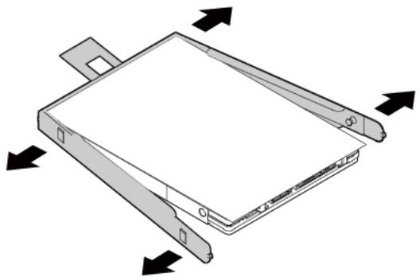

> **AI Description:**
> **Source:** `assets/_page_127_Figure_0.jpg`
> 
> **Generated:** 2026-06-01 23:37:13
> 
> ---
> 
> The image is a technical illustration showing the process of removing a hard drive from a laptop. It depicts the laptop lying on its back with arrows indicating the direction in which the hard drive should be lifted to remove it. The illustration is designed to guide users through the hardware maintenance process, specifically focusing on the extraction of the hard drive.

To install the new 2.5-inch storage drive, do the following:

1. Attach the bracket to the new 2.5-inch storage drive.

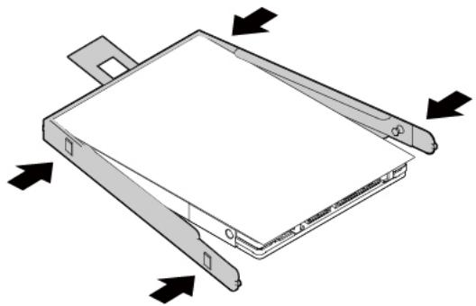

> **AI Description:**
> **Source:** `assets/_page_127_Figure_1.jpg`
> 
> **Generated:** 2026-06-01 23:37:19
> 
> ---
> 
> The image is a technical illustration showing the removal of a hard drive from a computer. It depicts a laptop with arrows indicating the direction to push to release the hard drive. The illustration includes a diagram of the hard drive and the surrounding components, with arrows pointing to the release points on the laptop. The image is designed to guide users on how to safely remove a hard drive from a laptop.

2. Connect the cable to the new 2.5-inch storage drive.

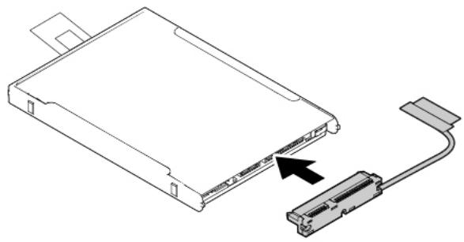

> **AI Description:**
> **Source:** `assets/_page_127_Figure_2.jpg`
> 
> **Generated:** 2026-06-01 23:36:13
> 
> ---
> 
> The image is a technical illustration showing a USB drive being inserted into a USB port. The diagram includes a USB drive with a cable and an arrow indicating the direction of insertion. The illustration is likely used for instructional purposes, guiding users on how to connect a USB device to a computer.

3. Insert the new storage drive 1 and then pivot it downward 2 . Ensure that the new storage drive is seated in place.

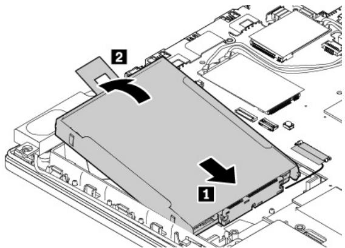

> **AI Description:**
> **Source:** `assets/_page_128_Figure_0.jpg`
> 
> **Generated:** 2026-06-01 23:44:27
> 
> ---
> 
> The image is a technical illustration showing the process of removing a hard drive from a computer's internal bay. It includes two numbered arrows indicating the direction of movement: arrow 1 points to the right, suggesting the direction to pull the hard drive out, and arrow 2 points upwards, indicating the angle at which the hard drive should be lifted. The illustration is part of a step-by-step guide, likely for maintenance or repair purposes.

4. Connect the cable to the system board 1 2 and insert the tape 3 .

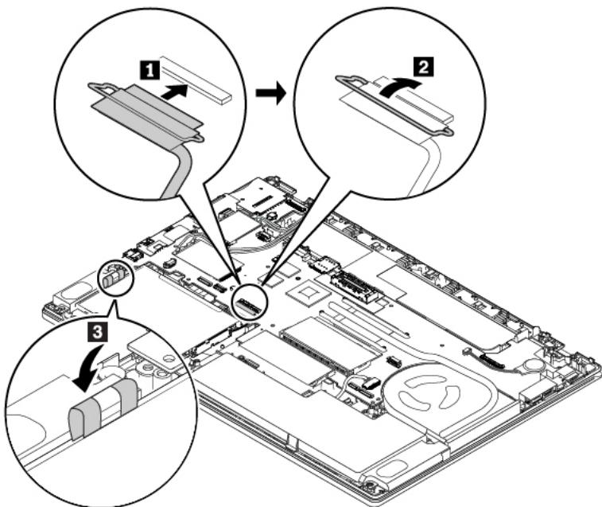

> **AI Description:**
> **Source:** `assets/_page_128_Figure_1.jpg`
> 
> **Generated:** 2026-06-01 23:44:19
> 
> ---
> 
> The image is a technical illustration showing the process of removing a component from a laptop's internal structure. It includes three numbered steps, each highlighting a different part of the laptop's internal components. The first step (1) shows a component being pulled out, the second step (2) depicts the same component being rotated, and the third step (3) shows the component being further removed. The illustration is detailed, showing various internal parts and connectors, indicating a step-by-step guide for maintenance or repair.

5. Reinstall the base cover assembly and the removable battery.

6. Turn the computer over. Connect the ac power adapter and all cables.

## M.2 solid-state drive

To remove the M.2 solid-state drive, do the following:

1. Disable the built-in battery. See Disabling the built-in battery.

2. Ensure that the computer is turned off and disconnected from ac power and all cables.

3. Close the computer display and turn the computer over.

4. Remove the removable battery. See “Replacing the removable battery” on page 100.

5. Remove the base cover assembly. See “Replacing the base cover assembly” on page 103.

6. Disconnect the cable from the system board 1 2 and pull out the tape 3 .

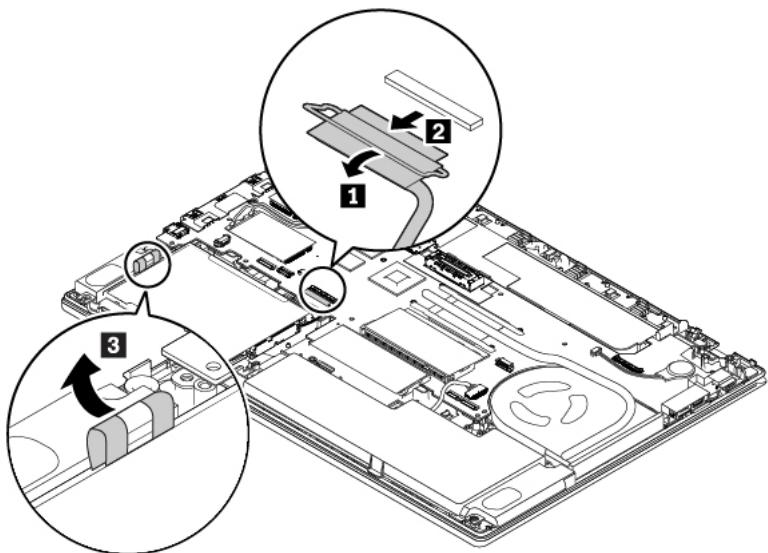

> **AI Description:**
> **Source:** `assets/_page_129_Figure_0.jpg`
> 
> **Generated:** 2026-06-01 23:46:08
> 
> ---
> 
> The image is a technical illustration of a laptop's internal components, specifically focusing on the removal of a memory module. It includes three numbered steps (1, 2, and 3) indicating the process of disconnecting and removing the memory module. Step 1 shows the memory module being lifted out of its socket. Step 2 highlights the cable that needs to be disconnected. Step 3 illustrates the removal of a retaining clip or latch that secures the memory module. The illustration is detailed and includes various components of the laptop's internal structure, such as the motherboard, cooling fan, and other hardware parts.

7. Remove the M.2 solid-state-drive adapter by pulling the tape.

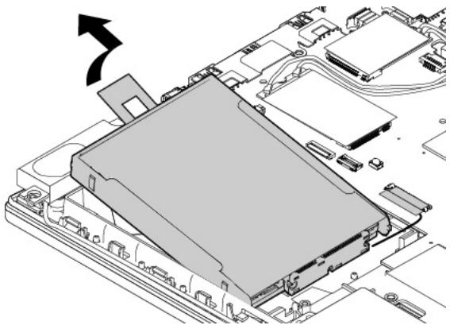

> **AI Description:**
> **Source:** `assets/_page_129_Figure_1.jpg`
> 
> **Generated:** 2026-06-01 23:46:40
> 
> ---
> 
> The image is a technical illustration showing the internal components of a device, likely a laptop or similar electronic device. It depicts a hard drive or similar storage component being removed or installed. The illustration includes a large gray area representing the hard drive, with various connectors and slots visible around it. There is a black arrow pointing upwards, indicating the direction in which the hard drive should be lifted or pushed. The surrounding area includes other internal components such as circuit boards and cables, suggesting this is a guide for disassembling or assembling the device.

8. If you also want to replace the M.2 solid-state-drive cable, disconnect the cable from the M.2 solidstate-drive adapter.

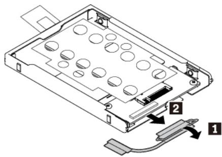

> **AI Description:**
> **Source:** `assets/_page_129_Figure_2.jpg`
> 
> **Generated:** 2026-06-01 23:48:12
> 
> ---
> 
> The image is a technical illustration showing a component, likely a part of an electronic device or hardware. It depicts a rectangular component with circular cutouts, a slot, and a cable with a connector. The illustration includes numbered arrows (1 and 2) indicating the direction of movement or assembly. The number 2 points to a slot, suggesting a component should be inserted or removed from this slot. The overall design suggests this is a guide for assembling or disassembling a specific part of a device.

9. Remove the two screws that secure the protective cover 1 , and then remove the cover 2 .

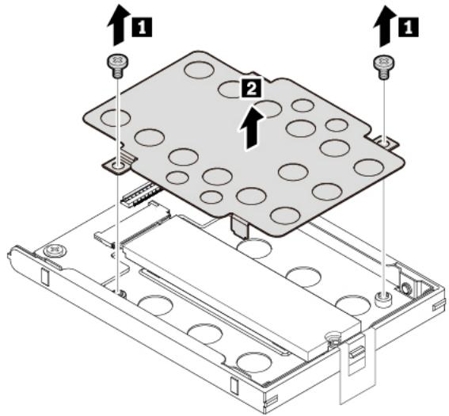

> **AI Description:**
> **Source:** `assets/_page_130_Figure_0.jpg`
> 
> **Generated:** 2026-06-01 23:43:23
> 
> ---
> 
> The image is a technical illustration showing a component being removed from a larger assembly. It features a flat, rectangular component with circular cutouts, labeled with the number "2," being lifted upwards. Two screws labeled with the number "1" are shown on either side of the component, indicating they need to be removed before the component can be lifted. The illustration is likely part of a manual or guide for assembling or disassembling electronic or mechanical equipment.

10. Remove the screw that secures the M.2 solid-state drive. The M.2 solid-state drive is released from the secured position and pivots upward.

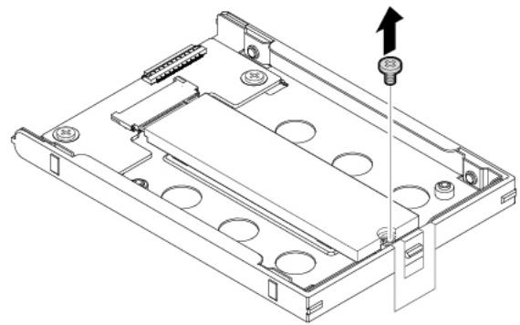

> **AI Description:**
> **Source:** `assets/_page_130_Figure_1.jpg`
> 
> **Generated:** 2026-06-01 23:42:50
> 
> ---
> 
> The image is a technical illustration of a component, likely a hard drive or similar electronic part. It shows a top-down view of a rectangular enclosure with several circular cutouts and a screw hole. The illustration includes a vertical arrow pointing upwards, indicating the direction of a screw or component insertion. The diagram is likely used for assembly or maintenance instructions.

11. Gently pull the M.2 solid-state drive out of the slot.

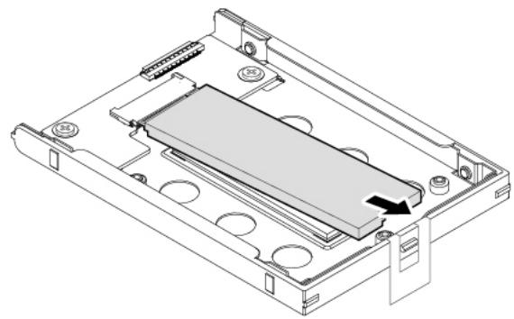

> **AI Description:**
> **Source:** `assets/_page_130_Figure_2.jpg`
> 
> **Generated:** 2026-06-01 23:41:54
> 
> ---
> 
> The image is a technical illustration of a component, likely a hard drive or a similar electronic device. It shows a rectangular component with a metallic back and a flat, dark gray surface, which appears to be a hard drive or a similar storage device. The illustration includes a black arrow pointing to the right, indicating the direction of insertion or removal of the component. The surrounding area includes various slots and connectors, suggesting it is part of a larger assembly, possibly a computer or server.

To install the new M.2 solid-state drive, do the following:

1. Align the notch in the new M.2 solid-state drive with the slot key in the M.2 slot. Insert the solid-state drive into the M.2 slot at an angle of about 20 degrees until it is secured tightly 1 and then pivot it downward 2 .

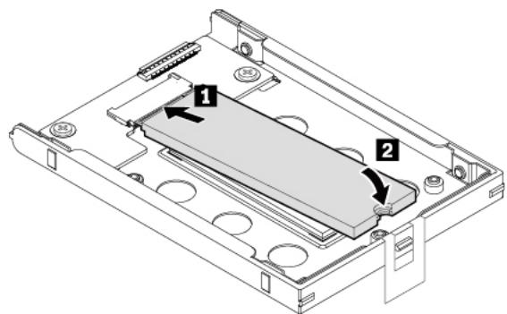

> **AI Description:**
> **Source:** `assets/_page_131_Figure_0.jpg`
> 
> **Generated:** 2026-06-01 23:40:26
> 
> ---
> 
> The image is a technical illustration showing the process of installing or removing a component, likely a hard drive or similar hardware, within a computer chassis. The diagram includes two numbered steps: Step 1 involves sliding the component into a slot, and Step 2 involves securing it in place by pressing down. The illustration is labeled with directional arrows to guide the user through the process.

2. Install the screw to secure the M.2 solid-state drive.

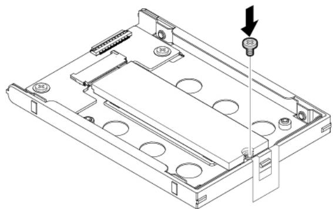

> **AI Description:**
> **Source:** `assets/_page_131_Figure_1.jpg`
> 
> **Generated:** 2026-06-01 23:41:38
> 
> ---
> 
> The image is a technical illustration of a mechanical component, likely part of a computer or electronic device. It shows a rectangular housing with several circular cutouts and a slot for a component. There is a vertical arrow pointing to a screw, indicating the direction of insertion or adjustment. The illustration is detailed and appears to be used for assembly or maintenance instructions.

3. Install the protective cover and then install the two screws to secure the cover.

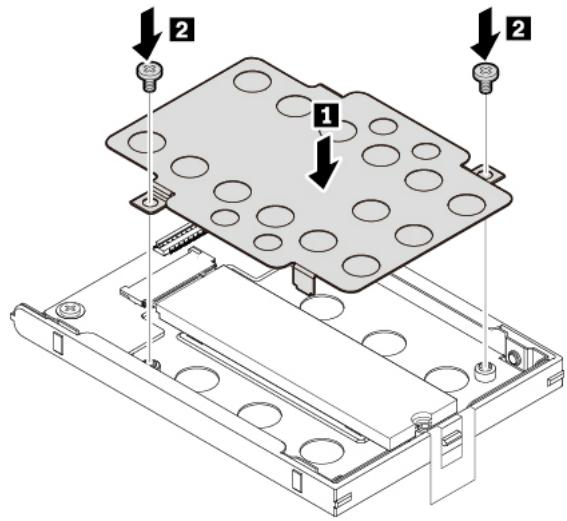

> **AI Description:**
> **Source:** `assets/_page_131_Figure_2.jpg`
> 
> **Generated:** 2026-06-01 23:40:19
> 
> ---
> 
> The image is a technical illustration showing the installation of a component, likely a hard drive or similar device, into a computer chassis. It includes two numbered arrows indicating the direction of insertion (1) and the placement of screws (2). The illustration is designed to guide the user through the process of securing the component in place.

4. If the M.2 solid-state-drive cable has been disconnected, connect the cable to the M.2 solid-state-drive adapter.

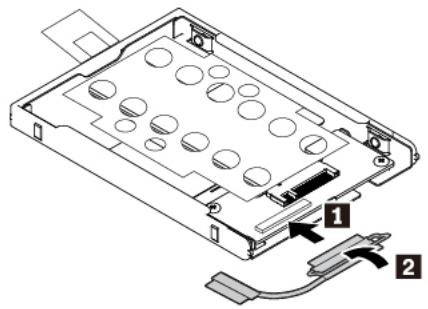

> **AI Description:**
> **Source:** `assets/_page_132_Figure_0.jpg`
> 
> **Generated:** 2026-06-01 23:37:45
> 
> ---
> 
> The image is a technical illustration of a computer component, likely a hard drive or optical drive bay. It shows a partially disassembled device with a focus on the internal components. The illustration includes numbered labels (1 and 2) pointing to specific parts of the device, indicating a step-by-step guide or diagram for assembly or disassembly. The numbered labels are likely referencing instructions for connecting cables or securing components within the device.

5. Insert the adapter 1 and then pivot it downward 2 . Ensure that the adapter is seated in place.

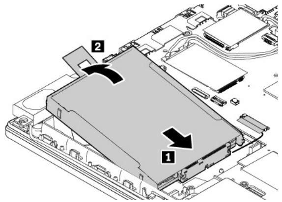

> **AI Description:**
> **Source:** `assets/_page_132_Figure_1.jpg`
> 
> **Generated:** 2026-06-01 23:36:44
> 
> ---
> 
> The image is a technical illustration showing the process of removing a hard drive from a computer's internal bay. The diagram includes two numbered arrows indicating the direction of movement: arrow 1 points to the right, indicating the direction to slide the hard drive out, and arrow 2 points upwards, indicating the direction to lift the hard drive. The illustration is labeled with the number 2, which likely corresponds to a step in a larger set of instructions. The image is designed to guide the user through the physical removal of a hard drive from a computer.

6. Connect the cable to the system board 1 2 and insert the tape 3 .

> **AI Description:**
> **Source:** `assets/_page_132_Figure_2.jpg`
> 
> **Generated:** 2026-06-01 23:36:03
> 
> ---
> 
> The image is a technical illustration showing the process of removing a component from a laptop motherboard. It consists of three numbered steps, each highlighting a different part of the process. Step 1 shows the initial removal of a small component, Step 2 depicts the lifting of a larger component, and Step 3 illustrates the final removal of another part. The illustration is detailed and labeled to guide the viewer through the disassembly process.

7. Reinstall the base cover assembly and the removable battery.

8. Turn the computer over. Connect the ac power adapter and all cables.

## Replacing a wireless-WAN card

The following information is only applies to computer models with user-installable modules.

Before you start, read “Important safety information” on page v and print the following instructions.

Attention: Before you start installing a wireless-WAN card, touch a metal table or a grounded metal object.   
This action reduces any static electricity from your body. Static electricity could damage the card.

Some computers might come with a wireless-WAN card. To replace the wireless-WAN card, do the following:

1. Disable the built-in battery. See Disabling the built-in battery.

2. Ensure that the computer is turned off and disconnected from ac power and all cables.

3. Close the computer display and turn the computer over.

4. Remove the removable battery. See “Replacing the removable battery” on page 100.

5. Remove the base cover assembly. See “Replacing the base cover assembly” on page 103.

6. To remove the wireless-WAN card, do the following:

a. Open the film to access the wireless-WAN card 1 .

b. Hold the cable connector with your fingers and gently disconnect each cable from the failing card 2 .

c. Remove the screw that secures the wireless-WAN card 3 . The card is released from the secured position and pivots upward.

d. Carefully remove the wireless-WAN card out of the slot 4 .

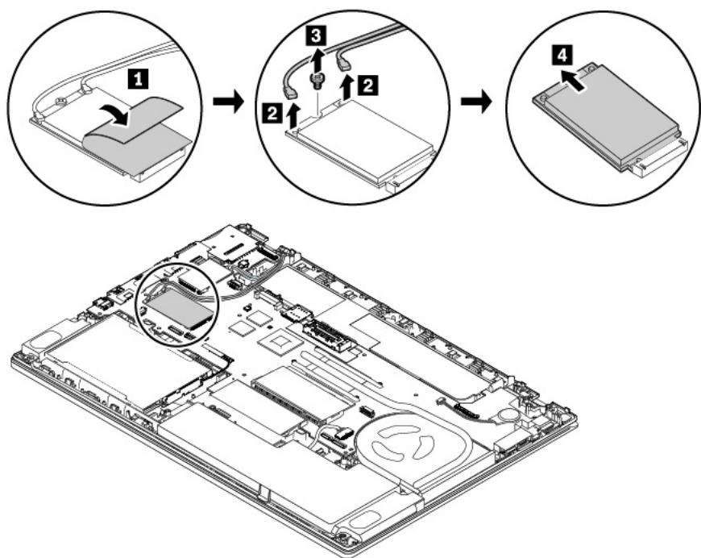

> **AI Description:**
> **Source:** `assets/_page_133_Figure_0.jpg`
> 
> **Generated:** 2026-06-01 23:38:55
> 
> ---
> 
> The image contains a technical illustration of a laptop's internal components, specifically focusing on the process of removing a hard drive. The illustration is divided into four numbered steps, each showing a different stage of the removal process. Step 1 shows the removal of a panel, Step 2 involves disconnecting cables and screws, Step 3 depicts the removal of the hard drive, and Step 4 shows the detached hard drive. The main focus is on the disassembly of the laptop's internal components to access the hard drive for replacement or repair.

7. To install a new wireless-WAN card, do the following:

a. Align the notched edge of the new wireless-WAN card with the slot key in the slot. Then carefully insert the card into the slot at an angle about 20 degrees 1 . Pivot the new wireless-WAN card downward 2 .

b. Install the screw to secure the card in place 3 . Connect the antenna cables to the new wireless-WAN card 4 . Ensure that you connect the orange cable to the main connector on the card, and the blue cable to the auxiliary connector on the card.

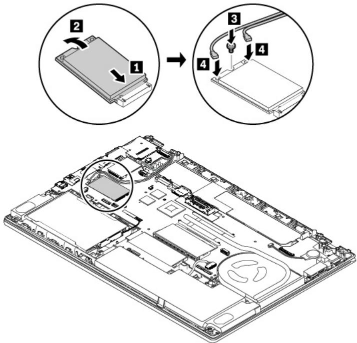

> **AI Description:**
> **Source:** `assets/_page_134_Figure_0.jpg`
> 
> **Generated:** 2026-06-01 23:38:38
> 
> ---
> 
> The image contains a technical illustration of a laptop's internal components, specifically focusing on the process of removing or installing a hard drive. The diagram includes numbered steps and arrows indicating the sequence of actions: 1) lifting the hard drive, 2) detaching the hard drive cable, 3) removing the screw securing the hard drive, and 4) detaching the hard drive from the laptop. The main feature is a detailed view of the laptop's internal structure, highlighting the placement of the hard drive and its connections.

8. Reinstall the base cover assembly and the removable battery.

9. Turn the computer over. Connect the ac power adapter and all cables to the computer.

## Replacing the keyboard

Before you start, read “Important safety information” on page v and print the following instructions.

To remove the keyboard, do the following:

1. Disable the built-in battery. See Disabling the built-in battery.

2. Ensure that the computer is turned off and disconnected from ac power and all cables.

3. Close the computer display and turn the computer over.

4. Remove the removable battery. See “Replacing the removable battery” on page 100.

5. Loosen the two screws that secure the keyboard.

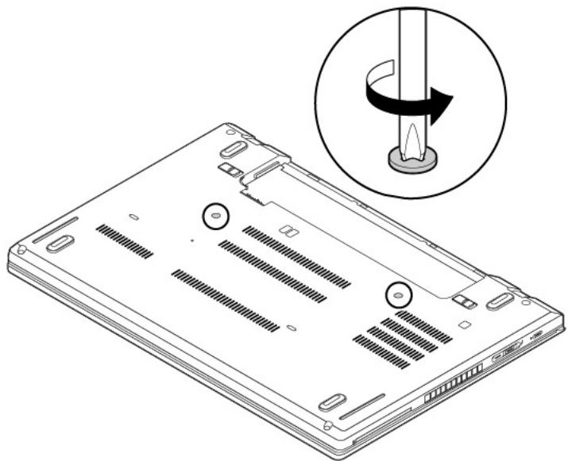

> **AI Description:**
> **Source:** `assets/_page_135_Figure_0.jpg`
> 
> **Generated:** 2026-06-01 23:37:56
> 
> ---
> 
> The image is a technical illustration showing the underside of a laptop or similar electronic device. It includes a detailed view of the device's bottom panel, highlighting several components and features. There is a close-up inset in the upper right corner that demonstrates the removal of a screw using a screwdriver, indicating a step in a maintenance or repair process. The illustration is likely part of a user manual or technical guide.

6. Turn the computer over and open the display. Push hard in the direction as shown to release the latches from the keyboard bezel.

> **AI Description:**
> **Source:** `assets/_page_135_Figure_1.jpg`
> 
> **Generated:** 2026-06-01 23:36:36
> 
> ---
> 
> The image is a technical illustration of a Lenovo ThinkPad laptop. It shows the laptop in an open position, with the keyboard and screen clearly visible. The image includes two black arrows pointing towards the keyboard, likely indicating a feature or function related to the keyboard. The ThinkPad logo is visible at the bottom of the laptop. The illustration is monochromatic, using shades of gray to depict the laptop and its components.

7. Pivot the keyboard slightly upward as shown by arrow 1 . Then turn over the keyboard as shown by arrow 2 .

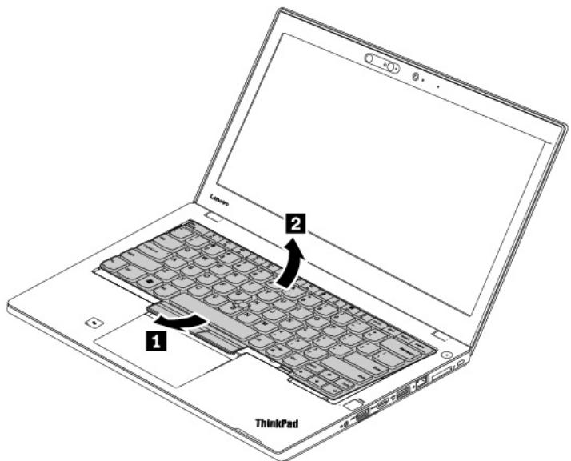

> **AI Description:**
> **Source:** `assets/_page_136_Figure_0.jpg`
> 
> **Generated:** 2026-06-01 23:40:37
> 
> ---
> 
> The image is a technical illustration of a Lenovo ThinkPad laptop. It shows the process of removing the keyboard. The image includes two numbered arrows: arrow 1 points to the keyboard, indicating where to press to release the keyboard, and arrow 2 shows the upward motion of the keyboard as it is being lifted off the laptop. The illustration is designed to guide users through the keyboard removal process, highlighting the key steps involved.

8. Put the keyboard on the palm rest and detach the connectors. Then remove the keyboard.

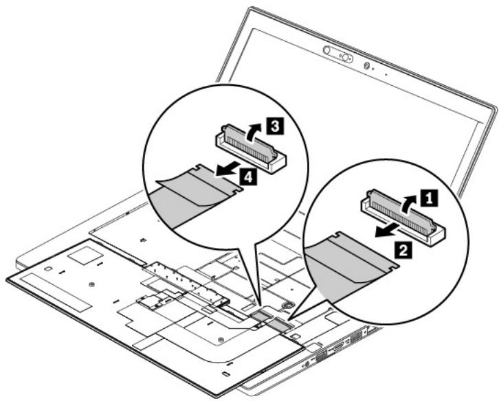

> **AI Description:**
> **Source:** `assets/_page_136_Figure_1.jpg`
> 
> **Generated:** 2026-06-01 23:41:31
> 
> ---
> 
> The image is a technical illustration showing the process of removing or installing memory modules (RAM) in a laptop. It includes two circular callouts with numbered steps (1-4) indicating the sequence of actions. The first step (1) shows the memory module being lifted out of its slot, while the second step (2) depicts the module being pushed back in. The third step (3) shows the module being lifted out of its slot again, and the fourth step (4) shows the module being pushed back in. The image is designed to guide users through the process of safely removing and reinserting RAM in a laptop.

To install the new keyboard, do the following:

1. Attach the connectors, and then turn over the keyboard.

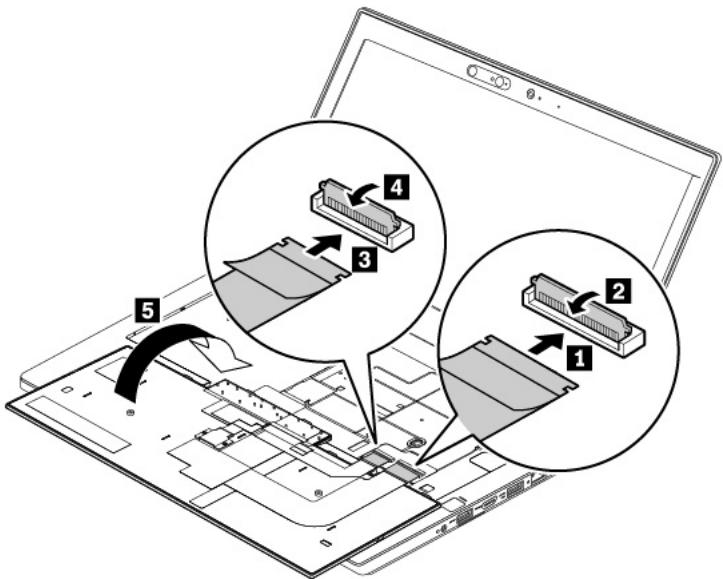

> **AI Description:**
> **Source:** `assets/_page_137_Figure_0.jpg`
> 
> **Generated:** 2026-06-01 23:43:13
> 
> ---
> 
> The image is a technical illustration showing the process of removing or installing a component, likely a memory module, in a laptop. The illustration includes numbered steps and arrows indicating the direction of movement. The main focus is on the laptop's internal components, specifically the memory slot area. The image is designed to guide users through the process of accessing and handling the memory module safely.

2. Insert the keyboard into the keyboard bezel as shown. Ensure that the top edge of the keyboard (the edge that is close to the computer display) is under the frame of the keyboard bezel.

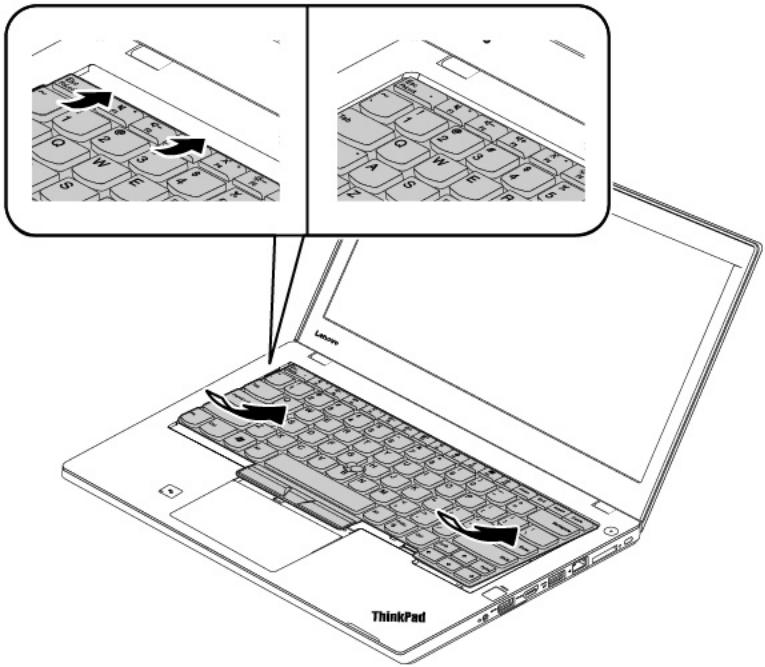

> **AI Description:**
> **Source:** `assets/_page_137_Figure_1.jpg`
> 
> **Generated:** 2026-06-01 23:43:02
> 
> ---
> 
> The image is a technical illustration showing the process of removing a keyboard from a Lenovo ThinkPad laptop. It includes a close-up view of the keyboard with arrows indicating the direction to push the keyboard to release it. The illustration is accompanied by two smaller diagrams highlighting the key areas where the keyboard needs to be pushed. The image is designed to guide users through the keyboard removal procedure, emphasizing the precise actions required to detach the keyboard from the laptop.

3. Slide the keyboard in the direction as shown by the arrows. Ensure that the latches are secured under the keyboard frame.

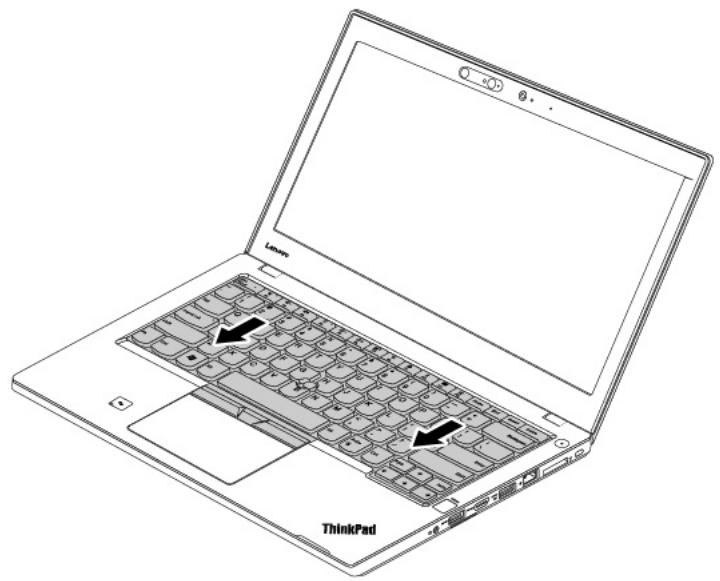

> **AI Description:**
> **Source:** `assets/_page_138_Figure_0.jpg`
> 
> **Generated:** 2026-06-01 23:33:52
> 
> ---
> 
> The image is a technical illustration of a Lenovo ThinkPad laptop. It shows a side view of the laptop with the keyboard and trackpad area highlighted. Two black arrows are pointing to the spacebar area on the keyboard, indicating a specific feature or action related to the spacebar. The image is likely used for instructional purposes, possibly to demonstrate a function or modification related to the spacebar on the ThinkPad laptop.

4. Close the computer display and turn the computer over. Tighten the screws to secure the keyboard.

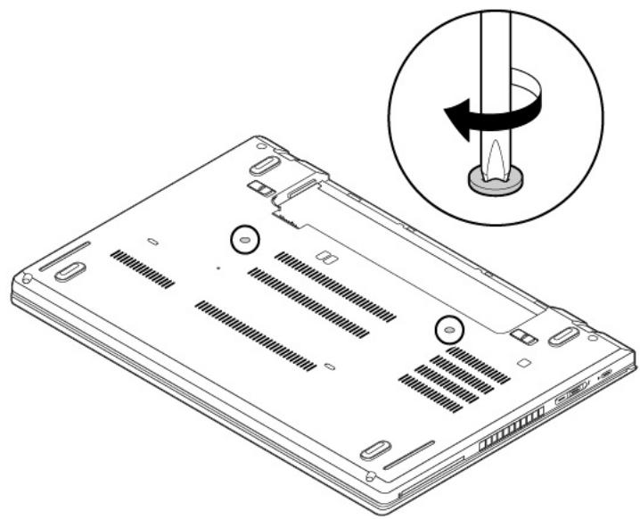

> **AI Description:**
> **Source:** `assets/_page_138_Figure_1.jpg`
> 
> **Generated:** 2026-06-01 23:34:10
> 
> ---
> 
> The image is a technical illustration showing the underside of a laptop with a focus on the battery compartment. It includes a detailed view of the battery area with cooling vents and connectors. The inset diagram on the right illustrates the process of removing or inserting a screw, likely used for accessing the battery or other components. The illustration is designed to guide users through the process of disassembling or assembling the laptop.

5. Reinstall the removable battery.

6. Turn the computer over. Connect the ac power adapter and all cables to the computer.

## Replacing the coin-cell battery

Before you start, read “Important safety information” on page v and print the following instructions.

## DANGER

If the coin-cell battery is incorrectly replaced, there is danger of an explosion. The coin-cell battery contains a small amount of harmful substance. To avoid possible injury:

• Replace only with a battery of the type recommended by Lenovo.

• Keep the battery away from fire.

• Do not expose it to excessive heat.

• Do not expose it to water or rain.

• Do not short-circuit it.

• Do not drop, crush, puncture the battery, or make it subject to strong forces. Battery abuse or mishandling can cause the battery to overheat, which can cause gasses or flame to "vent" from the battery or coin-cell battery.

To replace the coin-cell battery, do the following:

1. Disable the built-in battery. See Disabling the built-in battery.

2. Ensure that the computer is turned off and disconnected from ac power and all cables.

3. Close the computer display and turn the computer over.

4. Remove the removable battery. See “Replacing the removable battery” on page 100.

5. Remove the base cover assembly. See “Replacing the base cover assembly” on page 103.

6. Detach the connector 1 , and then remove the coin-cell battery 2 .

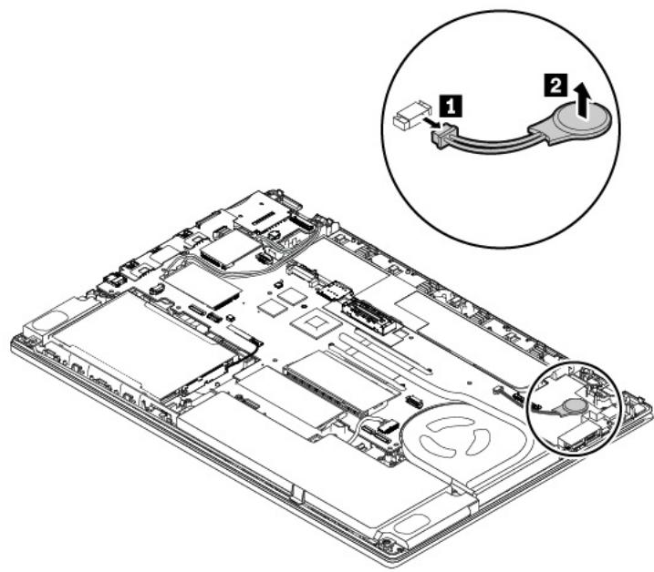

> **AI Description:**
> **Source:** `assets/_page_139_Figure_0.jpg`
> 
> **Generated:** 2026-06-01 23:33:12
> 
> ---
> 
> The image is a technical illustration of the internal components of a laptop. It shows a detailed view of the motherboard and various connectors. There is a zoomed-in section highlighting a specific connector labeled with numbers 1 and 2, indicating a step-by-step process for connecting or disconnecting a cable. The illustration is likely used for repair or assembly instructions, providing a clear view of the internal layout and the components involved.

7. Install the new coin-cell battery 1 and attach the connector 2 .

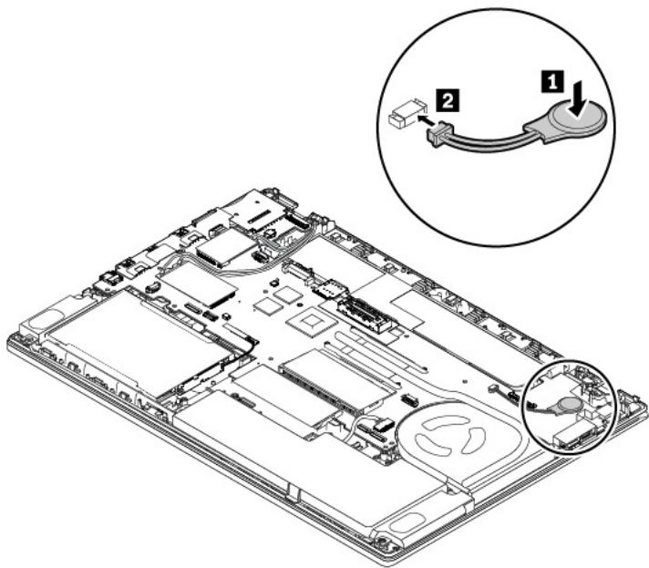

> **AI Description:**
> **Source:** `assets/_page_140_Figure_0.jpg`
> 
> **Generated:** 2026-06-01 23:39:51
> 
> ---
> 
> The image is a technical illustration of a laptop's internal components, specifically focusing on the connection of a cable. The diagram shows a close-up view of the laptop's interior, highlighting the placement of a cable and a connector. The cable is shown being inserted into a specific port, with the connector labeled as "1" and the cable itself labeled as "2". The illustration is likely part of a repair or assembly guide, providing instructions on how to connect or replace a component within the laptop. The image is detailed and technical, suitable for individuals familiar with laptop hardware.

8. Reinstall the base cover assembly and the removable battery.

9. Turn the computer over. Connect the ac power adapter and all cables to the computer.

Attention: After you replace the coin-cell battery, reset the system date and time in the ThinkPad Setup program. See “Date/Time menu” on page 70.

## Chapter 10. Getting support

This chapter provides information about getting help and support from Lenovo.

## Before you contact Lenovo

Often, you can solve your computer problems by referring to the information in the explanations of error codes, running diagnostic programs, or by consulting the Lenovo Support Web site.

## Registering your computer

Register your computer with Lenovo. For more information, see “Registering your computer” on page 17.

## Downloading system updates

Downloading updated software might resolve problems you experience with your computer.

To download updated software, go to the following Web site and follow the instructions on the screen:

https://support.lenovo.com

## Recording information

Before you talk to a Lenovo representative, record the following important information about your computer.

## Recording problem symptoms and details

Collect the answers to the following questions before you call for help. Then, you are able to get help as quickly as possible.

• What is the problem? Is it continuous or intermittent?

• Is there an error message? What is the error code, if any?

• What operating system are you using? Which version?

• Which software applications were running at the time of the problem?

• Can the problem be reproduced? If so, how?

## Recording system information

The serial number label is on the bottom of your computer. Record the machine type and the serial number.

• What is the name of your Lenovo product?

• What is the machine type?

• What is the serial number?

## Getting help and service

If you need help, service, technical assistance, or more information about Lenovo products, you will find a wide variety of sources available from Lenovo to assist you.

Information about your computer and preinstalled software, if any, is available in the documentation that comes with your computer or on the Lenovo Support Web site at https://support.lenovo.com. The documentation includes printed books, online books, readme files, and help files.

Microsoft Service Packs are the latest software source for Windows product updates. They are available through Web download (connection charges might apply) or through discs. For more specific information and links, go to https://www.microsoft.com. Lenovo offers technical assistance with installation of, or questions related to, Service Packs for your Lenovo-preinstalled Microsoft Windows product. For more information, contact the Customer Support Center.

## Lenovo Support Web site

Technical support information is available on the Lenovo Support Web site at https://support.lenovo.com.

This Web site is updated with the latest support information such as the following:

• Drivers and software

• Diagnostic solutions

• Product and service warranty

• Product and parts details

• User guides and manuals

• Knowledge base and frequently asked questions

## Calling Lenovo

If you have tried to correct the problem yourself and still need help, during the warranty period, you can get help and information by telephone through the Customer Support Center. The following services are available during the warranty period:

• Problem determination - Trained personnel are available to assist you with determining if you have a hardware problem and deciding what action is necessary to fix the problem.

• Lenovo hardware repair - If the problem is determined to be caused by Lenovo hardware under warranty, trained service personnel are available to provide the applicable level of service.

• Engineering change management - Occasionally, there might be changes that are required after a product has been sold. Lenovo or your reseller, if authorized by Lenovo, will make selected Engineering Changes (ECs) that apply to your hardware available.

The following items are not covered:

• Replacement or use of parts not manufactured for or by Lenovo or nonwarranted parts

• Identification of software problem sources

• Configuration of UEFI BIOS as part of an installation or upgrade

• Changes, modifications, or upgrades to device drivers

• Installation and maintenance of network operating systems (NOS)

• Installation and maintenance of programs

For the terms and conditions of the Lenovo Limited Warranty that apply to your Lenovo hardware product, see “Warranty information” in the Safety and Warranty Guide that comes with your computer.

If possible, be near your computer when you make your call. Ensure that you have downloaded the most current drivers and system updates, run diagnostics, and recorded information before you call. When calling for technical assistance, have the following information available:

• Machine type and model

• Serial numbers of your computer, monitor, and other components, or your proof of purchase

• Description of the problem

• Exact wording of any error messages

• Hardware and software configuration information for your system

## Telephone numbers

For a list of the Lenovo Support phone numbers for your country or region, go to https:// pcsupport.lenovo.com/supportphonelist or refer to the Safety and Warranty Guide that comes with your computer.

Note: Phone numbers are subject to change without notice. The latest phone numbers are available at https://pcsupport.lenovo.com/supportphonelist. If the number for your country or region is not provided, contact your Lenovo reseller or Lenovo marketing representative.

## Purchasing additional services

During and after the warranty period, you can purchase additional services. Service availability and service name might vary by country or region.

For more information about these services, go to https://www.lenovo.com/accessories.

# Appendix A. Supplemental information about the Ubuntu operating system

In limited countries or regions, Lenovo offers customers an option to order computers with the preinstalled Ubuntu® operating system.

If the Ubuntu operating system is available on your computer, read the following information before you use the computer. Ignore any information related to Windows-based programs, utilities, and Lenovo preinstalled applications in this documentation.

## Accessing the Lenovo Limited Warranty

This product is covered by the terms of the Lenovo Limited Warranty (LLW), version L505-0010-02 08/2011. You can view the LLW in a number of languages from the following Web site. Read the Lenovo Limited Warranty at:

https://www.lenovo.com/warranty/llw\_02

The LLW also is preinstalled on the computer. To access the LLW, go to the following directory:

/usr/share/doc/lenovo-doc

If you cannot view the LLW either from the Web site or from your computer, contact your local Lenovo office or reseller to obtain a printed version of the LLW.

## Accessing the Ubuntu help system

The Ubuntu help system provides information about how to use the Ubuntu operating system. To access the help system from the Unity, move your pointer to the Launch bar, and then click the Help icon. If you cannot find the Help icon from the Launch bar, click the Search icon, and type Help to search it.

To learn more about the Ubuntu operating system, go to:

https://www.ubuntu.com

## Getting support information

If you need help, service, technical assistance, or more information about the Ubuntu operating system or other applications, contact the provider of the Ubuntu operating system or the provider of the application. If you need the service and support for hardware components shipped with your computer, contact Lenovo. For more information about how to contact Lenovo, refer to the User Guide and Safety and Warranty Guide.

To access the latest User Guide and Safety and Warranty Guide, go to:

https://support.lenovo.com

## Appendix B. Regulatory information

This chapter provides regulatory and compliance information about Lenovo products.

## Certification-related information

Product name: ThinkPad T480

Compliance ID: TP00088C

Machine types: 20L5 and 20L6

The latest compliance information is available at:

https://www.lenovo.com/compliance

## Wireless-related information

This topic provides wireless-related information about Lenovo products.

## Wireless interoperability

Wireless-LAN card is designed to be interoperable with any wireless-LAN product that is based on Direct Sequence Spread Spectrum (DSSS), Complementary Code Keying (CCK), and/or Orthogonal Frequency Division Multiplexing (OFDM) radio technology, and is compliant to:

• The 802.11b/g Standard, 802.11a/b/g, 802.11n, or 802.11ac on wireless-LANs, as defined and approved by the Institute of Electrical and Electronics Engineers.

• The Wireless Fidelity (Wi-Fi®) certification as defined by the Wi-Fi Alliance®.

Your Bluetooth card supports Windows 10 in-box Bluetooth profiles. Some computer models might be equipped with a Bluetooth card compliant with the Bluetooth Specification version 4.2 or 5.0 as defined by the Bluetooth Special Interest Group SIG. However, the Windows operating system might limit the support only on the Bluetooth Specification version 4.1.

## Usage environment and your health

This computer contains integrated wireless cards that operate within the guidelines identified by radio frequency (RF) safety standards and recommendations; therefore, Lenovo believes that this product is safe for use by consumers. These standards and recommendations reflect the consensus of the worldwide scientific community, and result from deliberations of panels and committees of scientists, who continually review and interpret the extensive research literature.

In some situations or environments, the use of wireless devices might be restricted by the proprietor of a building or responsible representatives of an organization. For example, these situations and areas might include the following:

• On board of airplanes, in hospitals or near petrol stations, blasting areas (with electro-explosive devices), medical implants or body-worn electronic medical devices, such as pace makers.

• In any other environment where the risk of interference to other devices or services is perceived or identified as harmful.

If you are uncertain of the policy that applies to the use of wireless devices in a specific area (such as an airport or hospital), you are encouraged to ask for authorization to use a wireless device prior to turning on the computer.

## Locating the UltraConnect wireless antennas

ThinkPad notebook computers feature an integrated UltraConnect™ wireless antenna system built into the display for optimal reception, enabling wireless communication wherever you are.

The following illustration shows the antennas locations of your computer:

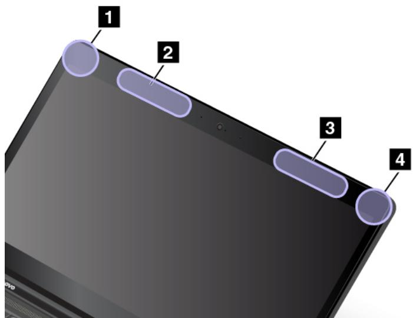

> **AI Description:**
> **Source:** `assets/_page_149_Figure_0.jpg`
> 
> **Generated:** 2026-06-01 23:34:49
> 
> ---
> 
> The image is a technical illustration of a laptop's side view, highlighting four specific components. The diagram includes numbered labels (1, 2, 3, and 4) pointing to different parts of the laptop. Component 1 appears to be a circular feature near the top corner, possibly a speaker or camera. Component 2 is a long, rectangular area, which might be a hinge or a part of the laptop's body. Component 3 is another long, rectangular feature, possibly a speaker or a part of the laptop's body. Component 4 is a circular feature near the bottom corner, which could be a speaker or a camera. The image is designed to provide a visual guide for identifying and understanding the components of the laptop.

1 Wireless-LAN antenna (auxiliary)

2 Wireless-WAN antenna (auxiliary, available on some models)

3 Wireless-WAN antenna (main, available on some models)

4 Wireless-LAN antenna (main)

## Wireless-radio compliance information

Computer models equipped with wireless communications comply with the radio frequency and safety standards of any country or region in which it has been approved for wireless use.

## Brazil wireless-radio compliance information

Este equipamento não tem direito à proteção contra interferência prejudicial e não pode causar interferência em sistemas devidamente autorizados.

This equipment is not protected against harmful interference and may not cause interference with duly authorized systems.

## Mexico wireless-radio compliance information

Advertencia: En Mexico la operación de este equipo estásujeta a las siguientes dos condiciones: (1) es posible que este equipo o dispositivo no cause interferencia perjudicial y (2) este equipo o dispositivo debe aceptar cualquier interferencia, incluyendo la que pueda causar su operación no deseada.

## Locating wireless regulatory notices

For more information about the wireless regulatory notices, refer to the Regulatory Notice shipped with your computer.

If your computer is shipped without the Regulatory Notice, you can find it on the Web site at:

https://support.lenovo.com

## TCO certification

To obtain the TCO certification information for your computer, go to:

https://www.lenovo.com/tco-cert

## Export classification notice

This product is subject to the United States Export Administration Regulations (EAR) and has an Export Classification Control Number (ECCN) of 5A992.c. It can be re-exported except to any of the embargoed countries in the EAR E1 country list.

## Electronic emission notices

## Federal Communications Commission Declaration of Conformity

The following information refers to ThinkPad T480, machine types: 20L5, 20L6.

This equipment has been tested and found to comply with the limits for a Class B digital device, pursuant to Part 15 of the FCC Rules. These limits are designed to provide reasonable protection against harmful interference in a residential installation. This equipment generates, uses, and can radiate radio frequency energy and, if not installed and used in accordance with the instructions, may cause harmful interference to radio communications. However, there is no guarantee that interference will not occur in a particular installation. If this equipment does cause harmful interference to radio or television reception, which can be determined by turning the equipment off and on, the user is encouraged to try to correct the interference by one or more of the following measures:

• Reorient or relocate the receiving antenna.

• Increase the separation between the equipment and receiver.

• Connect the equipment into an outlet on a circuit different from that to which the receiver is connected.

• Consult an authorized dealer or service representative for help.

Lenovo is not responsible for any radio or television interference caused by using other than specified or recommended cables and connectors or by unauthorized changes or modifications to this equipment. Unauthorized changes or modifications could void the user's authority to operate the equipment.

This device complies with Part 15 of the FCC Rules. Operation is subject to the following two conditions: (1) this device may not cause harmful interference, and (2) this device must accept any interference received, including interference that may cause undesired operation.

Responsible Party:

Lenovo (United States) Incorporated

1009 Think Place - Building One

Morrisville, NC 27560

Phone Number: 919-294-5900

# Industry Canada Class B emission compliance statement CAN ICES-3(B)/NMB-3(B)

## European Union conformity

EU Contact: Lenovo, Einsteinova 21, 851 01 Bratislava, Slovakia

EMC Directive Statement: This product is in conformity with the protection requirements of EU Council EMC Directive 2014/30/EU on the approximation of the laws of the Member States relating to electromagnetic compatibility.

This product has been tested and found to comply with the limits for Class B equipment according to European Standards harmonized in the Directives in compliance. The Class B requirements for equipment are intended to offer adequate protection to broadcast services within residential environments.

Radio Equipment Directive Statement: This product is in conformity with all the requirements and essential norms that apply to EU Council Radio Equipment Directive 2014/53/EU on the approximation of the laws of the Member States relating to radio equipment. The full text of the system EU declaration of conformity and the EU wireless module declarations are available at the following Internet addresses:

• For notebook computers: https://www.lenovo.com/eu-doc-notebooks

• For tablets: https://www.lenovo.com/eu-doc-tablets

Lenovo cannot accept responsibility for any failure to satisfy the protection requirements resulting from a non-recommended modification of the product, including the installation of option cards from other manufacturers. This product has been tested and found to comply with the limits for Class B equipment according to European Standards harmonized in the Directives in compliance. The limits for Class B equipment were derived for typical residential environments to provide reasonable protection against interference with licensed communication devices.

## German Class B compliance statement

Deutschsprachiger EU Hinweis:

Hinweis für Geräte der Klasse B EU-Richtlinie zur Elektromagnetischen Verträglichkeit

Dieses Produkt entspricht den Schutzanforderungen der EU-Richtlinie 2014/30/EU zur Angleichung der Rechtsvorschriften über die elektromagnetische Verträglichkeit in den EU-Mitgliedsstaaten und hält die Grenzwerte der Klasse B der Norm gemäß Richtlinie.

Um dieses sicherzustellen, sind die Geräte wie in den Handbüchern beschrieben zu installieren und zu betreiben. Des Weiteren dürfen auch nur von der Lenovo empfohlene Kabel angeschlossen werden. Lenovo übernimmt keine Verantwortung für die Einhaltung der Schutzanforderungen, wenn das Produkt ohne Zustimmung der Lenovo verändert bzw. wenn Erweiterungskomponenten von Fremdherstellern ohne Empfehlung der Lenovo gesteckt/eingebaut werden.

Deutschland:

Einhaltung des Gesetzes über die elektromagnetische Verträglichkeit von Betriebsmitteln

Dieses Produkt entspricht dem „Gesetz über die elektromagnetische Verträglichkeit von Betriebsmitteln“ EMVG (früher „Gesetz über die elektromagnetische Verträglichkeit von Geräten“). Dies ist die Umsetzung der EMV EU-Richtlinie 2014/30/EU in der Bundesrepublik Deutschland.

Zulassungsbescheinigung laut dem Deutschen Gesetz über die elektromagnetische Verträglichkeit von Betriebsmitteln, EMVG vom 20. Juli 2007 (früher Gesetz über die elektromagnetische Verträglichkeit von Geräten), bzw. der EMV EU Richtlinie 2014/30/EU, für Geräte der Klasse B.

Dieses Gerät ist berechtigt, in Übereinstimmung mit dem Deutschen EMVG das EG-Konformitätszeichen - CE - zu führen. Verantwortlich für die Konformitätserklärung nach Paragraf 5 des EMVG ist die Lenovo (Deutschland) GmbH, Meitnerstr. 9, D-70563 Stuttgart.

Informationen in Hinsicht EMVG Paragraf 4 Abs. (1) 4:

Das Gerät erfüllt die Schutzanforderungen nach EN 55024 und EN 55032 Klasse B.

## Japan VCCI Class B compliance statement

の装置、ク情報技術装置で。の装置は家庭環境で使用る事目的とてが、装置かや受機近接て使用る、受障引起あま。取書從正取いで下。VCCI-B

## Japan compliance statement for products which connect to the power mains with rated current less than or equal to 20 A per phase

日本の定格電流力20A/相以下の機器对る高調波電流規制高調波電流規格JISC61000-3-2適合品

## Japan notice for ac power cord

The ac power cord shipped with your product can be used only for this specific product. Do not use the ac power cord for other devices.

本製品おン電源ー属るの他の電機

## Lenovo product service information for Taiwan

委製商/進口商名稱：荷蘭商聯想股份有限公司台灣分公司進口商地址:台北市中山區北安路780號7樓進口商電話:0800-000-702(代表號)

## Eurasian compliance mark

## EA

## Brazil audio notice

Ouvir sons com mais de 85 decibéis por longos períodos pode provocar danos ao sistema auditivo.

## Appendix C. WEEE and recycling statements of countries and regions

This chapter provides environmental information about Lenovo products.

## General recycling information

Lenovo encourages owners of information technology (IT) equipment to responsibly recycle their equipment when it is no longer needed. Lenovo offers a variety of programs and services to assist equipment owners in recycling their IT products. For information about recycling Lenovo products, go to:

https://www.lenovo.com/recycling

The latest environmental information about our products is available at:

https://www.lenovo.com/ecodeclaration

## Important WEEE information

> **AI Description:**
> **Source:** `assets/_page_154_Figure_0.jpg`
> 
> **Generated:** 2026-06-01 23:41:46
> 
> ---
> 
> The image contains a visual symbol indicating that the item depicted should not be disposed of in regular waste bins. The symbol features a trash bin crossed out with two diagonal lines, suggesting that the item should be recycled or disposed of in a specific manner. This is a common symbol used in recycling and waste management to convey the need for proper disposal.

The WEEE marking on Lenovo products applies to countries with WEEE and e-waste regulations (for example, the European WEEE Directive, India E-Waste Management Rules). Appliances are labeled in accordance with local regulations concerning waste electrical and electronic equipment (WEEE). These regulations determine the framework for the return and recycling of used appliances as applicable within each geography. This label is applied to various products to indicate that the product is not to be thrown away, but rather put in the established collection systems for reclaiming these end of life products.

Users of electrical and electronic equipment (EEE) with the WEEE marking must not dispose of end of life EEE as unsorted municipal waste, but use the collection framework available to them for the return, recycle, and recovery of WEEE and to minimize any potential effects of EEE on the environment and human health due to the presence of hazardous substances. Lenovo electrical and electronic equipment (EEE) may contain parts and components, which at end-of-life might qualify as hazardous waste.

EEE and waste electrical and electronic equipment (WEEE) can be delivered free of charge to the place of sale or any distributor that sells electrical and electronic equipment of the same nature and function as the used EEE or WEEE.

For additional WEEE information, go to:

https://www.lenovo.com/recycling

## WEEE information for Hungary

Lenovo, as a producer, bears the cost incurred in connection with the fulfillment of Lenovo’s obligations under Hungary Law No. 197/2014 (VIII.1.) subsections (1)-(5) of section 12.

## Japan recycling statements

## Collecting and recycling a disused Lenovo computer or monitor

If you are a company employee and need to dispose of a Lenovo computer or monitor that is the property of the company, you must do so in accordance with the Law for Promotion of Effective Utilization of Resources. Computers and monitors are categorized as industrial waste and should be properly disposed of by an industrial waste disposal contractor certified by a local government. In accordance with the Law for Promotion of Effective Utilization of Resources, Lenovo Japan provides, through its PC Collecting and Recycling Services, for the collecting, reuse, and recycling of disused computers and monitors. For details, visit the Lenovo Web site at:

## https://www.lenovo.com/recycling/japan

Pursuant to the Law for Promotion of Effective Utilization of Resources, the collecting and recycling of homeused computers and monitors by the manufacturer was begun on October 1, 2003. This service is provided free of charge for home-used computers sold after October 1, 2003. For details, go to:

https://www.lenovo.com/recycling/japan

## Disposing of Lenovo computer components

Some Lenovo computer products sold in Japan may have components that contain heavy metals or other environmental sensitive substances. To properly dispose of disused components, such as a printed circuit board or drive, use the methods described above for collecting and recycling a disused computer or monitor.

## Disposing of disused lithium batteries from Lenovo computers

A button-shaped lithium battery is installed inside your Lenovo computer to provide power to the computer clock while the computer is off or disconnected from the main power source. If you need to replace it with a new one, contact your place of purchase or contact Lenovo for service. If you need to dispose of a disused lithium battery, insulate it with vinyl tape, contact your place of purchase or an industrial-waste-disposal operator, and follow their instructions.

Disposal of a lithium battery must comply with local ordinances and regulations.

## Disposing of a disused battery from Lenovo notebook computers

Your Lenovo notebook computer has a lithium ion battery or a nickel metal hydride battery. If you are a company employee who uses a Lenovo notebook computer and need to dispose of a battery, contact the proper person in Lenovo sales, service, or marketing, and follow that person's instructions. You also can refer to the instructions at:

## https://www.lenovo.com/jp/ja/environment/recycle/battery/

If you use a Lenovo notebook computer at home and need to dispose of a battery, you must comply with local ordinances and regulations. You also can refer to the instructions at:

https://www.lenovo.com/jp/ja/environment/recycle/battery/

## Recycling information for Brazil

Declarações de Reciclagem no Brasil

Descarte de um Produto Lenovo Fora de Uso

Equipamentos elétricos e eletrônicos não devem ser descartados em lixo comum, mas enviados à pontos de coleta, autorizados pelo fabricante do produto para que sejam encaminhados e processados por empresas especializadas no manuseio de resíduos industriais, devidamente certificadas pelos orgãos ambientais, de acordo com a legislação local.

A Lenovo possui um canal específico para auxiliá-lo no descarte desses produtos. Caso você possua um produto Lenovo em situação de descarte, ligue para o nosso SAC ou encaminhe um e-mail para: reciclar@lenovo.com, informando o modelo, número de série e cidade, a fim de enviarmos as instruções para o correto descarte do seu produto Lenovo.

## Battery recycling information for the European Union EU

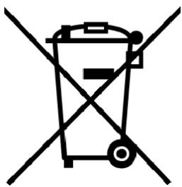

> **AI Description:**
> **Source:** `assets/_page_156_Figure_0.jpg`
> 
> **Generated:** 2026-06-01 23:36:07
> 
> ---
> 
> The image contains a single visual element: a diagram of a trash bin with a diagonal line crossing it out. This symbol is commonly used to indicate that the item should not be disposed of in the regular trash bin. It suggests that the item should be recycled or disposed of in a specific manner, typically in a designated recycling bin or collection point.

Notice: This mark applies only to countries within the European Union (EU).

Batteries or packaging for batteries are labeled in accordance with European Directive 2006/66/EC concerning batteries and accumulators and waste batteries and accumulators. The Directive determines the framework for the return and recycling of used batteries and accumulators as applicable throughout the European Union. This label is applied to various batteries to indicate that the battery is not to be thrown away, but rather reclaimed upon end of life per this Directive.

In accordance with the European Directive 2006/66/EC, batteries and accumulators are labeled to indicate that they are to be collected separately and recycled at end of life. The label on the battery may also include a chemical symbol for the metal concerned in the battery (Pb for lead, Hg for mercury, and Cd for cadmium). Users of batteries and accumulators must not dispose of batteries and accumulators as unsorted municipal waste, but use the collection framework available to customers for the return, recycling, and treatment of batteries and accumulators. Customer participation is important to minimize any potential effects of batteries and accumulators on the environment and human health due to the potential presence of hazardous substances.

Before placing electrical and electronic equipment (EEE) in the waste collection stream or in waste collection facilities, the end user of equipment containing batteries and/or accumulators must remove those batteries and accumulators for separate collection.

## Disposing of lithium batteries and battery packs from Lenovo products

A coin-cell type lithium battery might be installed inside your Lenovo product. You can find details about the battery in the product documentation. If the battery needs to be replaced, contact your place of purchase or

contact Lenovo for service. If you need to dispose of a lithium battery, insulate it with vinyl tape, contact your place of purchase or a waste-disposal operator, and follow their instructions.

## Disposing of battery packs from Lenovo products

Your Lenovo device might contain a lithium-ion battery pack or a nickel metal hydride battery pack. You can find details on the battery pack in the product documentation. If you need to dispose of a battery pack, insulate it with vinyl tape, contact Lenovo sales, service, or your place of purchase, or a waste-disposal operator, and follow their instructions. You also can refer to the instructions provided in the user guide for your product.

For proper collection and treatment, go to:

https://www.lenovo.com/lenovo/environment

## Battery recycling information for Taiwan

廢電池請回收

## Battery recycling information for the United States and Canada

US & Canada Only

## Recycling information for China

《废弃电器电子产品回收处理管理条例》提示性说明

联想鼓励拥有联想品牌产品的用户当不再需要此类产品时，遵守国家废弃电器电子产品回收处理相关法律法规，将其交给当地具有国家认可的回收处理资质的厂商进行回收处理。更多回收服务信息，请点击进入http://support.lenovo.com.cn/activity/551.htm

# Appendix D. Restriction of Hazardous Substances (RoHS) Directive of countries and regions

The latest environmental information about Lenovo products is available at:

https://www.lenovo.com/ecodeclaration

## European Union RoHS

This Lenovo product, with included parts (cables, cords, and so on) meets the requirements of Directive 2011/65/EU on the restriction of the use of certain hazardous substances in electrical and electronic equipment ("RoHS recast" or "RoHS 2").

For more information about Lenovo worldwide compliance on RoHS, go to:

https://www.lenovo.com/rohs-communication

## Turkish RoHS

The Lenovo product meets the requirements of the Republic of Turkey Directive on the Restriction of the Use of Certain Hazardous Substances in Waste Electrical and Electronic Equipment (WEEE).

## Türkiye AEEE Yonetmeligine Uygunluk Beyani

Bu Lenovo ürunü,T.C. Cevre ve Orman Bakanligi'nin “Atik Elektrik veElektronik Esyalarda Bazi Zararli Maddelerin Kullaniminin Sinirlandirimasina Dair Yonetmelik (AEEE)" direktiflerine uygundur.

AEEEYonetmeligine Uygundur.

## Ukraine RoHS

LNM niTBepAKyEMO,山O npOAyKuiA JeHOBO BiqnOBinaE BNMOraM HOpMaTNBHNX aKTiB YKpaiHN,Ki O6MeXyIOTb BMiCT He6e3Ne4HNX pe4OBNH

## India RoHS

RoHS compliant as per E-Waste (Management) Rules.

## China RoHS

The information in the following table is applicable for products manufactured on or after January 1, 2015 for sale in the People’s Republic of China.

产品中有害物质的名称及含量

## Appendix E. ENERGY STAR model information

ENERGY STAR® is a joint program of the U.S. Environmental Protection Agency and the U.S. Department of Energy aimed at saving money and protecting the environment through energy efficient products and practices.

Lenovo is proud to offer our customers products with the ENERGY STAR qualified designation. You might find an ENERGY STAR mark affixed on the computer or displayed on the power settings interface. Lenovo computers of the following machine types, if carry an ENERGY STAR mark, have been designed and tested to conform to the ENERGY STAR program requirements for computers.

## 20L5 and 20L6

By using ENERGY STAR qualified products and taking advantage of the power-management features of the computer, you can help reduce the consumption of electricity. Reduced electrical consumption can contribute to potential financial savings, a cleaner environment, and the reduction of greenhouse gas emissions.

For more information about ENERGY STAR, go to:

https://www.energystar.gov

Lenovo encourages you to make efficient use of energy an integral part of your day-to-day operations. To help in this endeavor, Lenovo has preset the following power-management features to take effect when the computer has been inactive for a specified length of time:

Power plan: Default (when plugged into ac power)

• Turn off the display: After 10 minutes

• Put the computer to sleep: After 30 minutes

To awaken the computer from sleep mode, press the Fn key on your keyboard. For more information about these settings, see the Windows help information on the computer.

The Wake on LAN function is enabled when your Lenovo computer is shipped from the factory, and the setting remains valid even when the computer is in sleep mode. If you do not need to have Wake on LAN enabled while the computer is in sleep mode, you can reduce the power consumption and prolong the time in sleep mode, by disabling the setting of Wake on LAN for sleep mode.

To disable the setting of Wake on LAN for sleep mode, do the following:

1. Go to Control Panel and click Hardware and Sound ➙ Device Manager.

2. In the Device Manager window, expand Network adapters.

3. Right-click your network adapter device, and click Properties.

4. Click the Power Management tab.

6. Click OK.

5. Clear the Allow this device to wake the computer check box.

## Appendix F. Notices

Lenovo may not offer the products, services, or features discussed in this document in all countries. Consult your local Lenovo representative for information on the products and services currently available in your area. Any reference to a Lenovo product, program, or service is not intended to state or imply that only that Lenovo product, program, or service may be used. Any functionally equivalent product, program, or service that does not infringe any Lenovo intellectual property right may be used instead. However, it is the user's responsibility to evaluate and verify the operation of any other product, program, or service.

Lenovo may have patents or pending patent programs covering subject matter described in this document. The furnishing of this document does not give you any license to these patents. You can send license inquiries, in writing, to:

Lenovo (United States), Inc.

1009 Think Place - Building One

Morrisville, NC 27560

U.S.A.

Attention: Lenovo Director of Licensing

LENOVO PROVIDES THIS PUBLICATION "AS IS" WITHOUT WARRANTY OF ANY KIND, EITHER EXPRESS OR IMPLIED, INCLUDING, BUT NOT LIMITED TO, THE IMPLIED WARRANTIES OF NON-INFRINGEMENT, MERCHANTABILITY OR FITNESS FOR A PARTICULAR PURPOSE. Some jurisdictions do not allow disclaimer of express or implied warranties in certain transactions, therefore, this statement may not apply to you.

This information could include technical inaccuracies or typographical errors. Changes are periodically made to the information herein; these changes will be incorporated in new editions of the publication. Lenovo may make improvements and/or changes in the product(s) and/or the application(s) described in this publication at any time without notice.

The products described in this document are not intended for use in implantation or other life support applications where malfunction may result in injury or death to persons. The information contained in this document does not affect or change Lenovo product specifications or warranties. Nothing in this document shall operate as an express or implied license or indemnity under the intellectual property rights of Lenovo or third parties. All information contained in this document was obtained in specific environments and is presented as an illustration. The result obtained in other operating environments may vary.

Lenovo may use or distribute any of the information you supply in any way it believes appropriate without incurring any obligation to you.

Any references in this publication to non-Lenovo Web sites are provided for convenience only and do not in any manner serve as an endorsement of those Web sites. The materials at those Web sites are not part of the materials for this Lenovo product, and use of those Web sites is at your own risk.

Any performance data contained herein was determined in a controlled environment. Therefore, the result obtained in other operating environments may vary significantly. Some measurements may have been made on development-level systems and there is no guarantee that these measurements will be the same on generally available systems. Furthermore, some measurements may have been estimated through extrapolation. Actual results may vary. Users of this document should verify the applicable data for their specific environment.

This document is copyrighted by Lenovo and is not covered by any open source license, including any Linux agreement(s) which may accompany software included with this product. Lenovo may update this document at any time without notice.

To obtain the most up-to-date documentation for your computer, go to:

https://support.lenovo.com

## Appendix G. Trademarks

The following terms are trademarks of Lenovo in the United States, other countries, or both:

Access Connections

Lenovo

Lenovo logo

ThinkPad

ThinkPad logo

TrackPoint

UltraConnect

Intel, Intel SpeedStep, Optane, and Thunderbolt are trademarks of Intel Corporation or its subsidiaries in the U.S. and/or other countries.

Microsoft, Windows, Direct3D, BitLocker, and Cortana are trademarks of the Microsoft group of companies.

DisplayPort are trademarks of the Video Electronics Standards Association.

Ubuntu is a registered trademark of Canonical Ltd.

The terms HDMI and HDMI High-Definition Multimedia Interface are trademarks or registered trademarks of HDMI Licensing LLC in the United States and other countries.

Wi-Fi, Wi-Fi Alliance, and Miracast are registered trademarks of Wi-Fi Alliance.

NVIDIA is a registered trademark of NVIDIA Corporation.

USB-C is a trademark of USB Implementers Forum.

Other company, product, and service names may be trademarks or service marks of others.