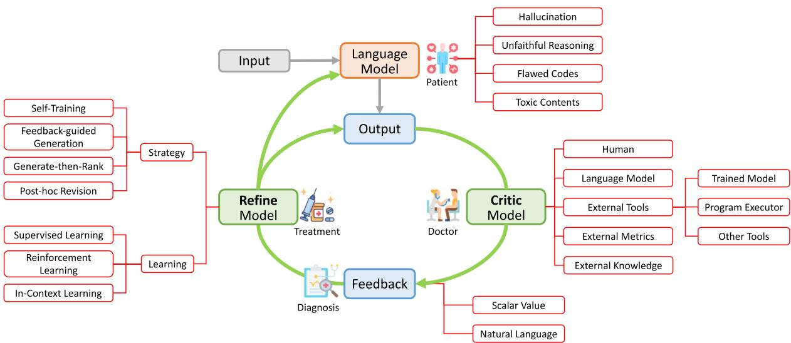
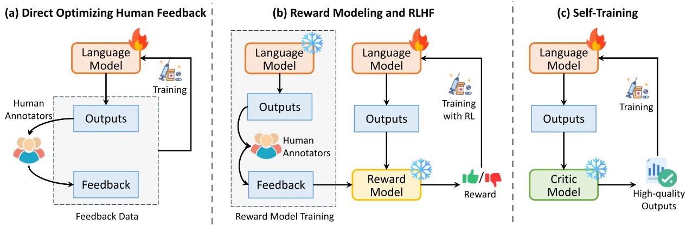
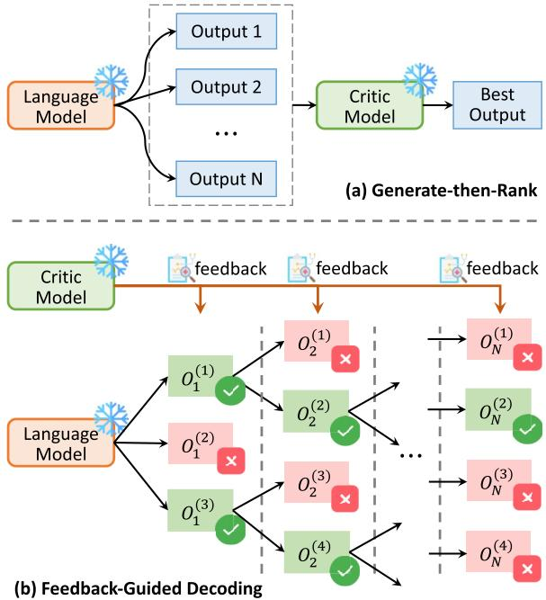
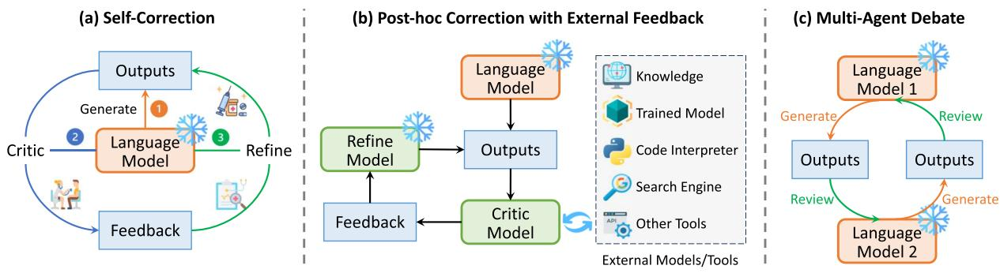

# Automatically Correcting Large Language Models: Surveying the Landscape of Diverse Automated Correction Strategies

Liangming Pan, Michael Saxon, Wenda Xu, Deepak Nathani, Xinyi Wang, William Yang Wang

University of California, Santa Barbara, USA

{liangmingpan, saxon, wendaxu, dnathani, xinyi wang}@ucsb.edu william@cs.ucsb.edu

## Abstract

While large language models (LLMs) have shown remarkable effectiveness in various NLP tasks, they are still prone to issues such as hallucination, unfaithful reasoning, and toxicity. A promising approach to rectify these flaws is correcting LLMs with feedback, where the LLM itself is prompted or guided with feedback to fix problems in its own output. Techniques leveraging automated feedback—either produced by the LLM itself (self-correction) or some external system—are of particular interest as they make LLM-based solutions more practical and deployable with minimal human intervention. This paper provides an exhaustive review of the recent advances in correcting LLMs with automated feedback, categorizing them into training-time, generation-time, and post-hoc approaches. We also identify potential challenges and future directions in this emerging field.

## 1 Introduction

Recent years have seen striking empirical successes of large language models (LLMs), as they consistently obtain impressive results across a diverse range of NLP benchmarks (Guo et al., 2023; Suzgun et al., 2023; Qin et al., 2023), while also showcasing surprising abilities of language understanding (Wei et al., 2022a; Begus et al., 2023), generation (Pu and Demberg, 2023; Lin and Chen, 2023; Lyu et al., 2023a), and reasoning (Wei et al., 2022b; Kojima et al., 2022; Dasgupta et al., 2022). However, these models are not without their flaws. LLMs are observed to intermittently display undesired and inconsistent behaviors such as producing seemingly convincing but inaccurate ‘‘hallucinations’’ (Lin et al., 2022; Zhang et al., 2023c; Min et al., 2023), conducting unfaithful reasoning (Golovneva et al., 2023; Lyu et al.,

2023b; Wu et al., 2023b), generating inappropriate or harmful content (Gehman et al., 2020; Levy et al., 2021, 2022; Shaikh et al., 2023), and failing to trustfully follow rules and constraints (Zhuo et al., 2023; Wang et al., 2023a). Such flawed behaviors hamper the trust in LLMs and pose hurdles to their real-world applications (OpenAI, 2023).

A prevailing strategy to rectify these undesired behaviors of LLMs is learning from feedback, mirroring a typical human learning strategy where individuals actively refine their behaviors through a cycle of trial, error, and correction. Humans, when making mistakes, often gather feedback either from others or through self-reflection (Boyd and Fales, 1983; Metcalfe, 2017; Ferretti et al., 2019; London et al., 2023; Bellhauser et al., 2023). ¨ Such feedback offers valuable insights for humans to correct mistakes and modify their behavior accordingly. Inspired by this natural learning mechanism, extensive research (Huang et al., 2022; Madaan et al., 2023; Gero et al., 2023; Jiang et al., 2023) has been undertaken to improve LLMs through the paradigm of learning from both internal and external feedback.

One popular line of research involves the use of human feedback to evaluate and refine models, as encapsulated in the survey by Fernandes et al. (2023). These methods typically involve direct optimization of LLMs against human feedback on their outputs (Kreutzer et al., 2018; Glaese et al., 2022; Ouyang et al., 2022; Scheurer et al., 2023), where human evaluations of output quality serve as a reward signal to improve model performance. However, this approach has two primary drawbacks: It can be costly due to the manual labor involved, and it lacks real-time capabilities as humans cannot provide instant feedback.

To minimize the need for human intervention, another strategy is correcting LLMs with automated feedback. As illustrated by the conceptual framework in Figure 1, the language model (iteratively) learns from automatically generated feedback signals to understand the consequences of its actions and adapts its behaviors. The source of automated feedback can be multifaceted, spanning from the LLM itself acting as the feedback model (Madaan et al., 2023; Schick et al., 2023), a separately trained feedback model (Yang et al., 2022b; Paul et al., 2023), readily available external tools (Gou et al., 2023; Chen et al., 2023e), to external knowledge sources such as Wikipedia or the internet (Yu et al., 2023; Li et al., 2023b). Various strategies of correction have been proposed, including self-training (Huang et al., 2022; Bai et al., 2022b), generate-then-rank (He et al., 2023; Weng et al., 2023), feedback-guided decoding (Yang et al., 2022a; Xie et al., 2023), iterative post-hoc revision (Zhang et al., 2023a; Jiang et al., 2023), etc. Recently, the incorporation of such strategies has demonstrated their effectiveness across a myriad of tasks, from question answering (Peng et al., 2023) and reasoning (Pan et al., 2023) to code generation (Zhang et al., 2023b) and toxicity detection (Lu et al., 2022).

Figure 1: A conceptual framework for correcting LLMs with automated feedback. We identify three parties involved in the prototypical correction pipeline that are analogous to a patient, doctor, and treatment in medicine, respectively: A Language Model produces initial output, a Critic Model analyzes the output and provides feedback, and a Refine Model provides treatment to either the output or the language model. We taxonomize existing works using this conceptualization along five key aspects: the problem to be corrected, the source and format of the feedback, and the strategy and learning method of the refine model.

> **AI Description:**
> **Source:** `assets/_page_1_Figure_0.jpg`
> 
> **Generated:** 2026-06-02 00:00:37
> 
> ---
> 
> The image is a flowchart depicting a process involving a language model, a refine model, and a critic model. The flowchart illustrates the interaction between these components, showing how an input is processed by the language model to produce an output. This output is then evaluated by the critic model, which provides feedback to the refine model. The refine model uses this feedback to improve the language model, which then processes a new input. The flowchart includes labels such as "Input," "Output," "Refine Model," "Critic Model," "Feedback," and "Treatment." It also categorizes strategies, learning methods, and feedback types, providing a structured overview of the iterative refinement process.

In light of these advancements, our paper aims to provide a comprehensive survey. We start by establishing the concept of correcting LLMs with automated feedback and creating a taxonomy of the different methods (§ 2). We then discuss the major techniques (§ 3), categorized as trainingtime, generation-time, and post-hoc correction. Finally, we discuss the connection to earlier works (§ 4) and five potential future directions (§ 5).

## 2 Conceptual Framework

For clean exposition, we first present a conceptual framework outlining the overall process of correcting LLMs with feedback in Figure 1, using an analogy of medical treatment in our daily life. Three parties are involved in this process:

• Language Model (Patient). A language model M : $\mathcal { X }  \mathcal { V }$ performs a specific task by mapping an input $x \in \mathcal { X }$ to an output text $\hat { y } \in \mathcal { V }$ . This formulation encompasses a wide range of NLP tasks, for example, in summarization, x is a passage, yˆ is the generated summary; for question-answering, x is a question and yˆ is the predicted answer. The initial generation yˆ may have problems such as hallucination and incorrect reasoning.

• Critic Model (Doctor & Diagnosis). A critic model $\mathcal { C } : \mathcal { X } \times \mathcal { Y }  \mathcal { F }$ learns to generate feedback $x , \hat { y } \to c$ where ${ \hat { y } } \sim { \mathcal { M } } ( x )$ is the output or partial output of the language model, and c is the feedback of some format, e.g., scalar value, or natural language. A simple example is binary feedback of whether the output is good or bad given the input $( \mathcal { C } : \mathcal { X } \times \mathcal { Y }  \{ 0 , 1 \} )$ ).

• Refine Model (Treatment). A refine model $\mathcal { R } : \mathcal { X } \times \mathcal { Y } \times \mathcal { F }  \mathcal { Y }$ learns to repair an output $x , \hat { y } , c  y _ { n e w }$ based on the feedback $^ { c , }$ where $y _ { n e w }$ is the revised output. Some refine models directly repair the language model M through fine-tuning or reinforcement learning.

Based on the above formulation, the specific model design in existing works varies along five crucial axes, elaborated in the following sections.

## 2.1 What Gets Corrected?

We summarize the three major error types of LLMs that are targeted for correction in existing works through automated feedback.

• Hallucination. An open challenge for LLMs is that they often hallucinate by making up facts or citing sources that do not exist (Li et al., 2023a; Zhang et al., 2023c). This hallucinated content is often quite plausiblesounding, making it difficult even for humans to detect (Clark et al., 2021). To address this, several studies have proposed the collection of automated feedback on potential factual inaccuracies by cross-referencing the generated output with credible knowledge sources. The gathered feedback can then be utilized by a subsequent refinement model to correct hallucinations (Gao et al., 2023b; Peng et al., 2023).

• Unfaithful Reasoning. A number of recent studies (Ribeiro et al., 2023; Lyu et al., 2023b; Golovneva et al., 2023) found that LLMs occasionally make unfaithful reasoning, i.e., the derived conclusion does not follow the previously generated reasoning chain. To address this, existing works have used automated feedback from external tools or models for guiding the reasoning process (Xie et al., 2023; Yao et al., 2023a), verifying the reasoning process and rectifying errors (He et al., 2023; Pan et al., 2023), or finetuning LLMs with process-based feedback (Huang et al., 2022; Lightman et al., 2023).

• Toxic, Biased, and Harmful Content. LLMs have been observed to occasionally generate content that is toxic, biased, or harmful due to biases present in the training data (Shaikh et al., 2023). To rectify this, reinforcement learning from human feedback (RLHF) (Ouyang et al., 2022; Bai et al., 2022a) has been extensively employed to train LLMs to align more closely with human values, such as being helpful, honest, and harmless. However, RLHF is heavily dependent on high-quality human feedback, the collection of which can be resource-intensive. To alleviate this, recent work (Lu et al., 2022; Gou et al., 2023) has also explored collecting automated feedback to identify and correct potentially harmful outputs.

## 2.2 What Is the Source of the Feedback?

Feedback can be broadly divided into human feedback and automated feedback. Fernandes et al. (2023) provided a survey on integrating human feedback for language generation. In our survey, we focus on the emerging research area of automated feedback, which typically originates from two sources: self-feedback (i.e., the feedback originates from the LLM itself) and external feedback (i.e., the feedback is derived from external models, tools, or knowledge sources).

• Self-Feedback. The LLM can act as its own feedback provider by iteratively assessing and refining its generated outputs until it meets a certain standard (Madaan et al., 2023; Shinn et al., 2023). This continuous self-improvement strategy has proven effective in multiple studies, especially when external feedback is unavailable or limited (Ye et al., 2023; Yan et al., 2023).

• External Feedback for LLMs comes from other models (Yang et al., 2022b; Lightman et al., 2023), tools (Gou et al., 2023; Charalambous et al., 2023), knowledge sources (Gao et al., 2023b; Yu et al., 2023), and evaluation metrics (Jung et al., 2022; Welleck et al., 2023). External feedback provides a valuable outside perspective for identifying errors that the LLM cannot recognize on its own. For example, code interpreters are widely used in programming tasks to provide real-time error messages; while external knowledge sources are used to verify the factual accuracy.

## 2.3 What Is the Format of the Feedback?

The selection of the feedback format requires considering its expressivity, ease of collection, and its potential to improve systems (Fernandes et al., 2023). Automated feedback is commonly either a scalar value or in natural language.

• Scalar Value Feedback. In this scenario, the critic model maps the input and output to a single score $( { \mathcal { C } } : { \mathcal { X } } \times { \mathcal { Y } }  { \mathcal { N } } \subseteq { \mathbb { R } } )$ Scalar value feedback can be easily integrated into the training/decoding process of LLMs. For example, Xie et al. (2023) use real-value feedback for each intermediate reasoning step to guide the model in performing a stochastic beam search for the optimal solution. Despite its flexibility, scalar feedback is less descriptive for detailed corrections.

• Natural Language Feedback provides richer information that can highlight specific errors and provide nuanced suggestions for improvement. This is important for certain applications such as text editing and code generation. For example, Self-Debug (Chen et al., 2023e) uses LLMs to generate explanations for the produced code and utilize both the explanation and the execution results as feedback to enhance coding solutions.

## 2.4 When to Correct the Model?

Depending on the timing of using automated feedback to correct the model, existing work can be divided into three major categories.

• Training-time Correction. The ideal scenario is to rectify a flawed model during training, prior to its deployment for use. Once feedback has been collected, it is directly used to optimize the model parameters. Human feedback is typically used for trainingtime correction, as exemplified by the widely adopted RLHF approach (Ouyang et al., 2022). For leveraging automated feedback, a common strategy is self-training (Huang et al., 2022), where the model is trained with its own generated high-quality output filtered out by the critic model. However, the practical application of training-time correction may be hindered by the infeasibility of fine-tuning giant closed-source LLMs, such as GPT-4 (OpenAI, 2023) and the potential unavailability of feedback during model training.

• Generation-time Correction. It utilizes automated feedback to guide the LLM to correct errors during generation. For example, for proof generation, several studies utilize the automated feedback of the intermediate reasoning steps to guide the model to recover from incorrect generation and search for the optimal solution in a more efficient way (Yang et al., 2022a; Lightman et al., 2023).

• Post-hoc Correction. It refines the model output after it has been generated, without updating the model parameters. This typically involves an iterative process of generating output, receiving feedback, and refining output. Post-hoc correction is more flexible as it does not require training the LLM or accessing its parameters. Furthermore, it facilitates the incorporation of more informative natural language feedback, offering a more transparent and explainable selfcorrection process.

## 2.5 How to Correct the Model with Feedback?

Various concrete strategies have been proposed to correct LLMs with automated feedback, which are tailored to the different dimensions we mentioned in previous sections. For example, selftraining is often used for training-time correction. Generate-then-rank often comes with scalar value feedback. We will cover the comprehensive landscape of self-correction strategies in Section 3.

## 2.6 Summary of Existing Work

Building upon the taxonomy established in the preceding sections, we collate existing work in Table 1 and Table 2. We have three major selection criteria for a work to be included in this survey:

1. Automated Feedback: Explicit feedback is involved to assess the quality of the model output. We focus on automated feedback that originates from external models, metrics, knowledge, etc. However, we will cover some representative works of human feedback for completeness.

2. Model Refinement: The feedback should act as a directive to enhance the LLM, either by:

Table 1: Representative works on Training-time Correction and Generation-Time Correction.

1) updating model parameters, or 2) altering the model’s output during or post the generation.

3. Large Language Model: We primarily focus on automated correction strategies in the era of modern large language models. Given this focus, we mainly emphasize very recent work from 2022 and 2023. However, it is important to acknowledge that the concept of automated correction is not new and has roots in early NLP research. To provide a complete historical perspective, we provide a succinct overview of these initial approaches to automated correction in Section 4.1.

These studies are categorized based on the three strategies introduced in Section 2.4. We also summarize key features of each study, including: 1) the source of feedback, 2) the format of feedback, 3) the strategy and learning method employed for the refinement, 4) whether the refinement process is iterative, and 5) the application of the method.

## 3 Methodologies

In this section, we delve into a detailed review of various correction methodologies. Depending on the time that the correction happens, we categorize them as Training-Time Correction, Generation-Time Correction, and Post-hoc Correction.

## 3.1 Training-Time Correction

Training-time correction rectifies model behavior during the training phase. We identify three typical strategies shown in Figure 2. Each strategy utilizes different forms of feedback to optimize the model during training: human feedback (a), a reward model (b), and automated feedback (c).

Table 2: Representative work on Post-hoc Correction.

Figure 2: Three typical strategies of training-time correction: direct optimization with human feedback (a), training a reward model that approximates human feedback (b), and self-training with automated feedback (c).

> **AI Description:**
> **Source:** `assets/_page_5_Figure_0.jpg`
> 
> **Generated:** 2026-06-02 00:01:22
> 
> ---
> 
> The image contains a flowchart with three main sections labeled (a) Direct Optimizing Human Feedback, (b) Reward Modeling and RLHF, and (c) Self-Training. Each section illustrates a different approach to training a language model using feedback from human annotators. The flowcharts depict the process of collecting human feedback, training the language model, and using the outputs to either directly optimize the model, train a reward model, or train a critic model. Key elements include "Language Model," "Outputs," "Feedback," "Human Annotators," "Reward Model," and "Critic Model." The flowcharts also show the use of training data and the progression from raw outputs to high-quality outputs.

Direct Optimization with Human Feedback. In an ideal scenario, we would directly leverage human feedback to optimize the model parameters, following the framework in Figure 2(a): 1) Candidate outputs are generated by LLMs, 2) Humans provide feedback or refinements on these outputs, and 3) LLMs are then directly optimized on the collected (outputs, feedback) to better align with human preferences. A simple strategy is to fine-tune the model on the outputs that receive positive feedback from human raters (Glaese et al.,

2022; Scheurer et al., 2023; Chen et al., 2023a). However, only utilizing positive-rated data may constrain the model’s ability to identify and correct negative attributes or errors. To address this, Chain-of-Hindsight (Liu et al., 2023a) fine-tunes the LLM on model outputs paired with both positive and negative feedback. Beyond fine-tuning, other optimization methods are explored as well. For example, Gao et al. (2023a) utilize human feedback as the reward signal and optimize the model with contextual bandit learning.

Reward Modeling and RLHF. Direct optimization with human feedback may not always be practical, since collecting human feedback can be both labor-intensive and time-consuming. An efficient alternative is to train a reward model that emulates human feedback. Once trained, this reward model can provide consistent, real-time feedback for every model output, thereby circumventing the need for constant human involvement. A prominent example of this approach is RLHF (Ouyang et al., 2022), as illustrated in Figure 2(b). It first asks human annotators to label the preference for different LLM outputs and then train the reward model to predict the human preference. Afterward, reinforcement learning (RL) algorithms (e.g., Proximal Policy Optimization [Schulman et al., 2017]) are employed to optimize the model. RLHF and its variants have proven effective in correcting LLMs to become more beneficial and less harmful (Bai et al., 2022a), as well as instilling moral correctness (Ganguli et al., 2023).

Self-Training with Automated Feedback. Reward modeling still requires the collection of human feedback. To build a fully autonomous self-improving agent, recent work has adopted the self-training strategy that self-improves LLM by bootstrapping its original outputs, as depicted in Figure 2(c). The language model itself is used to provide feedback for its own output. STaR (Zelikman et al., 2022) leverages the idea of chainof-thought to prompt LLM to generate answers with rationales. They found that the performance of LLM can be improved by iteratively selecting rationales leading to the correct answer to further finetune LLM. Self-training has also been used to reduce the harmful responses of LLMs. For example, in RLAIF (Bai et al., 2022b), the initial toxic responses are criticiqued and revised by the LLM itself following a set of human-defined principles. Afterward, the LLM is fine-tuned on the revised responses. AlpacaFarm (Dubois et al., 2023) further shows that LLMs can self-improve with RL. It designs LLM prompts to simulate human feedback in RLHF and shows that the feedback is effective and greatly reduces the cost.

## 3.2 Generation-Time Correction

Correcting LLMs at training time is ideal but not always feasible because it can be resourceintensive or even impractical for many LLMs, $e . g .$ , closed-source LLMs where weights are inaccessible, and colossal LLMs with billions of parameters. This necessitates generation-time correction methods that correct LLMs during the generation time. Two main strategies are Generate-then-Rank and Feedback-Guided Decoding.

Figure 3: The illustrations of the two typical strategies of generation-time correction: (a) Generate-then-Rank, and (b) Feedback-Guided Decoding.

> **AI Description:**
> **Source:** `assets/_page_6_Figure_0.jpg`
> 
> **Generated:** 2026-06-02 00:00:51
> 
> ---
> 
> The image contains a comparison between two methods of generating and ranking outputs: "Generate-then-Rank" and "Feedback-Guided Decoding." It is a diagram with two main sections, each illustrating a different approach. 
> 
> - The "Generate-then-Rank" method shows a language model generating multiple outputs, which are then ranked by a critic model to determine the best output.
> - The "Feedback-Guided Decoding" method illustrates a more iterative process where the critic model provides feedback to the language model, which then refines its outputs based on this feedback. This process is repeated until the best output is identified.
> 
> Key elements include the language model, critic model, outputs, and feedback arrows, all depicted in a flowchart-like structure. The diagram highlights the iterative nature of the feedback-guided decoding method compared to the sequential approach of the generate-then-rank method.

Generate-then-Rank. This involves sampling a large number of candidate generations and subsequently picking up the best generation based on the feedback provided by the critic model, as illustrated in Figure 3(a). This approach is often integrated with chain-of-thought prompting (Wei et al., 2022b) to tackle complex reasoning tasks, such as solving math word problems. Given an input problem x, the LLM initially generates multiple candidate solutions $y _ { 1 } , \cdots , y _ { n }$ . Each solution $y _ { i } = [ z _ { i } , a _ { i } ]$ comprises a reasoning path (explanation) $z _ { i }$ leading to the predicted answer $a _ { i }$ . Subsequently, the critic model C assigns a plausibility score $s _ { i }$ to each candidate reasoning path $z _ { i }$ . The best solution is selected from the scored set $( z _ { i } , a _ { i } , s _ { i } ) _ { i = 1 } ^ { n }$ via either ranking or voting.

Various critic models have been used for LLM output verification. DIVERSE (Li et al., 2023d) trains a binary verifier based on DeBERTa (He et al., 2021) to rate each reasoning path. Weng et al. (2023) introduced a training-free critic model based on the consistency between forward and backward reasoning. In a different vein, RR (He et al., 2023) used a critic model to assess reasoning path faithfulness by retrieving supporting information from a knowledge base. In code generation, LEVER (Ni et al., 2023) uses a verifier trained on program execution results. CodeT (Chen et al., 2023b) similarly employs dual execution agreement to select the best code solution.

Feedback-Guided Decoding. Despite its efficiency, the generate-then-rank strategy has several limitations: 1) The critic model provides only coarse-grained, output-level feedback, 2) The long length of the output can complicate its quality assessment, and 3) It requires the LLM to wait until the entire output is generated for any corrections.

The feedback-guided decoding strategy shown in Figure 3(b) overcomes the above limitations by using step-level feedback for fine-grained control during generation. Each output y is split into multiple reasoning steps $y = [ o _ { 1 } , o _ { 2 } , \cdot \cdot \cdot , o _ { n } ]$ . A critic model evaluates each step $o _ { t } ,$ guiding algorithms like beam search to explore the output space systematically and correct early mistakes. This strategy also helps alleviate the reasoning inconsistency problem (Zelikman et al., 2022; Creswell and Shanahan, 2022), i.e., incorrect reasoning leads to correct final answer. This strategy has been adopted in recent works like Tree-of-Thought (Yao et al., 2023a), GRACE (Khalifa et al., 2023), and RAP (Hao et al., 2023), which vary mainly in the critic model they employ, categorized into methods involving human feedback, trained verifiers, external metrics, external knowledge, and self-evaluation.

• Reward Model from Human Feedback: Studies like Uesato et al. (2022) and Lightman et al. (2023) collect human-annotated steplevel feedback to train a more robust reward model, which improves reasoning faithfulness.

• Trained Verifier: To reduce the cost of human annotations, some work (Yang et al., 2022a; Tafjord et al., 2022; Li et al., 2023d; Khalifa et al., 2023) uses automated methods to generate training data for obtaining a step-wise verifier. Positive examples are derived from ground-truth reasoning paths, while negative examples are synthesized by proposing an alignment algorithm (Khalifa et al., 2023) or by making text perturbations on positive samples (Yang et al., 2022a).

• External Metric: Several studies also leverage external metrics to re-rank or guide text generation without additional model training, such as using minimum Bayes risk decoding (Freitag et al., 2022), attribute classifiers (Dathathri et al., 2020; Yang and Klein, 2021), and Gaussian denoising (Li et al., 2022).

• External Knowledge: External knowledge sources have also been used to provide feedback. Varshney et al. (2023) use Wikipedia to validate and correct each generated sentence, which is then reinserted for further generation. Alternatively, MemPrompt (Madaan et al., 2022) utilizes a pool of prior user feedback to guide the text generation based on the current query’s intent.

• Self-Evaluation: For better flexibility, methods such as Tree-of-Thought (Yao et al., 2023a) and Guided-decoding (Xie et al., 2023) use the LLM itself as the critic model by prompting it to evaluate each individual reasoning step, avoiding the need for fine-tuning task-specific verifier.

Different strategies are adopted to control the decoding process with the help of the step-level critic model. Tree-of-Thought uses breadth-first and depth-first searches, while GRACE (Khalifa et al., 2023) and Xie et al. (2023) employ beam search. CoRe (Zhu et al., 2023) and RAP (Hao et al., 2023) use Monte Carlo Tree Search for a balance between exploration and exploitation.

## 3.3 Post-hoc Correction

The effectiveness of generation-time correction hinges on the critic model’s ability to give precise feedback for intermediate outputs, a challenging task in holistic NLP evaluations like summarization. This motivates the post-hoc correction methods, where both critic and refinement models act only after generating the complete output. Posthoc correction allows for more diverse natural language feedback, ranging from specific diagnostic reports to broader writing suggestions. As shown in Figure 4, we categorize the key post-hoc correction strategies into Self-Correction, Correction with External Feedback, and Multi-Agent Debate.

Figure 4: Three post-hoc correction strategies: self-correction (a), external feedback (b), multi-agent debate (c).

> **AI Description:**
> **Source:** `assets/_page_8_Figure_0.jpg`
> 
> **Generated:** 2026-06-02 00:01:07
> 
> ---
> 
> The image is a flowchart that illustrates three different approaches to improving the performance of a language model: (a) Self-Correction, (b) Post-hoc Correction with External Feedback, and (c) Multi-Agent Debate. 
> 
> - **Self-Correction** (a) shows a loop where the language model generates outputs, a critic provides feedback, and the model refines its outputs based on the feedback.
> 
> - **Post-hoc Correction with External Feedback** (b) depicts a more complex process where the language model generates outputs, which are then refined by a critic model that uses external tools like a knowledge base, trained model, code interpreter, search engine, and other tools to provide feedback.
> 
> - **Multi-Agent Debate** (c) illustrates a scenario where two language models generate outputs, which are then reviewed and refined by each other, creating a collaborative feedback loop.
> 
> The flowchart uses arrows to indicate the direction of information flow and labels to describe the components and processes involved in each approach.

Self-Correction. In ‘‘Self-Correction’’, a single LLM both generates and refines its output. As shown in Figure 4(a), the LLM first produces an output and then acts as its critic for iterative refinements. This process continues until the output obtains an acceptable quality or a pre-specified number of iterations is reached. Self-Refine (Madaan et al., 2023) introduced an effective framework using one LLM guided by varied prompts for the roles of generation, critic, and refinement, respectively. Clinical Self-Verification (Gero et al., 2023) applies this to extract clinical data, refining by spotting missing elements and verifying data accuracy. Reflexion (Shinn et al., 2023) extends the method, adding a ‘‘long-term memory’’ to recall past errors and integrating diverse feedback forms.

Though beneficial in many text-generation tasks, self-correction usually demands powerful, large-scale LLMs for effectiveness, which sacrifices efficiency. As observed by Madaan et al. (2023), smaller models often falter in refining, even with correct feedback. A possible solution involves explicitly training models for this selfcorrection process. SelFee (Ye et al., 2023) proposes training a model to emulate the self-correction process by generating output, feedback, and a refined solution in an auto-regressive manner. They use more powerful LLMs to provide feedback and refinement data, with data collection facilitated through ChatGPT.

Models/Tools as Feedback. In self-correction, the quality of the feedback is constrained by the inherent limitations of LLMs, such as the inability to access up-to-date information, take actions, or perform precise mathematical reasoning. To enhance feedback quality, recent research leverages external tools, as shown in Figure 4(b). These tools, including trained models, code interpreters, and search engines, offer specialized feedback to address LLM constraints.

• Code Interpreter. In code generation, models like Self-Edit (Zhang et al., 2023a) and Self-Evolve employ program executors to provide feedback from executed test cases. Others, like Self-Debug (Chen et al., 2023e) and ALGO (Zhang et al., 2023b), explore detailed feedback mechanisms using unit tests, program explanations, or comparison with reference oracle programs. Charalambous et al. (2023) use Bounded Model Checking for software verification.

• Logic Reasoner. Logic-LM (Pan et al., 2023) and Baldur (First et al., 2023) harness external logic reasoners and proof assistants to refine LLM outputs, using error messages as feedback for logical reasoning and theoremproof generation.

• External Knowledge is used to ensure factual accuracy of the output. Models like RARR (Gao et al., 2023b), REFEED (Yu et al., 2023), and LLM-Augmenter (Peng et al., 2023) prompt LLMs to question their outputs. An external retriever then searches for relevant evidence, which is used to refine outputs. FACTOOL (Chern et al., 2023) extends this approach to a wider range of tasks, including code generation, mathematical reasoning, and scientific literature review.

• Trained Model. Research has fine-tuned specialized critic models to provide feedback for iterative refinement alongside more powerful language models. For example, CodeRL (Le et al., 2022) treats program synthesis as a reinforcement learning task and trains a critic model whose output optimizes the main model. REFINER (Paul et al., 2023) uses a critique model to provide feedback on an intermediate representation, suitable for refining larger models like ChatGPT. Similarly, RL4F (Akyurek et al., 2023) trains a ¨ critic via reinforcement learning, fine-tuning it with policy optimization. The effectiveness is gauged by comparing the refined output’s accuracy to ground truth. In adversarial contexts, feedback from content filters can guide the generation of better adversarial examples, like how FLIRT (Mehrabi et al., 2023) leverages image classifier signals to guide LLMs in creating adversarial prompts for audit purposes.

• Integrating Multiple Tools. Broadening the idea of tool-assisted feedback, CRITIC (Gou et al., 2023) unifies various tools, such as code interpreters, search engines, and LLM feedback, offering a multifaceted feedback approach.

## 3.4 Multi-Agent Debate

Besides integrating tools, recent research has also explored the debate approach among multiple LLMs, inspired by the idea that multiple perspectives can converge to an improved solution. Multiple LLM instances debate their individual answers over several rounds, aiming for a consensus.

Du et al. (2023) trialed this in arithmetic reasoning. Agents, or LLM duplicates, present individual solutions and justifications. In the debate phase, these responses are aggregated and used as context for each agent to revise its original answer. After several iterations, they typically reach a consensus, showing superior performance compared to self-correction. PRD (Li et al., 2023c) furthered this by introducing the peer rank algorithm to optimize the consensus process. It considers pairwise preferences between all possible answer pairs from individual LLMs and uses these preferences to generate a final ranking of models.

In addition to reasoning tasks, LM vs LM (Cohen et al., 2023) employed this debate approach for factual error detection, where a generating LLM makes a claim and an examining LLM checks for inaccuracies. Extending its applicability, Fu et al. (2023) mimicked real-world human interactions, like a buyer-seller scenario, showcasing the versatility of multi-agent debates.

## 4 Discussion

## 4.1 Prior Research on Automated Correction

In our survey, we primarily examine the automated correction strategies in the era of modern large language models. However, the idea of ‘‘correcting the model with automated feedback’’ has been a longstanding practice in diverse NLP tasks. Recognizing these early works provides a deeper historical insight into the evolution of selfcorrection methods within NLP. Next, we briefly discuss the NLP applications where automated correction has been effectively implemented, and we discuss how these early works link to the automated correction strategies defined in this survey.

Machine Translation. The concept of post-hoc self-correction has deep roots in the field of machine translation (MT), where it is often called Automatic Post-Editing (APE) (do Carmo et al., 2021). A long line of prior work trains models to fix translation errors by either learning from human correction data (Alabau et al., 2014) or from synthetic training data (Lee et al., 2021). To minimize the cost of data collection, recent work (Chen et al., 2023d; Raunak et al., 2023) has leveraged the in-context learning ability of LLMs for post-editing translations. As well as post-hoc methods, training-time correction (Unanue et al., 2021) and decoding-time correction (Freitag et al., 2022) are also adopted by prior works.

Summarization. The idea of automated model correction has been commonly used in summarization to ensure the factuality of the generated summary. There are two mainstream methods: 1) training-time correction that imposes factuality constraints during training (Liu and Liu, 2021; Wan and Bansal, 2022; Scheurer et al., 2023), and 2) post-hoc correction that post-edits generated summaries to correct factual errors (Falke et al., 2019; Cao et al., 2020; Saunders et al., 2022). Recent work has investigated using RL to refine the model guided by automated feedback from either reward models (Akyurek et al., 2023) or language ¨ models (Pang et al., 2023).

Semantic Parsing. The use of external feedback in semantic parsing, particularly for Text-to-SQL tasks, has shown significant effectiveness. Execution-guided semantic parsing is a notable approach where the feedback from executing partial SQL queries guides the search for plausible complete SQL programs. Additionally, earlier works also explored training separate discriminative models either to rerank the generated SQL queries (Bogin et al., 2019; Kelkar et al., 2020) or to predict specific SQL components (Xu et al., 2017; Yu et al., 2018; Lee, 2019). The effectiveness of these generation-time correction techniques is largely attributable to the ease of defining intermediate feedback in semantic parsing.

Proof Generation. Automated correction has been well studied and implemented for proof generation (Saha et al., 2020; Tafjord et al., 2021). External feedback from natural language inference (NLI) are commonly used to spot errors as a heuristic for correction, and as a means to score the quality (Yang et al., 2022a; Golovneva et al., 2023). However, there are some open questions regarding the quality of NLI-based feedback (Srikanth and Rudinger, 2022; Saxon et al., 2023).

Open-Ended Generation. Post-hoc correction is often adopted to improve the quality of openended text generation (Wang et al., 2017; Holtzman et al., 2018; Sagarkar et al., 2018), such as correcting toxic outputs, enhancing the narrative quality in story generation, and refining response generation in dialogues. For example, Holtzman et al. (2018) proposed a framework to refine the generic, repetitive, and inconsistent texts by composing a committee of discriminators to provide multi-aspect feedback. Given the subjectivity involved in assessing the outputs, recent works started to use detailed, natural language feedback and utilize LLMs for iterative post-hoc refinement.

## 4.2 When Does Automated Correction Work?

Despite the relative infancy of this emerging field, recent studies have explored the efficacy of automated correction in LLMs. Notably, intrinsic self-correction—where the model corrects its initial output based solely on its inherent capabilities—has generally shown disappointing results (Huang et al., 2023; Stechly et al., 2023;

Hong et al., 2023; Tyen et al., 2023; Valmeekam et al., 2023; Ke et al., 2023). Most findings indicate that LLMs struggle to rectify their initial mistakes, and their performance even worsens after self-correction. This issue arises because the quality of the model’s self-generated feedback is bounded by its existing knowledge and abilities. Therefore, internal feedback may not offer any extra advantage for improving the results; it might even steer the model away from the correct answer. Preventing such mis-guidance is crucial for successful self-correction (Huang et al., 2023).

In contrast, the use of external feedback for automated correction has shown more promise. Numerous studies (Pan et al., 2023; Chen et al., 2023a; Gou et al., 2023; Huang et al., 2023) report positive outcomes when LLMs leverage highquality feedback from external sources. However, high-quality external feedback is unavailable in many real-world applications. This constraint narrows down the scope of automated correction to only those tasks where precise and readily obtainable external feedback exists, such as arithmetic reasoning, semantic parsing, and code generation.

The empirical study by Huang et al. (2023) highlighted multi-agent debate as an effective method for automated correction in LLMs. However, the observed improvement primarily stems from the model-driven voting process among different LLMs, rather than from self-correction. This approach represents another successful instance of learning through external feedback, as each LLM benefits from the input provided by other LLMs in the debate.

## 5 Research Gaps and Future Directions

## 5.1 Theoretical Justifications

First of all, whether LLMs can self-correct without any external feedback is still an ongoing debate, with both positive and negative outcomes reported. Numerous studies have discovered that self-correction often brings negative effects (Huang et al., 2023; Tyen et al., 2023), while some research indicates that the effectiveness of selfrepair is only seen in GPT-4 (Olausson et al., 2023). Although these empirical studies provide valuable insights, more fundamental theoretical research is needed to gain a mechanistic understanding of self-correction. Key research questions include: Can LLMs truly recognize their own errors without external feedback? What is the upper bound of intrinsic self-correction? Answers to those questions might closely associated with LLMs’ capacity to exhibit metacognitive awareness, i.e., their understanding of their own knowledge and uncertainties (Kadavath et al., 2022). The concept of calibration—how well a model’s predictions match observed outcomes— is also crucial (Lin et al., 2023).

While language models demonstrate some capacity for self-feedback, achieving superior performance often necessitates incorporating external feedback. This ties into the alignment of language models, an area still not fully understood. For example, in RLHF, the choice of the metric to minimize between the reward model output and the final model output significantly impacts downstream task performance (Go et al., 2023), yet this aspect remains underexplored in many applications. Determining the best approach to auto-generate instructive prompts for tasks like output evaluation is also an open challenge.

## 5.2 Benchmarking Automated Correction

While LLM automated correction has seen empirical advancements across applications, there is a lack of solid quantitative metrics to evaluate this capability. Comprehensive evaluations comparing various strategies on criteria like effectiveness, complexity, and potential limits are still needed. Future studies could develop evaluation frameworks considering variables such as task complexity, degree of initial error, improvement in quality after automated correction, etc.

Setting benchmarks to diagnose automated correction is another potential research avenue. Diagnostic datasets would offer standardized evaluations of LLMs and their correction strategies, fostering the development of more precise models.

## 5.3 Continual Self-Improvement

Another promising yet under-explored area of LLM self-correction is the idea of continual, life-long self-improvement. As LLMs are integrated into varied and evolving scenarios, their capacity for sustained adaptability becomes crucial. This mirrors the notion of continual (lifelong) learning (Wang et al., 2023c), suggesting LLMs should consistently assess outputs, rectify mistakes, update knowledge, and adjust decisionmaking.

While recent studies like Huang et al. (2022) and Zelikman et al. (2022) indicate that LLMs can enhance themselves through self-training on positively evaluated outputs, they often focus on a single, one-time correction process. The resilience of this self-training in continuous settings is not well-understood. Continual learning poses challenges like catastrophic forgetting (Kirkpatrick et al., 2016), where new skills impair old ones. It’s uncertain if such issues could plague continually self-improving LLMs, e.g., correcting one behavior may unintentionally alter a previously corrected behavior. Combining various selfcorrection techniques for continual improvement also warrants exploration. Integrating immediate post-hoc corrections with long-cycle training-time corrections—using the former to gather data and the latter to periodically address recurrent problems—could be a promising approach.

## 5.4 Self-Correction with Model Editing

Recent advancements in model editing (Sinitsin et al., 2020; Cao et al., 2021; Yao et al., 2023b) aim to adjust the model’s behavior for examples within the editing scope while leaving its performance for out-of-scope examples unaltered. It has been applied to update LLMs’ outdated knowledge (Lee et al., 2022; Onoe et al., 2023) and address false associations (Murty et al., 2022; Tanno et al., 2022). Though effective in adjusting LLMs’ factual knowledge, challenges like limited generalization (Yao et al., 2023b) and unintended side effects persist (Hoelscher-Obermaier et al., 2023).

We believe model editing offers great potential for LLM self-correction. It enables accurate, fine-grained corrections without full-scale retraining. Analyzing the impact of these model edits could yield insights into self-correction. Techniques mitigating model editing’s side effects (Hoelscher-Obermaier et al., 2023) may also enhance self-correction. We anticipate future research to increasingly merge model editing with LLM self-correction, a relatively untouched domain.

## 5.5 Multi-modal Self-Correction

Self-correction strategies have been well-tested on the textual modality, where both the model outputs and the feedback are in textual form. The recent surge in multi-modal data usage, including image, audio, and video modalities, presents enticing opportunities for expansion. These include the exploration of self-correction capabilities within multi-modal LLMs, the incorporation of visual feedback, and improving vision-language tasks through self-correction.

## 6 Conclusion

In this paper, we present a comprehensive survey of self-correcting large language models with automated feedback. We categorize and analyze various self-correction strategies, including training-time, generation-time, and post-hoc corrections. We also connect recent work with prior research and discuss the applicable scenarios for automated correction. Finally, we outline five potential future directions and associated challenges in this field. Our goal with this paper is to provide a comprehensive and useful resource for readers interested in the development of this rapidly evolving domain. To aid in this effort, we create a continually updated reading list in a GitHub repository as follows: https://github.com /teacherpeterpan/self-correction-llm -papers.

## Acknowledgments

This work was supported by the National Science Foundation (award #2048122). The views expressed are those of the authors and do not reflect the official policy or position of the US government. Thanks to Xinyuan Lu for assisting with the Github reading list repo.

## References

- Afra Feyza Akyurek, Ekin Aky ¨ urek, Ashwin ¨ Kalyan, Peter Clark, Derry Tanti Wijaya, and Niket Tandon. 2023. RL4F: Generating natural language feedback with reinforcement learning for repairing model outputs. In Proceedings of the 61st Annual Meeting of the Association for Computational Linguistics (ACL), pages 7716–7733. https://doi.org/10 .18653/v1/2023.acl-long.427
- Vicent Alabau, Christian Buck, Michael Carl, Francisco Casacuberta, Mercedes Garc´ıa-Mart´ınez, Ulrich Germann, Jesus Gonz´ alez-´ Rubio, Robin L. Hill, Philipp Koehn, Luis A. Leiva, Bartolome Mesa-Lao, Daniel Ortiz-´ Mart´ınez, Herve Saint-Amand, German´ Sanchis-Trilles, and Chara Tsoukala. 2014.
- CASMACAT: A computer-assisted translation workbench. In Proceedings of the 14th Conference of the European Chapter of the Association for Computational Linguistics (EACL), pages 25–28. The Association for Computer Linguistics. https://doi.org/10.3115 /v1/E14-2007
- Yuntao Bai, Andy Jones, Kamal Ndousse, Amanda Askell, Anna Chen, Nova DasSarma, Dawn Drain, Stanislav Fort, Deep Ganguli, Tom Henighan, Nicholas Joseph, Saurav Kadavath, Jackson Kernion, Tom Conerly, Sheer El Showk, Nelson Elhage, Zac Hatfield-Dodds, Danny Hernandez, Tristan Hume, Scott Johnston, Shauna Kravec, Liane Lovitt, Neel Nanda, Catherine Olsson, Dario Amodei, Tom B. Brown, Jack Clark, Sam McCandlish, Chris Olah, Benjamin Mann, and Jared Kaplan. 2022a. Training a helpful and harmless assistant with reinforcement learning from human feedback. CoRR, abs/2204.05862.
- Yuntao Bai, Saurav Kadavath, Sandipan Kundu, Amanda Askell, Jackson Kernion, Andy Jones, Anna Chen, Anna Goldie, Azalia Mirhoseini, Cameron McKinnon, Carol Chen, Catherine Olsson, Christopher Olah, Danny Hernandez, Dawn Drain, Deep Ganguli, Dustin Li, Eli Tran-Johnson, Ethan Perez, Jamie Kerr, Jared Mueller, Jeffrey Ladish, Joshua Landau, Kamal Ndousse, Kamile Lukosiute, Liane Lovitt, Michael Sellitto, Nelson Elhage, Nicholas Schiefer, Noem´ı Mercado, Nova DasSarma, Robert Lasenby, Robin Larson, Sam Ringer, Scott Johnston, Shauna Kravec, Sheer El Showk, Stanislav Fort, Tamera Lanham, Timothy Telleen-Lawton, Tom Conerly, Tom Henighan, Tristan Hume, Samuel R. Bowman, Zac Hatfield-Dodds, Ben Mann, Dario Amodei, Nicholas Joseph, Sam McCandlish, Tom Brown, and Jared Kaplan. 2022b. Constitutional AI: harmlessness from AI feedback. CoRR, abs/2212.08073.
- Gasper Begus, Maksymilian Dabkowski, and Ryan Rhodes. 2023. Large linguistic models: Analyzing theoretical linguistic abilities of LLMs. CoRR, abs/2305.00948.
- Henrik Bellhauser, Charlotte Dignath, and Maria ¨ Theobald. 2023. Daily automated feedback enhances self-regulated learning: A longitudinal randomized field experiment. Frontiers in

- Psychology, 14:1125873. https://doi.org /10.3389/fpsyg.2023.1125873, PubMed: 37275690
- Ben Bogin, Matt Gardner, and Jonathan Berant. 2019. Global reasoning over database structures for text-to-SQL parsing. In Proceedings of the 2019 Conference on Empirical Methods in Natural Language Processing and the 9th International Joint Conference on Natural Language Processing (EMNLP-IJCNLP), pages 3659–3664. https://doi.org/10 .18653/v1/D19-1378
- Evelyn M. Boyd and Ann W. Fales. 1983. Reflective learning: Key to learning from experience. Journal of Humanistic Psychology, 23(2):99–117. https://doi.org/10 .1177/0022167883232011
- Meng Cao, Yue Dong, Jiapeng Wu, and Jackie Chi Kit Cheung. 2020. Factual error correction for abstractive summarization models. In Proceedings of the 2020 Conference on Empirical Methods in Natural Language Processing (EMNLP), pages 6251–6258. https://doi.org/10 .18653/v1/2020.emnlp-main.506
- Nicola De Cao, Wilker Aziz, and Ivan Titov. 2021. Editing factual knowledge in language models. In Proceedings of the 2021 Conference on Empirical Methods in Natural Language Processing (EMNLP), pages 6491–6506. https://doi.org/10.18653/v1/2021 .emnlp-main.522
- Yiannis Charalambous, Norbert Tihanyi, Ridhi Jain, Youcheng Sun, Mohamed Amine Ferrag, and Lucas C. Cordeiro. 2023. A new era in software security: Towards self-healing software via large language models and formal verification. CoRR, abs/2305.14752.
- Angelica Chen, Jer´ emy Scheurer, Tomasz Korbak, ´ Jon Ander Campos, Jun Shern Chan, Samuel R. Bowman, Kyunghyun Cho, and Ethan Perez. 2023a. Improving code generation by training with natural language feedback. CoRR, abs/ 2303.16749.
- Bei Chen, Fengji Zhang, Anh Nguyen, Daoguang Zan, Zeqi Lin, Jian-Guang Lou, and Weizhu Chen. 2023b. Codet: Code generation with generated tests. In Proceedings of the 11th International Conference on Learning Representations (ICLR).
- Justin Chih-Yao Chen, Swarnadeep Saha, and Mohit Bansal. 2023c. Reconcile: Round-table conference improves reasoning via consensus among diverse LLMs. CoRR, abs/2309.13007.
- Pinzhen Chen, Zhicheng Guo, Barry Haddow, and Kenneth Heafield. 2023d. Iterative translation refinement with large language models. CoRR, abs/2306.03856.
- Xinyun Chen, Maxwell Lin, Nathanael Scharli, ¨ and Denny Zhou. 2023e. Teaching large language models to self-debug. CoRR, abs/2304 .05128.
- I-Chun Chern, Steffi Chern, Shiqi Chen, Weizhe Yuan, Kehua Feng, Chunting Zhou, Junxian He, Graham Neubig, and Pengfei Liu. 2023. Factool: Factuality detection in generative AI – a tool augmented framework for multi-task and multi-domain scenarios. CoRR, abs/2307 .13528.
- Elizabeth Clark, Tal August, Sofia Serrano, Nikita Haduong, Suchin Gururangan, and Noah A. Smith. 2021. All that’s ‘human’ is not gold: Evaluating human evaluation of generated text. In Processings of the 59th Annual Meeting of the Association for Computational Linguistics (ACL), pages 7282–7296. https://doi.org /10.18653/v1/2021.acl-long.565
- Roi Cohen, May Hamri, Mor Geva, and Amir Globerson. 2023. LM vs LM: Detecting factual errors via cross examination. CoRR, abs/2305 .13281. https://doi.org/10.18653/v1 /2023.emnlp-main.778
- Antonia Creswell and Murray Shanahan. 2022. Faithful reasoning using large language models. CoRR, abs/2208.14271.
- Ishita Dasgupta, Andrew K. Lampinen, Stephanie C. Y. Chan, Antonia Creswell, Dharshan Kumaran, James L. McClelland, and Felix Hill. 2022. Language models show human-like content effects on reasoning. CoRR, abs/2207 .07051.
- Sumanth Dathathri, Andrea Madotto, Janice Lan, Jane Hung, Eric Frank, Piero Molino, Jason Yosinski, and Rosanne Liu. 2020. Plug and play language models: A simple approach to controlled text generation. In Proceedings of the 8th International Conference on Learning Representations (ICLR).

- Felix do Carmo, Dimitar Shterionov, Joss ´ Moorkens, Joachim Wagner, Murhaf Hossari, Eric Paquin, Dag Schmidtke, Declan Groves, and Andy Way. 2021. A review of the stateof-the-art in automatic post-editing. Machine Translation, 35(2):101–143. https://doi .org/10.1007/s10590-020-09252-y, PubMed: 34720417
- Yilun Du, Shuang Li, Antonio Torralba, Joshua B. Tenenbaum, and Igor Mordatch. 2023. Improving factuality and reasoning in language models through multiagent debate. CoRR, abs/2305.14325.
- Yann Dubois, Xuechen Li, Rohan Taori, Tianyi Zhang, Ishaan Gulrajani, Jimmy Ba, Carlos Guestrin, Percy Liang, and Tatsunori B. Hashimoto. 2023. Alpacafarm: A simulation framework for methods that learn from human feedback. CoRR, abs/2305.14387.
- Tobias Falke, Leonardo F. R. Ribeiro, Prasetya Ajie Utama, Ido Dagan, and Iryna Gurevych. 2019. Ranking generated summaries by correctness: An interesting but challenging application for natural language inference. In Proceedings of the 57st Annual Meeting of the Association for Computational Linguistics (ACL), pages 2214–2220. https://doi.org/10 .18653/v1/P19-1213
- Patrick Fernandes, Aman Madaan, Emmy Liu, Antonio Farinhas, Pedro Henrique Martins, ´ Amanda Bertsch, Jose G. C. de Souza, Shuyan ´ Zhou, Tongshuang Wu, Graham Neubig, and Andre F. T. Martins. 2023. Bridging the gap: ´ A survey on integrating (human) feedback for natural language generation. CoRR, abs/2305 .00955. https://doi.org/10.1162/tacl a 00626
- Emanuela Ferretti, Kristina Rohde, Gregory P. Moore, and Thierry Daboval. 2019. Catch the moment: The power of turning mistakes into ‘precious’ learning opportunities. Paediatrics & Child Health, 24(3):156–159. https:// doi.org/10.1093/pch/pxy102, PubMed: 31111832
- Emily First, Markus N. Rabe, Talia Ringer, and Yuriy Brun. 2023. Baldur: Whole-proof generation and repair with large language models. CoRR, abs/2303.04910. https://doi.org /10.1145/3611643.3616243
- Markus Freitag, David Grangier, Qijun Tan, and Bowen Liang. 2022. High quality rather than high model probability: Minimum bayes risk decoding with neural metrics. Transactions of the Association for Computational Linguistics (TACL), pages 811–825. https://doi.org /10.1162/tacl\_a\_00491
- Yao Fu, Hao Peng, Tushar Khot, and Mirella Lapata. 2023. Improving language model negotiation with self-play and in-context learning from AI feedback. CoRR, abs/2305.10142.
- Deep Ganguli, Amanda Askell, Nicholas Schiefer, Thomas I. Liao, Kamile Lukosiute, Anna Chen, Anna Goldie, Azalia Mirhoseini, Catherine Olsson, Danny Hernandez, Dawn Drain, Dustin Li, Eli Tran-Johnson, Ethan Perez, Jackson Kernion, Jamie Kerr, Jared Mueller, Joshua Landau, Kamal Ndousse, Karina Nguyen, Liane Lovitt, Michael Sellitto, Nelson Elhage, Noem´ı Mercado, Nova DasSarma, Oliver Rausch, Robert Lasenby, Robin Larson, Sam Ringer, Sandipan Kundu, Saurav Kadavath, Scott Johnston, Shauna Kravec, Sheer El Showk, Tamera Lanham, Timothy Telleen-Lawton, Tom Henighan, Tristan Hume, Yuntao Bai, Zac Hatfield-Dodds, Ben Mann, Dario Amodei, Nicholas Joseph, Sam McCandlish, Tom Brown, Christopher Olah, Jack Clark, Samuel R. Bowman, and Jared Kaplan. 2023. The capacity for moral self-correction in large language models. CoRR, abs/2302.07459.
- Ge Gao, Hung-Ting Chen, Yoav Artzi, and Eunsol Choi. 2023a. Continually improving extractive QA via human feedback. CoRR, abs/ 2305.12473. https://doi.org/10.18653 /v1/2023.emnlp-main.27
- Luyu Gao, Zhuyun Dai, Panupong Pasupat, Anthony Chen, Arun Tejasvi Chaganty, Yicheng Fan, Vincent Y. Zhao, Ni Lao, Hongrae Lee, Da-Cheng Juan, and Kelvin Guu. 2023b. Rarr: Researching and revising what language models say, using language models. In Proceedings of the 61th Annual Meeting of the Association for Computational Linguistics (ACL). https://doi.org/10.18653/v1 /2023.acl-long.910
- Samuel Gehman, Suchin Gururangan, Maarten Sap, Yejin Choi, and Noah A. Smith. 2020. RealToxicityPrompts: Evaluating neural toxic

- degeneration in language models. In Findings of the Association for Computational Linguistics: EMNLP 2020, pages 3356–3369. https://doi.org/10.18653/v1/2020 .findings-emnlp.301
- Zelalem Gero, Chandan Singh, Hao Cheng, Tristan Naumann, Michel Galley, Jianfeng Gao, and Hoifung Poon. 2023. Self-verification improves few-shot clinical information extraction. CoRR, abs/2306.00024.
- Amelia Glaese, Nat McAleese, Maja Trebacz, John Aslanides, Vlad Firoiu, Timo Ewalds, Maribeth Rauh, Laura Weidinger, Martin J. Chadwick, Phoebe Thacker, Lucy Campbell-Gillingham, Jonathan Uesato, Po-Sen Huang, Ramona Comanescu, Fan Yang, Abigail See, Sumanth Dathathri, Rory Greig, Charlie Chen, Doug Fritz, Jaume Sanchez Elias, Richard Green, Sona Mokra, Nicholas Fernando, Boxi ´ Wu, Rachel Foley, Susannah Young, Iason Gabriel, William Isaac, John Mellor, Demis Hassabis, Koray Kavukcuoglu, Lisa Anne Hendricks, and Geoffrey Irving. 2022. Improving alignment of dialogue agents via targeted human judgements. CoRR, abs/2209.14375.
- Dongyoung Go, Tomasz Korbak, German´ Kruszewski, Jos Rozen, Nahyeon Ryu, and Marc Dymetman. 2023. Aligning language models with preferences through f-divergence minimization. CoRR, abs/2302.08215.
- Olga Golovneva, Moya Chen, Spencer Poff, Martin Corredor, Luke Zettlemoyer, Maryam Fazel-Zarandi, and Asli Celikyilmaz. 2023. ROSCOE: A suite of metrics for scoring stepby-step reasoning. In Proceedings of the 11th International Conference on Learning Representations (ICLR).
- Zhibin Gou, Zhihong Shao, Yeyun Gong, Yelong Shen, Yujiu Yang, Nan Duan, and Weizhu Chen. 2023. CRITIC: Large language models can self-correct with tool-interactive critiquing. CoRR, abs/2305.11738.
- Caglar Gulcehre, Tom Le Paine, Srivatsan Srinivasan, Ksenia Konyushkova, Lotte Weerts, Abhishek Sharma, Aditya Siddhant, Alex Ahern, Miaosen Wang, Chenjie Gu, Wolfgang Macherey, Arnaud Doucet, Orhan Firat, and Nando de Freitas. 2023. Reinforced self-
- training (rest) for language modeling. CoRR, abs/2308.08998.
- Biyang Guo, Xin Zhang, Ziyuan Wang, Minqi Jiang, Jinran Nie, Yuxuan Ding, Jianwei Yue, and Yupeng Wu. 2023. How close is chatgpt to human experts? Comparison corpus, evaluation, and detection. CoRR, abs/2301.07597.
- Shibo Hao, Yi Gu, Haodi Ma, Joshua Jiahua Hong, Zhen Wang, Daisy Zhe Wang, and Zhiting Hu. 2023. Reasoning with language model is planning with world model. CoRR, abs/2305.14992. https://doi.org/10 .18653/v1/2023.emnlp-main.507
- Hangfeng He, Hongming Zhang, and Dan Roth. 2023. Rethinking with retrieval: Faithful large language model inference. CoRR, abs/2301 .00303.
- Pengcheng He, Xiaodong Liu, Jianfeng Gao, and Weizhu Chen. 2021. Deberta: Decodingenhanced bert with disentangled attention. In Proceedings of The 9th International Conference on Learning Representations (ICLR).
- Alec Helbling, Mansi Phute, Matthew Hull, and Duen Horng Chau. 2023. LLM self defense: By self examination, LLMs know they are being tricked. CoRR, abs/2308.07308.
- Jason Hoelscher-Obermaier, Julia Persson, Esben Kran, Ioannis Konstas, and Fazl Barez. 2023. Detecting edit failures in large language models: An improved specificity benchmark. In Findings of the Association for Computational Linguistics: ACL 2023, pages 11548–11559. https://doi.org/10.18653/v1/2023 .findings-acl.733
- Ari Holtzman, Jan Buys, Maxwell Forbes, Antoine Bosselut, David Golub, and Yejin Choi. 2018. Learning to write with cooperative discriminators. In Proceedings of the 56th Annual Meeting of the Association for Computational Linguistics (ACL), pages 1638–1649. https://doi.org/10.18653/v1/P18 -1152
- Ruixin Hong, Hongming Zhang, Xinyu Pang, Dong Yu, and Changshui Zhang. 2023. A closer look at the self-verification abilities of large language models in logical reasoning. CoRR, abs/2311.07954.

- Jie Huang, Xinyun Chen, Swaroop Mishra, Huaixiu Steven Zheng, Adams Wei Yu, Xinying Song, and Denny Zhou. 2023. Large language models cannot self-correct reasoning yet. CoRR, abs/2310.01798.
- Jiaxin Huang, Shixiang Shane Gu, Le Hou, Yuexin Wu, Xuezhi Wang, Hongkun Yu, and Jiawei Han. 2022. Large language models can self-improve. CoRR, abs/2210.11610. https://doi.org/10.18653/v1/2023 .emnlp-main.67
- Shuyang Jiang, Yuhao Wang, and Yu Wang. 2023. Selfevolve: A code evolution framework via large language models. CoRR, abs/2306.02907.
- Jaehun Jung, Lianhui Qin, Sean Welleck, Faeze Brahman, Chandra Bhagavatula, Ronan Le Bras, and Yejin Choi. 2022. Maieutic prompting: Logically consistent reasoning with recursive explanations. In Proceedings of the 2022 Conference on Empirical Methods in Natural Language Processing (EMNLP), pages 1266–1279. https://doi.org/10 .18653/v1/2022.emnlp-main.82
- Saurav Kadavath, Tom Conerly, Amanda Askell, Tom Henighan, Dawn Drain, Ethan Perez, Nicholas Schiefer, Zac Hatfield-Dodds, Nova DasSarma, Eli Tran-Johnson, Scott Johnston, Sheer El Showk, Andy Jones, Nelson Elhage, Tristan Hume, Anna Chen, Yuntao Bai, Sam Bowman, Stanislav Fort, Deep Ganguli, Danny Hernandez, Josh Jacobson, Jackson Kernion, Shauna Kravec, Liane Lovitt, Kamal Ndousse, Catherine Olsson, Sam Ringer, Dario Amodei, Tom Brown, Jack Clark, Nicholas Joseph, Ben Mann, Sam McCandlish, Chris Olah, and Jared Kaplan. 2022. Language models (mostly) know what they know. CoRR, abs/2207.05221.
- Pei Ke, Bosi Wen, Zhuoer Feng, Xiao Liu, Xuanyu Lei, Jiale Cheng, Shengyuan Wang, Aohan Zeng, Yuxiao Dong, Hongning Wang, Jie Tang, and Minlie Huang. 2023. CritiqueLLM: Scaling LLM-as-critic for effective and explainable evaluation of large language model generation. CoRR, abs/2311.18702.
- Amol Kelkar, Rohan Relan, Vaishali Bhardwaj, Saurabh Vaichal, and Peter Relan. 2020. Bertrand-dr: Improving text-to-sql using a discriminative re-ranker. CoRR, abs/2002.00557.
- Muhammad Khalifa, Lajanugen Logeswaran, Moontae Lee, Honglak Lee, and Lu Wang. 2023. Discriminator-guided multi-step reasoning with language models. CoRR, abs/2305 .14934.
- Geunwoo Kim, Pierre Baldi, and Stephen McAleer. 2023. Language models can solve computer tasks. CoRR, abs/2303.17491.
- James Kirkpatrick, Razvan Pascanu, Neil C. Rabinowitz, Joel Veness, Guillaume Desjardins, Andrei A. Rusu, Kieran Milan, John Quan, Tiago Ramalho, Agnieszka Grabska-Barwinska, Demis Hassabis, Claudia Clopath, Dharshan Kumaran, and Raia Hadsell. 2016. Overcoming catastrophic forgetting in neural networks. CoRR, abs/1612.00796.
- Takeshi Kojima, Shixiang Shane Gu, Machel Reid, Yutaka Matsuo, and Yusuke Iwasawa. 2022. Large language models are zero-shot reasoners. In Proceedings of the 2022 Annual Conference on Neural Information Processing Systems (NeurIPS).
- Julia Kreutzer, Shahram Khadivi, Evgeny Matusov, and Stefan Riezler. 2018. Can neural machine translation be improved with user feedback? In Proceedings of the 2018 Conference of the North American Chapter of the Association for Computational Linguistics: Human Language Technologies (NAACL-HIT). https:// doi.org/10.18653/v1/N18-3012
- Hung Le, Yue Wang, Akhilesh Deepak Gotmare, Silvio Savarese, and Steven Chu-Hong Hoi. 2022. Coderl: Mastering code generation through pretrained models and deep reinforcement learning. In Proceedings of the Annual Conference on Neural Information Processing Systems (NeurIPS).
- Dongjun Lee. 2019. Clause-wise and recursive decoding for complex and cross-domain text-to-SQL generation. In Proceedings of the 2019 Conference on Empirical Methods in Natural Language Processing and the 9th International Joint Conference on Natural Language Processing (EMNLP-IJCNLP), pages 6045–6051. https://doi.org/10.18653/v1/D19 -1624
- Kyungjae Lee, Wookje Han, Seung-won Hwang, Hwaran Lee, Joonsuk Park, and Sang-Woo Lee. 2022. Plug-and-play adaptation

- for continuously-updated QA. In Findings of the Association for Computational Linguistics: ACL 2022, pages 438–447. https://doi.org /10.18653/v1/2022.findings-acl.37
- WonKee Lee, Baikjin Jung, Jaehun Shin, and Jong-Hyeok Lee. 2021. Adaptation of backtranslation to automatic post-editing for synthetic data generation. In Proceedings of the 16th Conference of the European Chapter of the Association for Computational Linguistics (EACL), pages 3685–3691. https://doi .org/10.18653/v1/2021.eacl-main .322
- Sharon Levy, Emily Allaway, Melanie Subbiah, Lydia Chilton, Desmond Patton, Kathleen McKeown, and William Yang Wang. 2022. SafeText: A benchmark for exploring physical safety in language models. In Proceedings of the 2022 Conference on Empirical Methods in Natural Language Processing (EMNLP), pages 2407–2421. https://doi.org/10 .18653/v1/2022.emnlp-main.154
- Sharon Levy, Michael Saxon, and William Yang Wang. 2021. Investigating memorization of conspiracy theories in text generation. In Findings of the Association for Computational Linguistics: ACL-IJCNLP 2021, pages 4718–4729, Online. Association for Computational Linguistics. https://doi.org/10.18653/v1 /2021.findings-acl.416
- Junyi Li, Xiaoxue Cheng, Wayne Xin Zhao, Jian-Yun Nie, and Ji-Rong Wen. 2023a. Halueval: A large-scale hallucination evaluation benchmark for large language models. CoRR, abs/2305.11747.
- Miaoran Li, Baolin Peng, and Zhu Zhang. 2023b. Self-checker: Plug-and-play modules for fact-checking with large language models. CoRR, abs/2305.14623.
- Ruosen Li, Teerth Patel, and Xinya Du. 2023c. PRD: Peer rank and discussion improve large language model based evaluations. CoRR, abs/ 2307.02762.
- Xiang Li, John Thickstun, Ishaan Gulrajani, Percy Liang, and Tatsunori B. Hashimoto. 2022. Diffusion-lm improves controllable text generation. In Proceedings of the Annual Conference on Neural Information Processing Systems (NeurIPS).
- Yifei Li, Zeqi Lin, Shizhuo Zhang, Qiang Fu, Bei Chen, Jian-Guang Lou, and Weizhu Chen. 2023d. Making language models better reasoners with step-aware verifier. In Proceedings of the 61st Annual Meeting of the Association for Computational Linguistics (ACL), pages 5315–5333. https://doi.org/10 .18653/v1/2023.acl-long.291
- Hunter Lightman, Vineet Kosaraju, Yura Burda, Harrison Edwards, Bowen Baker, Teddy Lee, Jan Leike, John Schulman, Ilya Sutskever, and Karl Cobbe. 2023. Let’s verify step by step. CoRR, abs/2305.20050.
- Stephanie Lin, Jacob Hilton, and Owain Evans. 2022. TruthfulQA: Measuring how models mimic human falsehoods. In Proceedings of the 60th Annual Meeting of the Association for Computational Linguistics (ACL), pages 3214–3252. https://doi.org/10 .18653/v1/2022.acl-long.229
- Yen-Ting Lin and Yun-Nung Chen. 2023. LLM-eval: Unified multi-dimensional automatic evaluation for open-domain conversations with large language models. CoRR, abs/2305.13711.
- Zhen Lin, Shubhendu Trivedi, and Jimeng Sun. 2023. Generating with confidence: Uncertainty quantification for black-box large language models. CoRR, abs/2305.19187.
- Hao Liu, Carmelo Sferrazza, and Pieter Abbeel. 2023a. Chain of hindsight aligns language models with feedback. CoRR, abs/2302.02676.
- Jiacheng Liu, Ramakanth Pasunuru, Hannaneh Hajishirzi, Yejin Choi, and Asli Celikyilmaz. 2023b. Crystal: Introspective reasoners reinforced with self-feedback. In Proceedings of the 2023 Conference on Empirical Methods in Natural Language Processing (EMNLP), pages 11557–11572. https://doi.org/10 .18653/v1/2023.emnlp-main.708
- Yixin Liu and Pengfei Liu. 2021. Simcls: A simple framework for contrastive learning of abstractive summarization. In Proceedings of the 59th Annual Meeting of the Association for Computational Linguistics and the 11th International Joint Conference on Natural Language Processing (ACL/IJCNLP), pages 1065–1072. https://doi.org/10 .18653/v1/2021.acl-short.135

- Manuel London, Valerie I. Sessa, and Loren A. Shelley. 2023. Developing self-awareness: Learning processes for self-and interpersonal growth. Annual Review of Organizational Psychology and Organizational Behavior, 10:261–288. https://doi.org/10.1146 /annurev-orgpsych-120920-044531
- Ximing Lu, Sean Welleck, Jack Hessel, Liwei Jiang, Lianhui Qin, Peter West, Prithviraj Ammanabrolu, and Yejin Choi. 2022. QUARK: Controllable text generation with reinforced unlearning. In Proceedings of the Annual Conference on Neural Information Processing Systems (NeurIPS).
- Chenyang Lyu, Jitao Xu, and Longyue Wang. 2023a. New trends in machine translation using large language models: Case examples with chatgpt. CoRR, abs/2305.01181. https://doi .org/10.18653/v1/2023.emnlp-main.1036
- Qing Lyu, Shreya Havaldar, Adam Stein, Li Zhang, Delip Rao, Eric Wong, Marianna Apidianaki, and Chris Callison-Burch. 2023b. Faithful chain-of-thought reasoning. CoRR, abs/2301.13379. https://doi.org/10.18653 /v1/2023.ijcnlp-main.20
- Aman Madaan, Niket Tandon, Peter Clark, and Yiming Yang. 2022. Memory-assisted prompt editing to improve GPT-3 after deployment. In Proceedings of the 2022 Conference on Empirical Methods in Natural Language Processing (EMNLP), pages 2833–2861. https://doi .org/10.18653/v1/2022.emnlp-main.183
- Aman Madaan, Niket Tandon, Prakhar Gupta, Skyler Hallinan, Luyu Gao, Sarah Wiegreffe, Uri Alon, Nouha Dziri, Shrimai Prabhumoye, Yiming Yang, Sean Welleck, Bodhisattwa Prasad Majumder, Shashank Gupta, Amir Yazdanbakhsh, and Peter Clark. 2023. Selfrefine: Iterative refinement with self-feedback. CoRR, abs/2303.17651.
- Potsawee Manakul, Adian Liusie, and Mark J. F. Gales. 2023. Selfcheckgpt: Zero-resource black-box hallucination detection for generative large language models. CoRR, abs/2303.08896. https://doi.org/10.18653/v1/2023 .emnlp-main.557
- Ninareh Mehrabi, Palash Goyal, Christophe Dupuy, Qian Hu, Shalini Ghosh, Richard Zemel, Kai-Wei Chang, Aram Galstyan, and
- Rahul Gupta. 2023. Flirt: Feedback loop in-context red teaming. CoRR, abs/2308.04265.
- Janet Metcalfe. 2017. Learning from errors. Annual Review of Psychology, 68:465–489. https://doi.org/10.1146/annurev -psych-010416-044022, PubMed: 27648988
- Ning Miao, Yee Whye Teh, and Tom Rainforth. 2023. Selfcheck: Using LLMs to zero-shot check their own step-by-step reasoning. CoRR, abs/2308.00436.
- Sewon Min, Kalpesh Krishna, Xinxi Lyu, Mike Lewis, Wen-tau Yih, Pang Wei Koh, Mohit Iyyer, Luke Zettlemoyer, and Hannaneh Hajishirzi. 2023. Factscore: Fine-grained atomic evaluation of factual precision in long form text generation. CoRR, abs/2305.14251. https://doi.org/10.18653/v1/2023 .emnlp-main.741
- Shikhar Murty, Christopher D. Manning, Scott M. Lundberg, and Marco Tulio Ribeiro. 2022.´ Fixing model bugs with natural language patches. In Proceedings of the 2022 Conference on Empirical Methods in Natural Language Processing (EMNLP), pages 11600–11613. https://doi.org/10.18653/v1/2022 .emnlp-main.797
- Deepak Nathani, David Wang, Liangming Pan, and William Wang. 2023. MAF: Multiaspect feedback for improving reasoning in large language models. In Proceedings of the 2023 Conference on Empirical Methods in Natural Language Processing (EMNLP), pages 6591–6616. https://doi.org/10 .18653/v1/2023.emnlp-main.407
- Ansong Ni, Srini Iyer, Dragomir Radev, Ves Stoyanov, Wen-tau Yih, Sida I. Wang, and Xi Victoria Lin. 2023. LEVER: Learning to verify language-to-code generation with execution. In Proceedings of the 40th International Conference on Machine Learning (ICML).
- Theo X. Olausson, Jeevana Priya Inala, Chenglong Wang, Jianfeng Gao, and Armando Solar-Lezama. 2023. Demystifying GPT selfrepair for code generation. CoRR, abs/2306 .09896.
- Yasumasa Onoe, Michael J. Q. Zhang, Shankar Padmanabhan, Greg Durrett, and Eunsol Choi. 2023. Can lms learn new entities from descriptions? Challenges in propagating injected

- knowledge. In Proceedings of the 61st Annual Meeting of the Association for Computational Linguistics (ACL), pages 5469–5485. https://doi.org/10.18653/v1/2023 .acl-long.300
- OpenAI. 2023. GPT-4 technical report. CoRR, abs/2303.08774.
- Long Ouyang, Jeffrey Wu, Xu Jiang, Diogo Almeida, Carroll L. Wainwright, Pamela Mishkin, Chong Zhang, Sandhini Agarwal, Katarina Slama, Alex Ray, John Schulman, Jacob Hilton, Fraser Kelton, Luke Miller, Maddie Simens, Amanda Askell, Peter Welinder, Paul F. Christiano, Jan Leike, and Ryan Lowe. 2022. Training language models to follow instructions with human feedback. In Proceedings of the Annual Conference on Neural Information Processing Systems (NeurIPS).
- Liangming Pan, Alon Albalak, Xinyi Wang, and William Yang Wang. 2023. Logic-LM: Empowering large language models with symbolic solvers for faithful logical reasoning. CoRR, abs/2305.12295. https://doi.org/10.18653 /v1/2023.findings-emnlp.248
- Jing-Cheng Pang, Pengyuan Wang, Kaiyuan Li, Xiong-Hui Chen, Jiacheng Xu, Zongzhang Zhang, and Yang Yu. 2023. Language model self-improvement by reinforcement learning contemplation. CoRR, abs/2305.14483.
- Debjit Paul, Mete Ismayilzada, Maxime Peyrard, Beatriz Borges, Antoine Bosselut, Robert West, and Boi Faltings. 2023. REFINER: Reasoning feedback on intermediate representations. CoRR, abs/2304.01904.
- Baolin Peng, Michel Galley, Pengcheng He, Hao Cheng, Yujia Xie, Yu Hu, Qiuyuan Huang, Lars Liden, Zhou Yu, Weizhu Chen, and Jianfeng Gao. 2023. Check your facts and try again: Improving large language models with external knowledge and automated feedback. CoRR, abs/2302.12813.
- Dongqi Pu and Vera Demberg. 2023. Chatgpt vs human-authored text: Insights into controllable text summarization and sentence style transfer. In Proceedings of the 61st Annual Meeting of the Association for Computational Linguistics: Student Research Workshop (ACL), pages 1–18.
- Chengwei Qin, Aston Zhang, Zhuosheng Zhang, Jiaao Chen, Michihiro Yasunaga, and Diyi Yang. 2023. Is chatgpt a general-purpose natural language processing task solver? CoRR, abs/2302.06476.
- Vikas Raunak, Amr Sharaf, Hany Hassan Awadallah, and Arul Menezes. 2023. Leveraging GPT-4 for automatic translation postediting. CoRR, abs/2305.14878. https://doi .org/10.18653/v1/2023.findings-emnlp .804
- Danilo Neves Ribeiro, Shen Wang, Xiaofei Ma, Henry Zhu, Rui Dong, Deguang Kong, Juliette Burger, Anjelica Ramos, William Yang Wang, Zhiheng Huang, George Karypis, Bing Xiang, and Dan Roth. 2023. STREET: A multi-task structured reasoning and explanation benchmark. In Proceedings of the 11th International Conference on Learning Representations (ICLR).
- Manasvi Sagarkar, John Wieting, Lifu Tu, and Kevin Gimpel. 2018. Quality signals in generated stories. In Proceedings of the Seventh Joint Conference on Lexical and Computational Semantics (SEM@NAACL-HLT 2018), pages 192–202. https://doi.org/10.18653 /v1/S18-2024
- Swarnadeep Saha, Sayan Ghosh, Shashank Srivastava, and Mohit Bansal. 2020. PRover: Proof generation for interpretable reasoning over rules. In Proceedings of the 2020 Conference on Empirical Methods in Natural Language Processing (EMNLP), pages 122–136. https://doi.org/10.18653/v1/2020 .emnlp-main.9
- William Saunders, Catherine Yeh, Jeff Wu, Steven Bills, Long Ouyang, Jonathan Ward, and Jan Leike. 2022. Self-critiquing models for assisting human evaluators. CoRR, abs/2206 .05802.
- Michael Saxon, Xinyi Wang, Wenda Xu, and William Yang Wang. 2023. PECO: Examining single sentence label leakage in natural language inference datasets through progressive evaluation of cluster outliers. In Proceedings of the 17th Conference of the European Chapter of the Association for Computational Linguistics (EACL), pages 3053–3066. https:// doi.org/10.18653/v1/2023.eacl-main .223

- Jer´ emy Scheurer, Jon Ander Campos, Tomasz ´ Korbak, Jun Shern Chan, Angelica Chen, Kyunghyun Cho, and Ethan Perez. 2023. Training language models with language feedback at scale. CoRR, abs/2303.16755.
- Timo Schick, Jane A. Yu, Zhengbao Jiang, Fabio Petroni, Patrick S. H. Lewis, Gautier Izacard, Qingfei You, Christoforos Nalmpantis, Edouard Grave, and Sebastian Riedel. 2023. PEER: A collaborative language model. In Proceedings of the 11th International Conference on Learning Representations (ICLR).
- John Schulman, Filip Wolski, Prafulla Dhariwal, Alec Radford, and Oleg Klimov. 2017. Proximal policy optimization algorithms. CoRR, abs/1707.06347.
- Omar Shaikh, Hongxin Zhang, William Held, Michael Bernstein, and Diyi Yang. 2023. On second thought, let’s not think step by step! Bias and toxicity in zero-shot reasoning. In Proceedings of the 61st Annual Meeting of the Association for Computational Linguistics (ACL), pages 4454–4470. https://doi.org/10 .18653/v1/2023.acl-long.244
- Noah Shinn, Federico Cassano, Beck Labash, Ashwin Gopinath, Karthik Narasimhan, and Shunyu Yao. 2023. Reflexion: Language agents with verbal reinforcement learning. CoRR, abs/2303.11366.
- Anton Sinitsin, Vsevolod Plokhotnyuk, Dmitry V. Pyrkin, Sergei Popov, and Artem Babenko. 2020. Editable neural networks. In Proceedings of the 8th International Conference on Learning Representations (ICLR).
- Neha Srikanth and Rachel Rudinger. 2022. Partialinput baselines show that NLI models can ignore context, but they don’t. In Proceedings of the 2022 Conference of the North American Chapter of the Association for Computational Linguistics: Human Language Technologies (NAACL-HLT), pages 4753–4763. https:// doi.org/10.18653/v1/2022.naacl-main .350
- Kaya Stechly, Matthew Marquez, and Subbarao Kambhampati. 2023. GPT-4 doesn’t know it’s wrong: An analysis of iterative prompting for reasoning problems. CoRR, abs/2310.12397.
- Mirac Suzgun, Nathan Scales, Nathanael Scharli, ¨ Sebastian Gehrmann, Yi Tay, Hyung Won
- Chung, Aakanksha Chowdhery, Quoc Le, Ed Chi, Denny Zhou, and Jason Wei. 2023. Challenging big-bench tasks and whether chainof-thought can solve them. In Findings of the Association for Computational Linguistics: ACL 2023, pages 13003–13051. https://doi .org/10.18653/v1/2023.findings-acl.824
- Oyvind Tafjord, Bhavana Dalvi, and Peter Clark. 2021. ProofWriter: Generating implications, proofs, and abductive statements over natural language. In Findings of the Association for Computational Linguistics: ACL-IJCNLP 2021, pages 3621–3634. https://doi.org/10 .18653/v1/2021.findings-acl.317
- Oyvind Tafjord, Bhavana Dalvi Mishra, and Peter Clark. 2022. Entailer: Answering questions with faithful and truthful chains of reasoning. In Proceedings of the 2022 Conference on Empirical Methods in Natural Language Processing (EMNLP), pages 2078–2093. https:// doi.org/10.18653/v1/2022.emnlp-main .134
- Ryutaro Tanno, Melanie F. Pradier, Aditya V. Nori, and Yingzhen Li. 2022. Repairing neural networks by leaving the right past behind. In Proceedings of the 2022 Annual Conference on Neural Information Processing Systems (NeurIPS).
- Gladys Tyen, Hassan Mansoor, Peter Chen, Tony Mak, and Victor Carbune. 2023. LLMs cannot find reasoning errors, but can correct them! CoRR, abs/2311.08516.
- Jonathan Uesato, Nate Kushman, Ramana Kumar, H. Francis Song, Noah Y. Siegel, Lisa Wang, Antonia Creswell, Geoffrey Irving, and Irina Higgins. 2022. Solving math word problems with process- and outcome-based feedback. CoRR, abs/2211.14275.
- Inigo Jauregi Unanue, Jacob Parnell, and Massimo Piccardi. 2021. Berttune: Fine-tuning neural machine translation with bertscore. In Proceedings of the 59th Annual Meeting of the Association for Computational Linguistics and the 11th International Joint Conference on Natural Language Processing (ACL/IJCNLP), pages 915–924. https://doi.org/10.18653 /v1/2021.acl-short.115

- Karthik Valmeekam, Matthew Marquez, and Subbarao Kambhampati. 2023. Can large language models really improve by self-critiquing their own plans? CoRR, abs/2310.08118.
- Neeraj Varshney, Wenlin Yao, Hongming Zhang, Jianshu Chen, and Dong Yu. 2023. A stitch in time saves nine: Detecting and mitigating hallucinations of LLMs by validating lowconfidence generation. CoRR, abs/2307.03987.
- David Wan and Mohit Bansal. 2022. Factpegasus: Factuality-aware pre-training and fine-tuning for abstractive summarization. In Proceedings of the 2022 Conference of the North American Chapter of the Association for Computational Linguistics: Human Language Technologies (NAACL-HLT), pages 1010–1028. https:// doi.org/10.18653/v1/2022.naacl-main .74
- Boxin Wang, Weixin Chen, Hengzhi Pei, Chulin Xie, Mintong Kang, Chenhui Zhang, Chejian Xu, Zidi Xiong, Ritik Dutta, Rylan Schaeffer, Sang T. Truong, Simran Arora, Mantas Mazeika, Dan Hendrycks, Zinan Lin, Yu Cheng, Sanmi Koyejo, Dawn Song, and Bo Li. 2023a. Decodingtrust: A comprehensive assessment of trustworthiness in GPT models. CoRR, abs/2306.11698.
- Haotian Wang, Xiyuan Du, Weijiang Yu, Qianglong Chen, Kun Zhu, Zheng Chu, Lian Yan, and Yi Guan. 2023b. Apollo’s oracle: Retrieval-augmented reasoning in multi-agent debates. CoRR, abs/2312.04854.
- Liyuan Wang, Xingxing Zhang, Hang Su, and Jun Zhu. 2023c. A comprehensive survey of continual learning: Theory, method and application. CoRR, abs/2302.00487.
- Tong Wang, Ping Chen, and Boyang Li. 2017. Predicting the quality of short narratives from social media. In Proceedings of the Twenty-Sixth International Joint Conference on Artificial Intelligence (IJCAI), pages 3859–3865. https://doi.org/10.24963/ijcai.2017 /539
- Jason Wei, Yi Tay, Rishi Bommasani, Colin Raffel, Barret Zoph, Sebastian Borgeaud, Dani Yogatama, Maarten Bosma, Denny Zhou, Donald Metzler, Ed H. Chi, Tatsunori Hashimoto, Oriol Vinyals, Percy Liang, Jeff Dean, and William Fedus. 2022a. Emergent
- abilities of large language models. CoRR, abs/2206.07682.
- Jason Wei, Xuezhi Wang, Dale Schuurmans, Maarten Bosma, Brian Ichter, Fei Xia, Ed H. Chi, Quoc V. Le, and Denny Zhou. 2022b. Chain-of-thought prompting elicits reasoning in large language models. In Proceedings of the Annual Conference on Neural Information Processing Systems (NeurIPS).
- Sean Welleck, Ximing Lu, Peter West, Faeze Brahman, Tianxiao Shen, Daniel Khashabi, and Yejin Choi. 2023. Generating sequences by learning to self-correct. In Proceedings of The 11th International Conference on Learning Representations (ICLR).
- Yixuan Weng, Minjun Zhu, Fei Xia, Bin Li, Shizhu He, Kang Liu, and Jun Zhao. 2023. Large language models are better reasoners with self-verification. CoRR, abs/2212.09561. https://doi.org/10.18653/v1/2023 .findings-emnlp.167
- Zeqiu Wu, Yushi Hu, Weijia Shi, Nouha Dziri, Alane Suhr, Prithviraj Ammanabrolu, Noah A. Smith, Mari Ostendorf, and Hannaneh Hajishirzi. 2023a. Fine-grained human feedback gives better rewards for language model training. CoRR, abs/2306.01693.
- Zhaofeng Wu, Linlu Qiu, Alexis Ross, Ekin Akyurek, Boyuan Chen, Bailin Wang, Najoung ¨ Kim, Jacob Andreas, and Yoon Kim. 2023b. Reasoning or reciting? Exploring the capabilities and limitations of language models through counterfactual tasks. CoRR, abs/2307.02477.
- Yuxi Xie, Kenji Kawaguchi, Yiran Zhao, Xu Zhao, Min-Yen Kan, Junxian He, and Qizhe Xie. 2023. Decomposition enhances reasoning via self-evaluation guided decoding. CoRR, abs/2305.00633.
- Wenda Xu, Danqing Wang, Liangming Pan, Zhenqiao Song, Markus Freitag, William Yang Wang, and Lei Li. 2023. INSTRUCTSCORE: Towards explainable text generation evaluation with automatic feedback. CoRR, abs/2305 .14282. https://doi.org/10.18653/v1 /2023.emnlp-main.365
- Xiaojun Xu, Chang Liu, and Dawn Song. 2017. Sqlnet: Generating structured queries from

- natural language without reinforcement learning. CoRR, abs/1711.04436.
- Hao Yan, Saurabh Srivastava, Yintao Tai, Sida I. Wang, Wen-tau Yih, and Ziyu Yao. 2023. Learning to simulate natural language feedback for interactive semantic parsing. In Proceedings of the 61th Annual Meeting of the Association for Computational Linguistics (ACL), pages 3149–3170. https://doi.org/10 .18653/v1/2023.acl-long.177
- Kaiyu Yang, Jia Deng, and Danqi Chen. 2022a. Generating natural language proofs with verifier-guided search. In Proceedings of the 2022 Conference on Empirical Methods in Natural Language Processing (EMNLP), pages 89–105. https://doi.org/10.18653 /v1/2022.emnlp-main.7
- Kevin Yang and Dan Klein. 2021. FUDGE: Controlled text generation with future discriminators. In Proceedings of the 2021 Conference of the North American Chapter of the Association for Computational Linguistics: Human Language Technologies (NAACL-HLT), pages 3511–3535. https://doi.org/10 .18653/v1/2021.naacl-main.276
- Kevin Yang, Yuandong Tian, Nanyun Peng, and Dan Klein. 2022b. Re3: Generating longer stories with recursive reprompting and revision. In Proceedings of the 2022 Conference on Empirical Methods in Natural Language Processing (EMNLP), pages 4393–4479. https://doi.org/10.18653/v1/2022 .emnlp-main.296
- Shunyu Yao, Dian Yu, Jeffrey Zhao, Izhak Shafran, Thomas L. Griffiths, Yuan Cao, and Karthik Narasimhan. 2023a. Tree of thoughts: Deliberate problem solving with large language models. CoRR, abs/2305.10601.
- Yunzhi Yao, Peng Wang, Bozhong Tian, Siyuan Cheng, Zhoubo Li, Shumin Deng, Huajun Chen, and Ningyu Zhang. 2023b. Editing large language models: Problems, methods, and opportunities. CoRR, abs/2305.13172.
- Seonghyeon Ye, Yongrae Jo, Doyoung Kim, Sungdong Kim, Hyeonbin Hwang, and Minjoon Seo. 2023. Selfee: Iterative self-revising LLM empowered by self-feedback generation. Blog post.
- Tao Yu, Michihiro Yasunaga, Kai Yang, Rui Zhang, Dongxu Wang, Zifan Li, and Dragomir Radev. 2018. SyntaxSQLNet: Syntax tree networks for complex and crossdomain text-to-SQL task. In Proceedings of the 2018 Conference on Empirical Methods in Natural Language Processing (EMNLP), pages 1653–1663. https://doi.org/10 .18653/v1/D18-1193
- Wenhao Yu, Zhihan Zhang, Zhenwen Liang, Meng Jiang, and Ashish Sabharwal. 2023. Improving language models via plug-and-play retrieval feedback. CoRR, abs/2305.14002.
- Weizhe Yuan, Kyunghyun Cho, and Jason Weston. 2023. System-level natural language feedback. CoRR, abs/2306.13588.
- Eric Zelikman, Yuhuai Wu, Jesse Mu, and Noah D. Goodman. 2022. Star: Bootstrapping reasoning with reasoning. In Proceedings of the Annual Conference on Neural Information Processing Systems (NeurIPS).
- Kechi Zhang, Zhuo Li, Jia Li, Ge Li, and Zhi Jin. 2023a. Self-edit: Fault-aware code editor for code generation. CoRR, abs/2305.04087. https://doi.org/10.18653/v1/2023 .acl-long.45
- Kexun Zhang, Danqing Wang, Jingtao Xia, William Yang Wang, and Lei Li. 2023b. Algo: Synthesizing algorithmic programs with generated oracle verifiers. CoRR, abs/2305.14591.
- Muru Zhang, Ofir Press, William Merrill, Alisa Liu, and Noah A. Smith. 2023c. How language model hallucinations can snowball. CoRR, abs/2305.13534.
- Xinyu Zhu, Junjie Wang, Lin Zhang, Yuxiang Zhang, Yongfeng Huang, Ruyi Gan, Jiaxing Zhang, and Yujiu Yang. 2023. Solving math word problems via cooperative reasoning induced language models. In Processings of the 61th Annual Meeting of the Association for Computational Linguistics (ACL), pages 4471–4485. https://doi.org/10 .18653/v1/2023.acl-long.245
- Terry Yue Zhuo, Yujin Huang, Chunyang Chen, and Zhenchang Xing. 2023. Red teaming chatgpt via jailbreaking: Bias, robustness, reliability and toxicity. CoRR, abs/2301.12867.