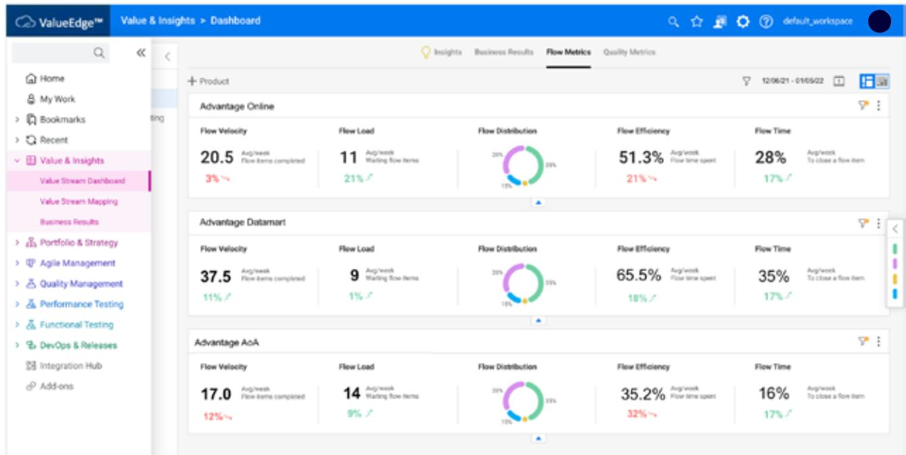
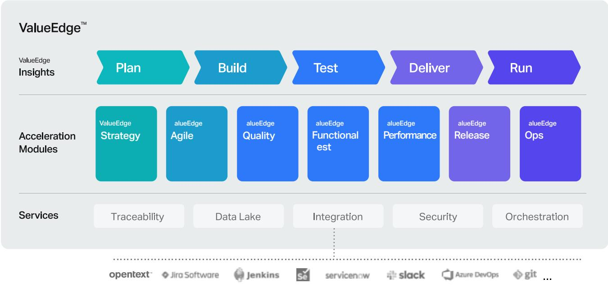

# Transform software delivery with ValueEdgeTM

Value stream management— from strategy to product delivery.

# What’s next for software delivery?

DevOps, cloud-native design, open source tooling, microservices—all have pushed software development and delivery forward. But these same innovations can also cause more complexity and inefficiency. Worst case scenario? Your software doesn’t meet customer needs.

As we all know by now, none of the above is slowing down. Digital transformation demands that organizations move faster without breaking things. It’s no wonder that your software delivery teams feel the pressure to deliver high-quality applications quickly.

Having siloed development teams doesn’t help. Working across separate groups can lead to fragmented and disconnected decision-making, which slows down your response to enterprise-wide change.

## So, what’s the solution?

With the increased need for speed, your organization must easily identify and resolve conflicting priorities. To pull it off, you’ll need to align business and IT goals and gain full visibility of your entire digital product delivery pipeline.

With all of this in mind, you can see why more and more teams are shifting their focus to value-based delivery. And that’s where value stream management comes in.

# Cue value stream management

Value stream management (VSM) provides a complete view of your entire digital software development lifecycle (SDLC)—from the first idea to product delivery. It empowers your teams to create, track, deliver, and validate the value of a feature, product, or service. Value streams span business and IT functions. They require alignment and collaboration to quickly deliver the most value to customers.

To gain full visibility, you need the best VSM approaches. They should help you balance objectives, optimize resources, understand dependencies, and connect business processes. With the right capabilities, you can find hidden inefficiencies in your cross-functional teams.

Using VSM helps your organization identify the highest priority business change and focus on adding value to your customers throughout the SDLC.

> **AI Description:**
> **Source:** `assets/_page_4_Figure_0.jpg`
> 
> **Generated:** 2026-06-02 00:12:10
> 
> ---
> 
> The image shows a close-up view of a modern glass skyscraper. The building is composed of numerous rectangular windows, reflecting light and creating a pattern of illuminated and dark sections. The structure appears to be part of a larger urban skyline, with other similar buildings visible in the background. The image captures the architectural details and the interplay of light and shadow on the building's facade, emphasizing the sleek and contemporary design of the skyscraper.

# Meet ValueEdgeTM

ValueEdge delivers end-to-end value stream management capabilities. It provides a unified, flexible way to visualize, track, and manage flow and value throughout development. This cloud-based DevOps and VSM platform works with your development tools to improve production efficiency, maximize quality delivery, and align business goals with development resources.

With ValueEdge, you get:

AI-powered predictive intelligence.

In short, these features give you the power to deliver maximum value. And the more value you bring customers, the happier they are. Happy customers breed more customers, which keeps you ahead of the competition.

Seamless integration with your toolchains.

Real-time pipeline visibility and status.

Persona-based actionable analytics.

Smart automation of critical functions.

A unified strategy, development, testing, and deployment approach.

## Platform overview

The ValueEdge platform is a modular, cloud-based solution. Its managed services are easy to deploy in any organization. Start with a single ValueEdge service, or leverage multiple to augment your toolchain. You know your organization best. So you control usage based on your organization’s needs.

A cutting-edge platform deserves a great UI. ValueEdge’s intuitive, unified user interface and prebuilt connectors make value generation and adoption quick and easy.

Plan, build, and deliver digital product value streams.

Align your business objectives with your development resources.

2 Discover, visualize, and manage flow—from strategy to delivery.

Improve customer experience with low-risk, high-quality value streams.

Accelerate business decision-making with AI and analytics.

Empower continuous feedback, learning, and improvement.

Integrate your commercial and open source development tools.

The flexible design lets you choose only the modules you need for your software delivery process. As a cloud-based solution, you can easily add capabilities to the platform as your needs change.

> **AI Description:**
> **Source:** `assets/_page_8_Figure_0.jpg`
> 
> **Generated:** 2026-06-02 00:06:45
> 
> ---
> 
> The image is a photograph of two men in business attire shaking hands. They are standing in front of a window with horizontal blinds that allow some light to filter through, creating a pattern of light and shadow. The men appear to be smiling and engaged in a friendly interaction. The setting suggests a professional or formal environment, possibly an office or a business meeting.

## ValueEdge insights

This module enables data-driven organizations to easily measure and manage flow efficiency. Cross-priority data visualization provides instant insight into your development velocity, project duration, and quality. Now you can speed up your time to market by stopping bottlenecks before they happen.

> **AI Description:**
> **Source:** `assets/_page_9_Figure_0.jpg`
> 
> **Generated:** 2026-06-02 00:05:28
> 
> ---
> 
> The image contains a dashboard from the ValueEdge platform, specifically the "Value & Insights > Dashboard" section. It displays flow metrics for three products: Advantage Online, Advantage Datamart, and Advantage AoA. The dashboard includes visual elements such as pie charts and bar graphs to represent flow velocity, flow load, flow distribution, flow efficiency, and flow time. The data is presented in a structured format with numerical values and percentages, indicating the performance metrics of each product over a specific time period.

> **AI Description:**
> **Source:** `assets/_page_10_Figure_0.jpg`
> 
> **Generated:** 2026-06-02 00:09:56
> 
> ---
> 
> The image contains a photograph of a woman with curly hair and glasses, sitting at a table in what appears to be a meeting or discussion setting. She is gesturing with her hands, suggesting she is actively engaged in conversation. The background includes another person partially visible on the left and a hexagonal patterned wall on the right. The setting appears to be indoors, possibly in a professional or educational environment.

## ValueEdge strategy

Manage and combine your enterprise-wide product strategy to align with your business needs. By defining and monitoring critical KPIs, you can prioritize the best mix of deliverables versus investments to maximize the value delivered by your Agile teams. Lean portfolio management techniques help you make better scheduling decisions, incorporating risk exposure and resource limitations. With these capabilities, you can extend the agility of your Agile teams to the business through continuous planning and focus on investing in business initiatives to gain a competitive advantage. Plus, ValueEdge integrates with Agile tools like ALM Octane, Broadcom Rally, Atlassian Jira, and others.

## ValueEdge agile

Deliver continuous value to your customers by enhancing and observing value streams. This module works with your Agile and DevOps methods to design, manage, and optimize software delivery. Implement industrystandard enterprise Agile frameworks to achieve consistent delivery. And gain full traceability across diverse, decentralized teams—all while harnessing intelligent automation at scale.

> **AI Description:**
> **Source:** `assets/_page_11_Figure_0.jpg`
> 
> **Generated:** 2026-06-02 00:07:25
> 
> ---
> 
> The image contains a photograph of two men in business attire engaged in a discussion. One man is holding a piece of paper and pointing at it, while the other is gesturing with his hand. The setting appears to be an office environment, with a desk in the foreground that has a tablet, some sticky notes, and a pen. The men are dressed professionally, suggesting a formal or business context. The image conveys a sense of collaboration and communication.

## ValueEdge quality

Continuous quality controls make product delivery more efficient and less error-prone. Track the ongoing health of your application by centralizing testing from a single point of visibility and control.

This module helps you:

Manage manual and automated testing to improve consistency and coverage.

Eliminate redundant efforts with test reuse, versioning for test cases, and parameterization.

Analyze quality with application modules to concentrate testing efforts.

## ValueEdge functional test

Comprehensive functional testing improves accuracy and application quality. Test any application from anywhere with mobile and model-based testing capabilities. ValueEdge Functional Test delivers state-of-the-art AI analytics and prediction to ensure your software works to spec, with support for both coded and codeless test design frameworks. Increase confidence in your product deliverables by testing earlier and faster, reducing the number of defects and misaligned deliverables.

## ValueEdge performance

Include performance engineering in your SDLC to improve software quality and user experience. Leveraging these capabilities can:

Ensure the scalability and security of your business applications.

Reduce infrastructure management and maintenance.

Gain insights for developers and performance engineers with intelligent analytics.

Access a fully cloud-native solution with a flexible testing model.

Integrate with DevOps and application performance monitoring tools.

With ValueEdge Performance, you can deliver highperforming applications that surpass expectations.

## ValueEdge release

Design and manage product delivery, from code change to production deployment. With ValueEdge Release, you can:

Ensure secure software governance and compliance.

Manage all aspects of code change and review.

Perform continuous integration builds.

Capture and govern artifacts.

Deploy to environments and provision infrastructure as needed.

ValueEdge Release enhances your DevOps toolchain with quality control gates to ensure on-time, repeatable product delivery.

## ValueEdge ops

Your value streams don’t end with product delivery. Measure the value of product changes with modern enterprise service management capabilities, service monitoring, and governed infrastructure as code. An easy-to-use self-service portal enables you to deliver enterprise-class operations in the data center and the cloud.

> **AI Description:**
> **Source:** `assets/_page_16_Figure_0.jpg`
> 
> **Generated:** 2026-06-02 00:07:05
> 
> ---
> 
> The image is a diagram illustrating a software development lifecycle framework called ValueEdge. It consists of five main stages: Plan, Build, Test, Deliver, and Run, each represented by a colored arrow. Below these stages are acceleration modules labeled ValueEdge Strategy, Agile, Quality, Functional, Performance, Release, and Ops. At the bottom, there are service categories including Traceability, Data Lake, Integration, Security, and Orchestration. The diagram also includes logos of various software tools such as OpenText, Jira Software, Jenkins, ServiceNow, Slack, Azure DevOps, and Git, indicating integration points or tools used in the framework.

> **AI Description:**
> **Source:** `assets/_page_17_Figure_0.jpg`
> 
> **Generated:** 2026-06-02 00:11:08
> 
> ---
> 
> The image contains a photograph of two individuals walking on a paved surface. Both are wearing white hard hats, suggesting a construction or engineering context. The person on the left is dressed in a light-colored suit and heels, while the person on the right is wearing a blue shirt and gray pants. The setting appears to be outdoors, possibly at a construction site or similar environment. The image conveys a professional and work-related atmosphere.

## Transform with Value Stream Management

With ValueEdge, you can achieve superior business outcomes. Start maximizing your ROI by unifying your organization’s business and technology goals to eliminate waste, optimize resource investment, and streamline your entire SDLC.

With this innovative platform, you can transform your enterprise delivery processes by planning, monitoring, and delivering true business value. Its VSM capabilities help you reduce time to market, deliver high-value change, and succeed in the marketplace.

## opentext"