
## HUAWEI WATCH D USER GUIDE

Getting Started   
Buttons and screen control 1   
Pairing and connecting to wearable devices 2   
Measure the wrist circumference and select a strap and airbag 4   
Wearing the watch 5   
Setting the time and language 6   
Setting the AOD watch face 6   
Ñnfiªñà²nª Gallery watch faces 6   
Locking or unlocking 7   
Customizing the function of the Down button 7   
Charging 8   
Updating the watch 9   
Powering on, powering ÑffȀ and restarting your watch 9   
Blood Pressure Management   
Blood pressure measurement results are š²ffžàžnì each time 10   
The blood pressure measured at home is š²ffžàžnì from that   
10   
measured at the hospital   
Measuring blood pressure 11   
Care for Health   
Measuring SpO2 17   
Automatic SpO2 measurements 17   
Sleep monitoring 17   
Measuring your skin temperature 18   
Healthy Living 19   
Starting a workout 20   
Viewing workout records 21   
Workout status 21   
Recording daily activities 21   
Automatic workout detection 22   
Assistant   
HUAWEI Assistant·TODAY 23   
Message management 23   
Rejecting incoming calls 24   
Controlling music playback 24   
Flashlight 24   
Remote shutter 24   
Adding custom cards 25

# Getting Started

## Buttons and screen control

The watch is equipped with a color touchscreen that is highly responsive to your touches and can be swiped in š²ffžàžnì directions.

## Up button

## Down button

## Gestures

## Wake the screen

• Press the Up button.

• Raise or rotate your wrist inwards.

• Swipe down on the home screen to open the shortcut menu. Enable Show Time for the screen to stay on for fivž minutes.

0 • HarmonyOS/Android users can enable or disable Show Time on the Device settings screen of the Huawei Health app.

• iOS users can enable or disable Show Time on the device details screen of the Huawei Health app.

## Turn Ñč the screen

• Lower or rotate your wrist outwards, or use your palm to cover the watch face screen.

• Perform no operations for a period of time after you wake the screen by pressing the button or raising your wrist.

Press the Up button to access the app list screen and go to Settings > Display > Advanced to adjust the duration it takes for the watch screen to turn Ñffȇ

You cannot turn Ñff the screen by covering the standby watch face screen with your palm.

## Pairing and connecting to wearable devices

Ensure that your phone meets all the following requirements:

• Download and install the latest version of the Huawei Health app.

• Bluetooth and location services are enabled on your phone, and the Huawei Health app is authorized to access your phone's location.

When you power on your device for the fiàäì time or pair it after a factory reset, you will be prompted to select a language before pairing.

## Installing the Huawei Health app

Before pairing, download and install the Huawei Health app on your phone. If you have installed the Huawei Health app, update it to the latest version.

## • HUAWEI phones

The Huawei Health app is installed on your phone by default. If you are unable to finš this app on your phone, you can download and install it from AppGallery.

## • Non-HUAWEI Android phones

If you are using a non-HUAWEI Android phone, you can download and install the Huawei Health app through either of the following ways:

• Visit Download the Huawei Health app, or scan the following QR code to download and install the Huawei Health app.

Search for the Huawei Health app in the app store on your phone, and follow the onscreen instructions to download and install the app.

## • iPhones

Search for the HUAWEI Health app in the App Store, and follow the onscreen instructions to download and install the app.

## Pairing and connecting to wearable devices

To protect your privacy, your watch will need to be restored to its factory settings in certain scenarios (subject to the onscreen instructions) when it connects to a new phone. Restoring the watch to its factory settings will clear all data from the device. Please exercise caution when performing this operation.

## • HUAWEI/Non-HUAWEI Android phones

1 After the device is powered on, select a language. Bluetooth is ready for pairing by default.

2 Place the device close to your phone, open the Huawei Health app on your phone, touch in the upper right corner, and then touch ADD. Your phone will automatically scan for available devices. Select the device you wish to pair with, and touch LINK.

3 When a pairing request is displayed on the device screen, touch √, and follow the onscreen instructions to complete the pairing.

## • iPhones

1 After the device is powered on, select a language. Bluetooth is ready for pairing by default.

2 Follow the onscreen instructions to go to Settings > Bluetooth and select your device for pairing. Once a pairing request is displayed on the device screen, touch √.

3 You can place your device close to your phone, open the Huawei Health app on your phone, touch in the upper right corner, touch ADD, and then follow the onscreen instructions to select your device from the pop-up window.

Or you can open the Huawei Health app on your phone, touch in the upper right corner, and then touch SCAN to scan the QR code on your device. On your phone, follow the onscreen instructions and touch Yes > Next.

4 When a pop-up window on your phone requests a Bluetooth pairing via the Huawei Health app, touch Pair. Another pop-up window will display, asking you whether to allow the device to display phone nÑì²fi”†ì²Ñnäȇ Touch Allow.

5 Wait for several seconds until the Huawei Health app displays a message indicating that the pairing is successful. Touch Done to complete the pairing.

## Measure the wrist circumference and select a strap and airbag

Measuring your wrist's circumference and selecting a suitable strap

1 At a position on your wrist that is about the width of two finªžàä away from the bottom of your palm, put the end of the ruler that comes with the watch through the buckle on the head.

2 Pull the ruler until it touches your arm, but don't pull it too tightly. Record the position indicated by the arrow.

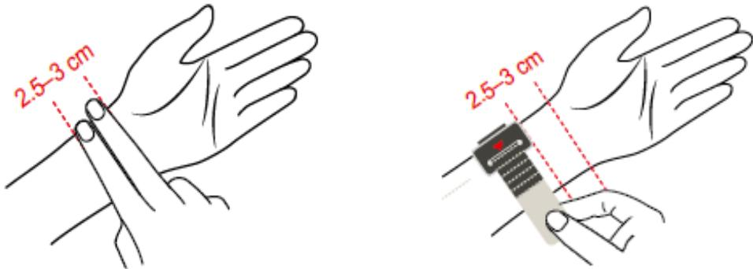

> **AI Description:**
> **Source:** `assets/_page_5_Figure_0.jpg`
> 
> **Generated:** 2026-06-02 00:21:03
> 
> ---
> 
> The image contains a diagram illustrating the placement of a device on a wrist. The diagram includes two illustrations side by side, showing the device being positioned approximately 2.5-3 cm from the wrist joint. The device appears to be a small, rectangular gadget, possibly a fitness tracker or similar wearable technology. The red dashed lines and annotations provide clear guidance on the measurement and positioning of the device.

3 Select the strap and airbag based on the scale value.

Replacing the strap and airbag with ones in suitable sizes

1 Open the strap nail buckle and the upper and lower buckles of the airbag.

2 Press the cover button and pull up the airbag to separate the airbag cover from the body of the watch.

3 Push the lever inwards and pull the strap outwards.

4 Align one side of the strap to be installed with the watch body, push the lever inwards, and fasten it.

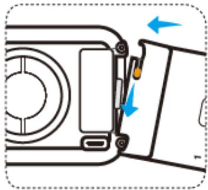

> **AI Description:**
> **Source:** `assets/_page_5_Figure_1.jpg`
> 
> **Generated:** 2026-06-02 00:20:55
> 
> ---
> 
> The image is a technical illustration showing a close-up view of a camera's side, focusing on the battery compartment. It includes two blue arrows indicating the direction to slide the battery door open. The illustration is simple and uses black lines on a white background, with no additional text or labels. The diagram is designed to guide the user on how to access the battery compartment for battery replacement or removal.

5 Align the airbag with the air nozzle and press the airbag cover.

6 Align the end of the strap with the buckle and insert the strap into the buckle.

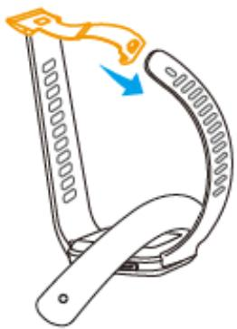

> **AI Description:**
> **Source:** `assets/_page_6_Figure_0.jpg`
> 
> **Generated:** 2026-06-02 00:20:11
> 
> ---
> 
> The image is a technical illustration showing a step in the assembly or adjustment of a device, likely a wristband or strap. It depicts a flexible, coiled component being bent into a specific shape, guided by a blue arrow indicating the direction of the bend. The orange highlight on the coiled part suggests a critical area or feature that should be focused on during the bending process. The illustration is designed to guide the user through a precise adjustment or assembly step.

7 After adjusting the tightness, fasten the airbag buckle.

Adjust the strap based on your wrist's circumference.

1 Open the watch buckle and airbag buckle.

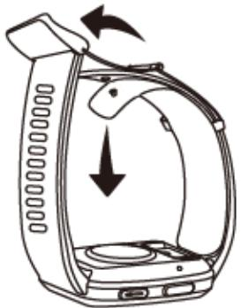

> **AI Description:**
> **Source:** `assets/_page_6_Figure_1.jpg`
> 
> **Generated:** 2026-06-02 00:20:16
> 
> ---
> 
> The image is a technical illustration showing a step-by-step process for a device, likely a coffee maker. It depicts a side view of the device with a lid being lifted upwards and then a downward arrow indicating the action of lowering the lid. The illustration is designed to guide the user through the operation of the device, emphasizing the sequence of actions needed to operate it.

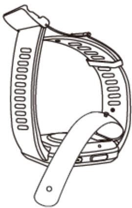

> **AI Description:**
> **Source:** `assets/_page_6_Figure_2.jpg`
> 
> **Generated:** 2026-06-02 00:20:05
> 
> ---
> 
> The image is a technical illustration of a wristwatch. It shows a side view of the watch with the band and case clearly depicted. The watch band is detailed with a series of holes, likely for size adjustment, and the watch face is partially visible. The watch case appears to have a hinge mechanism, suggesting it can be opened or closed. The illustration is monochromatic and lacks any additional labels or text annotations.

2 Select the size of the strap based on the measurement, and then fasten the nail buckle.

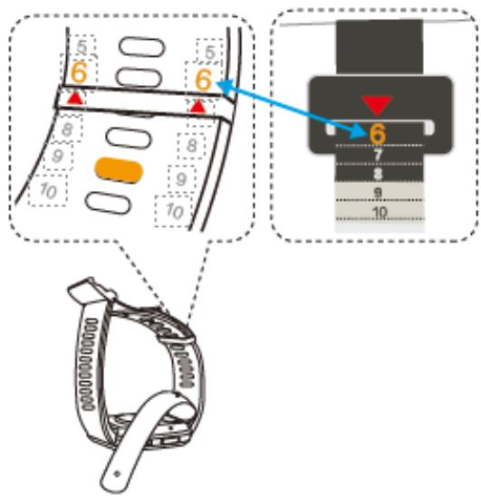

> **AI Description:**
> **Source:** `assets/_page_6_Figure_3.jpg`
> 
> **Generated:** 2026-06-02 00:20:00
> 
> ---
> 
> The image is a technical illustration of a gear shift lever and its corresponding display. It includes a diagram of the gear shift lever with numbered positions (5, 6, 8, 9, 10) and a magnified view of the display showing the number 6 with an arrow pointing to it. The display also shows numbers 6, 7, 8, 9, and 10, indicating the gear positions. The illustration is likely used for instructional purposes, such as explaining how to operate a manual transmission vehicle.

3 Fasten the airbag buckle to fin²ä¯ adjusting the strap.

## Wearing the watch

To ensure the accuracy of the measurement, place the watch body in the middle of the back of your wrist. The edge of the watch's body should be below the root of the ulnar styloid process, and should not press the root of the ulnar styloid process or be too far away from it. The center of the watch's face should be on your wrist about two finªžàä width away from the palm.

Do not attach a protector to the back of your watch. Your watch's bottom cover contains a sensor that can identify your body. If the sensor is blocked, the ²šžnì²fi”†ì²Ñn may fail or be inaccurate, †ffž”ì²nª heart rate, ECG, blood oxygen, and sleep data measurements.

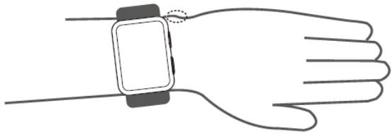

> **AI Description:**
> **Source:** `assets/_page_7_Figure_0.jpg`
> 
> **Generated:** 2026-06-02 00:20:44
> 
> ---
> 
> The image is a simple line drawing of a hand with a smartwatch on the wrist. The smartwatch is depicted with a rectangular screen and a band, and the hand is shown in a relaxed position with fingers slightly curled. The drawing is minimalistic and does not contain any text or additional annotations.

## Setting the time and language

After you have synced data between your device and phone/tablet, the system language will be synced to your device as well.

If you change the language, region, or time on your phone/tablet, the changes will automatically sync to the device as long as it is connected to your phone/tablet via Bluetooth.

## Setting the AOD watch face

After the Always on display (AOD) feature is enabled, the current watch face will be displayed when you raise your wrist if the main watch face doesn't come with a built-in AOD watch face.

## Setting AOD

1 In the app list, go to Settings > Watch face or Settings > Watch face & home, and enable AOD.

2 Go to AOD style > Default style and select your preferred style. The style will then be displayed when the main watch face doesn't come with a built-in AOD watch face and you raise your wrist.

## ÑÊfiªñà²Êª Gallery watch faces

Before using this feature, update the Huawei Health app and your device to their latest versions.

## Selecting Gallery watch faces

1. Open the Huawei Health app, touch Devices and then your device name, and go to Watch faces > More > Mine > On watch > Gallery to access the Gallery settings screen.

2. Touch + and select either Camera or Gallery as the method for uploading an image.

3. Touch √ in the upper right corner, and then touch Save. Your watch will then display the selected image as the watch face.

## Other settings

On the Gallery settings screen:

• Touch Style, Position, and Function to set the style, location of the date and time and functions on the Gallery watch faces.

• Touch the Cross icon in the upper right corner of a selected photo to delete it.

## Locking or unlocking

You can set a PIN on the device to bolster your privacy. After you have set a PIN and enabled Auto-lock, you will need to enter the PIN to unlock the device and enter the home screen.

## Setting a PIN

## 1 Set a PIN.

Swipe down on the home screen of the device, go to Settings > PIN > Enable PIN, and follow the onscreen instructions to set a PIN.

## 2 Enable Auto-lock.

Swipe down on the home screen of the device, go to Settings > PIN, and enable Autolock.

If you forget the PIN, you will be required to restore the device to its factory settings.

## Changing the PIN

Swipe down on the home screen of the device, go to Settings > PIN > Change PIN, and follow the onscreen instructions to change the PIN.

## Disabling the PIN

Swipe down on the home screen of the device, go to Settings > PIN > Disable PIN, and follow the onscreen instructions to disable the PIN.

## Forgot the PIN

If you have forgotten the PIN, restore the device to its factory settings and try again.

• Method 1: Open the Huawei Health app, touch Devices and your device name, and then select Reset.

• Method 2: If you've enter an incorrect password for fivž times, touch Reset at the bottom of the device screen.

Once you have restored your device to its factory settings, all of your data will be cleared, so please exercise caution when performing this operation.

## Customizing the function of the Down button

1 Press the Up button to open the app list and then go to Settings > Down button.

2 Select an app and customize the function of the Down button.

After you have fin²ä¯žš customizing the function, return to the home screen and press the Down button to open the current app.

## Charging

## Charging

1 Connect the charging cradle to a power adapter and then connect the power adapter to a power supply.

2 Rest your watch on top of the charging cradle and align the metal contacts on your watch to those of the charging cradle until a charging icon appears on the watch screen.

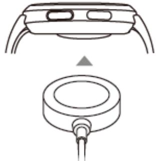

> **AI Description:**
> **Source:** `assets/_page_9_Figure_0.jpg`
> 
> **Generated:** 2026-06-02 00:20:50
> 
> ---
> 
> The image contains a technical illustration of a smartwatch and a charging dock. The smartwatch is shown in the top part of the image, with a focus on the back where the charging port is located. The bottom part of the image displays the charging dock, which has a circular design with a cable connected to it. The image is likely used for instructional purposes, such as demonstrating how to charge a smartwatch.

3 Remove the watch and disconnect the power adapter after the watch is fully charged and the charging icon displays 100%.

You are advised to use a Huawei charger or a non-Huawei charger that complies with corresponding regional or national laws and regulations as well as regional and international safety standards to charge your watch. Other chargers and power banks that do not meet corresponding safety standards may cause issues such as slow charging and overheating. Exercise caution when using them. It is recommended that you purchase a Huawei power adapter from an Ñffi”²†Ã Huawei sales outlet.

• Keep the charging port dry and clean to prevent short circuits or other risks.

The charging cradle tends to attract metal objects due to it being magnetic. Therefore, it is necessary to check and clean the charging cradle before use. Do not expose the charging cradle to high temperatures for a long time, as this may cause the charging cradle to demagnetize or cause other exceptions.

## Checking the battery level

Method 1: Swipe down from the top of the home screen to check the battery level.

Method 2: Connect your watch to a power supply and check the battery level on the charging screen.

Method 3: View the battery level on a watch face that displays the battery level.

Method 4: Connect your watch to the Health app, open the Health app, touch Devices then your device name, and check the battery level on the device details screen.

## Updating the watch

Method 1: Open the Huawei Health app, touch Devices and your device name, then touch Firmware update. Your phone will then check for the available updates. Follow the onscreen instructions to complete the update.

Method 2: Go to Settings > System & updates > Update and touch Update. Follow the onscreen instructions to complete the update.

## Powering on, powering ÑčȀ and restarting your watch

## Powering on

• Press and hold the Up button.

• Charge the device.

## Powering Ñč

• Press and hold the Up button, and then touch Power Ñč.

• Press the Up button and go to Settings > System > Power Ñč or Settings > System & updates > Power Ñč

## Restarting

• Press and hold the Up button, and then touch Restart.

• Press the Up button and go to Settings > System > Restart or Settings > System & updates > Restart.

# Blood Pressure Management

## Blood pressure measurement results are š²čžàžÊì each time

Blood pressure flñ”ìñ†ìžä throughout the day.

To correctly manage blood pressure, it is recommended that you measure your blood pressure at the same time every day.

• Blood pressure flñ”ìñ†ìžä in the following situations:

· Within 1 hour after meal

· After going to the toilet

· After drinking alcohol and ”†ffž²nž

· Not being quiet during the measurement

· After smoking

· Feeling stressed

· After bathing

· The environment being too cold or hot, or changing drastically

· After exercise

• Measurement results can be †čž”ìžš if long-time measurements cause blood stasis. During the measurement, the wrist is pressed by the airbag, which may result in the blood flÑw to your finªžàì²Ýä slowing down and cause blood stasis. In this case, take Ñff your watch, raise your arm high, and repeatedly make a fiäì and open it for about 15 times.

## The blood pressure measured at home is š²čžàžÊì from that measured at the hospital

• If the blood pressure measured at home is lower than that measured at the hospital, the possible causes are as follows:

• You feel more stressed at the hospital, resulting in the blood pressure higher than it should be.

You have greater peace of mind and your body is more relaxed at home, sometimes resulting in the blood pressure lower than that measured at the hospital.

• The measurement results will be lower if the measurement position is above the heart.

The measurement results may be lower if your wrist is above your heart during the measurement.

• If the blood pressure measured at home is higher than that measured at the hospital, the possible causes are as follows:

• If you are taking antihypertensive drugs, your blood pressure will rise after the drug žčž”ìä wear Ñčȇ

The žffž”ìä of the antihypertensive drugs will wear Ñff after you take the drugs for a few hours. Then, your blood pressure will rise. Consult a doctor for details.

The measured values may also be higher when the watch isn't worn tight. If the watch is too loose on your wrist, the pressure cannot reach the blood vessels, resulting in the measurement results being higher than expected.

An incorrect measurement posture may also result in higher measurement results. Higher measurement results may also result from sitting cross-legged, on a low sofa or in front of a low table, or other postures exerting pressure on your abdomen, or placing the watch below the heart.

## Measuring blood pressure

The blood pressure measurement feature helps you better manage your health.

0 This product can be used as a reference in clinical practice, but the measurement results cannot serve as the basis for diagnosis.

• If you feel uncomfortable during a measurement due to the airbag ²nfl†ì²nª excessively or other reasons, stop the measurement immediately to šžfl†ìž the airbag or unfasten the strap.

• To prevent injuring your arm, do not keep your arm in the device for a long time when it is ²nfl†ìžšȇ

## Precautions

• If you feel uncomfortable during a measurement due to the airbag ²nfl†ì²nª excessively or other reasons, stop the measurement immediately to šžfl†ìž the airbag or unfasten the strap.

• Unfasten your strap if the ²nfl†ì²Ñn pressure increases to more than 300 mmHg (40 kPa) but does not šžfl†ìž automatically.

• To ensure the accuracy of measurement results, comply with the following requirements:

The airbag and strap sizes are suitable, you are wearing the device correctly, and your posture during the measurement is correct. For details, see the Wearing Guide.

Measure your blood pressure during the same time period each day. Measurement results may vary depending on the time of day.

• After smoking, drinking alcohol, ”ÑffžžȀ or black tea, bathing, or doing exercise, wait at least 30 minutes before measuring.

• After going to the toilet, wait 10 minutes before measuring.

• Do not measure within one hour after eating a meal.

Do not measure in a place where the temperature is too low or too high or the environment changes dramatically.

• Do not measure when you are standing or lying down.

Do not measure when your body is under pressure.

Do not measure in a moving vehicle.

• Do not stretch or bend the strap and airbag with force.

Rest for 5 minutes before a measurement and keep your body naturally relaxed until the measurement is complete. Do not perform the measurement when you feel emotional or stressed.

Perform a measurement in a quiet environment. Do not speak, bend your finªžàäȀ or move your body or arms during the measurement.

Rest your wrist for 1 to 2 minutes or longer before you perform the next measurement. During this period of time your arteries will return to how they were before the blood pressure was measured.

## Measuring blood pressure

1 Ensure that you are wearing your device correctly. (Before the fiàäì measurement, you can scan the QR code on the device to view the guide.)

2 Press the Up button and select Blood pressure from the app list. If you are measuring for the fiàäì time, touch Next.

You can set to press the Down button to enter the blood pressure measurement screen by default.

3 On the wrist circumference settings screen, select a range, and touch Next > Next.

4 Ensure that your arm being measured is steady (with your arm bent and your palm facing your chest). Your palm should be naturally relaxed and not clenched. Hold the elbow of the arm with your other hand and keep the device at the same height as your heart.

## Measuring posture

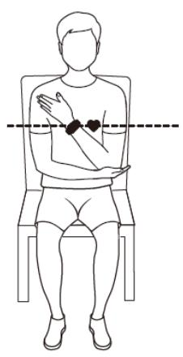

> **AI Description:**
> **Source:** `assets/_page_13_Figure_0.jpg`
> 
> **Generated:** 2026-06-02 00:20:30
> 
> ---
> 
> The image is a simple line drawing of a person sitting on a chair. The person is depicted in a side profile, with their arms crossed over their chest. The drawing includes a horizontal dashed line across the chest area, which appears to be a reference or measurement line. The person is wearing a shirt and shorts, and the drawing is minimalistic with no additional text or annotations.

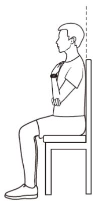

> **AI Description:**
> **Source:** `assets/_page_13_Figure_1.jpg`
> 
> **Generated:** 2026-06-02 00:20:25
> 
> ---
> 
> The image is a simple line drawing of a person sitting on a chair. The person is depicted from a side view, with their head slightly tilted forward, and their arms resting on the chair's armrests. The person's legs are bent at the knees, and their feet are flat on the ground. The chair is depicted with a backrest and armrests. The drawing is minimalistic, focusing on the posture and seating position of the individual.

# Incorrect postures when measuring blood pressure

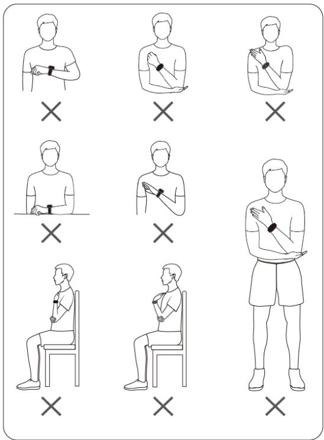

> **AI Description:**
> **Source:** `assets/_page_14_Figure_0.jpg`
> 
> **Generated:** 2026-06-02 00:20:40
> 
> ---
> 
> The image is a diagram illustrating various positions of a person wearing a smartwatch. It contains 12 different poses, each marked with an "X" to indicate incorrect usage of the smartwatch. The poses include different arm positions, sitting, standing, and other body orientations. The diagram is designed to highlight the correct placement of the smartwatch for optimal use.

5 Tap Measure on the measurement screen to start a measurement. After the measurement is complete, the measurement result will be displayed.

You can also press the Down button twice to start a measurement.

• An error occurred while measuring.

Table 2-1 Inaccurate measurement results

Blood Pressure Management

Table 2-2 Error nÑì²fi”†ì²Ñnä during a measurement

• Solution for handling slow šžfl†ì²Ñnǿ
Perform the following steps to clean the air inlet and outlet. If the issue persists, contact a service center for it to be repaired.

a Remove the short strap (including the buckle) and keep the long strap and airbag. Keep the bottom cover facing up and unfold the long strap and airbag in your hand.

b Dip the cotton swab in an appropriate amount of detergent and water. Use the cotton swab to slowly wipe the air fiÃìžà back and forth 20 times along the shorter side of the watch body until the air fiÃìžà is clean. Do not exert too much force, otherwise the air fiÃìžà may fall Ñffȇ

c Wipe the long strap and airbag dry and put them to one side for half an hour.

## Managing blood pressure

1 On the home screen of the Huawei Health app, touch the Blood pressure card. If there is no blood pressure card, touch EDIT to add it.

2 Touch Blood pressure management plan > Go, and follow the onscreen instructions to enter basic information and join the plan.

## Other settings

Swipe up on the measurement result screen

• You can touch Measurement records to view historical measurement records.

• Touch Settings to set your wrist circumstance, unit, and other information.

• Touch Guest measurement to enter the guest measurement mode.

# Care for Health

## Measuring SpO2

0 To ensure the accuracy of the SpO2 measurement, wear the watch properly and ensure the strap is fastened. Ensure that the monitoring module is in direct contact with your skin without any obstructions.

## Single SpO2 measurement

1 Wear your watch correctly and keep your arm still.

2 From the home screen, press the Up button, swipe on the screen, and touch SpO2.

3 For some products, touch Measure. The actual product prevails.

4 Keep your body still during the SpO2 measurement.

0 The measurement will be interrupted if you swipe right on the watch screen, start a workout with the Health app, or receive a nÑì²fi”†ì²Ñn for an incoming call or alarm.

• Data provided is for reference only and not for medical use. Consult a doctor as soon as possible if you feel uncomfortable.

• During the SpO2 measurement, the watch will also measure your heart rate.

• This measurement may also be †ffž”ìžš by some external factors such as low blood perfusion, tattoos, a lot of hair on your arm, a dark complexion, lowering or moving your arm, or low ambient temperatures.

## Automatic SpO2 measurements

1 Open the Huawei Health app, touch Devices and then your device name, touch Health monitoring, and enable Automatic SpO2 measurement. The device will then automatically measure and record your SpO2 when it detects that you are still.

2 Touch Low SpO2 alert to set the lower limit of your SpO2 for you to receive an alert when you are not asleep.

## Sleep monitoring

## Recording sleep data on your wearable device

i Ensure that you are wearing your device correctly. The device will automatically record the duration of your sleep, and identify whether you are in a deep sleep, a light sleep, or awake.

• Open the Huawei Health app, touch Devices, then your device name, go to Health monitoring > HUAWEI TruSleep™, and enable HUAWEI TruSleep™. When enabled, the device can accurately recognize when you fall asleep, when you wake up, and whether you are in a deep sleep, a light sleep, or REM sleep. The app can then provide you with sleep quality analysis, to help you understand your sleep patterns, and suggestions to help you improve the quality of your sleep.

• If HUAWEI TruSleep™ has not been enabled, your device will track your sleep in the regular way. When you wear your device while sleeping, it will identify your sleep stages, and record the time that you fall asleep, wake up, and enter or exit each sleep stage, and it will then sync the data to the Huawei Health app.

## Recording sleep data on your phone

• In the Huawei Health app, touch Sleep monitoring on the Health screen to enter the sleep monitoring screen. Alternatively, touch the Sleep card on the Health screen, and swipe to finš and touch Record your sleep.

• Touch the settings icon in the upper right corner to edit your schedule and enable or disable general sleep settings, such as Sleep sounds.

• Touch Go to sleep and place your phone within 50 cm of your pillow. Your phone will then monitor and record your sleep data. Press and hold Hold to end for 3 seconds to exit sleep recording.

• Touch the icons at the bottom of the screen to select, play, turn ÑffȀ and set a time for sleep music.

## Productive nap

• Touch the Sleep card on the Health screen of the Huawei Health app, swipe to finš and touch Productive nap. Touch the settings icon in the upper right corner to set an alarm or nap reminder.

• Swipe to select a break time and touch START to enable the alarm. Touch the icons at the bottom of the screen to select, play, turn ÑffȀ and set a time for sleep music.

## Viewing your sleep data

Touch the Sleep card on the Health screen of the Huawei Health app to view your daily, weekly, monthly, and yearly sleep data.

## Measuring your skin temperature

Skin temperature measurements are mainly used to monitor the changes in the wrist skin temperature after exercise. After you enable a continuous skin temperature measurement, your skin temperature will be continuously measured and a measurement curve will be generated.

0 The product is not a medical device. Temperature measurements are mainly used to monitor the changes in the wrist skin temperature of healthy people over the age of 18 during and after exercise. Results are for reference only and should not be used as a basis for medical diagnosis or treatment.

• During the measurement, wear the device relatively tightly for more than 10 minutes and stay in a relaxed environment at room temperature (about 25°C). Ensure that there are no water stains or alcohol on your wrist. Do not start a measurement in an environment with direct sunlight, wind, or cold/heat sources.

• After you exercise, shower, or switch between outdoor and indoor environments, wait 30 minutes before you start a measurement.

## Single measurement

In the watch's app list, go to Skin temperature > Measure to start measuring your temperature.

## Continuous measurement

1 Open the Health app, touch Devices and then the device name, go to Health monitoring, and enable Continuous skin temperature measurement.

2 In the watch's app list, touch Skin temperature to view the measurement curve.

## Healthy Living

The Huawei Health app Ñffžàä Healthy Living to help you develop healthy lifestyle habits and enjoy a healthy new life.

Due to the š²ffžàžnì physical conditions of each individual, the health suggestions provided in Healthy Living, especially those related to physical activity, may not be applicable to all users, and may not be able to achieve the desired žffž”ìȇ If you feel uncomfortable during activities or workouts, please stop and take a rest or consult a doctor in a timely manner.

• The health suggestions provided in Healthy Living are for reference only. You shall bear all risks, damages, and liabilities arising from participating in any activities or workouts.

## Enabling Healthy Living

1 Open the Huawei Health app, go to Health > EDIT, and add the Healthy Living card.

2 Touch the Healthy Living card, and follow the onscreen instructions to agree to the User Notice.

## Selecting check-in tasks and setting goals

Check-in tasks are ”Æää²fižš into basic check-in tasks and optional check-in tasks. You can add optional check-in tasks based on your needs.

On the Healthy Living screen, touch in the upper right corner, select Health plan, select a check-in task, and touch Goal settings on the task card to set your daily goal.

## Viewing the task completion status

• Enter the app list, and select Healthy Living to view the completion status of a äݞ”²fi” task.

• Open the Huawei Health app and touch the Healthy Living card on the Health screen to view the task completion status.

## Reminders

1 On the Healthy Living screen, touch in the upper right corner, and select Health plan.

2 On the health plan screen, you can set general reminders or reminders for check-in tasks. That is, you can turn on the Weekly report reminders on watch switch or the Reminders switch for a äݞ”²fi” task, for example, enabling Reminders for Breath.

## Weekly report and sharing

Viewing a weekly report: On the Healthy Living screen, touch in the upper right corner, and select Weekly report to view the report details.

Sharing: On the Healthy Living screen, touch the share icon in the upper right corner to share it to your WeChat friends, WeChat Moments, or Weibo, or save it to your device.

## Disabling Healthy Living

On the Healthy Living screen, touch in the upper right corner, and go to About > Disable. Once Healthy Living is disabled, all data of goals will be cleared.

## Starting a workout

## Starting a workout on your watch

1 Enter the app list of your watch and touch Workout.

2 Select the workout you want to do or your preferred course. Alternatively, swipe up on the screen and touch Custom to add other workout modes.

3 Touch the Start icon to start a workout session. (Ensure that GPS positioning is working before you start an outdoor workout.)

4 To end a workout session, press the Up button and touch the Stop icon, or press and hold the Up button.

0 For devices that support voice broadcasts, press the Up button to pause the workout and then adjust the volume during a workout.

• Swipe left or right on the screen to switch between the music, sunrise/sunset, and other screens.

## Starting a workout in the Huawei Health app

This feature is not available in the Health app on tablets.

To start a workout using the Huawei Health app, put your phone and watch close to each other to ensure that they are connected.

1 Open the Huawei Health app, touch Exercise, choose a workout mode, and touch the Start icon to start a workout.

2 Once you have started a workout, your watch will sync and display your workout heart rate, speed, and time. Your workout data, such as the workout time, will be displayed in the Huawei Health app.

## Viewing workout records

## Viewing workout records on the device

1 On the device, enter the app list and touch Workout records.

2 Select a record and view the corresponding details. The device will display š²ffžàžnì data types for š²ffžàžnì workouts.

## Viewing workout records in the Huawei Health app

You can also view detailed workout data under Exercise records on the Health screen in the Huawei Health app.

## Deleting a workout record

Touch and hold a workout record on Exercise records in the Huawei Health app and delete it. However, this record will still be available in Workout records on the device.

## Workout status

Enter the watch's app list, touch Workout status, and swipe up on the screen to view data including your recovery status, training load, and VO2Max.

• Your training load from the last seven days can be viewed to determine your level based on your fiìnžää status. The watch collects your training load from workout modes that track your heart rate.

• VO2Max data can be obtained from outdoor running workouts.

## Recording daily activities

Wear your watch correctly for it to automatically record data relating to calories burned, distance covered, step count, duration of moderate-to-high intensity activities, and other daily activities.

Press the Up button to access the app list, swipe until you finš Activity records, touch it, and then swipe up or down to view data relating to calories, distance, steps, duration of moderate-to-high intensity activities, and other activities.

## Automatic workout detection

Go to Settings > Workout settings and enable Auto-detect workouts. After this feature is enabled, the device will remind you to start a workout when it detects increased activity. You can ignore the nÑì²fi”†ì²Ñn or choose to start the corresponding workout.

• The supported workout types are subject to the onscreen instructions.

• The device will automatically identify your workout mode and remind you to start a workout if you meet the requirements based on the workout posture and intensity and stay in this state for a certain period of time.

• If the actual workout intensity is lower than that required by the workout mode for a certain period of time, the device will display a message indicating that the workout has ended. You can ignore the message or end the workout.

## Assistant

## HUAWEI Assistant·TODAY

The HUAWEI Assistant·TODAY screen makes it easy to view weather forecast, wake up the voice assistant, access apps that have been opened, and view push messages from the calendar and AI Tips.

## Entering/Exiting HUAWEI Assistant·TODAY

Swipe right on the watch home screen to enter HUAWEI Assistant·TODAY. Swipe left on the screen to exit HUAWEI Assistant·TODAY.

## Message management

When the Huawei Health app is connected to your device, and the message nÑì²fi”†ì²Ñnä are enabled, messages pushed to the status bar of your phone/tablet can be synced to your device.

## Enabling message ÊÑì²fi”†ì²ÑÊä

1 Open the Huawei Health app, touch Devices and then your device name, touch EÑì²fi”†ì²ÑÊä, and turn on the switch.

2 Go to the app list and turn on the switches for apps that you want to receive nÑì²fi”†ì²Ñnä from.

You can go to Apps to view the apps that you can receive nÑì²fi”†ì²Ñnä from.

## Viewing unread messages

Your device will vibrate to notify you of new messages pushed from the status bar of your phone/tablet.

Unread messages can be viewed on your device. To view them, swipe up on the home screen to enter the unread message center.

## Replying to messages

This feature is not supported for iOS phones/tablets.

When receiving a message on your watch, you can use quick replies or emoticons to reply to it. The supported message types are subject to the actual situation.

## Deleting unread messages

> **AI Description:**
> **Source:** `assets/_page_24_Figure_0.jpg`
> 
> **Generated:** 2026-06-02 00:20:19
> 
> ---
> 
> The image contains a single icon of a trash can, which is commonly used to represent the action of deleting or removing something. There are no charts, graphs, or other visual elements present in the image. The icon is simple and does not provide any additional textual or numerical information.

Touch Clear or at the bottom of the message list to clear all unread messages.

## Rejecting incoming calls

When there is an incoming call, your watch will inform you and display the caller's number or name. You can reject the call.

• Press the Up button to stop the watch from vibrating during an incoming call.

• Touch the End icon on the screen or touch and hold the Up button on your watch to end the call.

## Controlling music playback

i • You can use the device to control music playback on third-party music apps, such as NetEase Music.

• This feature is not available when the device is connected to an iOS phone.

1 Open the Huawei Health app, touch Devices then your device name, and touch Music.

2 After a song is played on your phone/tablet, touch Music in the device's app list to pause or play the song, or switch to the previous or next song.

## Flashlight

On the device, enter the app list and touch Flashlight. The screen will light up. Touch the screen to turn Ñff the fl†ä¯Ã²ª¯ìȀ then touch the screen again to turn it back on. Swipe right on the screen or press the side button to close the Flashlight app.

The fl†ä¯Ã²ª¯ì turns on for 5 minutes by default.

## Remote shutter

After the watch is connected to your phone/tablet, touch Remote shutter in the app list on your watch to enable the camera on your phone/tablet, and then you can touch on the watch screen to take a photo. Touch or to switch between a 2-second and 5-second timer.

0 After your watch is paired with your phone/tablet, if Remote shutter is displayed in the app list on your watch, it indicates that this feature is supported. Otherwise, this feature is not supported.

• To use this feature, ensure that your watch is connected to your phone/tablet and that the Huawei Health app is running in the background.

## Adding custom cards

1 Go to Settings > Custom cards or Settings > Display > Favorites.

2 Touch , and select the cards to be displayed, such as the Sleep, Stress, and Heart rate cards. The actual display prevails.

3 Touch next to a card that you have added, or touch and hold the card to move it to another position (supported on some device models). Touch to delete the card.

4 After the settings are complete, swipe left or right on the home screen to view the added cards.