
# Welcome te NUS

nus.edu.sg

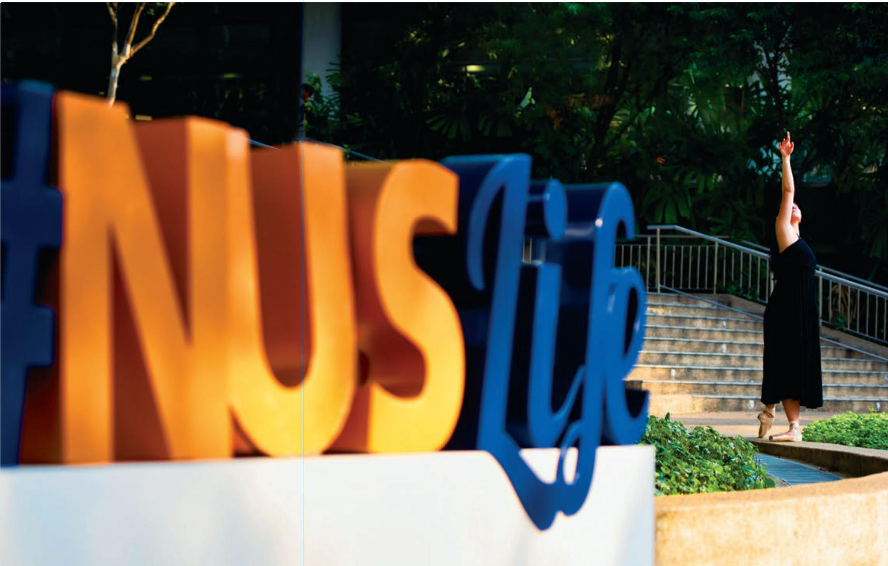

> **AI Description:**
> **Source:** `assets/_page_0_Figure_1.jpg`
> 
> **Generated:** 2026-06-02 00:33:37
> 
> ---
> 
> The image contains a large, colorful sign with the text "#NUSlife" prominently displayed. The sign is made up of large, bold letters with a mix of orange and blue colors. In the background, there is a person standing on a set of stairs, wearing a black outfit and ballet shoes, with one arm raised in the air. The setting appears to be an outdoor area with greenery and a railing visible. The image combines text with a photograph, providing a visual representation of a campus or university environment.

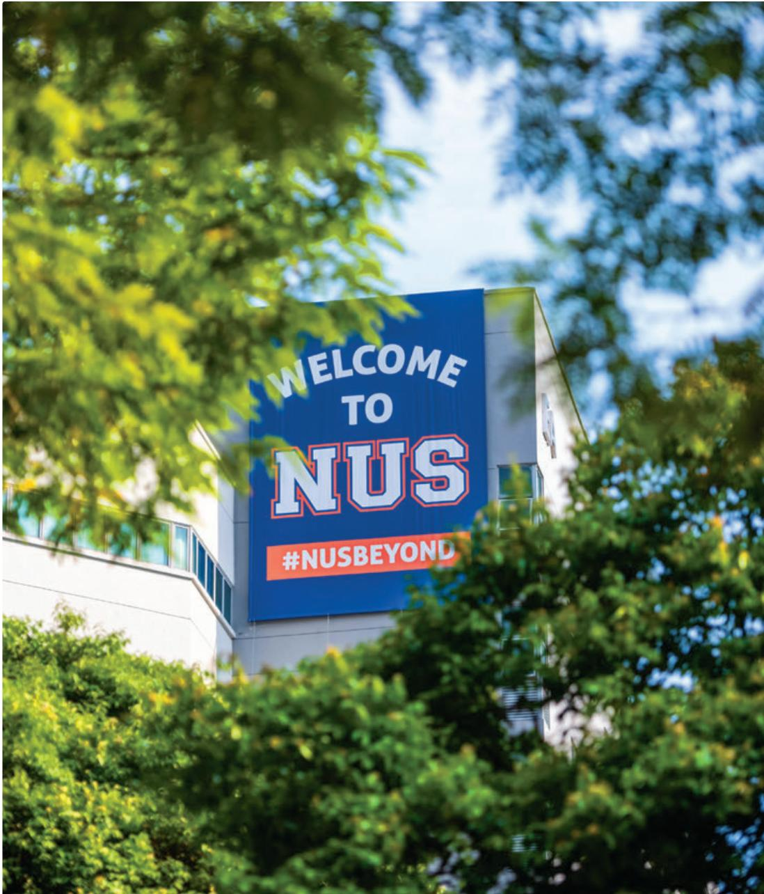

> **AI Description:**
> **Source:** `assets/_page_1_Figure_0.jpg`
> 
> **Generated:** 2026-06-02 00:27:59
> 
> ---
> 
> The image contains a large blue sign with the text "WELCOME TO NUS" in white and orange letters. Below the main text, there is a hashtag "#NUSBEYOND" in white and orange. The sign is mounted on a building, and the background includes green foliage and a clear sky. The image conveys a welcoming message to the National University of Singapore (NUS) and suggests a focus on the university's broader vision or initiatives.

CONTENTS

STARTING OUT

04 Our Campuses   
06 Staying on Track   
08 Discover NUS

BEYOND THE CLASSROOM

14 Be an Entrepreneur   
16 Making New Friends

24 Caring for the Community & Environment

EXPLORE CAMPUS LIFE

30 Campus Living   
34 Learning Resources   
38 Food & Retail   
42 Student Services

The student guide to living, learning and thriving at Singapore’s flagship university

> **AI Description:**
> **Source:** `assets/_page_2_Figure_0.jpg`
> 
> **Generated:** 2026-06-02 00:42:04
> 
> ---
> 
> The image contains a photograph of three individuals sitting at an outdoor table, engaged in what appears to be a collaborative activity. The person on the left is using a laptop and holding a pen, while the other two individuals are looking at a document or book on the table. There are two white cups on the table, suggesting they might be having a coffee break or a casual meeting. The setting is outdoors, with trees and buildings in the background, indicating a relaxed and informal environment.

Starting OUT

US commemorates its 115th year of founding in 2020. Established in 1905 as a modest medical school with 23 students, NUS is today widely known for its innovative and rigorous education, research and entrepreneurship, which has nurtured generations of leaders and luminaries across industries, professions and sectors in Singapore and beyond.

With NUS115, we proudly celebrate the University’s transformative impact over 115 years and its continual efforts at shaping the future for a better world.

Find out more at nus115.sg.

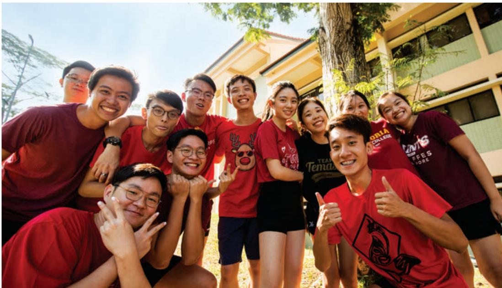

> **AI Description:**
> **Source:** `assets/_page_2_Figure_2.jpg`
> 
> **Generated:** 2026-06-02 00:38:41
> 
> ---
> 
> The image contains a group of people posing outdoors in front of a building. They are wearing red t-shirts with various designs and logos, including one with a reindeer and another with a bird. The group appears to be in a casual and friendly setting, with some individuals making playful gestures. The background includes a tree and part of a building, suggesting a campus or school environment. The overall mood of the image is positive and lighthearted.

> **AI Description:**
> **Source:** `assets/_page_2_Figure_3.jpg`
> 
> **Generated:** 2026-06-02 00:40:21
> 
> ---
> 
> The image contains a simple icon of a school building with a flag on top. The school is enclosed within an orange circle, which is set against a light blue background. The icon is a flat, two-dimensional representation with no additional text or labels.

3 CAMPUSES

> **AI Description:**
> **Source:** `assets/_page_2_Figure_4.jpg`
> 
> **Generated:** 2026-06-02 00:43:47
> 
> ---
> 
> The image contains a simple icon of a building with a flag on top, enclosed within an orange circle. The icon appears to represent a school or educational institution. There are no charts, graphs, or additional visual elements present in the image.

17 SCHOOLS

> **AI Description:**
> **Source:** `assets/_page_2_Figure_5.jpg`
> 
> **Generated:** 2026-06-02 00:44:24
> 
> ---
> 
> The image contains a simple icon of a location pin over a globe, which is typically used to represent a global location or a point of interest on a map. The icon is orange with a white pin and globe, set against a light blue background. This icon is commonly used in maps, navigation apps, and other applications to indicate a specific location on a global scale.

11 NUS OVERSEAS COLLEGES

> **AI Description:**
> **Source:** `assets/_page_2_Figure_6.jpg`
> 
> **Generated:** 2026-06-02 00:47:17
> 
> ---
> 
> The image contains a simple icon of a diploma or certificate, which is a symbol commonly used to represent education, achievements, or qualifications. The icon is a flat, two-dimensional graphic with no additional text or data. It is a single, isolated element without any background or surrounding context.

>70

DOUBLE, JOINT ANDCONCURRENT DEGREEPROGRAMMES WITH THEWORLD’S TOP UNIVERSITIES

> **AI Description:**
> **Source:** `assets/_page_2_Figure_7.jpg`
> 
> **Generated:** 2026-06-02 00:44:48
> 
> ---
> 
> The image contains a simple icon with a handshake inside a globe. The icon suggests a theme of international cooperation or global partnership. The handshake symbolizes agreement or collaboration, while the globe represents a global context. There are no additional labels or text annotations within the image.

>300

PARTNER UNIVERSITIES IN 40+ COUNTRIES FOR STUDENT EXCHANGE EXPERIENCES

## OUR CAMPUSES

## KENT RIDGE CAMPUS

NUS’ main campus since 1980, the sprawling 150-hectare Kent Ridge Campus hosts most of the University’s academic, research and administrative facilities. It is also a bustling hub of student life, with student residences, sports facilities and venues for arts and cultural activities.

University Town (UTown) – an extension of the Kent Ridge Campus – offers a unique residential college experience, as well as a host of educational and recreational spaces for interaction, peer learning and personal development. UTown is also home to Yale-NUS College, Singapore’s first liberal arts college with a full residential programme.

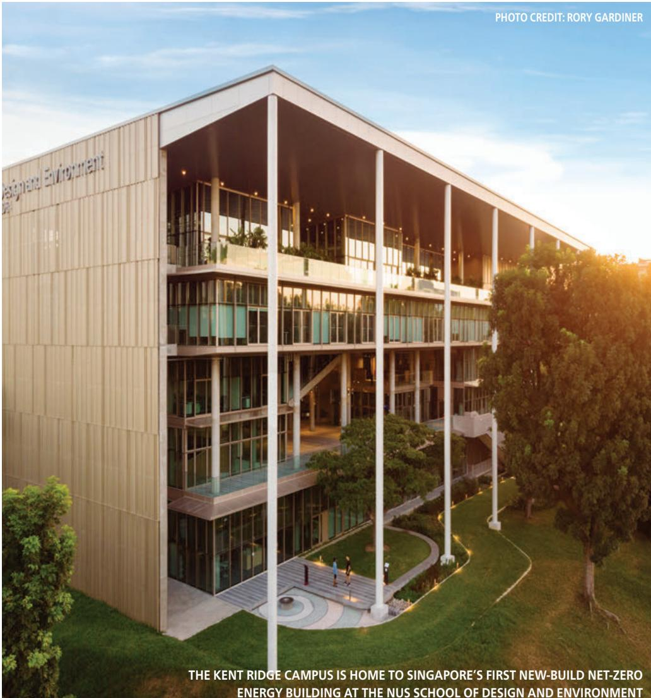

> **AI Description:**
> **Source:** `assets/_page_3_Figure_0.jpg`
> 
> **Generated:** 2026-06-02 00:45:34
> 
> ---
> 
> The image is a photograph of a modern building with a glass facade and wooden exterior. The building is part of the Kent Ridge Campus and is described as Singapore's first new-build net-zero energy building at the NUS School of Design and Environment. The photo credit is given to Rory Gardiner. The image includes text at the bottom providing information about the building's location and significance.

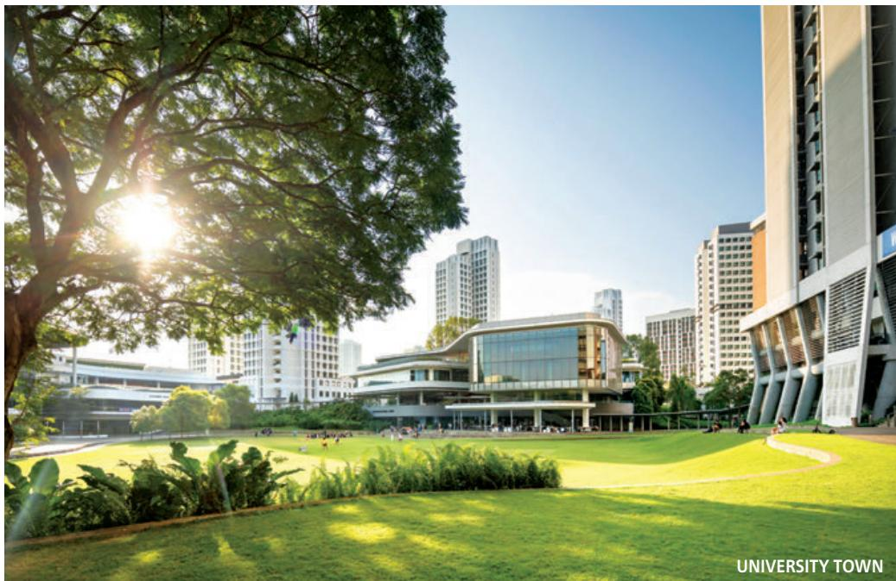

> **AI Description:**
> **Source:** `assets/_page_3_Figure_1.jpg`
> 
> **Generated:** 2026-06-02 00:45:50
> 
> ---
> 
> The image is a photograph of an outdoor scene, likely a university campus. It features a large, modern building with a glass facade and a curved roof, surrounded by lush green grass and trees. The sun is shining through the leaves of a large tree on the left side of the image, creating a bright and vibrant atmosphere. In the background, there are several other buildings, including tall residential or office structures. The text "UNIVERSITY TOWN" is visible in the bottom right corner of the image.

BUKIT TIMAH CAMPUS The Bukit Timah Campus houses the Faculty of Law and the Lee Kuan Yew School of Public Policy. The colonial style buildings date back to 1928 when NUS’ predecessor institution, Raffles College, was established.

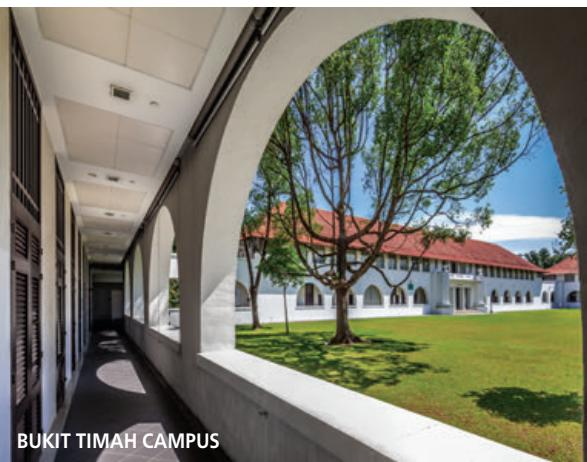

> **AI Description:**
> **Source:** `assets/_page_3_Figure_2.jpg`
> 
> **Generated:** 2026-06-02 00:44:17
> 
> ---
> 
> The image is a photograph of the Bukit Timah Campus. It shows a corridor with arched windows leading to an outdoor area with a tree and a building in the background. The building has a red-tiled roof and white walls, and the area is surrounded by green grass. The sky is clear and blue, indicating a sunny day.

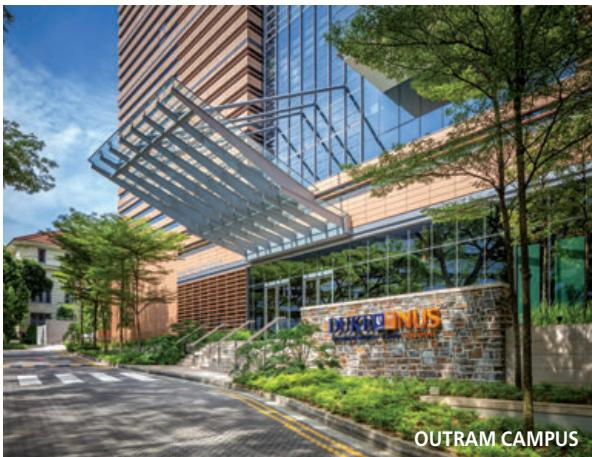

> **AI Description:**
> **Source:** `assets/_page_3_Figure_3.jpg`
> 
> **Generated:** 2026-06-02 00:44:10
> 
> ---
> 
> The image is a photograph of a modern building with a glass facade and wooden paneling. The building has a sign that reads "Duke-NUS Medical School" and "OUTRAM CAMPUS." The surrounding area includes trees and a paved road, indicating an urban setting. The image provides visual context for the location of the Duke-NUS Medical School campus.

## OUTRAM CAMPUS

Located among many of the nation’s key medical institutions, the Outram Campus houses the Duke-NUS Medical School (Duke-NUS). Duke-NUS’ innovative medical education programme with a distinctive research focus is designed to develop medical leaders in research, education and patient care.

## STAYING ONTRACK

VERY academic year comprises two semesters and a special term.   
Each semester has 13 weeks of classes and two weeks of examinations.

> **AI Description:**
> **Source:** `assets/_page_4_Figure_1.jpg`
> 
> **Generated:** 2026-06-02 00:47:14
> 
> ---
> 
> The image contains a photograph of a person sitting at a desk in a modern, well-lit room with a high ceiling and exposed beams. The individual is wearing headphones and appears to be writing or drawing in a notebook. The room has large windows allowing natural light to enter, and there are other people in the background, suggesting a collaborative or educational setting. The environment looks organized and conducive to study or work.

> **AI Description:**
> **Source:** `assets/_page_4_Figure_2.jpg`
> 
> **Generated:** 2026-06-02 00:44:20
> 
> ---
> 
> The image contains a simple orange circle with a white compass icon in the center. The compass has a red needle pointing to the right, indicating a direction or orientation. There are no labels or text annotations present in the image.

> **AI Description:**
> **Source:** `assets/_page_4_Figure_3.jpg`
> 
> **Generated:** 2026-06-02 00:43:50
> 
> ---
> 
> The image contains a simple orange circle with a white clock face and a white arrow pointing downward. The clock has black hour and minute hands, indicating a time of approximately 10:10. The arrow suggests a downward trend or a decrease in the time displayed.

## ORIENTATION WEEK

The start of a new   
academic year.   
Get a sense of the   
University and forge   
new friendships before   
you get busy with   
study sessions and   
project meetings.

## RECESS WEEK

Grab a well-deserved breather from your studies, or catch up on subjects you need more time on.

## READING WEEK

The last lap before   
the start of   
examination season;   
selected libraries   
will be open   
24 hours.

## PUBLIC HOLIDAYS DURING ACADEMIC YEAR 2020/2021

Hari Raya Haji (31 Jul 2020) National Day (9 Aug 2020) Deepavali (14 Nov 2020) Christmas (25 Dec 2020) New Year’s Day (1 Jan 2021)

Chinese New Year (12 & 13 Feb 2021) Good Friday (2 Apr 2021) Labour Day (1 May 2021) Hari Raya Puasa (13 May 2021) Vesak Day (26 May 2021)

Note: If a public holiday falls on a Sunday, the following Monday will also be a public holiday.

## SEMESTER ONE

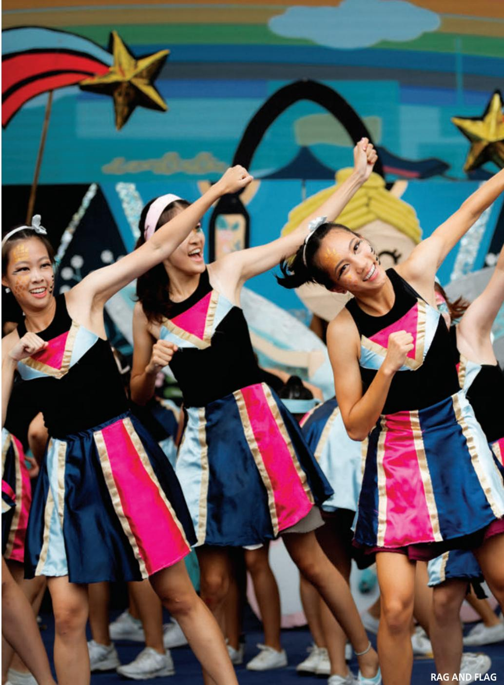

> **AI Description:**
> **Source:** `assets/_page_5_Figure_0.jpg`
> 
> **Generated:** 2026-06-02 00:42:53
> 
> ---
> 
> The image contains a photograph of a group of people performing a dance or cheerleading routine. They are wearing matching outfits consisting of black tops with pink and blue skirts, and they are raising their arms in a celebratory or energetic pose. The background features a colorful mural with stars and abstract shapes, adding a vibrant and festive atmosphere to the scene. The text "RAG AND FLAG" is visible in the bottom right corner of the image.

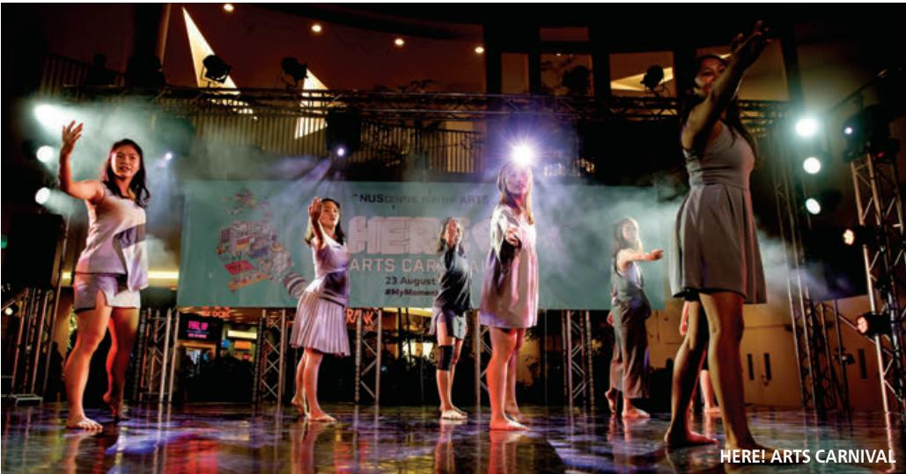

> **AI Description:**
> **Source:** `assets/_page_5_Figure_1.jpg`
> 
> **Generated:** 2026-06-02 00:40:35
> 
> ---
> 
> The image contains a photograph of a group of performers on a stage. The performers are dressed in light-colored outfits and are barefoot. They are positioned in front of a banner that reads "HERE! ARTS CARNIVAL" along with additional text indicating the date and hashtag. The stage is illuminated with spotlights, and there is a backdrop featuring a map and some text. The performers appear to be engaged in a dance or performance.

## AUGUST

## RAG AND FLAG

Signature event organised by the NUS Students’ Union. Funds are raised in aid of selected beneficiaries on Flag Day and in appreciation of public donation, students display floats and put up colourful performances on Rag Day.

## RUNNUS

Annual running event organised by NUS Students’ Sports Club. Proceeds from runners’ fees and pledges go toward a selected beneficiary.

## KENT RIDGE MINISTERIAL FORUM

This event, organised by the NUS Students’ Political Association, offers students a chance to engage with prominent political leaders in Singapore.

## HERE! ARTS CARNIVAL

Presented as a one-night feast for the mind and the body, this curated showcase demonstrates the wealth of creative opportunities that are available at NUS.

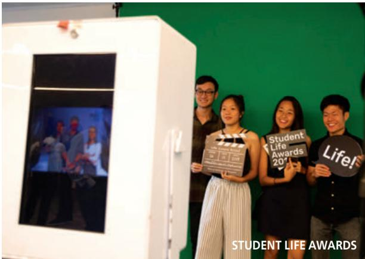

> **AI Description:**
> **Source:** `assets/_page_5_Figure_2.jpg`
> 
> **Generated:** 2026-06-02 00:38:23
> 
> ---
> 
> The image contains a photograph of four individuals standing in front of a green backdrop. They are holding signs that read "Student Life Awards 2019" and "Life!" The individuals appear to be posing for a photo, and there is a large white machine with a screen on the left side of the image. The text "STUDENT LIFE AWARDS" is visible at the bottom of the image. The image includes a visual representation of people and text, providing context for the event being celebrated.

## OCTOBER/NOVEMBER

STUDENT LIFE AWARDS Recognising performance beyond academics, the Awards acknowledge student contributions in leadership, arts and culture, community service, and campus vibrancy, among others.

# DISCOVER NUS

## SEMESTER TWO

## JANUARY

## GO GLOBAL FAIR

Look up the exciting overseas opportunities, including exchange and international summer programmes, that NUS has to offer.

## JANUARY/FEBRUARY

## CAREER FEST

There is free Wi-Fi   
across campus, even on the   
shuttle buses, so you can stay connected on the go.

Interact and network with potential employers to get a head start in your career planning.

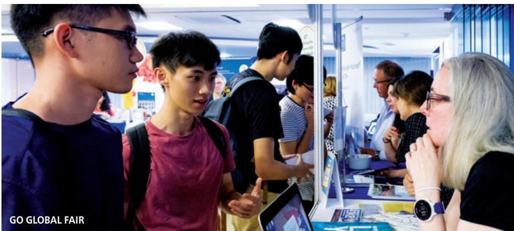

> **AI Description:**
> **Source:** `assets/_page_6_Figure_1.jpg`
> 
> **Generated:** 2026-06-02 00:29:21
> 
> ---
> 
> The image contains a photograph of a Go Global Fair event. It shows a group of people, including students and adults, interacting at a booth. The setting appears to be indoors, possibly in a conference or exhibition hall. The individuals are engaged in conversation, with some pointing towards a laptop on the table, which displays a presentation or informational content. The background includes other booths and informational displays, suggesting a networking or educational fair environment.

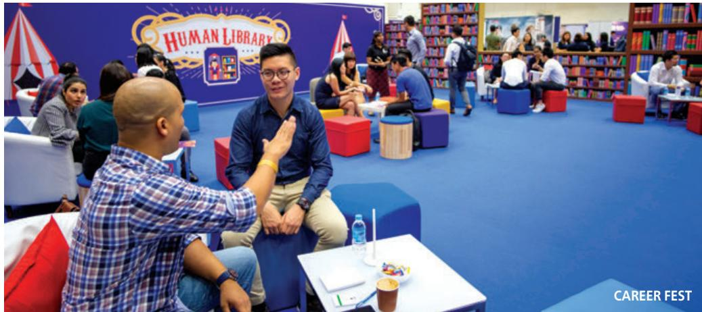

> **AI Description:**
> **Source:** `assets/_page_6_Figure_2.jpg`
> 
> **Generated:** 2026-06-02 00:27:11
> 
> ---
> 
> The image contains a photograph of a Human Library event, likely part of a Career Fest. The setting is a spacious room with a blue carpet and various seating arrangements, including couches and stools. The walls are decorated with bookshelves and a banner that reads "HUMAN LIBRARY." People are engaged in conversations, some sitting on the floor while others are seated on the furniture. The atmosphere appears relaxed and interactive, suggesting a space for dialogue and learning. The text "CAREER FEST" is visible in the bottom right corner, indicating the event's theme.

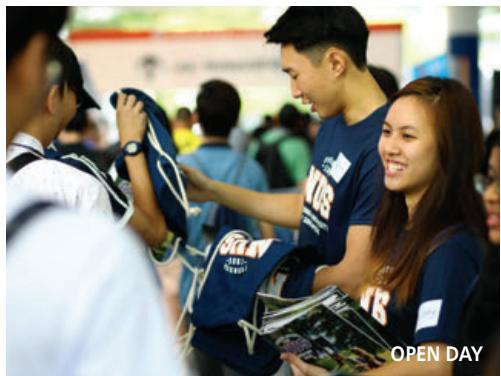

> **AI Description:**
> **Source:** `assets/_page_6_Figure_3.jpg`
> 
> **Generated:** 2026-06-02 00:25:11
> 
> ---
> 
> The image contains a photograph of a group of people at what appears to be an "Open Day" event, as indicated by the text in the bottom right corner. The individuals are interacting with each other, with one person handing over a blue bag to another. The setting seems to be indoors, possibly at a school or university, given the context of the event. The image captures a moment of engagement and interaction, likely related to a promotional or informational activity.

## MARCH

## OPEN DAY

Find out everything you need to know about learning and living in NUS.

## NUS ARTS FESTIVAL

Organised by NUS Centre For the Arts, this festival brings campus and professional artists together to explore a contemporary theme each year.

## JULY

## NUS COMMENCEMENT

Celebrate with the graduating cohort as they mark the completion of their degrees and the beginning of the next chapter in their lives.

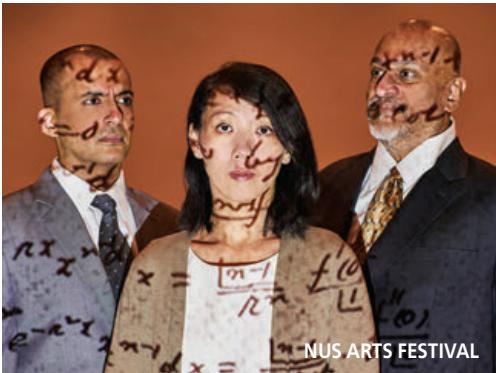

> **AI Description:**
> **Source:** `assets/_page_6_Figure_4.jpg`
> 
> **Generated:** 2026-06-02 00:32:16
> 
> ---
> 
> The image contains a photograph of three individuals with mathematical equations and symbols superimposed on their faces and bodies. The individuals are dressed in formal attire, and the background is a plain, solid color. The text "NUS Arts Festival" is visible at the bottom of the image. The visual content includes a combination of a photograph and text, with the equations and symbols being the primary visual elements.

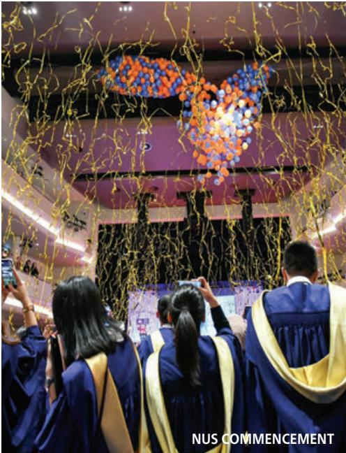

> **AI Description:**
> **Source:** `assets/_page_6_Figure_5.jpg`
> 
> **Generated:** 2026-06-02 00:30:32
> 
> ---
> 
> The image is a photograph taken at a graduation ceremony. It shows a group of graduates in academic regalia, facing a stage. The graduates are holding up their phones to take pictures. Above the stage, there are two large, heart-shaped decorations made of blue and orange balloons. The stage is decorated with gold streamers falling down, creating a festive atmosphere. The text "NUS COMMENCEMENT" is visible at the bottom of the image, indicating the event is the National University of Singapore's graduation ceremony.

## Look out for these other events which are regularly held throughout the year:

> **AI Description:**
> **Source:** `assets/_page_6_Figure_6.jpg`
> 
> **Generated:** 2026-06-02 00:32:32
> 
> ---
> 
> The image contains a simple icon of a podium with a microphone on top, set against an orange circle. The icon is likely used to represent a speech, presentation, or announcement. There are no charts, graphs, or other visual elements present in the image.

Academic events like symposiums, talks and forums featuring prominent speakers.

> **AI Description:**
> **Source:** `assets/_page_6_Figure_7.jpg`
> 
> **Generated:** 2026-06-02 00:35:09
> 
> ---
> 
> The image contains a simple diagram of a street vendor stall. The stall is depicted with a canopy, a person standing behind it, and a cup of coffee, suggesting a coffee stall. The background is orange, and the stall is outlined in white. There are no charts, graphs, or other visual elements beyond the basic representation of the stall and its contents.

Bazaars, carnivals   
and fairs with stalls   
offering a range of   
items, from clothing and   
accessories to food and   
electronic items.

> **AI Description:**
> **Source:** `assets/_page_6_Figure_8.jpg`
> 
> **Generated:** 2026-06-02 00:42:07
> 
> ---
> 
> The image contains a simple icon of a microphone on a stand, which is a white graphic on a light blue circular background. This icon is commonly used to represent audio recording or broadcasting. There are no charts, graphs, or other visual elements present in the image.

Arts and music lovers can look forward to a wide range of exhibitions, performances, concerts and recitals organised by NUS Centre For the Arts and NUS Yong Siew Toh Conservatory of Music.

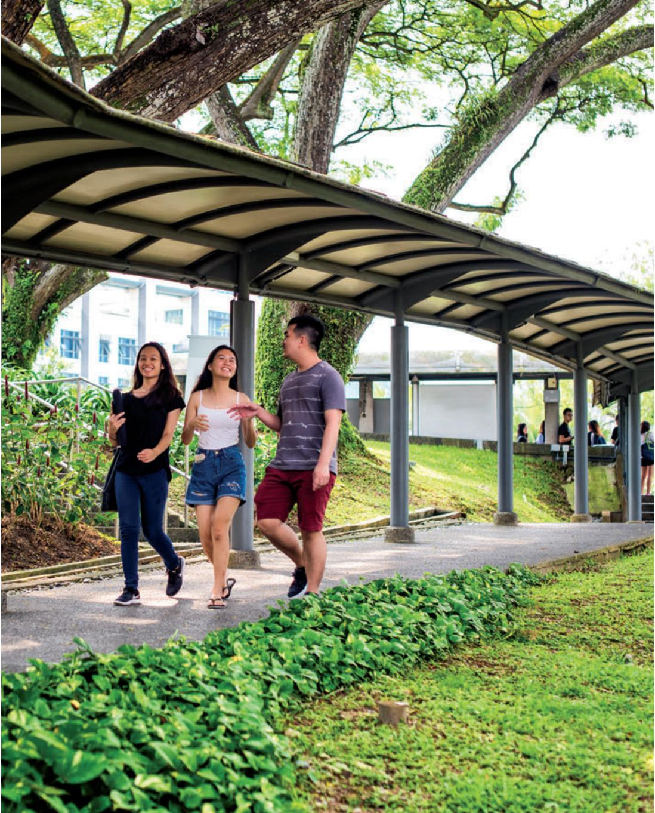

> **AI Description:**
> **Source:** `assets/_page_7_Figure_0.jpg`
> 
> **Generated:** 2026-06-02 00:34:31
> 
> ---
> 
> The image contains a photograph of three individuals walking under a covered walkway. The walkway is supported by metal pillars and has a roof providing shade. The individuals appear to be engaged in conversation as they walk. The background includes greenery and a building, suggesting the setting might be a campus or park. The overall atmosphere is casual and relaxed.

US provides a holistic education. You can hone your entrepreneurial skills, or make an impact in the community, while making new friends.

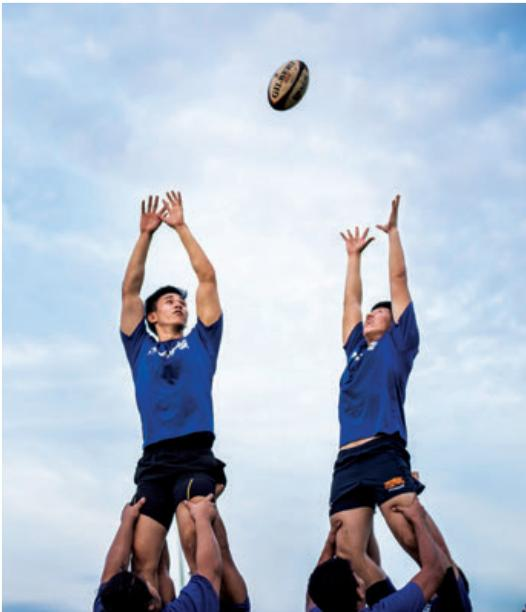

> **AI Description:**
> **Source:** `assets/_page_7_Figure_2.jpg`
> 
> **Generated:** 2026-06-02 00:31:54
> 
> ---
> 
> The image is a photograph of two rugby players in the middle of a lineout, reaching up to catch a rugby ball. The players are wearing blue jerseys and black shorts. The sky in the background is partly cloudy. The image captures the dynamic action of the sport, emphasizing the height and coordination required in a lineout.

> **AI Description:**
> **Source:** `assets/_page_7_Figure_3.jpg`
> 
> **Generated:** 2026-06-02 00:31:57
> 
> ---
> 
> The image contains a simple diagram with a circular orange background. Within the circle, there are four smaller circles arranged in a square pattern, with lines connecting each smaller circle to the central circle. This suggests a network or group structure, possibly representing a team or a group of interconnected entities.

> 200

STUDENT ORGANISATIONS, SOCIETIES AND INTEREST GROUPS

> **AI Description:**
> **Source:** `assets/_page_7_Figure_4.jpg`
> 
> **Generated:** 2026-06-02 00:26:03
> 
> ---
> 
> The image contains a simple icon of a ping pong paddle with a ball. The icon is white with a thin outline, set against an orange circular background. There are no additional visual elements or text annotations present in the image.

>40 TYPES OF SPORTS

> **AI Description:**
> **Source:** `assets/_page_7_Figure_5.jpg`
> 
> **Generated:** 2026-06-02 00:26:58
> 
> ---
> 
> The image contains a simple icon with a bright orange circle. Inside the circle, there are two musical notes and a plus sign, suggesting a connection to music or sound. The icon is likely used to represent a music-related function or feature, such as adding music to a playlist or playing music.

>20

GROUPS IN MUSIC, DANCE, DRAMA AND VISUAL ARTS

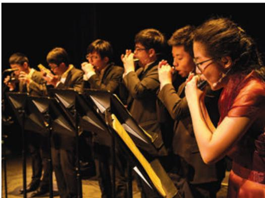

> **AI Description:**
> **Source:** `assets/_page_7_Figure_6.jpg`
> 
> **Generated:** 2026-06-02 00:28:38
> 
> ---
> 
> The image shows a group of individuals playing harmonicas. They are standing in a row, each with a harmonica in their mouth and a music stand in front of them. The individuals appear to be part of a performance or ensemble. The setting seems to be a stage or a performance area, as indicated by the dark background and the presence of music stands. The individuals are dressed in formal or semi-formal attire, suggesting a formal or semi-formal event.

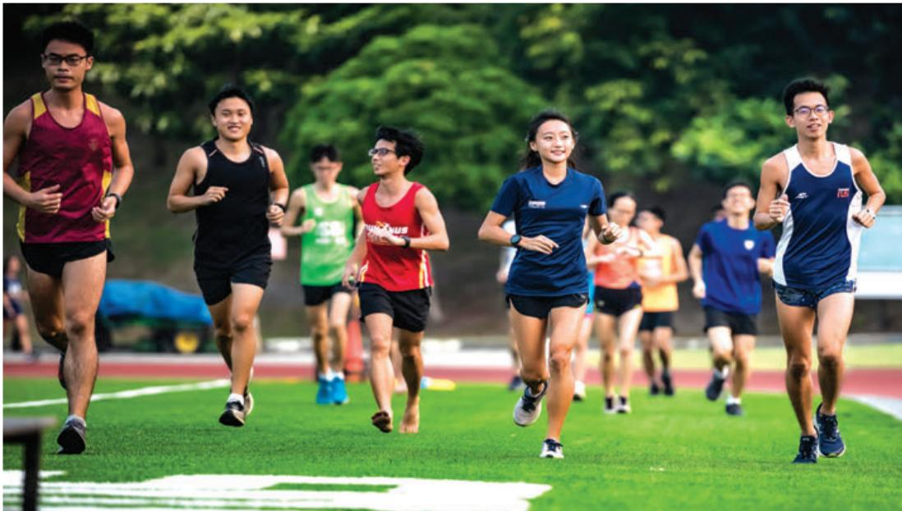

> **AI Description:**
> **Source:** `assets/_page_7_Figure_7.jpg`
> 
> **Generated:** 2026-06-02 00:28:24
> 
> ---
> 
> The image is a photograph of a group of individuals running on a track. The runners are wearing athletic attire, with some in tank tops and shorts, and others in t-shirts and shorts. The setting appears to be an outdoor sports field, with green grass and trees in the background. The runners are in motion, suggesting a race or training session. The image captures the energy and movement of the participants, emphasizing the physical activity and teamwork involved.

# BE AN ENTREPRENEUR

HERE are many avenues for a budding entrepreneur in NUS to get inspired, pick up the right skills and develop an entrepreneurial mindset.

NUS Enterprise actively promotes entrepreneurship and cultivates global mindsets and talents through the synergies of experiential entrepreneurial education, active industry partnerships, holistic entrepreneurship support and catalytic entrepreneurship outreach.

## NUS OVERSEAS COLLEGES

overseas.nus.edu.sg

One of the University’s flagship programmes, the NUS Overseas Colleges programme is specially designed to help students with entrepreneurial drive gain start-up skills and experience. Students can intern at start-ups while studying part-time at prestigious overseas universities in leading entrepreneurial hotspots in Canada, China, Indonesia, Israel, Sweden, the United States and Vietnam, as well as Singapore. A new location in Japan will be launched in July 2020.

## NUS START-UP RUNWAY

Students who are working on or hope to develop their own start-ups can turn to the NUS Start-Up Runway for support. It provides funding and validation support, market assessments, consultation and mentoring services, access to events and workshops amid a passionate start-up community.

## BLOCK71

BLOCK71 is an initiative by NUS Enterprise in collaborative and strategic partnerships with established corporates and government agencies. It forms part of a global network of innovation and entrepreneurial gateways to and from NUS, through providing programmes as a technology ecosystem builder and business connector with an objective to catalyse, aggregate and develop competencies of the start-up community.

BLOCK71 Singapore, located at JTC Launchpad, houses a thriving community of entrepreneurs, investors, developers and mentors, and is home to hundreds of tech-related start-ups, venture capitalists and incubators.

BLOCK71 has expanded beyond Singapore to BLOCK71 San Francisco, BLOCK71 Jakarta, BLOCK71 Suzhou, BLOCK71 Bandung, BLOCK71 Yogyakarta and BLOCK71 Saigon (opening in 2nd quarter 2020). These locations enable a two-way flow of talent, technologies and start-ups between Singapore and other entrepreneurial hubs, while facilitating even greater information exchange, connectivity and access to programmes for start-ups and entrepreneurs.

## THE HANGAR BY NUS ENTERPRISE

The Hangar by NUS Enterprise is the campus base where like-minded individuals gather to pursue their entrepreneurial curiosity and passion, as well as nurture business ideas and start-ups. Entrepreneurs can enjoy the use of a wide range of workspaces and benefit from other amenities and services like dedicated mentorship, idea validation and test-bedding capabilities while they focus on their entrepreneurial pursuits.

## NUS ENTERPRISE@SINGAPORE SCIENCE PARK

Strategically located next to the University, NUS Enterprise@Singapore Science Park leverages a ready pool of students, academics and researchers to create a deep technology community. It focuses on innovation in the nascent deep technology space, such as in the areas of food science and technology, artificial intelligence, future health and environmental solutions.

## COMMUNITY & EVENTS

From Innovfest Unbound to Kopi Chats, NUS Enterprise supports and engages the entrepreneur community with more than 400 events all year round. These events provide students and start-ups with opportunities to learn and network, and act as catalysts of growth for the community.

To find out more about the NUS entrepreneurial ecosystem, visit enterprise.nus.edu.sg.

Launched in 2018, the Graduate Research Innovation Programme (GRIP) is the NUS Industry Liaison Office’s flagship innovation programme. GRIP provides step-by-step guidance to postgraduate students and researchers to transform research into deep technology start-ups. Under this programme, the University has committed S\$25 million to co-create up to 250 companies over five years.

To find out more about GRIP, visit nus.edu.sg/grip/

## MAKING NEW FRIENDS

AKE your pick of student organisations, societies and interest groups offering a wide array of social and professional opportunities.

Develop your leadership skills, pursue your passion and expand your network of friends by engaging in a diverse range of student-run activities.

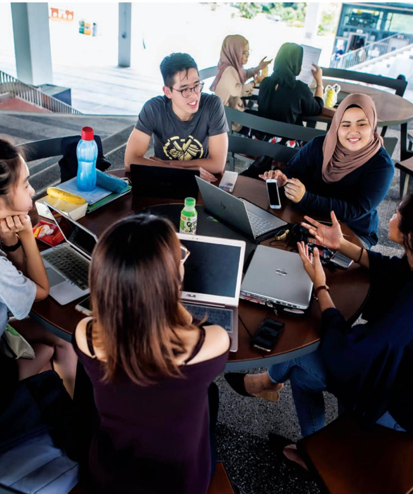

> **AI Description:**
> **Source:** `assets/_page_9_Figure_1.jpg`
> 
> **Generated:** 2026-06-02 00:37:45
> 
> ---
> 
> The image contains a group of people sitting around a table outdoors, engaged in a collaborative activity. They are using laptops and some have food and drinks on the table. The setting appears to be a casual workspace or café. The individuals are dressed in casual attire, and some are wearing headscarves. The scene conveys a sense of teamwork and productivity in a relaxed environment.

## NUSSU CLUBS AND COMMITTEES nussu.org.sg

All full-time undergraduate students are members of the NUS Students’ Union (NUSSU) and their respective faculty constituent clubs. NUSSU, led by the NUSSU Council and Executive Committee, comprises a total of 15 constituent clubs and nine committees.

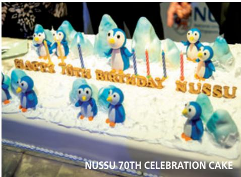

> **AI Description:**
> **Source:** `assets/_page_9_Figure_2.jpg`
> 
> **Generated:** 2026-06-02 00:37:53
> 
> ---
> 
> The image contains a photograph of a birthday cake. The cake is decorated with blue and white fondant penguins and has candles in the shape of the number 70. The cake is frosted with white icing and has the words "Happy 70th Birthday Nussu" written in gold lettering. The bottom of the image has the text "NUSSU 70TH CELEBRATION CAKE".

NUSSU traces its roots to its early predecessor, the University of Malaya Students’ Union (UMSU), which was established in 1949. UMSU then evolved into the University of Singapore Students’ Union (USSU), and took its present form as NUSSU in 1980, following the inception of NUS.

Generations of NUSSU executive committee members and volunteers gathered at the NUSS Kent Ridge Guild House on 23 August 2019 to reconnect with old friends and celebrate the Union’s 70th anniversary.

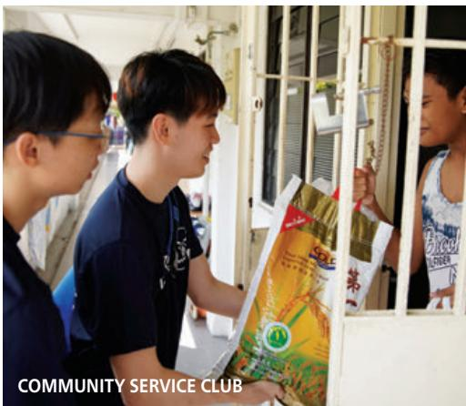

> **AI Description:**
> **Source:** `assets/_page_9_Figure_3.jpg`
> 
> **Generated:** 2026-06-02 00:37:59
> 
> ---
> 
> The image contains a photograph of two individuals, one handing a bag of food to a child through a window. The bag has a logo and text on it, and the setting appears to be a community service club event. The text "COMMUNITY SERVICE CLUB" is prominently displayed at the bottom of the image.

## CONSTITUENT CLUBS

• Arts and Social Sciences Club

• Business Club

• Community Service Club

• Computing Club

• Conservatory Club

• Cultural Activities Club

• Dental Club

• Design & Environment Club

• Engineering Club

• Law Club

• Medical Club

• Political Association

• Science Club

• Sports Club

• University Scholars Club

## NUSSU COMMITTEES

• Business Committee

Committee for Information Technology

• Global Relations Unit

• International Student Relations

• Public Relations Unit

• Students’ Fund Committee

• The Ridge

• Video and Photographic Committee

• Welfare Committee

## SOCIETIES AND INTEREST GROUPS

To pursue your interests, check out the list of student-run groups below:

• AIESEC

American Society of Mechanical Engineers (NUS Student Branch)

• Education Lab

• Architecture Society

• Art of Living

Electrical and Computer Engineering Club

• Electronic Gaming Society

• Arttero

• Enablers

• Asian Journal of Public Affairs

• Enactus

• Association for Public Affairs

• Energy Carta

• Astronomical Society

. Engineering Good Student Chapter

• Bachelor of Environmental Studies

• English Debate

• Board Games

• Bridging Gap (Gender and Policy)

• Entrepreneurship Society

Building and Estate Management Society

• Business Analytics Group

Environmental Law Students Association

• Case Consulting Group

Chemical and Environmental Engineering Students’ Society

• Chemical Sciences Society

Eta Kappa Nu NUS Chapter – Institute of Electrical and Electronic Engineers

• Chinese Debate

. Food Science and Technology Society

• FinFolks

• Chinese Studies Students’ Society

• Games Development Group

• Comics & Animation Society

. Communication & New Media Society

• Geographical Society

• Computer Base Learning Centre

• German Language Society

• Global Studies Club

• Global Engineering Programme

Computing for Voluntary Welfare Organisation

• Graduate Students’ Society

• Hackers’ Interest Group

• Dental Society

• Design Centric Programme Club

Disaster Risk and Response – Climate Change

• Cross-Learn

• History Society

Innovation & Design Programme

• Economics Society

Institute of Electrical and Electronic Engineers (NUS Student Branch)

• Institution of Engineers, Singapore (NUS Student Branch)

• Japanese Studies Society

• Korean Cultural Interest Group

• Life Sciences Society

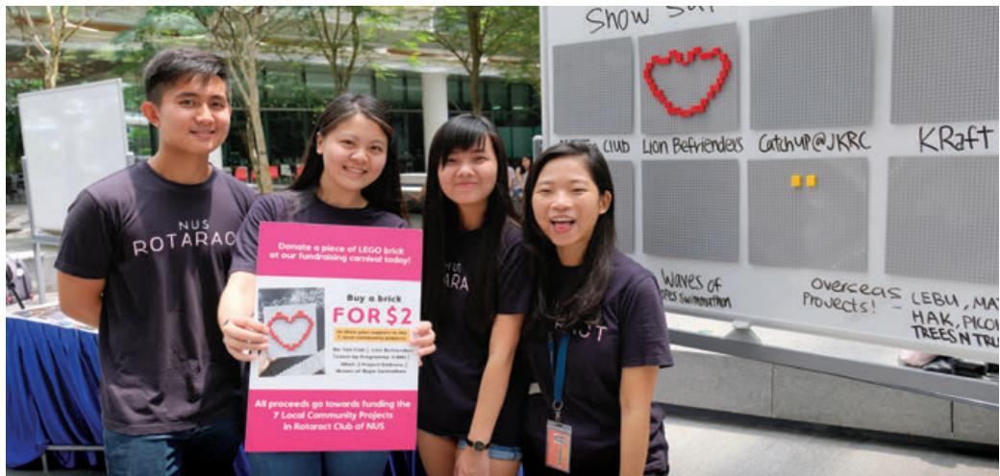

> **AI Description:**
> **Source:** `assets/_page_10_Figure_0.jpg`
> 
> **Generated:** 2026-06-02 00:43:07
> 
> ---
> 
> The image contains a photograph of four individuals standing in front of a display board. The display board has a pink poster that reads, "Donate a piece of LEGO brick at our fundraising carnival today! Buy a brick FOR $2. All proceeds go towards funding the 7 Local Community Projects in Rotaract Club of NUS." The poster features a red LEGO heart. The individuals are wearing matching dark shirts with "NUS ROTARACT" printed on them. The background includes a wall with various handwritten notes and a red LEGO heart decoration.

THE ROTARACT CLUB AT NUS HELD A CARNIVAL AT UTOWN ON 14-15 MAR 2019 TO RAISE FUNDS FOR ITS BENEFICIARIES IN CONJUNCTION WITH WORLD ROTARACT WEEK, AS WELL AS CELEBRATE ITS 50TH ANNIVERSARY

• Literary Society

• Pharmaceutical Society

• Makeup and Design

• Philosophy

• Malay Studies Society

• Physics Society

• Mathematics Society

• Political Science Society

• Medical Society

• Psychology Society

• Motoring Club

• Public Health Interest Group

• National Police Cadet Corps

• Radio Pulze

• NUANSA Cultural Productions

• Red Cross Youth – NUS Chapter

• NUS BiZiT

• Rotaract Club

• NUS CFA Students’ Interest Group

• Society of Mechanical Engineering

• NUS Drone Club

• Society of Social Work Students

• NUS GreyHats

• Sociology Society

• NUS iCARE

• Southeast Asian Studies Society

• NUS Investment Society

• Statistics

• NUS Linguistics

• NUS Toastmasters Club

• Students Against Violation of the Earth (SAVE)

• NUS Volunteer Action Committee

• The Helping Hands

• Outdoor Activities Club

• The Neural Connection

People Ending Animal Cruelty & Exploitation (PEACE)

• The Photographic Society of NUS

• Youth Developer Society

## SPORTS

For sports enthusiasts, we have more than 40 types of sports to cater to your sporting pursuits. Interested students may join our NUS varsity sports teams and/or NUS Students’ Sports Club and its member clubs.

Catch some sporting action at the University Sports Centre on the Kent Ridge Campus which offers a wide range of facilities such as two Olympic-sized swimming pools, an outdoor training pool and an indoor sports hall.

> **AI Description:**
> **Source:** `assets/_page_11_Figure_0.jpg`
> 
> **Generated:** 2026-06-02 00:40:18
> 
> ---
> 
> The image is a photograph of a swimming pool with two swimmers in action. The swimmer in the foreground is performing a butterfly stroke, while the swimmer in the background appears to be in a freestyle stroke. The pool is marked with lane dividers, and the water is a clear blue, indicating a well-maintained swimming environment. The swimmers are wearing swim caps and goggles, and their movements create ripples and splashes in the water.

## SPORTS TEAMS

• Aquathlon

• Cross-country

• Netball

• Archery

• Taekwondo

• Cuesports

• Powerlifting

• Tchoukball

• Badminton

• Dragon Boat

• Rugby

• Tennis

• Basketball

• Fencing

• Sailing

• Touch Football

• Bowling

• Floorball

• Shooting

• Track and Field

• Canoeing

• Golf

• Silat

• Ultimate Frisbee

• Canoe Polo

• Handball

• Soccer

• Volleyball

• Cheerleading

• Judo

• Squash

• Water Polo

• Climbing

• Lifesaving

• Cricket

• Swimming

• Muay Thai

• Weiqi

• Table Tennis

• Wushu

## STUDENTS’ SPORTS CLUBS

LAND

## INDOOR

## MARTIAL ARTS

• Archery

## WATER

• Aerobics

• Aikido

• Lifesaving

• Basketball

• Climbing

• Boxing

• Netball

• Cuesports

• Skating

• Capoeira

• Volleyball

. Intellectual Ga es

• Karate

• Kendo

• Muay Thai

• Nam Wah Pai

• Wushu

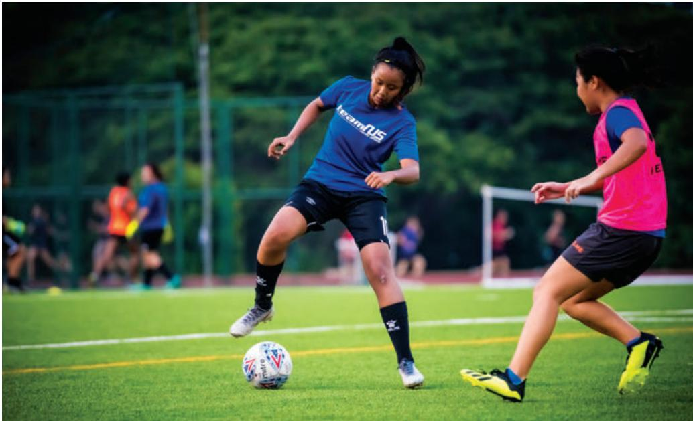

> **AI Description:**
> **Source:** `assets/_page_11_Figure_1.jpg`
> 
> **Generated:** 2026-06-02 00:38:56
> 
> ---
> 
> The image is a photograph of two individuals playing soccer on a field. One player, wearing a blue jersey, is in the process of kicking a soccer ball. The other player, in a pink jersey, is running towards the ball. The background shows a blurred view of other players and a goalpost, indicating a soccer match or practice session. The field is well-maintained with clear boundary lines.

## COMMUNITY ENGAGEMENT NETWORK

You may also wish to check out the network of religious and cultural groups, which promotes awareness and understanding of the various faiths and cultures within the NUS student community.

• Buddhist Society

• NUS Cru

• Catholic Students’ Society

• Chinese Society

• NUS Interfaith

• Hindu Society

• Sikh Cultural & Literary Society

• Tamil Language Society

• Indian Cultural Society

• Legion of Mary

• The Navigators

• Malay Language Society

• Uni-YMCA Interest Group

• Muslim Society

• Varsity Christian Fellowship

## OUTDOOR EDUCATION NETWORK

Get your adrenaline pumping with adventure and outdoor activities organised by these student groups:

• Facilitators@NUS

• NUS Mountaineering (Make It Real)

• NUS Dive

• NUS Outdoor Activities Club (ODAC)

• NUS Kayaking

• NUS Rovers

To find out more about NUS student organisations, societies and interest groups, visit nus.edu.sg/osa

## STUDENT ARTS GROUPS

## cfa.nus.edu.sg

Participation in the arts encourages creativity to flourish and positively enhances students’ development and academic outcomes. The NUS Centre For the Arts (CFA) inspires students to unleash their passion through the arts – visual arts, dance, music and theatre.

Augment your studies by getting involved with one of NUS’ Arts Excellence Groups. These groups, supported by CFA and

tutored by dedicated industry artistes, cover traditional Asian dances to the latest in hip-hop, and from classical symphonies to avant-garde electronic music.

NUS unveiled its very own University Cultural Centre (UCC) in 2000. Besides hosting the annual NUS commencement ceremonies, the UCC is a popular venue for various performances by students and staff, Singaporean arts companies and international artistes, and state events.

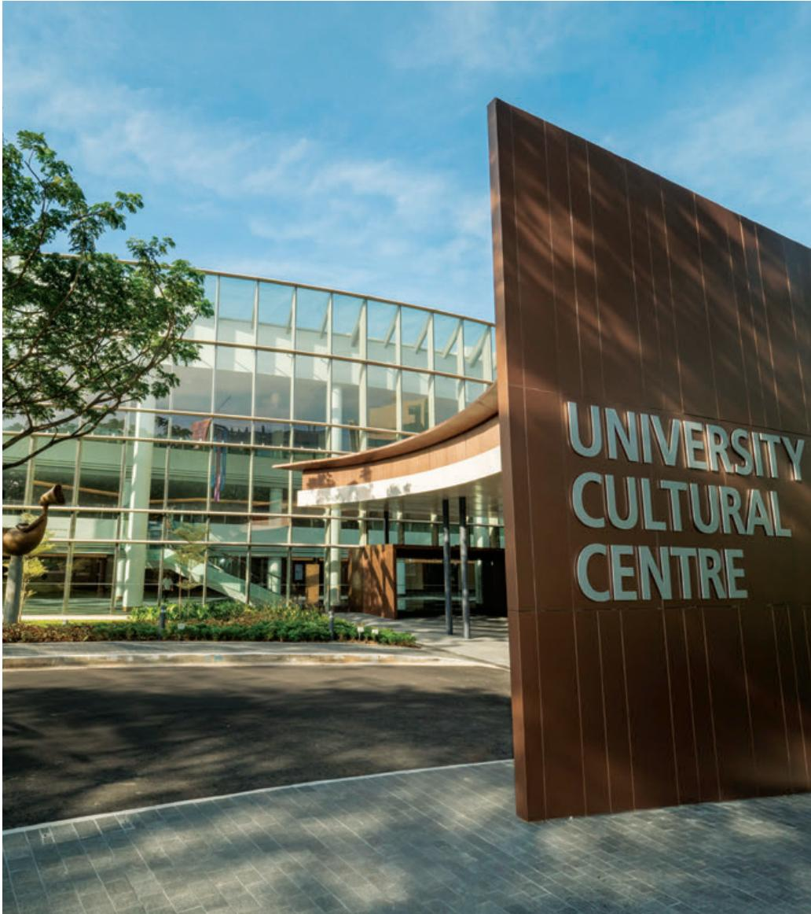

> **AI Description:**
> **Source:** `assets/_page_12_Figure_0.jpg`
> 
> **Generated:** 2026-06-02 00:26:40
> 
> ---
> 
> The image contains a photograph of a modern building with a large sign in the foreground that reads "UNIVERSITY CULTURAL CENTRE." The building features a glass facade with a curved design and is surrounded by greenery. The sky is clear and blue, indicating a sunny day. The image includes a sculpture to the left of the building, adding to the cultural and artistic atmosphere suggested by the name of the center.

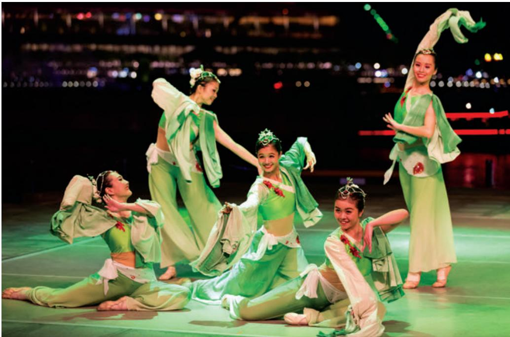

> **AI Description:**
> **Source:** `assets/_page_12_Figure_1.jpg`
> 
> **Generated:** 2026-06-02 00:26:55
> 
> ---
> 
> The image contains a photograph of a group of dancers performing on a stage. The dancers are dressed in green costumes with flowing fabric elements, and they are striking dynamic poses. The background appears to be an urban setting at night, with blurred lights suggesting a cityscape. The dancers' expressions and body language convey a sense of grace and movement.

## DANCE

• NUS Chinese Dance

• NUS Dance Blast!

• NUS Dance Ensemble

• NUS Dance Synergy

• NUS Ilsa Tari

• NUS Indian Dance

• NUS Lion Dance

## THEATRE, FILM & PRODUCTION

• NUS Chinese Drama

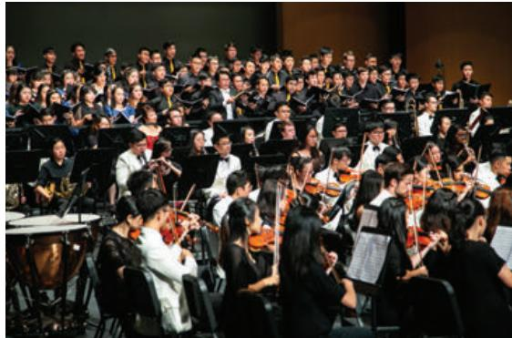

> **AI Description:**
> **Source:** `assets/_page_12_Figure_2.jpg`
> 
> **Generated:** 2026-06-02 00:28:31
> 
> ---
> 
> The image is a photograph of a large orchestra performing on stage. The orchestra includes a variety of instruments such as violins, violas, cellos, and a drum set. The musicians are dressed in formal attire, with some wearing white shirts and black ties, while others are in black outfits. The background shows a choir standing in rows, also dressed formally, with some members holding sheet music. The setting appears to be a concert hall or theater with stage lighting.

• NUS Stage

nuSTUDIOS Film Productions

ExxonMobil Campus Concerts Crew

## MUSIC

• NUS Chinese Orchestra

• The NUSChoir

• NUS Electronic Music Lab

• NUS Guitar Ensemble

• NUS Harmonica

• NUS Indian Instrumental Ensemble

• NUS Jazz Band

• NUS Piano Ensemble

• NUS Symphony Orchestra

• NUS Wind Symphony

## CARING FOR THE COMMUNITY & ENVIRONMENT

HE University’s unstinting support for community service is a tradition instilled by our predecessors more than a century ago. As a student, you can get involved in many student-driven activities to reach out to the less fortunate.

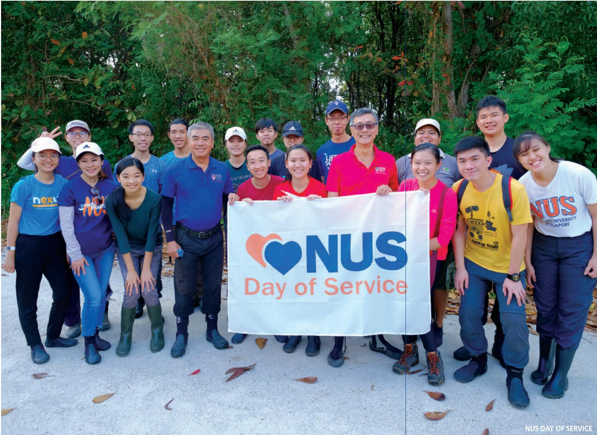

> **AI Description:**
> **Source:** `assets/_page_13_Figure_1.jpg`
> 
> **Generated:** 2026-06-02 00:31:46
> 
> ---
> 
> The image contains a photograph of a group of people posing outdoors. They are holding a banner that reads "NUS Day of Service" with a heart symbol preceding the text. The group appears to be participating in a community service event, as indicated by the banner. The individuals are dressed in casual attire suitable for outdoor activities, and the background shows a natural setting with trees and foliage. The image captures a moment of community engagement and collaboration.

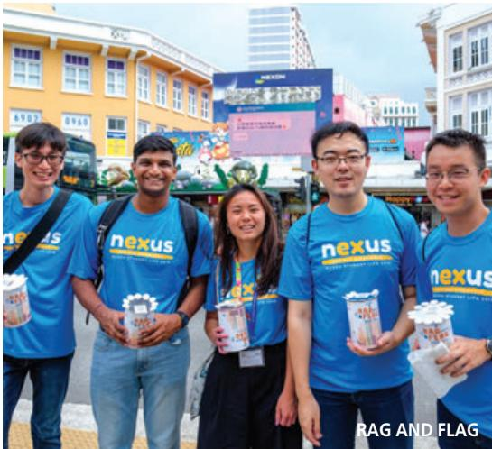

> **AI Description:**
> **Source:** `assets/_page_13_Figure_2.jpg`
> 
> **Generated:** 2026-06-02 00:32:40
> 
> ---
> 
> The image contains a group of five individuals standing outdoors in front of a building with a sign that reads "NEXUS." They are all wearing blue t-shirts with the same "NEXUS" logo and text. Each person is holding a cup, possibly containing a beverage. The background includes a bus and a large digital screen displaying the Nexus logo. The text "RAG AND FLAG" is visible in the bottom right corner of the image.

## NUS DAY OF SERVICE

The annual NUS Day of Service on 7 September 2019 saw a record 2,411 NUS staff, students and alumni participating in community service activities for more than 5,500 beneficiaries. It featured some 54 activities across 10 categories ranging from animal welfare, environment and sports, to the elderly, children and youth.

## RAG AND FLAG

The annual charity event organised by the NUS Students’ Union (NUSSU) is a unique tradition established since the 1950s to inculcate a spirit of giving and volunteerism among NUS students. It also provides a platform for new undergraduates to integrate into the NUS community. Over the past five years, nearly S\$2 million has been raised for beneficiaries through NUSSU Rag and Flag.

## NUS VOLUNTEER NETWORK

Established in December 2007, the NUS Volunteer Network comprises the NUS Volunteer Action Committee, Red Cross Youth – NUS Chapter, Rotaract NUS and NUS Students’ Community Service Club (CSC). This network seeks to provide a platform to share ideas, experiences and best practices relating to volunteering. It also serves as a platform to provide a wider range of volunteering opportunities to the NUS community.

## SEEDS OF GOOD PROGRAMME

The community development learning programme, jointly launched by NUS Office of Student Affairs and NUS Office of Alumni Relations on 20 March 2019, seeks to empower NUS students to collaborate with the community, social service organisations and corporations to promote social causes or address issues faced by communities both within NUS and beyond. The student teams have since initiated over 80 projects with community partners of their choice and engaged in activities to enhance the well-being of the community and/or environment.

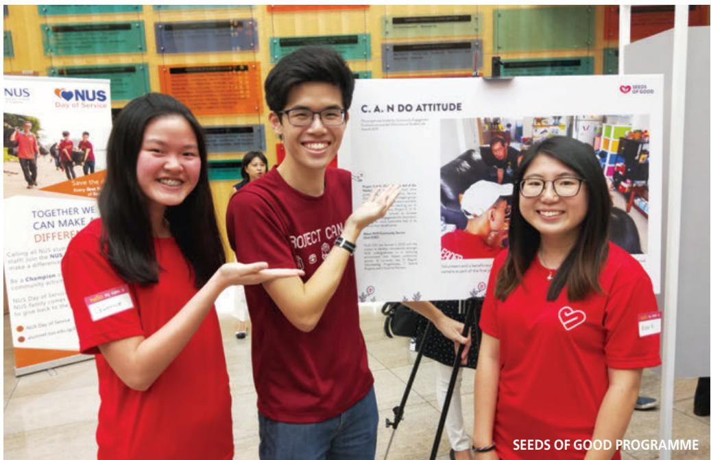

> **AI Description:**
> **Source:** `assets/_page_14_Figure_1.jpg`
> 
> **Generated:** 2026-06-02 00:30:22
> 
> ---
> 
> The image contains a photograph of three individuals wearing red shirts with logos and text. They are standing in front of a display board that includes text and images related to the "Seeds of Good Programme" and the "NUS Day of Service." The display board features phrases such as "Together We Can Make a Difference" and "C.A.N Do Attitude," along with images of people engaged in community activities. The setting appears to be an indoor event or exhibition space, with lockers and other display materials in the background.

## GREEN NUS

Our environmental student groups play a big part in promoting campus sustainability and acting as a catalyst for change in areas such as resource consumption and sustainable lifestyles.

> **AI Description:**
> **Source:** `assets/_page_14_Figure_2.jpg`
> 
> **Generated:** 2026-06-02 00:32:29
> 
> ---
> 
> The image contains a simple icon of a white shirt with a pocket, set against an orange circular background. There are no charts, graphs, or other visual elements present. The icon is likely used to represent clothing or apparel in a digital interface or document.

## GREEN BAZAAR

To promote responsible   
consumption, yearly or biannual   
clothing swap events are   
organised for students and staff to   
exchange secondhand items.   
The surplus items are donated   
to student-run projects and   
other causes.

> **AI Description:**
> **Source:** `assets/_page_14_Figure_3.jpg`
> 
> **Generated:** 2026-06-02 00:35:12
> 
> ---
> 
> The image contains a simple orange circle with a white rectangular shape inside it, divided into two sections. The design appears to be a minimalist icon or symbol, possibly representing a container or a box with compartments. There are no labels or text annotations present in the image.

## PROJECTS BOX AND TUMBLER

Projects Box and Tumbler were   
introduced in NUS canteens and   
other selected food and beverage outlets in 2010 and 2012 respectively. These are rebate schemes funded by the   
Plastic Bag Tax Scheme, aimed at   
encouraging NUS students and staff to bring their own lunch boxes and tumblers for takeaways.

NUS Students Against Violation of the Earth (SAVE) is the main environmental student group in the University. The group initiates campaigns and projects to reduce waste and promote nature appreciation, including Green Bazaar, Plastic Bag Tax Scheme, Projects Box and Tumbler, and Reusable Bag Library.

> **AI Description:**
> **Source:** `assets/_page_14_Figure_4.jpg`
> 
> **Generated:** 2026-06-02 00:28:03
> 
> ---
> 
> The image contains a simple icon with a white shopping bag shape on an orange background. Inside the bag, the text "10¢" is displayed, indicating a price of 10 cents. The design is minimalistic and likely represents a price point or a discount in a retail or e-commerce context.

PLASTIC BAG TAX SCHEME   
Since 2008, a 10-cent charge per   
plastic bag has been imposed to   
encourage consumers to switch   
from using plastic bags to reusable bags at canteens, convenience stores and bookstores. The tax proceeds go to the NUS Sustainability Fund that   
supports environmental projects run by NUS students.   
REUSABLE BAG LIBRARY   
Launched in 2018,   
the Reusable Bag Library provides   
easily accessible alternatives   
to plastic bags at retail outlets   
on campus, such as Cheers   
convenience store.   
Reusable bags are regularly   
refilled at the library racks   
whenever possible. The NUS   
community is encouraged to   
borrow, return and contribute   
additional bags at the   
collection points.

> **AI Description:**
> **Source:** `assets/_page_14_Figure_5.jpg`
> 
> **Generated:** 2026-06-02 00:29:24
> 
> ---
> 
> The image contains a simple icon of a shopping bag with a recycling symbol inside it. The icon is orange with a white outline and the recycling symbol is a white triangular shape with three curved arrows forming a circular motion. This icon is commonly used to represent recycling or sustainable shopping practices.

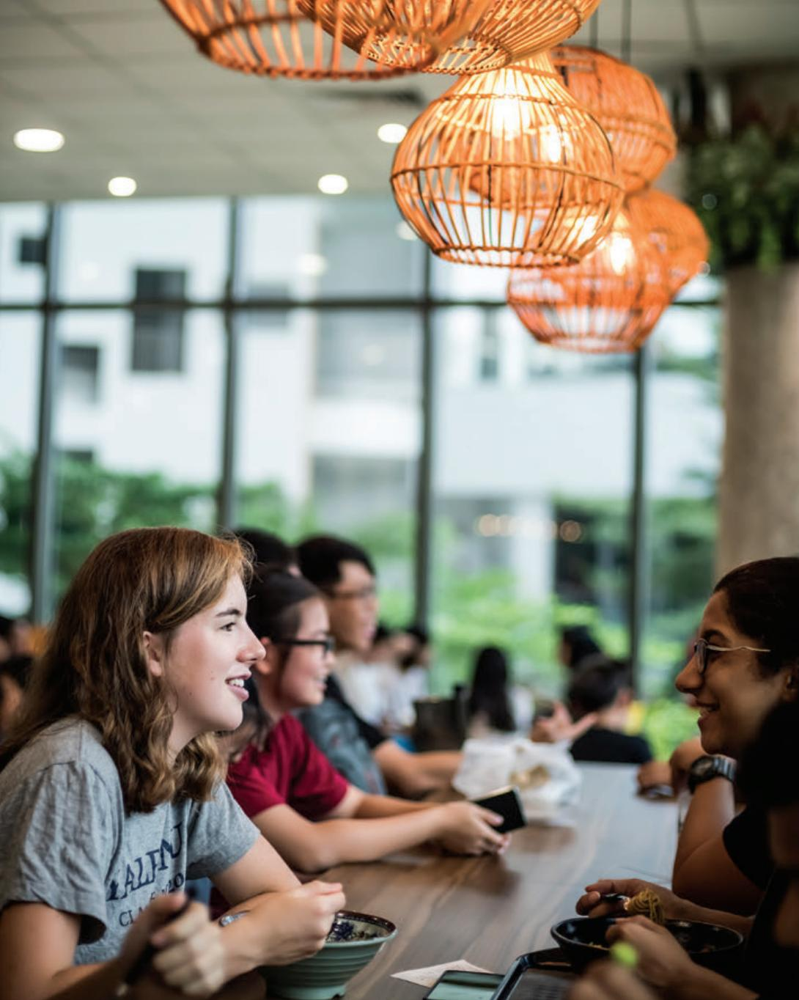

> **AI Description:**
> **Source:** `assets/_page_15_Figure_0.jpg`
> 
> **Generated:** 2026-06-02 00:26:00
> 
> ---
> 
> The image is a photograph of a group of people sitting at a long wooden table in what appears to be a casual dining or café setting. The individuals are engaged in conversation, with some smiling and gesturing. The background shows large windows with a view of greenery outside, and the interior is decorated with hanging, spherical, woven light fixtures. The atmosphere suggests a relaxed and social environment.

## tudent accommodation

on campus gives you a taste of independent living, and our halls of residence, student residences and residential colleges offer you the comforts of “a home away from home” environment. You will also meet new people, participate in social events and forge lifelong friendships.

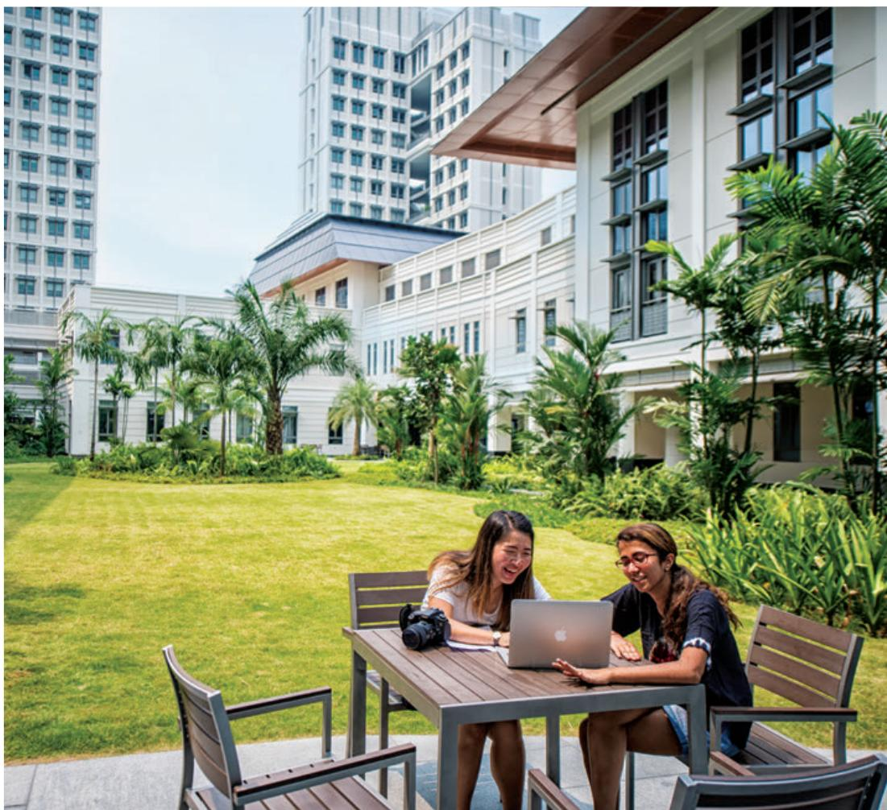

> **AI Description:**
> **Source:** `assets/_page_15_Figure_2.jpg`
> 
> **Generated:** 2026-06-02 00:29:08
> 
> ---
> 
> The image contains a photograph of two individuals sitting at a wooden outdoor table in a well-maintained garden area. They appear to be engaged in a discussion or collaborative activity, with one person using a laptop and the other holding a camera. The setting is modern, with tall buildings in the background and lush greenery surrounding the area. The scene suggests a relaxed, professional, or academic environment, possibly a campus or office courtyard.

> **AI Description:**
> **Source:** `assets/_page_15_Figure_3.jpg`
> 
> **Generated:** 2026-06-02 00:28:07
> 
> ---
> 
> The image contains a simple icon of a building within an orange circle. The icon appears to represent a school or educational institution. There are no charts, graphs, or other visual elements present.

STUDENTACCOMMODATIONOPTIONS ON CAMPUS

7

MODERN LIBRARIES WITH LEARNING RESOURCES AND STUDY FACILITIES

> **AI Description:**
> **Source:** `assets/_page_15_Figure_5.jpg`
> 
> **Generated:** 2026-06-02 00:33:42
> 
> ---
> 
> The image contains a simple icon with a white fork and spoon on an orange background. This icon is commonly used to represent dining or eating utensils, suggesting a context related to food, meals, or dining services.

FOOD & RETAIL OUTLETS

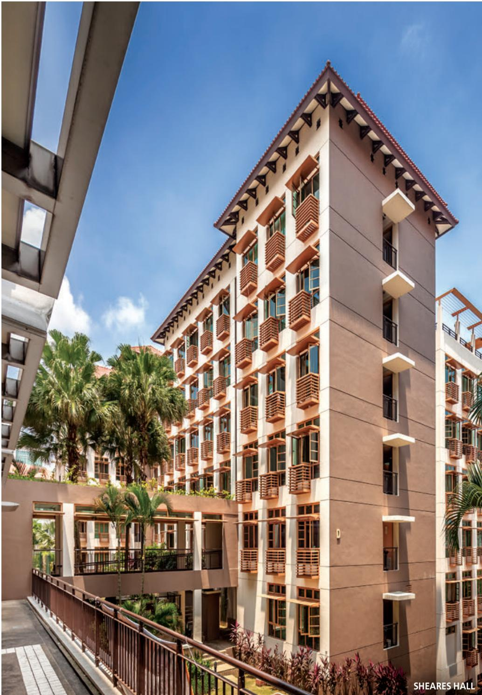

> **AI Description:**
> **Source:** `assets/_page_16_Figure_0.jpg`
> 
> **Generated:** 2026-06-02 00:40:06
> 
> ---
> 
> The image is a photograph of a multi-story building with a modern architectural design. The building features a series of balconies with a unique geometric pattern on the roofline. The structure is primarily beige with white accents. The image also shows a walkway with railings leading up to the building, and there are palm trees and other greenery in the background, indicating a tropical or subtropical setting. The sky is clear with a few clouds, suggesting a sunny day. The bottom right corner of the image has the text "SHEARES HALL," which appears to be the name of the building or the location.

## HALLS OF RESIDENCE

The Halls are vibrant communities dedicated to experiential learning. Through a myriad of programmes and activities, students get a chance to explore new interests and pursue new experiences, as well as hone their analytical and leadership skills. The Halls are well known for their vibrant co-curricular activities, as well as their rich history and culture. Each Hall is led by a Hall Master, a team of Resident Fellows and an elected student committee.

• Eusoff Hall

• Kent Ridge Hall

• King Edward VII Hall

• Prince George’s Park (PGP) House

• Raffles Hall

• Sheares Hall

• Temasek Hall

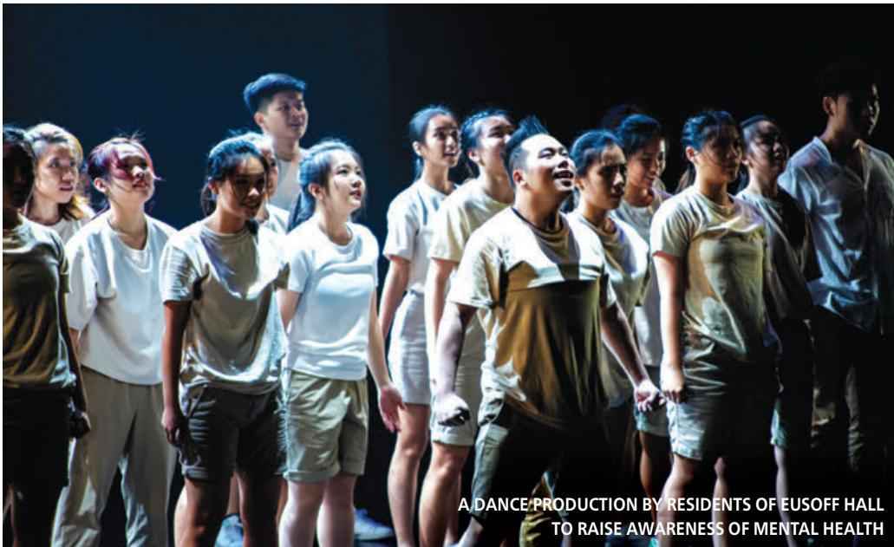

> **AI Description:**
> **Source:** `assets/_page_16_Figure_1.jpg`
> 
> **Generated:** 2026-06-02 00:39:15
> 
> ---
> 
> The image is a photograph of a group of individuals performing a dance production. The participants are dressed in casual attire, with some wearing white t-shirts and others in darker clothing. The lighting is dramatic, with a dark background and spotlights highlighting the performers. The text at the bottom of the image reads, "A DANCE PRODUCTION BY RESIDENTS OF EUOFF HALL TO RAISE AWARENESS OF MENTAL HEALTH." This suggests that the performance is a choreographed dance created by residents of a specific hall to promote awareness about mental health.

## STUDENT RESIDENCES

Each Residence is a melting pot of nationalities and cultures where like-minded peers from diverse backgrounds meet and expand social circles. Students participate in activities and programmes organised by the Residences. Each Residence has a team of Resident Advisors and Resident Assistants who takes care of the welfare of the students.

• Prince George’s Park Residences

• UTown Residence

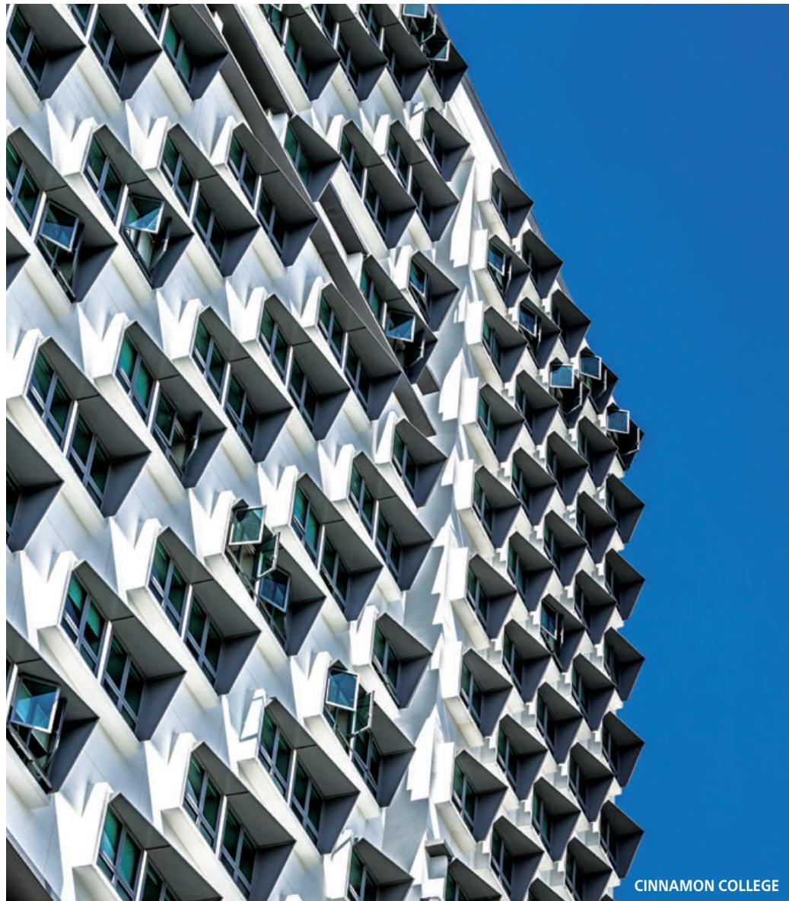

> **AI Description:**
> **Source:** `assets/_page_17_Figure_0.jpg`
> 
> **Generated:** 2026-06-02 00:43:44
> 
> ---
> 
> The image is a photograph of a modern building with a unique architectural design. The building features a facade composed of numerous rectangular windows arranged in a geometric pattern. The windows are set at varying angles, creating a textured and dynamic appearance. The sky in the background is a clear blue, which contrasts with the white and gray tones of the building. The text "CINNAMON COLLEGE" is visible in the bottom right corner of the image, indicating the name of the institution associated with the building.

## RESIDENTIAL COLLEGES

Combining the vibrancy of campus living with exciting multidisciplinary academic programmes, residential colleges offer students an integrated residential learning environment, where they get to learn and live alongside their professors and peers. Each residential college is led by a Rector, a Master, a team of Faculty Fellows and a student committee, who define each College’s academic tone and character.

The University Scholars Programme (USP) is housed in Cinnamon College. The rigorous interdisciplinary USP curriculum allows students to develop core academic and professional skills that complement their strengths in their majors and to see connections across disciplines.

The University Town College Programme (UTCP) is a two-year residential programme offered at College of Alice & Peter Tan, Residential College 4 and Tembusu College. Designed as a coherent delivery of general education, the UTCP emphasises multidisciplinary learning and active small-group learning. Students from different disciplines, cultures and nationalities are put together in each class, which helps them to assimilate and synthesise cross-disciplinary knowledge, facilitating multiperspectival thinking.

The two-year Ridge View Residential College Programme adopts an integrated interdisciplinary approach that is designed to cultivate students’ holistic

development to prepare them for life in the University and the work environment after graduation. Students can also look forward to opportunities for close engagement with industry players and prominent individuals from the public and private sectors.

• Cinnamon College

• College of Alice & Peter Tan

• Residential College 4

• Ridge View Residential College

• Tembusu College

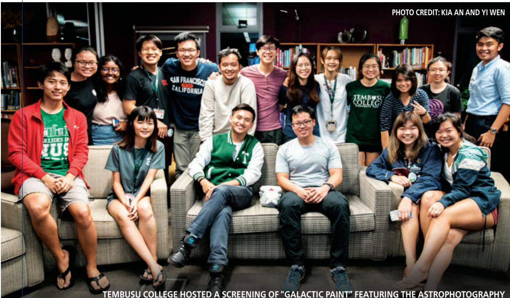

> **AI Description:**
> **Source:** `assets/_page_17_Figure_1.jpg`
> 
> **Generated:** 2026-06-02 00:44:45
> 
> ---
> 
> The image is a photograph of a group of people posing for a photo in what appears to be a library or study area. The group is seated on couches, with some standing behind them. They are dressed casually, with some wearing T-shirts and others in jackets or sweaters. The text at the bottom of the image indicates that Tembusu College hosted a screening of "Galactic Paint" featuring astrophotography. The photo credit is given to Kia An and Yi Wen.

TEMBUSU COLLEGE HOSTED A SCREENING OF “GALACTIC PAINT” FEATURING THE ASTROPHOTOGRAPHY WORK OF IVAN BOK (SEATED THIRD FROM RIGHT), THAT WAS PRODUCED BY FILMMAKER AND ALUMNUS OF NUS BUSINESS SCHOOL AND TEMBUSU COLLEGE, ONG KAH JIN (IN GREEN JACKET)

# LEARNING RESOURCES

multitude of state-of-the-art multimedia facilities are available throughout the campus while our modern libraries are well-stocked with learning resources and study facilities.

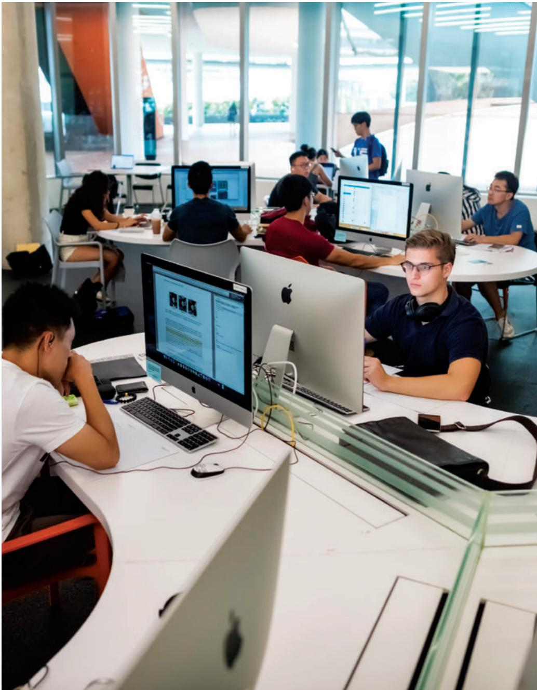

> **AI Description:**
> **Source:** `assets/_page_18_Figure_1.jpg`
> 
> **Generated:** 2026-06-02 00:37:08
> 
> ---
> 
> The image depicts a group of individuals working on computers in a modern, well-lit space. The setting appears to be a collaborative workspace or a computer lab, with multiple desks arranged in a semi-circular layout. Each person is focused on their computer screen, which displays various applications and documents. The environment is open and airy, with large windows allowing natural light to fill the room. The individuals are dressed casually, suggesting a relaxed and informal work or study atmosphere.

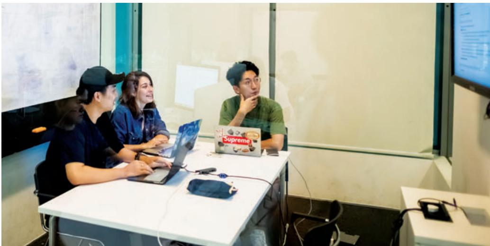

> **AI Description:**
> **Source:** `assets/_page_18_Figure_2.jpg`
> 
> **Generated:** 2026-06-02 00:36:26
> 
> ---
> 
> The image contains a photograph of three individuals sitting at a table in what appears to be a collaborative workspace. They are engaged in a discussion, with laptops open in front of them. The person on the right is wearing a green shirt and has a laptop with a sticker that reads "Supreme." The table has various items on it, including a blue pouch and some cables. The background includes a large screen and a glass partition, suggesting a modern office or meeting room environment.

## COMPUTING COMMONS

Education Resource Centre, Level 1   
University Town   
Open 24 hours   
The Computing Commons offer iMacs (Mac Commons) and Windows desktops (PC Commons) for use. Within these   
Commons are smaller rooms fitted with LCD TVs to facilitate meetings and group discussions.

## MULTIMEDIA HUB

Education Resource Centre, Level 1 University Town

The Multimedia Hub enables students to hone their skills in media content creation. The Audio Recording Booth is equipped for recording talking head presentations and voice presentations. The Visualisation Suite supports audiovideo post-production and web content creation.

## COLLABORATIVE LEARNING ACTIVITY ROOM

## Central Library, Level 1

This multi-purpose space provides a plug-n-play environment for learning programmes (such as gamification for learning) or simply a collaboration space to meet your learning needs.

## DIGITAL SCHOLARSHIP LAB

Central Library, Level 4

The Digital Scholarship Lab offers a dedicated space for users working on humanistic research projects. It offers facilities such as high-performance workstations, big multi-touch screens, cloud data storage access and specialised software to support computationally intensive processing and visualisation.

## TEL IMAGINARIUM

The TEL (‘Technology Enhanced Learning’) Imaginarium showcases immersive tech tools that facilitate experiential learning and teaching. These tools include a mixed reality room, virtual and augmented reality (VR/AR) headsets, and a digital graffiti wall, among others.

## YUSOF ISHAK HOUSE CommIT

Yusof Ishak House, Level 3 Tucked away in a corner at the Yusof Ishak House, CommIT offers desktops, as well as printing and scanning facilities for students’ use.

## THINKLAB

## Computer Centre, Level 3

The first lab in NUS to provide a virtual desktop experience, ThinkLab is NUS IT’s initiative to offer highly efficient computing using a fraction of the energy of traditional PCs. Equipped with virtual Windows desktops and iMacs, this lab runs 24/7 to provide a comfortable and quiet place for students to work. Printing services are also available.

## AS8 CommIT

AS8, Level 2

Centrally located near the Central Library, this centre houses computers for your computing needs. Printing services are also available here.

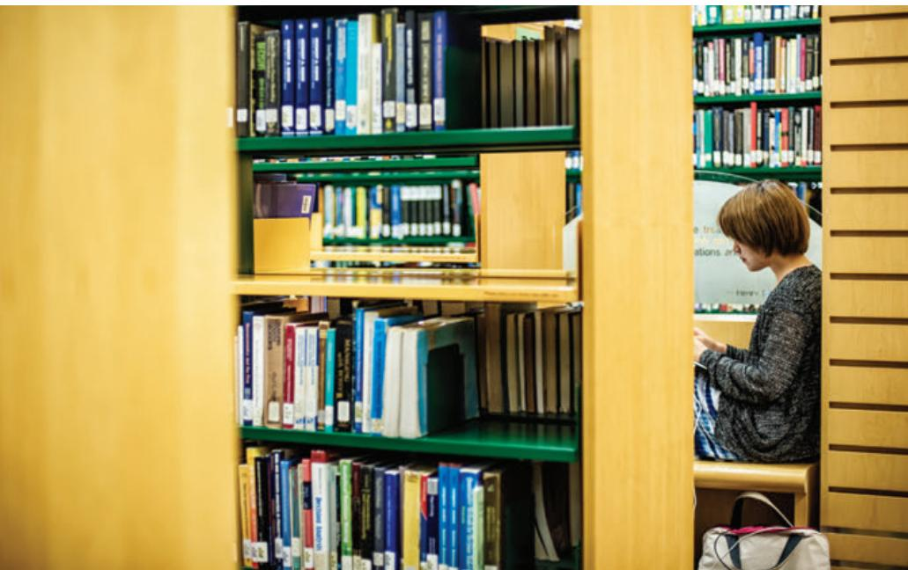

> **AI Description:**
> **Source:** `assets/_page_19_Figure_0.jpg`
> 
> **Generated:** 2026-06-02 00:35:33
> 
> ---
> 
> The image shows a section of a library with bookshelves filled with books. The shelves are organized with books of various sizes and colors, primarily in shades of blue, green, and white. In the background, a person is seated at a desk, seemingly engaged in reading or studying. The setting appears to be a quiet study area within a library, with wooden paneling and a bag placed on the floor next to the desk.

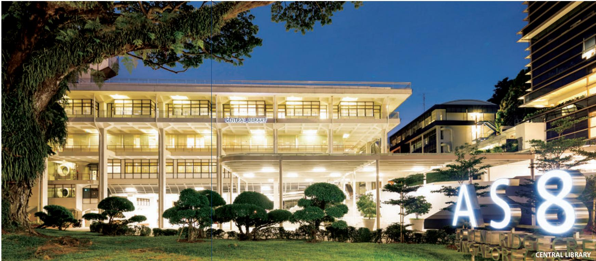

> **AI Description:**
> **Source:** `assets/_page_19_Figure_1.jpg`
> 
> **Generated:** 2026-06-02 00:36:13
> 
> ---
> 
> The image is a photograph of a multi-story building at dusk, identified as the Central Library. The building is well-lit, with the words "Central Library" prominently displayed on the facade. The structure features a series of balconies and large windows, and is surrounded by neatly trimmed trees and shrubs. The sky is dark, indicating it is evening. The image also includes a large, stylized text overlay in the bottom right corner that reads "AS8" and "CENTRAL LIBRARY," which appears to be part of a larger graphic or logo.

## NUS LIBRARIES

## CENTRAL LIBRARY

Above Central Forum Mon - Fri: 8.30am to 9pm Sat: 10am to 5pm Sun: Closed

## CHINESE LIBRARY

Central Library Building, Level 6 Mon - Fri: 8.30am to 9pm Sat: 10am to 5pm Sun: Closed

## C J KOH LAW LIBRARY

Bukit Timah Campus Mon - Fri: 8.30am to 9pm Sat: 10am to 5pm Sun: Closed

## HONSUISEN MEMORIALLIBRARY

NUS Business School Mon - Fri: 8.30am to 9pm Sat: 10am to 5pm Sun: Closed

## MEDICALLIBRARY

Mon - Fri: 8.30am to 9pm Sat: 10am to 5pm Sun: Closed

## MUSIC LIBRARY

Yong Siew Toh Conservatory of Music Mon - Fri: 8.30am to 6pm Sat & Sun: Closed

## SCIENCELIBRARY

Block S6 Mon - Fri: 8.30am to 9pm Sat: 10am to 5pm Sun: Closed

Note: Opening hours of the respective libraries will vary during vacation and exam periods. For more details, please refer to libportal.nus.edu.sg/frontend/ opening-hours-calendar

FOOD & RETAIL

## ALICE LEE PLAZA

BAR BAR BLACK SHEEP

ARTS AND SOCIAL SCIENCES

LIANG BAN KUNG FU The Deck, Level 2

SALAD EXPRESS X PASTA   
EXPRESS   
The Deck, Level 2

THE COFFEE HUTBlock AS2

THE COFFEE ROASTER Block AS8

THE DECK

UNCLE PENYET The Deck, Level 2

## BUSINESS SCHOOL

THE SPREAD   
Mochtar Riady Building   
Level 1

## CENTRAL LIBRARY

MAXX COFFEE Level 1

NUS CO-OP Level 1

## COMPUTING

OMO STORE Block COM1

DESIGN AND ENVIRONMENT

## ENGINEERING

PLATYPUS FOOD BAR Block SDE4

ARISE & SHINE Block E4

E2 HALAL CAFETERIA Block E2

PASTA NATION BY   
PLATYPUS   
Block E2A

PLATYPUS FOOD BAR Block E2A

SPINELLI Block EA

SUBWAY Block E4

CHEERS Block E3

## INNOVATION 4.0

NAMI Level 1

LEE KONG CHIAN NATURALHISTORY MUSEUM

MUSEUM GIFT SHOP

## MEDICINE

EUREKA TASTE Block MD6

JEWEL COFFEE Block MD11

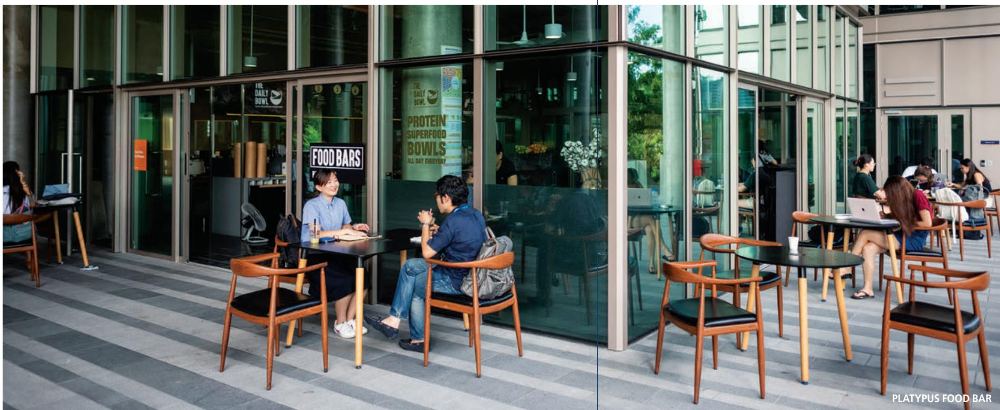

> **AI Description:**
> **Source:** `assets/_page_20_Figure_0.jpg`
> 
> **Generated:** 2026-06-02 00:41:14
> 
> ---
> 
> The image is a photograph of an outdoor seating area at a food bar. The setting includes several tables and chairs arranged on a striped pavement. People are seated at the tables, some engaged in conversation, while others appear to be working or using their laptops. The food bar has large glass windows and doors, through which the interior is partially visible. Signs on the glass indicate the availability of "Food Bars" and mention "Protein Superfood Bowls" as part of the menu. The overall atmosphere suggests a casual and relaxed dining environment.

## PRINCE GEORGE’S PARK RESIDENCES

## FOODCLIQUE

PGPRAIRCONFOOD COURT

NANYANG MART

## SCIENCE

ARISE & SHINE Block S16

GONG CHA Frontier

LI JI COFFEEHOUSE Frontier

PASTA EXPRESS Frontier

PLATYPUS FOOD BAR Block S16

STARBUCKS Block S9

TAIWAN ICHIBAN Frontier

UNCLE PENYET Frontier

CHEERS Frontier

NUS CO-OP LT27

## SHAW FOUNDATION ALUMNI HOUSE

PRIVE GRILL AT THE UNIVERSITY CLUB Shaw Foundation Alumni House, Level 4

REEDZ CAFÉ   
Shaw Foundation Alumni   
House, Level 1

## UNIVERSITY HALL

SPINELLI   
Tan Chin Tuan Wing   
Level 1

UNIVERSITY SPORTS CENTRE

THE TEA PARTY Level 3

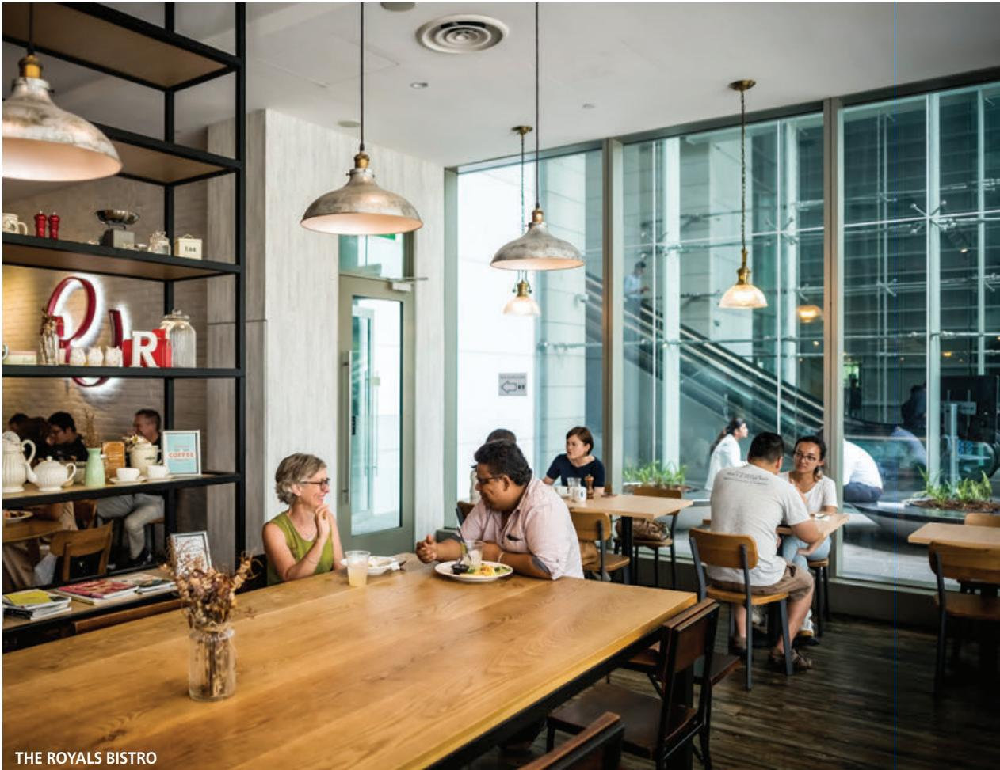

> **AI Description:**
> **Source:** `assets/_page_21_Figure_0.jpg`
> 
> **Generated:** 2026-06-02 00:46:28
> 
> ---
> 
> The image is a photograph of a restaurant named "The Royals Bistro." The interior features wooden tables and chairs, with people seated and eating. The restaurant has a modern design with large windows allowing natural light to enter. On the left side, there is a shelving unit with decorative items and a sign that reads "Our." The background shows a view of an escalator and a glass wall, suggesting the restaurant is located in a public area or shopping mall. The atmosphere appears casual and inviting.

## UNIVERSITY TOWN

FINE FOOD Town Plaza

FLAVOURS@UTOWN Stephen Riady Centre Level 2

HWANG’S KOREAN RESTAURANT Town Plaza

SAPORE ITALIAN RESTAURANT Town Plaza

STARBUCKS Education Resource Centre

SUBWAY Town Plaza

SUPERSNACKS Stephen Riady Centre Level 1

THE ROYALS BISTRO Town Plaza

UDON DON BAR Town Plaza

WAA COW!   
Stephen Riady Centre   
Level 1

2359 LI JI COFFEE HOUSE Stephen Riady Centre Level 1

BOOKHAVEN Stephen Riady Centre Level 1

CHEERS   
Town Plaza   
FAIRPRICEXPRESS   
Stephen Riady Centre   
Level 1

FRANK BY OCBC Stephen Riady Centre Level 1

HAIR DESTINATION Stephen Riady Centre Level 1

OCTOBOX   
Stephen Riady Centre   
Level 1   
STA TRAVEL   
Stephen Riady Centre   
Level 1

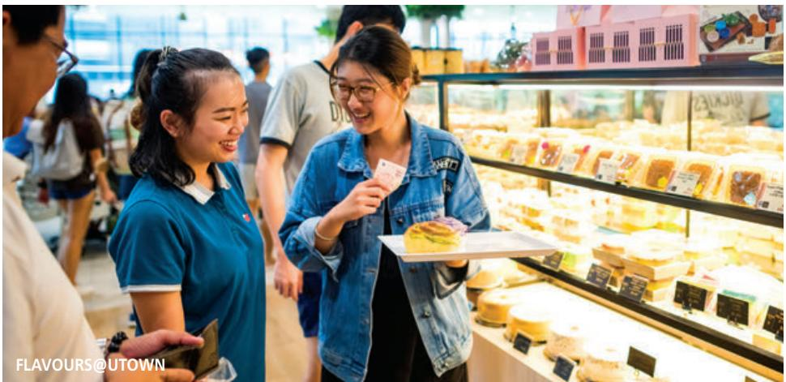

> **AI Description:**
> **Source:** `assets/_page_21_Figure_1.jpg`
> 
> **Generated:** 2026-06-02 00:45:02
> 
> ---
> 
> The image contains a photograph of two individuals in a bakery or café setting. One person is holding a tray with a pastry and a small card, while the other person is smiling and appears to be engaged in conversation. The background shows a display case filled with various baked goods, such as cakes and pastries, with price tags visible. The text "FLAVOURS@UTOWN" is visible in the bottom left corner of the image.

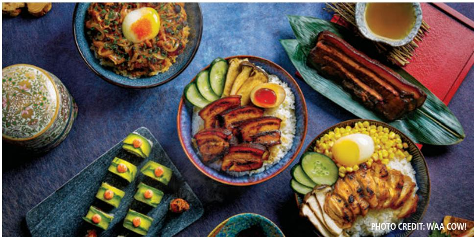

> **AI Description:**
> **Source:** `assets/_page_21_Figure_2.jpg`
> 
> **Generated:** 2026-06-02 00:44:03
> 
> ---
> 
> The image contains a variety of food items arranged on a table, likely for a meal or a spread. The dishes include grilled chicken, roasted pork belly, a bowl of rice with corn and a hard-boiled egg, a bowl of what appears to be a stir-fried dish with an egg on top, and a plate of sushi rolls. The presentation is colorful and appetizing, with a focus on traditional Asian cuisine. The photo credit is given to "WAA COW!" at the bottom right corner of the image.

UNIVERSITY CULTURAL CENTRE D’ARTS @ UCC

VENTUS CAFÉ DELIGHT

YALE-NUS COLLEGE AGORA CAFÉ

YONG SIEW TOHCONSERVATORYOF MUSIC

ATEMPO Level 1

YUSOF ISHAK HOUSE CENTRAL SQUARE Level 2

CRAVE Level 1

OLD CHANG KEE Level 1

SUBWAY Level 1

7-ELEVEN Level 1

GOH BROS E-PRINT Level 1

BUKIT TIMAH CAMPUS REEDZ CAFÉ The Thinking Corner @ Li Ka Shing Building

THE SUMMIT Block B

OCTOBOX Block B

# STUDENT SERVICES

HETHER you’re looking for career advice, information on admissions and financial aid, student housing or urgent medical attention, help is always available.

## YUSOF ISHAK HOUSE

The Yusof Ishak House (YIH) is a vibrant student hub, housing the NUS Students’ Union (NUSSU) and various societies. It is also a meeting place where students take a break, gather over meals, or study at the student lounge, training rooms or outdoor plaza. The Centre for Futureready Graduates, Student Service Centre and Student Support Services Unit are located at the YIH.

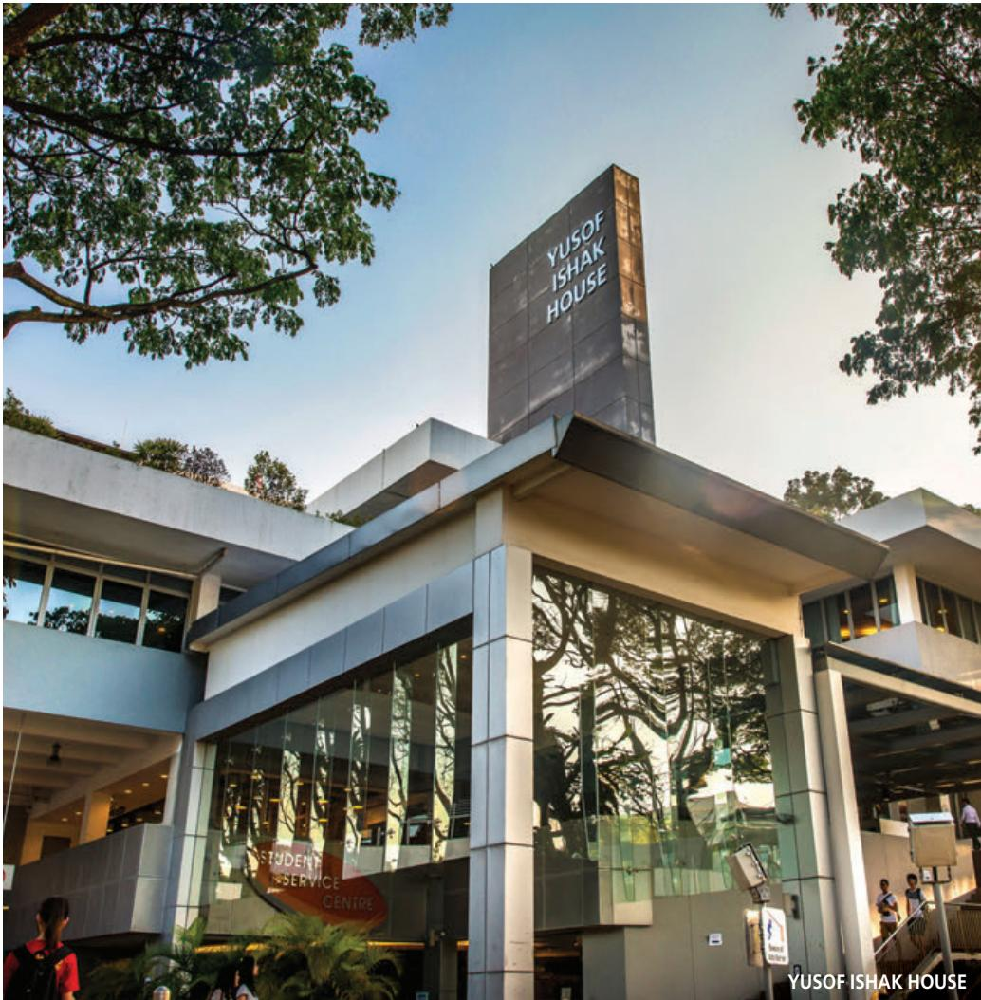

> **AI Description:**
> **Source:** `assets/_page_22_Figure_1.jpg`
> 
> **Generated:** 2026-06-02 00:35:04
> 
> ---
> 
> The image is a photograph of a building with a modern architectural design. The building has a large glass entrance with reflections of trees and sky visible on the glass. Above the entrance, there is a tall, rectangular sign with the text "YUSOF ISHAK HOUSE" in white letters. The building appears to be part of a campus or institutional setting, given the signage and the style of the architecture. The sky is clear with some clouds, and there are trees visible in the background, suggesting a well-maintained campus environment.

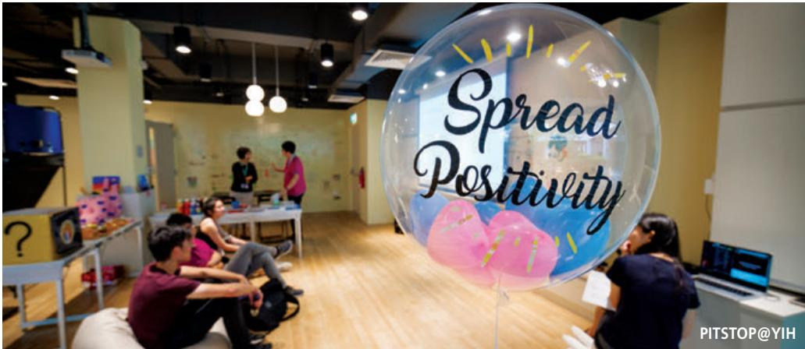

> **AI Description:**
> **Source:** `assets/_page_22_Figure_2.jpg`
> 
> **Generated:** 2026-06-02 00:32:09
> 
> ---
> 
> The image contains a photograph of a group of people in what appears to be a casual office or workshop setting. The room is well-lit with natural and artificial light, and there are tables with various items on them, including what looks like snacks and possibly some office supplies. The walls are decorated with colorful posters and maps, suggesting a creative or collaborative environment. A large, transparent balloon with the text "Spread Positivity" is prominently displayed in the foreground, indicating a theme of positivity or team building. The overall atmosphere seems relaxed and collaborative.

## CENTRE FOR FUTURE-READY GRADUATES

The Centre for Future-ready Graduates (CFG) prepares students to thrive in a world of constant change, ensuring that they are ready for their future careers. CFG offers access to career-readiness programmes, career and internship opportunities, professional career advisory and valuable industry insights.

## DISABILITY SUPPORT OFFICE

NUS strives to provide an inclusive and nurturing campus environment for students with disabilities and special education needs to achieve their fullest potential. Supportive services and resources are available to facilitate an enriching and meaningful student life.

## STUDENT SERVICE CENTRE

The Student Service Centre is the convenient contact point for information on frontline services like academic and administrative matters, student bills as well as student housing applications.

## STUDENT WELLNESS

The Student Wellness unit promotes a culture of self-care and community care on campus through activities and programmes. You can unwind at PitStop@YIH or look up any of the Peer Student Supporters if you need a listening ear. This cosy haven also offers the latest assistive technologies to support students with special needs.

## UNIVERSITYHEALTHCENTRE

20 Lower Kent Ridge Road, Level 1 The University Health Centre has three divisions – Health Service, University Counselling Services, and Wellness Outreach – to tend to the community’s physical and mental well-being.

## VICTIM CARE UNIT

The Victim Care Unit provides a central point of contact for NUS students affected by sexual misconduct. Facilitated by trained professionals, it offers a private and safe place where students can seek support in confidence.

## VISITORSCENTRE

Stephen Riady Centre, Level 1 The Office of Admissions is co-located with the Visitors Centre in the Stephen Riady Centre at University Town. Visitors and students – prospective and current – can find out more about NUS, including admission matters, undergraduates programmes, scholarships and financial aid schemes, and booking of campus facilities.

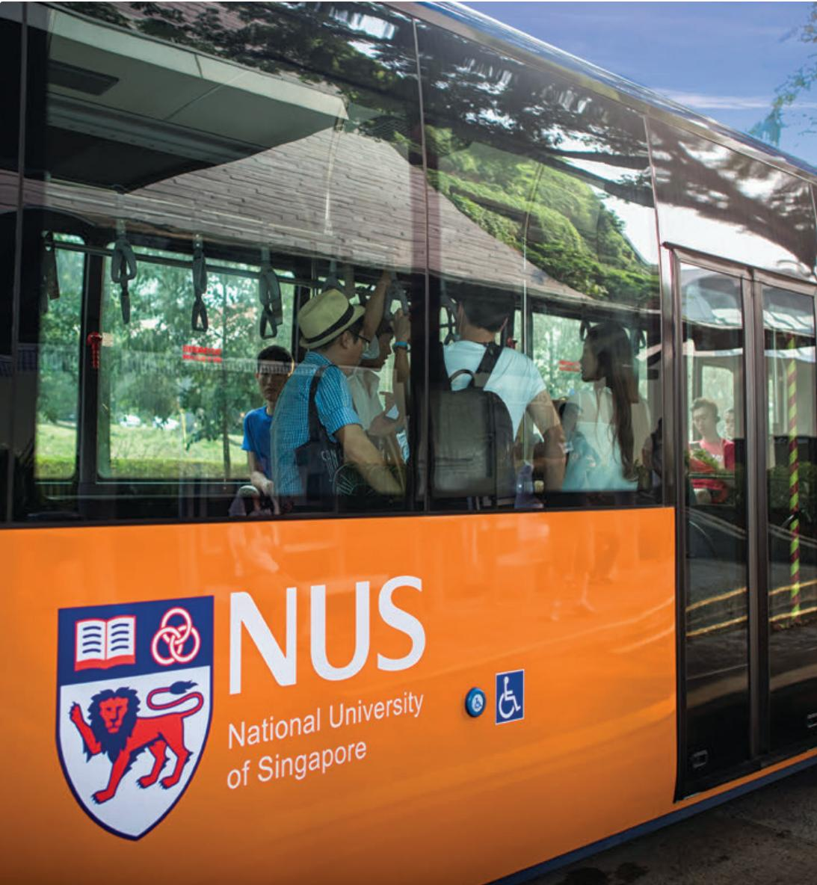

> **AI Description:**
> **Source:** `assets/_page_23_Figure_0.jpg`
> 
> **Generated:** 2026-06-02 00:30:05
> 
> ---
> 
> The image contains a photograph of a bus with the logo and name "NUS" (National University of Singapore) prominently displayed on its side. The bus is orange and has a wheelchair accessibility symbol on the side. Inside the bus, several passengers are visible, some standing and holding onto handrails, while others are seated. The bus appears to be in motion, as suggested by the slight blur of the background. The image also reflects greenery and a building structure on the side of the bus, indicating it is likely on a campus or near a university.

## FOLLOW US

facebook.com/nus.singapore

instagram.com/nus\_singapore

nus.edu.sg

nus.edu/linkedin

> **AI Description:**
> **Source:** `assets/_page_23_Figure_5.jpg`
> 
> **Generated:** 2026-06-02 00:32:26
> 
> ---
> 
> The image contains a visual element of a Twitter logo, which is a well-known social media platform icon. The logo consists of a white bird silhouette on a blue background, with the Twitter name and the Twitter bird logo prominently displayed. The image does not contain any charts, graphs, or other visual content beyond the logo itself.

twitter.com/NUSingapore

NUS\_Singapore

> **AI Description:**
> **Source:** `assets/_page_23_Figure_6.jpg`
> 
> **Generated:** 2026-06-02 00:35:16
> 
> ---
> 
> The image contains a visual element that appears to be a logo or icon. It features two stylized green shapes resembling speech bubbles or chat bubbles, commonly associated with messaging or communication platforms. The design is simple and uses a limited color palette, primarily green and white. There are no text annotations or additional visual elements present in the image.
